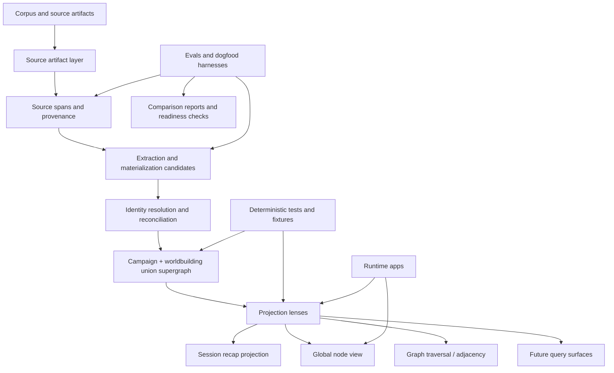

# Graph Memory Supergraph Architecture Roadmap v0

Date: 2026-06-27
Status: accepted roadmap direction
Workstream: Graph Memory / Union Supergraph / Projection Contracts
Branch anchor: `experiment/ontology-taxonomy-ladder` after PR196

## 1. Current reorientation

Graph Memory is no longer primarily an eval-only Ontology/Taxonomy ladder inside `evals/graph_memory_layer`.

The project is becoming a reusable graph-memory architecture centered on a campaign/worldbuilding union supergraph. The union supergraph is the durable graph-memory read model where reconciled global identity, evidence, source domains, and projection-ready adjacency live.

This reorientation preserves the value of the eval work: dogfood harnesses, prompt harnesses, gold comparisons, static reports, and benchmark fixtures remain essential proof machinery. They do not own the durable graph-memory contracts.

## 2. Core architecture in one sentence

Source artifacts feed provenance-bearing extraction and reconciliation pipelines that materialize a campaign/worldbuilding union supergraph in `src/graph_memory`; projections are lenses over that graph, and runtime apps consume those graph-memory contracts through explicit adapters.

## 3. Preserved decisions

The following decisions remain valid and should continue to guide implementation:

- Source-span evidence and provenance are required for inspectable graph memory.
- Candidate graph previews, dogfood reports, and gold comparisons remain useful for proving readiness.
- Recap projection remains a key user-facing entry point into graph memory.
- File-backed fixtures are acceptable for v0 when they are deterministic, inspectable, and clearly separated from approved canon.
- Runtime behavior should remain stable while reusable contracts are clarified underneath it.

## 4. Changed decisions

The center of gravity has changed:

- The union supergraph is not an eval-only fixture; it is the durable graph-memory read model.
- Session recap projections are lenses over global graph identity, not ownership boundaries for identity.
- `src/graph_memory` is the durable home for reusable graph-memory contracts and infrastructure.
- `evals/graph_memory_layer` remains dogfood/evaluation infrastructure, not architecture ownership.
- `apps/live_control_server` and `apps/live-control-ui` are runtime consumers of graph-memory contracts, not the places where identity, evidence, source-domain, or projection semantics should be invented ad hoc.

## 5. Layered architecture



### Accepted architectural boundaries

The union supergraph should model:

- global nodes
- global edges
- aliases
- source domains
- source artifacts
- evidence refs
- session-focus overlays
- adjacency traversal
- safety/canon state

The union supergraph is not:

- a prompt harness
- an eval-only fixture
- a Session 23-local graph
- a `category_graph_model_study` artifact
- a runtime UI component
- approved canon by default

## 6. File hierarchy ownership

The target organizing principle is:

```text
src/
  graph_memory/
    evidence/
      source_artifact.py
      evidence_ref.py
      source_domain.py

    identity/
      aliases.py
      route_ids.py
      resolver.py

    union_supergraph/
      model.py
      load.py
      validate.py
      report.py

    projection/
      recap_projection.py
      focus_overlay.py
      node_view.py

    ingestion/
      source_spans.py
      provenance.py
      materialize.py

tests/
  fixtures/
    graph_memory/
      union_supergraph/
      projection/
      evidence/

evals/
  graph_memory_layer/
    prompt harnesses
    dogfood runs
    benchmark fixtures
    static reports
    comparison artifacts
    generated previews

apps/
  live_control_server/
    graph-memory consumers and adapters

  live-control-ui/
    graph-memory projection and navigation UI
```

This is an aspirational ownership map, not a mandate to create every folder in this roadmap PR.

## 7. Supergraph lifecycle

The intended lifecycle is:

```text
source artifacts
→ source artifact records
→ source spans / provenance refs
→ candidate extraction outputs
→ materialized candidate graph fragments
→ identity resolution
→ reconciled global nodes / edges / evidence
→ union supergraph read model
→ projection lenses
→ runtime surfaces
```

What exists today:

- recap artifacts and source-span/provenance concepts from the prior graph-memory work
- dogfood/eval harnesses that prove candidate extraction, comparison, and projection readiness
- a relocated union-supergraph read-model validator/report under `src/graph_memory/union_supergraph`
- deterministic union-supergraph fixture data under `tests/fixtures/graph_memory/union_supergraph`

What comes next:

- explicit package/import cleanup for `src/graph_memory`
- typed union-supergraph model contracts
- reusable source-domain and evidence-ref contracts
- projection contracts that expose focus overlays, global node views, source badges, and adjacency candidates
- runtime adapter seams that consume those contracts without redefining graph semantics

## 8. Projection lifecycle

A session projection is a lens over the union supergraph.

Example flow:

```text
/plan asks for Session 23 recap projection

projection layer loads:
  recap artifact
  source spans
  union supergraph
  focus_session_id=session-23

projection resolves:
  recap mentions → global node IDs
  session evidence → focused highlights
  global node context → hover/pin/global node view
  adjacency → graph navigation candidates

UI renders:
  recap pills
  hover summaries
  pinned/global node panel
  source/evidence badges
  future adjacency click-through
```

Correct identity behavior:

```text
global node: pc_caelynn

Session 23 projection:
  highlight Session 23 evidence and edges attached to pc_caelynn

Global node view:
  show all known Caelynn context across campaign/worldbuilding sources
```

Incorrect identity behavior:

```text
session_23_pc_caelynn
session-local Caelynn graph
Session 23 graph as final architecture
```

## 9. Runtime integration path

`/plan` should become a consumer of graph-memory projection contracts.

The runtime path should be:

1. Keep existing `/plan` behavior stable.
2. Define backend-neutral projection payloads in `src/graph_memory/projection`.
3. Add adapter seams in `apps/live_control_server` that translate existing graph-preview behavior into the shared projection contract.
4. Let `apps/live-control-ui` render projection payloads without owning identity, evidence, source-domain, or reconciliation semantics.
5. Expand adjacency and global node navigation only after contracts are explicit and tested.

### Plan prep-memory and object navigation (post-PR314)

After the `/plan` dogfood checklist merge, Plan also needs:

- a **shared graph-object card** for chip selection (converge with Graph Review’s node card; Plan mode hides review machinery);
- a **graph-aware chip resolver** with corpus-index fallback;
- a **plan-scoped graph-memory query contract** for prep Q&A that is not gated by the server’s loaded live-packet session.

Authoritative sequencing for those Plan-facing slices: `Docs/Design/DESIGN-plan-graph-memory-reanchor-after-dogfood-2026-07.md` §7 (default order; dogfood may reprioritize Q&A when it is the sharper blocker). That work consumes this roadmap’s projection/adapter contracts; it does not redefine Union Supergraph semantics inside the UI, and must not reach into graph-memory storage or eval fixture internals.

## 10. What remains in evals

`evals/graph_memory_layer` remains the home for:

- dogfood harnesses
- prompt harnesses
- benchmark fixtures
- gold comparisons
- static reports
- category graph studies
- run artifacts
- preview prototypes
- comparison artifacts and readiness checks

Evals are proof machinery. They can propose, stress, and validate contracts, but durable reusable contracts should graduate into `src/graph_memory`.

## 11. What graduates to src/graph_memory

Reusable architecture belongs in `src/graph_memory`, including:

- union-supergraph model, load, validation, and reporting contracts
- source-domain, source-artifact, and evidence-ref contracts
- identity/alias resolution contracts
- projection contracts for focus overlays, node views, recap projections, source badges, and adjacency candidates
- ingestion primitives that represent source spans, provenance, and materialized candidate fragments

Source artifacts are not the graph. Session recaps, worldbuilding docs, statblocks, NPC notes, location notes, faction notes, item notes, session memories, prep artifacts, and future generated artifacts feed the graph through ingestion, extraction, materialization, identity resolution, and reconciliation while remaining inspectable and provenance-bearing.

## 12. Next implementation PR sequence

### PR A — Package cleanup

Title: `graph-memory: normalize src package import layout`

Mission: remove or replace the temporary top-level `graph_memory` import shim by configuring the project so `src/graph_memory` is importable cleanly.

Acceptance:

- `python -m graph_memory.union_supergraph.validate` works without a top-level namespace shim.
- Tests import `graph_memory` from the intended package root.
- No graph model expansion is mixed into this cleanup.

### PR B — Union supergraph model module

Title: `graph-memory: add union supergraph model contract v0`

Mission: move schema semantics out of ad hoc validator expectations into explicit typed models or dataclasses/Pydantic models.

Likely files:

- `src/graph_memory/union_supergraph/model.py`
- `src/graph_memory/union_supergraph/load.py`
- `tests/test_graph_memory_union_supergraph_model.py`

The union-supergraph read model is represented by typed model and load seams in `src/graph_memory/union_supergraph/model.py` and `src/graph_memory/union_supergraph/load.py`.

### PR C — Evidence and source-domain module

Title: `graph-memory: add evidence/source-domain contracts v0`

Mission: define reusable source-domain and evidence-ref contracts shared by union supergraph, ingestion, projection, and future runtime adapters.

Likely files:

- `src/graph_memory/evidence/source_domain.py`
- `src/graph_memory/evidence/source_artifact.py`
- `src/graph_memory/evidence/evidence_ref.py`
- `tests/test_graph_memory_evidence_contracts.py`

### PR D — Projection contract

Title: `graph-memory: add graph projection contract v0`

Mission: define the backend-neutral projection payload that turns a focus session and global graph node references into recap pills, node summaries, source badges, and adjacency candidates.

Likely files:

- `src/graph_memory/projection/focus_overlay.py`
- `src/graph_memory/projection/node_view.py`
- `src/graph_memory/projection/recap_projection.py`
- `tests/test_graph_memory_projection_contract.py`

### PR E — Runtime adapter seam

Title: `graph-memory: add /plan union-supergraph adapter seam v0`

Mission: let existing `/plan` graph-preview services consume the graph-memory projection contract without changing user-facing behavior yet.

This should happen only after the contracts are clearer.

## 13. Non-goals and safety boundaries

This roadmap does not authorize:

- implementing new graph runtime behavior
- wiring `/plan` to the union supergraph
- migrating all eval files
- renaming the whole project
- rewriting old historical docs
- changing graph schema
- changing validation semantics
- running LLM extraction
- mutating corpus files
- promoting any graph memory to canon
- creating approved memory writes
- changing production retrieval

This is a reorientation and roadmap capture, not a runtime implementation PR.
