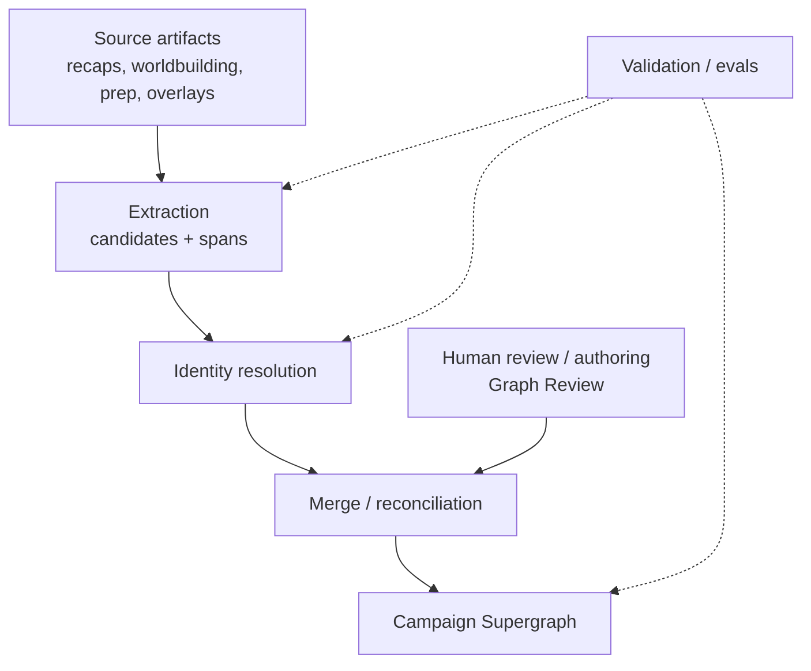
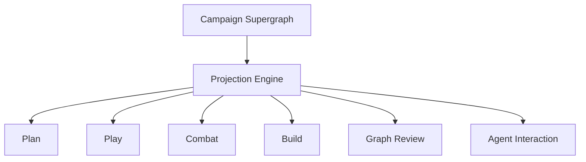

# Architecture — Campaign Supergraph

**Status:** Canonical architecture authority  
**Date:** 2026-07-10  
**Mode:** Documentation / architectural north star  
**Supersedes as architecture authority:**

- `Docs/Design/GRAPH-MEMORY-SUPERGRAPH-ARCHITECTURE-ROADMAP.md` (archived)
- `Docs/Design/GRAPH-MEMORY-UNION-SUPERGRAPH-PROJECTION.md` (archived; projection contracts absorbed here)
- `Docs/Experiments/GRAPH-MEMORY-WORKSTREAM-ANCHOR.md` (archived as operational anchor)
- `Docs/Design/ANCHOR-dungeonBuddy-graph-retrieval.md` (archived as pre-supergraph thesis)

**Companion docs:**

- Roadmap: [`Docs/Roadmaps/ROADMAP-campaign-supergraph.md`](../Roadmaps/ROADMAP-campaign-supergraph.md)
- PR tracker: [`Docs/Plans/PR-TRACKER-campaign-supergraph.md`](../Plans/PR-TRACKER-campaign-supergraph.md)
- Document audit: [`Docs/Reports/graph-document-audit.md`](../Reports/graph-document-audit.md)

**Still in force (contracts / surface product, not graph ownership):**

- [`CONTRACT-surface-vocabulary-boundary-v0.md`](CONTRACT-surface-vocabulary-boundary-v0.md)
- [`ARCHITECTURE-plan-surface-toolbox.md`](ARCHITECTURE-plan-surface-toolbox.md)
- [`DESIGN-graph-object-authoring-surface.md`](DESIGN-graph-object-authoring-surface.md)
- [`DESIGN-plan-surface-session-prep-current-goal-2026-07.md`](DESIGN-plan-surface-session-prep-current-goal-2026-07.md)
- Evidence / identity / taxonomy contracts under `Docs/Design/GRAPH-MEMORY-*` that this audit marks KEEP

---

## 1. Vision

DungeonMindBuddy is building a **persistent Campaign Supergraph**.

The Campaign Supergraph is the product’s memory backend. Every surface — Plan, Play, Combat, Build, Graph Review, Agent Interaction — either contributes data to it, reads from it, validates it, or visualizes it.

This project is **not** building a graph-extraction experiment, a session-local graph product, or a preview-graph architecture. Those were useful proofs. Their lessons remain. Their ownership models do not.

```text
One campaign → one authoritative graph → many projections → many surfaces
```

There is no backwards-compatibility requirement for obsolete abstractions. Prefer clarity over historical continuity.

---

## 2. Core concepts

### 2.1 Campaign Supergraph

The single authoritative graph for a campaign.

It holds:

- global nodes (identity-stable campaign objects)
- global edges (relationships)
- aliases and identity keys
- source domains (recap, worldbuilding, prep, authored overlay, etc.)
- source artifacts and evidence refs
- merge / reconciliation history as needed for inspectability
- safety / visibility / canon-state metadata when required

It does **not** hold:

- UI state
- surface-specific presentation rules
- eval harness configuration
- “session graphs” as first-class stores

Worldbuilding is a **source domain** that contributes nodes and edges into the same Campaign Supergraph. It is not a second peer graph that surfaces must union at read time.

### 2.2 Session is a lens

Sessions are not ownership boundaries.

```text
Campaign Supergraph
        ↓
   Projection Engine
   focus = Session 23 (or prep window, or live turn, or none)
        ↓
   Surface (Plan / Play / …)
```

A projection applies focus, ranking, highlighting, and admissibility. The graph owns identity. A projection never invents a second Caelynn for “Session 23 Caelynn.”

### 2.3 Read and write are separate systems

**Write path**

```text
Source Artifact
  → Extraction (candidates)
  → Identity Resolution
  → Merge / Reconciliation
  → Campaign Supergraph
```

**Read path**

```text
Campaign Supergraph
  → Projection Engine
  → Surface
```

These must not intertwine. Surfaces do not extract. Extractors do not render. Projection does not mutate identity.

### 2.4 Surfaces never own graph behavior

Plan, Play, Combat, Build, Graph Review, and Agent Interaction **consume projections**.

None of them:

- invent identity semantics
- invent evidence semantics
- invent merge rules
- reach into graph storage files or eval fixture internals
- treat “latest ingest for session-N” as a substitute for an explicit graph-context contract

Graph Review may **author corrections** that flow through the write path. That is still write-pipeline work, not “the surface owns the graph.”

### 2.5 Forward only

Experimental infrastructure does not become production architecture by inertia.

If an experiment proved something valuable, keep the **lesson**, not the implementation:

| Lesson to keep | Implementation to discard as architecture |
|---|---|
| Source-span evidence is required | Eval-owned graph as durable store |
| Session focus is a projection overlay | Session-local graphs as product concepts |
| Category-decomposed extraction quality | Compact single-call preview extractor as the quality path |
| Union of campaign + worldbuilding sources | “Preview union” keyed only to one session’s latest ingest as the product model |
| Shared `GraphObjectCard` across surfaces | Parallel Plan-only object cards |

---

## 3. Graph ownership

| Concern | Owner |
|---|---|
| Graph state | Campaign Supergraph (`src/graph_memory` durable contracts + persistent store) |
| Identity / aliases / merge | Graph Kernel |
| Evidence / provenance | Graph Kernel + evidence contracts |
| Projection focus / lenses | Projection Engine |
| Surface UX | Surface apps (`apps/live-control-ui`, etc.) |
| Proof / dogfood / gold | `evals/graph_memory_layer` (never architecture ownership) |
| Corpus markdown on disk | Source of truth for authored prose; feeds write path; is not the graph |

**Corpus markdown remains the human-authored source of truth.** The Campaign Supergraph is the durable **graph-memory read/write model** derived from (and correctable against) that corpus. Graph summaries are not evidence by themselves.

---

## 4. Write architecture



### Principles

1. **Provenance first.** Every durable claim carries source anchors / evidence refs.
2. **Candidates are not canon.** Extraction produces candidates; merge decides what enters the supergraph.
3. **Identity is global.** Cross-session and cross-artifact resolution happens before or at merge, not in the UI.
4. **Authoring is a write path.** Graph Review overlays and merges are first-class write inputs, not UI-only patches.
5. **Multi-source is normal.** Recaps, worldbuilding hubs, prep notes, and future artifact families all feed the same graph.

### What “preview ingest” was

Preview / session-keyed ingest runs were a **temporary materialization strategy** to prove extraction → projection. They are not the long-term write architecture. The long-term write path materializes into the persistent Campaign Supergraph, not into a family of session-owned preview stores that surfaces must guess among.

---

## 5. Read architecture



### Principles

1. Surfaces request a **graph context** (campaign + focus lens + projection mode), not “whatever latest ingest exists for memorySession-1.”
2. Projection payloads are backend-neutral contracts in `src/graph_memory/projection`.
3. Runtime adapters in `apps/live_control_server` translate store → projection contract. They do not redefine identity.
4. UI components (`GraphObjectCard`, chips, search) render projection views. They do not load graph files.

### Graph context (read contract sketch)

A surface asks for something like:

```text
campaignId
focus (session id, prep window, live turn, or unfocused)
projectionMode (e.g. campaign-supergraph + focus overlay)
admissibility / visibility rules
```

The Projection Engine returns node views, relationships, evidence summaries, and focus highlights. Missing projection is an honest failure of context or materialization — not a prompt to invent a session graph.

---

## 6. Projection architecture

A projection is a **lens**, not a store.

| Projection concern | Meaning |
|---|---|
| Focus overlay | Which evidence/edges are highlighted for the current session or prep window |
| Node view | GM-facing card fields: label, kind, role, aliases, summary, relationships, evidence, actions |
| Recap projection | Mentions in a recap resolve to global nodes |
| Adjacency | Traversal candidates for related-object navigation |
| Search index over projection | Label/alias/kind/id search for insert-refs and dogfood |

Incorrect models (do not reintroduce):

```text
session_23_graph as architecture
plan_graph vs play_graph as separate stores
preview_graph as the product memory backend
```

Correct model:

```text
Campaign Supergraph + focus=session-23 → Plan / Recap / Object cards
```

---

## 7. Graph Kernel

The Graph Kernel is the durable core inside `src/graph_memory` that owns graph semantics.

### In scope

- Node / edge / alias model
- Identity resolution and cross-class collision policy
- Merge / reconciliation rules
- Evidence ref and source-domain contracts
- Validation and inspectability reports
- Persistent load/store seams for the Campaign Supergraph
- Projection-ready adjacency primitives (not surface UX)

### Out of scope

- TipTap / Plan chrome
- Hermes / Agent Interaction prompts
- Eval harness orchestration
- Corpus markdown editing UX
- Retrieval ranking policies that belong to the retrieval layer (Kernel provides graph facts; retrieval composes them)

Surfaces and adapters call the Kernel. They do not reimplement it.

---

## 8. Surface architecture

| Surface | Role relative to the graph |
|---|---|
| **Plan** | Prep cockpit. Consumes focused projections for object cards, chip insert, and (later) prep Q&A. Escalates corrections to Graph Review / ingest write path. |
| **Play** | Live table. Consumes projections for turn-relevant objects; does not own merge. |
| **Combat** | Encounter tooling. May resolve graph objects to tools (statblocks); does not invent identity. |
| **Build** | Authoring / worldbuilding tooling. May feed write path; does not become a second graph. |
| **Graph Review** (`/ingest` workbench) | Correction and authored-memory cockpit. Writes through Kernel merge; reads projections for review. |
| **Agent Interaction** | Asks questions against admissible projected/retrieved context. Does not own graph semantics. |

Shared UI primitives (especially `GraphObjectCard`) are **presentation of projection**, reusable across surfaces with surface-safe action policies.

---

## 9. Ingestion architecture

Ingestion is the write-side pipeline that turns source artifacts into Kernel inputs.

Target shape:

```text
raw / normalized source
  → source spans + provenance
  → category-decomposed (or successor) extraction
  → candidate validation
  → identity resolution
  → merge into Campaign Supergraph
```

### Rules

- Graph-first: durable graph memory must not depend on breadcrumb / session-memory steps as a gate.
- Evals prove extraction quality; they do not own the runtime store.
- Multi-source ingestion (Phase 5) expands artifact families without creating per-family graphs.

---

## 10. Long-term storage

v0 may remain file-backed and inspectable. That is an implementation detail.

Requirements that do not change with storage technology:

1. One authoritative graph per campaign.
2. Deterministic load/validate.
3. Evidence-bearing nodes/edges.
4. Merge history inspectable enough to debug identity mistakes.
5. No surface reaches into storage internals.

When storage evolves (DB, event log, etc.), the Kernel API and projection contracts stay stable; adapters change.

---

## 11. Versioning

Version:

- **Graph schema / model contracts** (Kernel)
- **Projection payload contracts** (read API)
- **Extraction profiles** (write pipeline knobs)
- **Gold fixtures** (eval only)

Do not version “session graphs.” Do not treat preview run IDs as the product identity of campaign memory — they may remain operational run metadata.

---

## 12. Retrieval

Long-term retrieval is **graph-native**: traverse and admit evidence through the Campaign Supergraph, with lexical/vector helpers subordinate to graph identity and provenance.

Near-term:

- Surfaces may still use transitional corpus-index / live-query paths.
- Those paths are **not** the architecture target.
- Graph-backed prep Q&A and agent context must consume validated projections / Kernel retrieval, not invent a parallel memory model.

See also: surface vocabulary boundary (`SourceArtifact → SourceAnchor → SourceUnit`) — still the shared language for source-facing consumers until graph-native retrieval fully replaces transitional adapters.

---

## 13. Agent architecture

Agents are surfaces with tools.

They:

- request projected context and admissible evidence
- may propose candidates that enter the write path under human/policy control
- must not silently mutate the Campaign Supergraph
- must not treat chat history as campaign memory

Agent Interaction’s durable backend is the Campaign Supergraph + retrieval layer, not Hermes-shaped transitional drawers.

---

## 14. Future evolution

Ordered product evolution (detail in the roadmap):

0. Architecture reset (this document set)
1. Persistent Campaign Supergraph storage
2. Graph Kernel hardening
3. Projection Engine (focus as lens; honest graph context)
4. Surface integration (Plan first, then Play / others)
5. Multi-source ingestion
6. Graph-native retrieval
7. Agent backend on graph memory
8. Living campaign memory (continuous correctable memory at the table)

Each phase must preserve: one graph, session-as-lens, read/write separation, surfaces-as-consumers.

---

## 15. Explicit non-concepts

Do not reintroduce these as architectural entities:

- Session graph / plan graph / play graph / recap graph (as stores)
- Preview graph (as product memory)
- Eval-owned durable graph
- UI-owned identity merge
- “Latest ingest for derived memorySession” as the Plan graph-context contract

Those may appear as **temporary implementation artifacts or tests**. They are not the design.

---

## 16. Definition of done for this architecture

A new contributor can answer, from this document and its companions alone:

1. What is the Campaign Supergraph?
2. What owns graph state?
3. How does data enter the graph?
4. How do surfaces consume the graph?
5. What belongs in the Graph Kernel?
6. What is the difference between ingestion and projection?
7. What is the long-term roadmap?
8. What implementation PRs remain?
9. Which older design documents are superseded?

If answering any of those requires reading experimental ladder docs, the documentation reset is incomplete.
