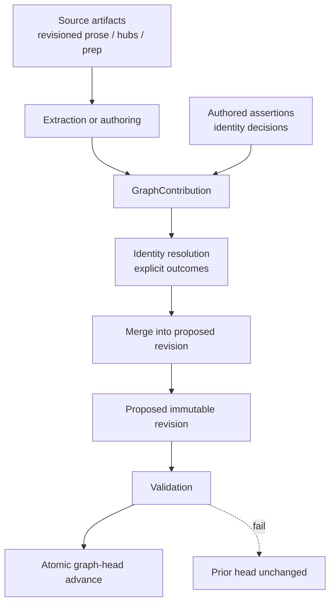
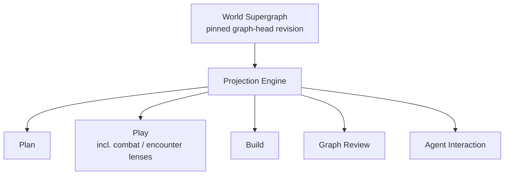

# Architecture — Campaign Supergraph

**Status:** Canonical World-model architecture authority
**Date:** 2026-07-10
**Updated:** 2026-09-25 — post-CUTOVER ownership settlement; durable World authority is DungeonMind and WorldKeeper is the governed change coordinator
**Mode:** Documentation / architectural north star
**Supersedes as architecture authority:**

- `Docs/Design/GRAPH-MEMORY-SUPERGRAPH-ARCHITECTURE-ROADMAP.md` (archived)
- `Docs/Design/GRAPH-MEMORY-UNION-SUPERGRAPH-PROJECTION.md` (archived; projection contracts absorbed here)
- `Docs/Experiments/GRAPH-MEMORY-WORKSTREAM-ANCHOR.md` (archived as operational anchor)
- `Docs/Design/ANCHOR-dungeonBuddy-graph-retrieval.md` (archived as pre-supergraph thesis)

**Current companions:**

- Document authority audit: [`Docs/Reports/graph-document-audit.md`](../Reports/graph-document-audit.md)
- Current-source manifest: [`INDEX-design-agent-source-set.md`](INDEX-design-agent-source-set.md)
- Source-to-World interaction authority: [`DESIGN-source-to-world-authoring-interaction-contract.md`](DESIGN-source-to-world-authoring-interaction-contract.md)
- Repository settlement record: [`Docs/Reports/REPORT-repository-settlement-2026-09-25.md`](../Reports/REPORT-repository-settlement-2026-09-25.md)

**Historical program records:** `ROADMAP-campaign-supergraph.md`,
`PR-TRACKER-campaign-supergraph.md`, and
`STATUS-world-graph-continuity-spine.md` preserve the Buddy-owned migration
program. They do not authorize new work after the 2026-09-25 settlement.

**Still in force as contracts / surface product (not graph-workstream roadmap authority):**

- [`CONTRACT-surface-vocabulary-boundary-v0.md`](CONTRACT-surface-vocabulary-boundary-v0.md)
- [`ARCHITECTURE-surface-interaction-layer.md`](ARCHITECTURE-surface-interaction-layer.md) — **UI shell / shared bars** (cross-boundary pointer only)
- [`ARCHITECTURE-plan-surface-toolbox.md`](ARCHITECTURE-plan-surface-toolbox.md) — Plan domain composition
- [`DESIGN-graph-object-authoring-surface.md`](DESIGN-graph-object-authoring-surface.md)
- [`DESIGN-source-to-world-authoring-interaction-contract.md`](DESIGN-source-to-world-authoring-interaction-contract.md) — source/World authoring interaction and transaction-local reference contract
- [`DESIGN-plan-surface-session-prep-current-goal-2026-07.md`](DESIGN-plan-surface-session-prep-current-goal-2026-07.md)
- Evidence / identity / taxonomy contracts under `Docs/Design/GRAPH-MEMORY-*` that the audit marks KEEP

The architectural invariants in this document remain current. The old Buddy
Campaign Supergraph implementation sequence is settled; current implementation
order is owned by the active domain workstream authorities listed in
[`INDEX-design-agent-source-set.md`](INDEX-design-agent-source-set.md).

### 0.1 Post-CUTOVER ownership re-anchor

The World model survived; its runtime ownership moved.

```text
DungeonBuddy
  GM/product interaction
  source and work surfaces
  reversible drafts/intents
  projection and presentation
  AgentRuntime + product capability policy

WorldKeeper
  WorldChangeIntent interpretation
  same-transaction dependency resolution
  PreparedWorldChange
  confirmation coordination
  verified-result reshaping

DungeonMind
  durable World identity
  source/provenance authority
  semantic profile + admission
  immutable revisions/head
  governed publication + recovery
  general World reads
```

References below to the historical Buddy Graph Kernel or `src/graph_memory`
describe semantic responsibilities and migration-era implementation placement.
They are **not** a claim that Buddy still owns durable World storage, identity,
revision, or publication. CUTOVER #667 physically removed that legacy ownership.

---

## 1. Vision

DungeonMindBuddy is building a **persistent World Supergraph** (product shorthand: **Campaign Supergraph**) that serves as the memory backend for every surface.

Every surface — Plan, Play, Build, Graph Review, and Agent Interaction — either contributes data to it, reads from it, validates it, or visualizes it.

**UI boundary:** Shared Nav/Tool/Edit/Agent/Projection host ownership lives in
[`ARCHITECTURE-surface-interaction-layer.md`](ARCHITECTURE-surface-interaction-layer.md).
This document does not sequence UI hoists.

This project is **not** building a graph-extraction experiment, a session-local graph product, or a preview-graph architecture. Those were useful proofs. Their lessons remain. Their ownership models do not.

```text
One world → one authoritative World Supergraph
  → campaign-scoped assertions / evidence / chronology
  → many projections (campaign + focus)
  → many surfaces
```

There is no backwards-compatibility requirement for obsolete abstractions. Prefer clarity over historical continuity. A forward-only project does not indefinitely run two architectures.

---

## 2. Core concepts

### 2.1 World Supergraph (Campaign Supergraph)

**Durable ownership boundary:** one authoritative graph **per world / setting** (e.g. Eldyrwild).

Product language may still say “Campaign Supergraph” because surfaces almost always operate inside a campaign. Architecturally, the durable store is a **World Supergraph**. Campaign is a **scope** on assertions, evidence, chronology, and visibility — not a second graph and not a copy of world entities.

It holds:

- global nodes (identity-stable world objects — places, factions, NPCs, cosmology)
- edges and assertions, each carrying campaign scope where applicable
- aliases and identity keys (world-global)
- source domains (recap, worldbuilding, prep, authored assertion, identity decision, etc.)
- source artifacts, contributions, and evidence refs
- merge / reconciliation history as needed for inspectability
- a world **graph head** (pointer to the current validated immutable revision)
- **mandatory** epistemic, temporal, visibility, and canon-state metadata on durable assertions

It does **not** hold:

- UI state
- surface-specific presentation rules
- eval harness configuration
- “session graphs” as first-class stores
- duplicated per-campaign copies of the same world entity as the default identity model

Worldbuilding is a **source domain** that contributes into the World Supergraph. It is not a peer graph that surfaces must union at read time, and it is not copied into a campaign-private graph.

### 2.2 Session is a lens

Sessions are not ownership boundaries.

```text
World Supergraph (graph head)
        ↓
   Projection Engine
   campaign = Campaign 2
   focus = Session 23 (or prep window, or live turn, or none)
        ↓
   Surface (Plan / Play / Build / …)
```

A projection applies campaign scope, focus, ranking, highlighting, and admissibility. The graph owns identity. A projection never invents a second Caelynn for “Session 23 Caelynn.”

Combat and encounter operation are **Play modes / Play projection lenses**, not separate top-level surfaces and not separate graphs.

### 2.3 Read and write are separate systems

**Write path**

```text
Source Artifact (revisioned)
  → Extraction (candidates)
  → GraphContribution
  → Identity Resolution (explicit outcomes)
  → Merge / Reconciliation (idempotent, retractable)
  → Proposed immutable graph revision
  → Validation
  → Atomic graph-head advancement
```

**Read path**

```text
World Supergraph (pinned graph-head revision)
  → Projection Engine (campaign + focus + admissibility)
  → Surface
```

These must not intertwine. Surfaces do not extract. Extractors do not render. Projection does not mutate identity. Readers pin one coherent revision for a request.

### 2.4 Surfaces never own graph behavior

Plan, Play, Build, Graph Review, and Agent Interaction **consume projections** (Graph Review also authors write-path corrections).

None of them:

- invent identity semantics
- invent evidence semantics
- invent merge rules
- reach into graph storage files or eval fixture internals
- select a graph by ingest-run ID, preview source, manifest path, or “latest ingest for session-N”

Graph Review may **author corrections** that flow through the write path as durable contributions. That is still write-pipeline work, not “the surface owns the graph.”

### 2.5 Forward only

Experimental infrastructure does not become production architecture by inertia.

If an experiment proved something valuable, keep the **lesson**, not the implementation:

| Lesson to keep | Implementation to discard as architecture |
|---|---|
| Source-span evidence is required | Eval-owned graph as durable store |
| Session focus is a projection overlay | Session-local graphs as product concepts |
| Category-decomposed extraction quality | Compact single-call preview extractor as the quality path |
| Union of campaign chronology + worldbuilding sources | “Preview union” keyed only to one session’s latest ingest as the product model |
| Shared `GraphObjectCard` across surfaces | Parallel Plan-only object cards |
| Authored overlay + event log as correction trail | Preview-store-only materialization as the durable write destination |

Obsolete runtime paths (preview routes, latest-ingest selectors, fixture-specific adapters) are **deleted in the same PR that makes their replacement production-ready**, unless a named remaining consumer blocks deletion. PR012 is a leftover safety net, not the default demolition owner.

---

## 3. Graph tenancy (decision)

### Decision: Model B — World-owned graph with campaign scopes

Compared alternatives:

| Model | Shape | Verdict |
|---|---|---|
| **A — Campaign-owned graph** | Each campaign copies/imports worldbuilding | Rejected. Corpus already has Campaign 1 and Campaign 2 sharing Eldyrwild hubs (e.g. Mirathorn). Duplicates identities, forces replay of world corrections per campaign, and invites a second architectural reset. |
| **B — World-owned + campaign scopes** | One World Supergraph; campaign scopes assertions/evidence/chronology/visibility | **Selected.** Preserves shared identity; projection selects `worldId` + `campaignId` + focus. |
| **C — Layered world + campaign overlay graphs** | Compose two stores at read time | Deferred. Avoids some write complexity but introduces composition and dual-head problems. Revisit only if Model B scoping proves insufficient. |

### Model B consequences (normative)

1. **One Mirathorn.** Two campaigns in Eldyrwild do **not** get separate durable nodes for the same world entity by default.
2. **Shared world updates propagate once.** Correcting a world hub / world assertion updates the World Supergraph; all campaigns see it under their projection rules.
3. **Campaign-scoped truth is explicit.** Played events, campaign-only relationships, secrets, and chronology carry campaign scope (and often session/temporal scope). They are not silently promoted to world-universal facts.
4. **Cross-campaign identity is supported** for world entities. Cross-campaign *consequence* edges may exist when evidenced; they remain inspectable and scoped.
5. **Migration path away from B** would be Model C composition — not a return to per-campaign copied graphs — if future products need stronger campaign isolation than scoping provides.

### Storage and context keys

```text
Durable store key:  worldId
Graph head:         per worldId
Projection context: worldId + campaignId + focus + admissibility
```

v0 may physically store one world (Eldyrwild) with one active campaign scope emphasized in dogfood. The **model** must still be world-owned so Campaign 2 does not fork Mirathorn from Campaign 1.

---

## 4. Graph ownership and authority

| Concern | Owner |
|---|---|
| Graph state + graph head | **DungeonMind** durable World authority |
| Identity / aliases / merge / split | **DungeonMind** |
| Evidence / provenance / contributions | **DungeonMind** contracts and governed publication |
| Semantic World-change coordination | **WorldKeeper** |
| Projection focus / lenses / admissibility | DungeonBuddy consumer/projection layer over DungeonMind reads |
| Surface UX | DungeonBuddy surface apps (`apps/live-control-ui`, etc.) |
| Proof / dogfood / gold | Buddy evals/reports (never architecture ownership) |
| Corpus/source material | Human-authored **prose** and source artifacts; evidentiary input, not the durable World |
| Authored World assertions / identity decisions | Governed World change through WorldKeeper → DungeonMind |

### 4.1 Authority model (decision)

```text
Source artifacts are evidentiary authority.

Graph state is a durable materialized knowledge model.

Human graph corrections create explicit authored source assertions
or identity/merge/split decisions.

Those assertions become durable source artifacts or governed graph records.

The graph can be reconstructed without silently losing approved corrections.
```

**Corpus markdown** remains the human-authored source of truth for **narrative prose**. It is not the complete authority for every durable graph decision (identity merges, alias corrections, accepted/rejected candidates, epistemic overrides).

**Graph Review corrections** do **not** silently edit corpus markdown. Outcomes by correction class:

| Correction class | Authoritative home | Corpus markdown? |
|---|---|---|
| Factual assertion (relationship, attribute) | Authored graph assertion artifact (contribution) | No automatic rewrite; optional later prose promotion is a separate authoring act |
| Identity merge / split / unmerge | Governed identity decision record (replayable) | No |
| Alias correction | Governed identity / alias record | No |
| Evidence reassignment | Contribution + evidence refs | No |
| Canon-state / visibility / epistemic correction | Authored assertion or governed record on the assertion | No |
| Source-text editing | Edit corpus markdown → new source revision → re-ingest / supersede contribution | Yes — this is the prose path |

### 4.2 Dual-authority invariants

1. Source-derived claims remain distinguishable from human-authored graph assertions.
2. Approved corrections survive full graph reconstruction / replay.
3. Corpus ↔ graph disagreement is **inspectable** (reportable), never silently resolved by dropping one side.
4. Rebuilding the graph from current source revisions + durable authored records + identity decisions must reproduce an equivalent graph head (see §6).
5. Graph summaries are not evidence by themselves.

---

## 5. GraphContribution lifecycle (decision)

The compressed write sketch “extract → resolve → merge” is insufficient. The
historical Buddy write pipeline used **GraphContribution** as its explicit
provenance/replay unit; current Buddy ingestion adapters may still produce or
map that shape. Durable acceptance/publication semantics belong to DungeonMind,
and the accepted interactive authoring seam is Buddy → WorldKeeper → DungeonMind.

### 5.1 Concept

```text
GraphContribution
  contribution_id
  source_artifact_id
  source_revision
  extraction_profile          # or "authored" / "identity_decision"
  produced_at
  campaign_scope              # when applicable
  candidate assertions
  accepted assertions
  rejected assertions
  unresolved / ambiguous mentions
  supersedes / replaces contribution_id?
  status: active | superseded | retracted
```

### 5.2 Lifecycle semantics the durable World path must preserve

| Event | Required behavior |
|---|---|
| Source edited / replaced | New contribution supersedes prior contribution for that source revision lineage; unsupported assertions retract if no remaining support |
| Extraction rerun (new profile/model) | New contribution; idempotent w.r.t. unchanged accepted meaning; does not duplicate durable state |
| Edge disappears in later extraction | Prior accepted assertion loses this contribution’s support; retract only if unsupported elsewhere |
| Source artifact deleted | Retract that contribution’s exclusive support; retain assertions still supported by other contributions |
| Same source ingested twice | Idempotent — no duplicate graph state |
| Candidate rejected | Remains contribution-level record; does not enter durable accepted identity/assertion set |
| Identity merge reversed (split/unmerge) | Durable identity decision; replayable; does not require deleting unrelated support |
| Canon status of source changes | Recompute admissibility / authority class; may retract or demote assertions |

### 5.3 Required invariants

1. Reprocessing an unchanged source does not duplicate graph state.
2. Replacing a source revision retracts assertions no longer supported by any active contribution.
3. Multiple sources may independently support the same durable assertion.
4. Removing one source does not remove an assertion still supported elsewhere.
5. Identity decisions remain inspectable across contribution replacement.
6. Reconstruction from contributions + identity decisions produces an equivalent graph head.
7. Failed merges leave the prior graph head readable (see §7).

### 5.4 Provenance/replay questions that must remain answerable

- Which contribution introduced this node, edge, alias, or evidence reference?
- Is this assertion still supported by the current source revision set?
- What happens when a contribution is superseded or retracted?
- Is replay idempotent?
- Can the graph head be deterministically rebuilt?

---

## 6. Write architecture



### Principles

1. **Provenance first.** Every durable claim carries source anchors / evidence refs and contribution ids.
2. **Candidates are not canon.** Extraction produces candidates; merge decides acceptance.
3. **Identity is world-global.** Cross-session and cross-campaign resolution for world entities happens before or at merge, with explicit ambiguity outcomes (§9).
4. **Authoring is a write path.** Graph Review overlays and merges are first-class contributions, not UI-only patches.
5. **Multi-source is normal.** Recaps, worldbuilding hubs, prep notes, authored assertions, and identity decisions all feed the same World Supergraph.
6. **Initial materialization is required.** Storage and merge APIs are not enough; a named, representative real union must be populated and validated before surfaces migrate.
7. **Corrections survive rebuild.** Approved authored assertions and identity decisions are inputs to reconstruction.

### What “preview ingest” was

Preview / session-keyed ingest runs were a **temporary materialization strategy** to prove extraction → projection. They are not the long-term write architecture and are not a production graph-selection mode.

---

## 7. Graph head and versioning (decision)

### Minimum invariants

These invariants remain normative for the durable World even though the original
Buddy PR sequence that first proved them is historical.

1. A published graph **revision is immutable**.
2. The **graph head** points to exactly one validated revision per `worldId`.
3. A merge builds a **proposed next revision** without mutating the current head’s revision bytes.
4. **Validation completes before** head advancement.
5. Head advancement is **atomic**.
6. Failed writes leave the **prior head readable**.
7. Every revision records its **parent revision** and contributing operation(s) / contribution ids.
8. Readers receive a **coherent single revision** (projection pins the head revision, or an explicitly requested historical revision, for the request).
9. **Rebuild and rollback** are supported operationally (even if crude in v0: restore prior head pointer / reload parent revision).

### Open implementation choices (not open invariants)

```text
snapshot files
copy-on-write directory
event log + materialized snapshot
database transaction
```

v0 may be file-backed. File-backed storage makes atomicity and concurrency **more** important, not less. A mutable “edit the current JSON in place” store does **not** satisfy these invariants.

### Version what

- Durable World schema / model contracts (DungeonMind)
- Projection payload contracts (read API)
- Extraction profiles (write pipeline knobs)
- Gold fixtures (eval only)
- World graph head / revision identity

Do not version “session graphs.” Do not treat preview run IDs as the product identity of campaign memory — they may remain operational/provenance metadata only.

### Concurrency

While an ingest/merge is running, “current” means the last successfully published head. In-flight proposals are not readable as the campaign memory backend. Two concurrent merges must not clobber: lose-and-retry against parent, or serialize writers per `worldId`.

---

## 8. Read architecture



### Principles

1. Surfaces request a **graph context** (`worldId` + `campaignId` + focus + projection mode + admissibility). They never select an ingest run, preview source, store path, or manifest as the graph.
2. **Projection always reads the persistent World Supergraph head** (or an explicitly pinned historical revision). Ingest-run IDs may appear as provenance or operational metadata; they are never graph-selection modes for surfaces.
3. Projection payloads are backend-neutral contracts in `src/graph_memory/projection`.
4. Runtime adapters in `apps/live_control_server` translate store → projection contract. They do not redefine identity.
5. UI components (`GraphObjectCard`, chips, search) render projection views. They do not load graph files.
6. Projection applies **visibility and epistemic admissibility**; adjacency alone never implies audience access.

### Production graph-context contract (absolute)

Surface-facing graph APIs **must not** expose:

- `preview-source` production selectors
- `latest-ingest` / `useLatestGraphIngest` production selectors
- `recap-only` graph modes as the campaign memory backend
- explicit store paths or manifest paths as graph identity
- session-derived “pick the latest ingest for memorySession-N” as graph context

Test and developer loaders may exist **outside** the production context contract (isolated tests, offline tools). They must not appear in surface-facing acceptance criteria as selectable backends.

### Graph context (read contract sketch)

```text
worldId
campaignId
focus (session id, prep window, live turn, combat/encounter lens, or unfocused)
projectionMode (world-supergraph + campaign scope + focus overlay)
admissibility / visibility rules
revisionPin? (default: current head)
```

Missing projection is an honest failure of materialization, scope, or focus — not a prompt to invent a session graph or fall back to latest-ingest.

---

## 9. Epistemic, temporal, visibility, and canon metadata (decision)

These are **durable World invariants**, not optional node decorations.

Every **durable assertion** (and evidence-bearing edge instance) must carry enough metadata to answer:

| Question | Required |
|---|---|
| Who asserts this? | Yes |
| What source / contribution supports it? | Yes |
| What authority class does the source have? | Yes (recap, world hub, prep, rumor note, authored assertion, …) |
| Acceptance state? | Yes (`candidate` / `accepted` / `superseded` / `contradicted` / `retconned` / `rejected`) |
| Temporal scope of validity? | Yes (as-of session, interval, or world-timeless — explicit) |
| Audience / visibility? | Yes (GM-only, player-known, public, table, …) |
| Epistemic kind? | Yes (`fact` / `played_event` / `plan` / `rumor` / `belief` / `inference` / `mechanical_rule` / …) |
| Admissible for this projection/agent? | Derived from the above + projection policy |

### Normative distinctions

- A planned betrayal and a played betrayal are **not** the same unqualified edge.
- A rumor and a confirmed fact are **not** interchangeable.
- A player-facing agent must not receive GM-only secrets merely because both are adjacent to the same node.
- Union/merge must preserve these distinctions; projection must enforce them.

Historical Buddy PR002/PR005/PR007 first proved these properties. Current
DungeonMind-backed publication/read paths must preserve the same metadata and
fail-closed visibility/admissibility behavior.

---

## 10. Identity resolution outcomes (decision)

Identity resolution is not a single silent merge step. Every mention/candidate resolves to an explicit outcome:

| Outcome | Enters durable graph? | Notes |
|---|---|---|
| `resolved_existing` | Yes — linked to existing identity | |
| `created_new` | Yes — new canonical identity | Requires sufficient evidence / policy |
| `provisional_new` | Yes — **noncanonical** provisional node | Excluded from some projections; must be clearly marked |
| `ambiguous` | No as canonical identity | Remains contribution-level; may queue review |
| `blocked_collision` | No | Cross-class or policy collision; diagnostics required |
| `rejected` | No | Explicit rejection record on contribution |
| `human_override` | Yes — via durable identity decision | Replayable; preferred resolution for hard cases |

### Defaults

- Unresolved mentions and ambiguous candidates remain **contribution-level records**.
- They do **not** silently become canonical identity.
- Provisional nodes are clearly noncanonical and excluded from projections that require accepted identity.
- Human merge / split / unmerge decisions are durable and replayable.
- Resolution confidence scores are **not** authority.

### Reversibility

The durable identity authority must support **split / unmerge**, not only alias
merge and blocked collision. Identity mistakes are inevitable; reversibility is
foundational. The original Buddy PR004 proof is historical.

---

## 11. Projection architecture

A projection is a **lens**, not a store.

| Projection concern | Meaning |
|---|---|
| Campaign scope | Which campaign-scoped assertions/evidence are in view |
| Focus overlay | Which evidence/edges are highlighted for the current session, prep window, or Play lens |
| Node view | GM-facing card fields: label, kind, role, aliases, summary, relationships, evidence, actions |
| Recap projection | Mentions in a recap resolve to global nodes |
| Adjacency | Traversal candidates for related-object navigation (still filtered by admissibility) |
| Search index over projection | Label/alias/kind/id search for insert-refs and dogfood |
| Play combat/encounter lens | Play-mode focus over the same World Supergraph — not a combat graph |
| Revision pin | Request reads one immutable revision |

Incorrect models (do not reintroduce):

```text
session_23_graph as architecture
plan_graph vs play_graph as separate stores
preview_graph as the product memory backend
latest-ingest as a projection mode
per-campaign copied Mirathorn nodes as the default
```

Correct model:

```text
World Supergraph (head) + campaign=C2 + focus=session-23 → Plan / Recap / Object cards
World Supergraph (head) + campaign=C2 + Play combat lens → encounter-relevant objects
```

---

## 12. Graph Kernel

This section defines the semantic responsibilities historically proven by
Buddy's Graph Kernel. Durable production ownership of these responsibilities now
lives in **DungeonMind**. Buddy code under `src/graph_memory` may still provide
extraction, candidate/review, projection, retrieval, and compatibility seams; it
must not become a second durable World owner.

### In scope

- Node / edge / assertion / alias model (including mandatory epistemic metadata)
- Identity resolution outcomes, merge, split/unmerge, cross-class collision policy
- GraphContribution lifecycle (accept / reject / supersede / retract / replay)
- Evidence ref and source-domain contracts
- Validation, integrity reports, and inspectability
- Persistent load/store seams and atomic graph-head advancement
- Projection-ready adjacency primitives (not surface UX)

### Out of scope

- TipTap / Plan chrome
- Hermes / Agent Interaction prompts
- Eval harness orchestration
- Corpus markdown editing UX
- Retrieval ranking policies that belong to Buddy's retrieval layer (DungeonMind provides admitted durable World facts; retrieval composes them)

### Historical Buddy implementation sequencing

The sequence below records how the semantics were originally established in
Buddy. It is evidence, not current dispatch authority.

1. **Public boundary and invariants** — package/API surface, what adapters may call, what is forbidden; enforceable import/API guards
2. **Identity and reconciliation semantics** — outcomes, provisional nodes, split/unmerge
3. **Durable contribution merge** — contribution IDs, idempotency, supersession, retraction, rebuild, head advancement

Historical note: the original Buddy “Kernel” program was considered incomplete
until identity and merge/replay semantics were proven, not merely packages
rearranged. Do not interpret that historical sequencing rule as authority to
recreate a Buddy Kernel.

Buddy surfaces/adapters consume the current World boundary. They do not
reimplement DungeonMind identity/publication semantics or resurrect the removed
Buddy graph engine.

---

## 13. Surface architecture

Top-level product surfaces:

| Surface | Role relative to the graph |
|---|---|
| **Plan** | Prep cockpit. Consumes focused projections for object cards, references, and Agent context. Escalates durable corrections/authoring to governed product write flows; does not own World mutation. |
| **Play** | Live table, including combat and encounter operation as Play modes/lenses. Consumes projections for turn-relevant objects; does not own merge. |
| **Build** | Authoring / worldbuilding tooling. May feed write path; does not become a second graph. |
| **Graph Review** (`/ingest` workbench) | Controlled review/authoring workbench. Buddy may prepare/select/propose through current adapters, but durable World publication is DungeonMind authority; the accepted consumer-migration seam coordinates semantic changes through WorldKeeper. |
| **Agent Interaction** | Cross-surface interaction layer / graph consumer. Asks questions against admissible projected/retrieved context. Does not own graph semantics. |

**Combat is not a peer surface.** Combat-specific projection behavior is a Play mode or Play projection lens.

Shared UI primitives (especially `GraphObjectCard`) are **presentation of projection**, reusable across surfaces with surface-safe action policies.

---

## 14. Ingestion architecture

Ingestion is Buddy's source-side extraction/review pipeline. It may still
produce contribution-shaped candidate/provenance material for compatibility and
mapping, but it does not own the durable World. Durable publication terminates
in DungeonMind authority.

Target shape:

```text
raw / normalized source (revisioned)
  → evidence spans + provenance
  → category-decomposed (or successor) extraction
  → GraphContribution (candidates)
  → identity resolution (explicit outcomes)
  → merge into proposed revision → validate → advance head
```

### Rules

- Graph-first: durable graph memory must not depend on breadcrumb / session-memory steps as a gate.
- Evals prove extraction quality; they do not own the runtime store.
- **Initial world/campaign materialization** populates the first real union from a **named acceptance corpus** before Projection Engine and Plan migration.
- Later multi-source expansion adds artifact families without creating per-family graphs.

---

## 15. Long-term storage

v0 may remain file-backed and inspectable. That is an implementation detail.

Requirements that do not change with storage technology:

1. One authoritative World Supergraph per `worldId` with an explicit graph head (§7).
2. Deterministic load/validate and rebuild from contributions.
3. Evidence-bearing assertions with mandatory epistemic metadata (§9).
4. Merge/identity history inspectable enough to debug mistakes and reverse them.
5. No surface reaches into storage internals or selects stores by path/manifest.
6. Machine-readable integrity / health reports (head revision, coverage, unresolved identities, stale contributions, etc.).

DungeonMind's durable World contract and Buddy's consumer/projection boundaries
must remain stable across storage evolution; storage adapters change underneath
their owning boundaries.

---

## 16. Retrieval

Long-term retrieval is **graph-native**: traverse and admit evidence through the World Supergraph, with lexical/vector helpers subordinate to graph identity, provenance, and admissibility.

Near-term:

- Surfaces may still use transitional corpus-index / live-query paths for **non-graph** memory answers until graph-native retrieval lands.
- Those paths are **not** the graph architecture target and must not be used as a substitute World Supergraph.
- World-backed prep Q&A and Agent context must consume DungeonMind-backed admitted retrieval/projections through Buddy boundaries, not invent a parallel memory model.

See also: surface vocabulary boundary (`SourceArtifact → SourceAnchor → SourceUnit`) — still the shared language for source-facing consumers until graph-native retrieval fully replaces transitional adapters.

---

## 17. Agent architecture

Agents are graph consumers with tools (cross-surface), not a separate memory backend. **Agents are not privileged graph writers.**

They:

- request projected context and admissible evidence (visibility enforced)
- may propose candidates that enter the write path under human/policy control
- must not silently mutate the World Supergraph
- must not treat chat history as campaign memory
- must not write graph/storage internals or advance graph head directly

### 17.1 Agent tool capability categories and authored prep

Normative detail: [`CONTRACT-agent-tool-authored-prep-contributions-v0.md`](CONTRACT-agent-tool-authored-prep-contributions-v0.md).

Capability categories (exact):

```text
read_only
draft_only
preview_write
confirm_commit
admin_diagnostic
```

Durable agent-proposed writes require **explicit revision-bound GM confirmation** bound to one proposal (`proposal_id` / version / digest + expected parent graph revision). Stale proposals fail closed.

Authored prep uses a separate lifecycle (`draft` → `planned` → `placed` → `played` → `world_canon`, plus `retracted` / `superseded`) that must not be collapsed into assertion acceptance, epistemic kind, or contribution status. `played` requires actual-play evidence or an explicit played-event assertion; `world_canon` requires explicit promotion and must not automatically universalize campaign-scoped plans or play.

Historical Buddy PR011/PR006 records show how the first runtime tool and
materialization paths were proven. Current Agent/write work must follow the
current AgentRuntime and source-to-World authorities instead of redispatching
those PR labels.

Agent Interaction’s durable knowledge backend is DungeonMind World authority
plus Buddy's governed retrieval/projection layer, not Hermes-shaped thread
memory. Hermes/UI/thread memory remains non-canonical continuity.

---

## 18. Integrity and observability

A persistent graph can be logically wrong while remaining structurally valid. Integrity reporting is a **cross-cutting requirement**, not polish.

At minimum, machine-readable health/coverage reports must expose:

- graph-head revision id and parent
- source coverage (requested vs ingested vs skipped)
- contribution failures / supersessions / retractions
- unresolved / ambiguous / provisional identity counts
- stale source revisions (contribution not matching current artifact revision)
- orphaned evidence
- unsupported assertions
- projection truncation reasons
- visibility / admissibility denials (aggregate, not secret leakage)
- merge diff summary between revisions

Historical Buddy PR002/PR005/PR006/PR007 proved slices of this surface. Current
World/consumer paths still require machine-readable health evidence; a one-time
Markdown audit is not sufficient.

---

## 19. Historical evolution record

The following sequence records the Campaign Supergraph program that established
the current World invariants. It is no longer an implementation roadmap:

0. Architecture reset (this document set)
1. Persistent World Supergraph storage + immutable revision / graph-head contract
2. Graph Kernel (boundary → identity outcomes → contribution merge)
3. **Initial real materialization** against a named acceptance corpus (before projection)
4. Projection Engine (campaign + focus lenses; revision-pinned; admissibility tests)
5. Surface integration (Plan, then Play including combat lenses, Build as needed)
6. Multi-source ingestion expansion
7. Graph-native retrieval
8. Agent backend on graph memory
9. Living campaign memory + leftover obsolete-path cleanup

Each phase must preserve: world-owned graph, session-as-lens, read/write separation, contribution lifecycle, surfaces-as-consumers, forward-only demolition at replacement time.

---

## 20. Explicit non-concepts

Do not reintroduce these as architectural entities or production selectors:

- Session graph / plan graph / play graph / recap graph (as stores)
- Preview graph (as product memory)
- Eval-owned durable graph
- UI-owned identity merge
- Campaign-owned duplicated world graphs as the default tenancy
- `latest-ingest` / `useLatestGraphIngest` as graph context
- `preview-source` as graph context
- Recap-only graph mode as the campaign backend
- Explicit store/manifest paths in surface-facing graph APIs
- Combat as a peer top-level surface (use Play lenses instead)
- Mutable in-place “current graph JSON” without revision immutability
- Silent ambiguous → canonical identity promotion
- Optional epistemic/visibility metadata on durable assertions

Isolated tests and developer tools may load fixtures. They are not the design and not production graph context.

---

## 21. Definition of done for this architecture

A new contributor can answer, from this document and its companions alone:

1. What is the World / Campaign Supergraph, and what is its tenancy model?
2. What owns graph state, and what is the corpus vs graph authority relationship?
3. What is a GraphContribution, and how do supersession/retraction/replay work?
4. What are the graph-head / immutable revision invariants?
5. How does data enter the graph, and how do surfaces consume it?
6. Which durable graph semantics are owned by DungeonMind, and which Buddy-side extraction/projection responsibilities remain consumers/adapters?
7. What identity resolution outcomes exist, including split/unmerge?
8. Why are epistemic, temporal, and visibility fields mandatory?
9. How is the first real populated union defined (named acceptance corpus) before Plan migrates?
10. Where do current runtime ownership and workstream sequencing live after the DungeonMind/WorldKeeper extraction?

If answering any of those requires reading experimental ladder docs as authority, the documentation reset is incomplete.
