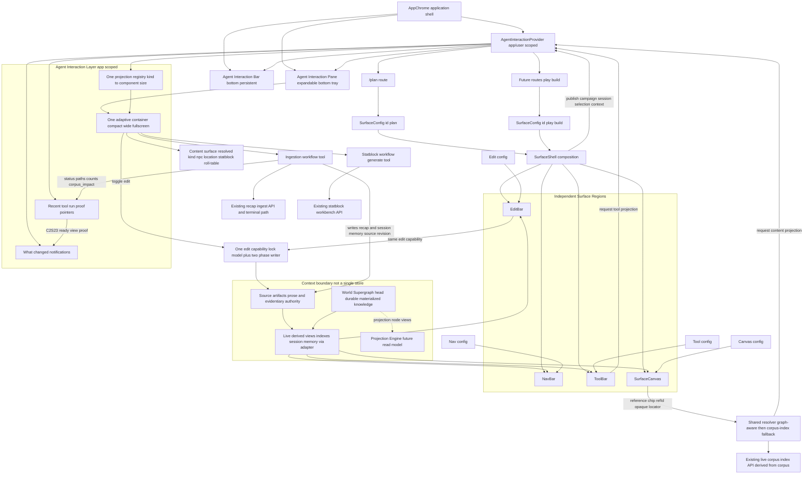
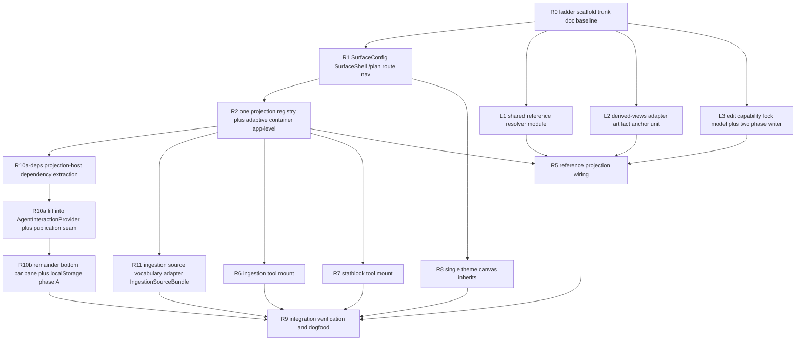

# Plan Surface Toolbox

## Current checkpoint — 2026-07

This document remains the architecture authority for `SurfaceConfig`, projection, the Tiptap/Markdown Plan canvas, the shared resolver, edit capability, and the Agent Interaction target shape.

Current product framing for the next `/plan` dogfood phase is in `Docs/Design/DESIGN-plan-surface-session-prep-current-goal-2026-07.md`.

Post-PR314 transitional vs durable graph-memory path for Plan (selected-object card convergence, graph-aware resolver, plan-scoped prep-memory query, Union Supergraph as target read model) is in `Docs/Design/DESIGN-plan-graph-memory-reanchor-after-dogfood-2026-07.md`.

**Workspace document identity (2026-07):** Authored workspace documents (plan preps, Tiptap runbooks) use **opaque server-issued UUIDs** from the workspace document registry — not semantic slugs or path-derived keys. URL selection is `?documentId=<uuid>`; `?session=` is memory/graph focus only. Contract: [`CONTRACT-workspace-document-identity-v1.md`](CONTRACT-workspace-document-identity-v1.md).

Since this architecture was written, `/ingest` has matured into the **Graph Review / correction cockpit** for authored-memory commits. `/plan` is a **consumer surface**: it consumes reviewed graph memory and reuses selected-object projections from that work; it may draft prep and launch preview_write but does not absorb Graph Review diagnostics, Author Draft, identity merging, or durable commit semantics as its default session-prep UX. The current right-side Plan projection container remains transitional implementation state.

**Dual authority:** corpus/source artifacts are prose and evidentiary authority; the World Supergraph head is durable materialized knowledge state. Plan reads both through adapters; it does not own Kernel merge or graph-head advancement.

**Resolver note (2026-07 re-anchor):** corpus-index resolution remains the valid **fallback**. The durable ladder is graph-aware resolver → World Supergraph / projection node view → corpus-index fallback → unresolved `/ingest` escalation. Do not treat “resolve kind from corpus indexes” as the final architecture.

## Product Direction

`/plan` becomes the first intentional configured surface, not an alias to `/surface` or a random session-specific static page. It should show a clear context header such as **Plan · Longmont C2 · preparing Session 24 · ingesting Session 23**, with the context derived from a stable Plan session descriptor rather than whatever `DUNGEONMIND_LIVE_SESSION_DIR` happens to point at.

The durable abstraction is **Surface**, not Bar. A surface expresses one of the named work modes **Plan**, **Play**, or **Build**; each surface config composes independent regions instead of making every region pretend to be the same generic bar. Combat is no longer a fourth surface. It folds into the React **Play** surface as operational cockpit projections: initiative, HP, statblock drilldowns, generated combatants, terrain pressure, and related table tools.

**Priority decision (2026-06-22):** Surface work is the product priority, and it should exercise retrieval rather than wait for a separate retrieval-only milestone. Plan proves ingest and planning-context retrieval; Play proves table-facing retrieval through reference chips, statblocks, roll tables, combat rows, and focused-beat overlays. Build remains named but intentionally nebulous until Plan and Play dogfood show which durable world-object authoring surfaces are actually needed.

`/plan` does not own tool, edit, or nav internals. It supplies a `SurfaceConfig` to a reusable `SurfaceShell`:

- **NavBar** — global/surface navigation.
- **ToolBar** — config-projected workflow launcher and adaptive drawer/container.
- **EditBar** — document/editing command surface when a selected context is editable.
- **SurfaceCanvas** — the main work object for the active surface; for `/plan`, this is the Tiptap/Markdown planning board.

The ToolBar consumes shared knowledge and schemas, then projects configured workflow components into right-sized work surfaces. On `/plan`, those workflows support session preparation rather than recreate the serious memory-correction flow:

- **Memory status / ingest escalation** may show a lightweight state or route the GM to `/ingest`; Graph Review, diagnostics, and Author Draft belong primarily to that dedicated surface.
- **Statblock** opens a workbench surface that reuses the existing working statblock generation flow rather than rebuilding it.
- The registry stays open so a new workflow is added by config, but the plan only commits what has a real backing today; speculative surfaces are not pre-built.
- The drawer/container adapts to the active workflow: narrow for simple tools, wide for review surfaces, and mobile/full-screen when needed.

Reference chips on the canvas are navigation handles into corpus/graph detail, and resolving one is the same projection primitive as opening a tool. A chip resolves to a glance/selected-object card, then can expand into the content surface registered for whatever kind the resolver returns — rendered by the same adaptive container, sized to the content. From that projected content surface the GM can toggle edit. So "open a tool" and "follow a reference into its content surface" share one registry and one container; they differ only in what is projected and where it was triggered from. The surface does not declare a category vocabulary of its own: it treats the chip's `refId` as an opaque locator. Kind resolution today often comes from corpus indexes; the target path prefers World Supergraph / projection node views via a graph-aware resolver, with corpus indexes as fallback (see the post-dogfood re-anchor).

## Architecture Shape

**Core primitive:** A Surface is a configured work environment composed of Nav, Tool, Edit, and Canvas regions. `/plan` is the first concrete surface config. For `/plan`, the canvas is the Tiptap/Markdown working board the GM writes on. NavBar, ToolBar, and EditBar are independent projection components composed around it. Tools are not pages; they are configured workflows projected by the ToolBar into an adaptive container that can sit beside the canvas, overlay it, or fill the screen on mobile.

**Second primitive:** projection is shared. One projection registry maps a kind (`tool` | `content`) to a component and a preferred container size. Two things trigger a projection into the adaptive container:

1. The ToolBar (launch a workflow).
2. A reference chip on the canvas (follow a corpus reference into its content surface).

Both render through the same container and size modes.

This single registry and single adaptive container are **app-scoped**, not surface-local. They are hoisted above the route/surface switch into the Agent Interaction layer (see [Agent Interaction layer](#agent-interaction-layer-continuity-host) below). A `SurfaceConfig` declares which projections it enables and publishes ambient context into that layer; it does not own a private projection container. This keeps "one projection registry, one adaptive container" literally singular across the whole app rather than per surface.

The source-vocabulary boundary for projected ingestion material is defined by `Docs/Design/CONTRACT-surface-vocabulary-boundary-v0.md`. Agent Interaction and future taxonomy/ontology producers consume `SourceArtifact` -> `SourceAnchor` -> `SourceUnit` bundles, not raw ingestion internals.

**Simplification thesis** (the design rule that also risk-proofs against the ladder): one vocabulary, one registry, one edit capability, one resolver, one theme — and the surface never names ontology categories, it resolves them. Concretely:

- Content kind is resolved by a shared resolver. **Today** that often means corpus-index resolution as a valid **fallback**. The durable ladder is graph-aware resolver → World Supergraph / projection node view → corpus-index fallback → unresolved `/ingest` escalation. Do not treat corpus-index resolution as the final graph architecture.
- Edit everywhere is the single lock-model + two-phase-writer capability.
- One resolver module is shared by static and React.
- One `SurfaceConfig.theme` (canvas inherits).

This keeps the surface structurally incapable of forking the taxonomy registry the ladder owns. This document remains **ACTIVE REFERENCE** for Plan surface composition — it is **not** Campaign Supergraph sequencing authority (see `PR-TRACKER-campaign-supergraph.md`).



### Interpretation

- **SurfaceConfig** is the top-level product abstraction. It can express `plan`, `play`, or eventually `build` without copying shell layout. Combat belongs inside `play` as configured projections and operational state, not as its own route-level surface.
- **SurfaceCanvas** is the object of work. For `/plan`, it is the editable Tiptap/Markdown board.
- **ToolBar** projects configured workflow components; it does not hardcode ingestion/statblock as page-specific branches.
- **EditBar** edits the selected canvas/document/block; it does not launch prep workflows.
- A single projection registry keyed by kind (`tool` | `content`) backs both the ToolBar and reference-chip navigation. A reference chip resolves via graph-aware resolver → World Supergraph / projection node view → corpus-index fallback, shows a glance card, then expands into the content surface registered for the resolved kind.
- The surface resolves kind through the shared resolver and treats `refId` as an opaque locator; it does not declare its own category enum and does no alias/identity/merge logic (those belong to Graph Review / Kernel path).
- Content surfaces are projected the same way tools are, sized to the content. Editing everywhere is one capability — the spike lock model plus the two-phase source writer for **source revision**; graph/memory correction uses preview_write → confirm_commit through Graph Review. The EditBar and the projected-surface edit toggle are two triggers of the source-edit capability, not two stacks.
- One reference resolver module is shared by the static and React surfaces (both hit `/api/live/*/index` and future graph projection APIs); there is no parallel reimplementation.
- The "shared context" is **not a single store**. It decomposes into:
  - **source artifacts** (prose and evidentiary authority on disk),
  - **World Supergraph head** (durable materialized knowledge state),
  - live-derived views over both (corpus indexes the chip resolver reads today; projection node views as the target read model; plus session memory),
  - the Projection Engine and ontology/taxonomy workstream as producers/enrichers of derived semantics — not a shadow-only future dependency.
- **Current write boundary:**
  - source editing → source revision (two-phase writer),
  - prep drafting → `draft_only`,
  - proposed memory change → `preview_write`,
  - correction/commit → Graph Review / governed Kernel path (`confirm_commit`),
  - Plan does **not** own durable commit semantics.
- The surface consumes derived views through an adapter (`source artifact` → `source anchor` → `source unit`), so a later Tiptap-backed or graph-backed source is a config/adapter change, not a surface rewrite.

## Agent Interaction layer (continuity host)

Surface is the top-level **work** abstraction. The Agent Interaction layer is an orthogonal concern, not a competing top-level object: it is the app-level continuity host that owns the single shared projection container and the user's interaction continuity across surfaces and projects. A surface publishes context into it and enables projections; it does not own the container.

**Decided (2026-06-21):** the durable interaction affordance is a persistent bottom **Agent Interaction Bar** plus an expandable **Agent Interaction Pane**, hosted by the application shell (`AppChrome`), above the route/surface switch. The earlier right-side `/plan` Tools drawer is transitional implementation state, not the target. The pane is the adaptive container described above; its size modes `compact` | `wide` | `fullscreen` present as pane sizes `peek` | `half` | `full`.

### Composition target

```text
AppChrome
  AgentInteractionProvider        // app/user scoped; above the route switch
    Route / Surface               // PlanSurfaceShell, LiveControlSurface, Tiptap, ...
      SurfaceShell regions (Nav / Tool / Edit / Canvas)
  AgentInteractionBar             // persistent bottom bar
  AgentInteractionPane            // expandable bottom tray = the one adaptive container
```

**AgentInteractionProvider owns:**

- current conversation/thread pointer,
- pane open/size/active-projection state,
- active mode (`ask` | `inspect` | `ingest` | `statblock` | `reference`),
- active project/campaign/session context published by the surface,
- recent tool-run pointers,
- proof-artifact pointers,
- queued questions,
- "what changed?" notifications.

**Surfaces publish ambient context upward** (they do not own it):

| Surface | Published context |
|---|---|
| `/plan` | campaign, prep session, ingest session, selected canvas block/reference |
| future `/play` (migrating from `/surface`) | live session, focused beat, combat state, active event/job |
| editor surfaces | selected document/reference |
| future project surfaces | project id, corpus root, active artifact |

The bar consumes this as ambient context, not ownership.

**Pointers-only discipline** (binds to "the shared context is not a single store"): the provider stores locators and interaction history only — `refId`, artifact relpaths, session/campaign ids, run summaries, notification pointers, graph revision pins — never corpus bodies, normalized recap text, statblock content, or accepted graph assertions. Projected content is always resolved on demand from source artifacts, World Supergraph / projection node views, the derived-views adapter, or read endpoints. This layer must never become the unified knowledge/lifecycle store; it is **pointer-only continuity**, not derived semantics or durable authority.

For recap-ingestion proof and "what was ingested?" surfaces, the provider consumes an `IngestionSourceBundle` from the source-vocabulary adapter, not `corpus_impact` or `_normalized/` paths directly. `corpus_impact` remains diagnostic proof metadata inside that adapter contract; it is not narrative evidence and not the Agent Interaction semantic model.

**Persistence and cross-surface continuity:** routes currently hard-navigate (anchor href + pathname routing), so in-memory provider state does not survive a surface switch. Continuity is therefore delivered by persistence + rehydrate, not by in-memory state alone.

- **Phase A** — persist a bounded, safe subset (pane state, active projection, recent runs, notifications, active project id) to versioned `localStorage` and rehydrate on mount; transient context (selected reference) is not persisted.
- **Phase B** (later) — user-level store outside any project repo: JSON/SQLite under a user app-state directory, explicitly not under `corpus/` and not under a campaign.
- **Phase C** (later) — real identity for multi-device continuity.

## Boundary with the Ontology / Taxonomy ladder and Campaign Supergraph

Derived semantics, controlled vocabulary, and the graph model are owned by the Campaign Supergraph architecture and the `experiment/ontology-taxonomy-ladder` workstream, not by this plan (see `Docs/Experiments/EXPERIMENT-Ontology-Taxonomy-Ladder.md` and `Docs/Design/ARCHITECTURE-campaign-supergraph.md`). This surface plan must:

- Consume existing Markdown, session-memory JSONL, manifests, routes, corpus indexes, and World Supergraph / projection node views via an adapter.
- Use `Docs/Design/CONTRACT-surface-vocabulary-boundary-v0.md` as the minimal shared source vocabulary for ingestion consumers: current ingestion emits `IngestionSourceBundle`; graph-backed retrieval produces/enriches the same `SourceUnit` envelope.
- Use `Docs/Design/CONTRACT-agent-tool-authored-prep-contributions-v0.md` for agent tool categories and durable write boundaries.
- **Not** build a unified knowledge store here, and **not** collapse GM prep, rumor, candidate facts, and played truth into "one state everything reads and writes" — that conflation is explicitly forbidden; provenance + lifecycle belong in separate state machines (source envelope, authored-prep lifecycle, GraphContribution status).
- **Resolve, don't declare:** the surface owns no category vocabulary. Entity kind is resolved via graph-aware resolver → World Supergraph / projection node view → corpus-index fallback; the taxonomy registry stays the canonical owner.
- **Opaque locators, no identity work on Plan:** `refId` is a locator only. The surface performs no alias resolution, identity merge, or relationship inference — those belong to Graph Review / Kernel path.
- **Adapter speaks the source vocabulary** (`source artifact` → `source anchor` → `source unit`) so graph-backed retrieval is a drop-in swap, not a translation layer.

### Sequencing (decided)

This Surface plan and the ontology/taxonomy ladder run in parallel at full scope; the adapter boundary above is what keeps them decoupled. Neither blocks the other:

- World Supergraph / projection node views are the target read model for reference resolution and prep consumption.
- Until graph-backed projection is fully promoted, the surface resolves references over source artifacts and live-derived views (corpus indexes), and degrades gracefully: shallow resolution (glance + content surface) works today; reference-depth navigation lights up when projection node views land, via an adapter swap, not a surface rewrite.
- **Risk to manage while parallel:** full-scope surface work must not invent a stand-in "shared state" to fake reference depth before the graph exists. Keep the adapter seam honest so the depth arrives from the supergraph, not from a conflated blob.

## Visual Design and Theming

Anchor on the existing Tiptap spike styling rather than inventing a new look. The spike at `apps/live-control-ui/src/tiptap/tiptapSpike.css` and `apps/live-control-ui/src/tiptap/TiptapCalloutBridgeSpike.tsx` already establishes the token vocabulary and theming seam to reuse:

- **Token set:** `--fg`, `--fg-mute`, `--border`, `--bg-card`, `--bg-input`, `--accent`, `--radius`, `--mono`, each falling back to app-level tokens (`--text`, `--text-muted`, `--panel`). The surface should consume these same tokens so the canvas matches the spike by default.
- **Descriptor-driven theme:** the editor applies `md-theme-${themeId}` / `data-md-theme` from a descriptor and loads `prep-markdown-themes.css`. This is the existing "config selects styling" mechanism to generalize, not replace.

### Design intent for the projected canvas

Easy and chill, ready for creative activity. Concretely:

- **Not busy:** chrome (nav/tool/edit) stays quiet and recessive; the canvas is the visual focus. Calm spacing, soft borders (`--border`), generous radius (`--radius`), restrained accent use (`--accent` for state/affordance, not decoration).
- **Not vacant:** a clear starting block, gentle block-boundary affordances (reuse the spike's block-state pills), and an inviting empty state so a blank canvas still feels like a workspace, not a void.
- **Calm by default, expressive on demand:** ToolBar workflows expand into their adaptive container without crowding the canvas; the canvas keeps its breathing room while a tool is open.

Retain the config heart: styling is loaded through config, not hardcoded per surface, so themes can be customized and extended later.

- **One theme:** `SurfaceConfig.theme` declares the token overrides and/or `themeId` for the surface; the canvas and projected components inherit it. No separate per-canvas theme layer until a second surface proves the need.
- The shell applies theme tokens as CSS custom properties at the surface root and passes `themeId` down to the canvas exactly as the spike does, so a future theme is a config change, not a component rewrite.
- Workflow and content components inherit the surface tokens so projected surfaces visually belong to the surface rather than carrying their own palette.

## Implementation Approach

1. Add a real `/plan` route in `apps/live-control-ui/src/App.tsx`, separate from `/surface` and the static `evals/.../live-play.html` dogfood page.
2. Introduce a `SurfaceConfig` type with only what `/plan` needs now: identity, label, context, tools, canvas, and theme. Do not pre-build nav/edit config breadth or build/combat/play knobs speculatively; generalize when a second surface arrives.
3. Make theme carry token overrides and/or a `themeId` that the shell applies as CSS custom properties at the surface root, defaulting `/plan` to the existing Tiptap spike token set; canvas inherits.
4. Introduce a reusable `SurfaceShell` that composes independent NavBar, ToolBar, EditBar, and SurfaceCanvas regions.
5. Keep NavBar, ToolBar, and EditBar reusable and surface-agnostic. `/plan` supplies context and config; the components remain independent.
6. Define one projection registry keyed by kind (`tool` | `content`) mapping to a component and a preferred container size. Both ToolBar launches and resolved reference chips resolve through it.
7. Add an adaptive projection container that loads the selected component from the registry. Size modes: `compact` (glance), `wide` (work surface), `fullscreen`/mobile. This single container is hosted at app level by the Agent Interaction layer (bottom Bar/Pane in `AppChrome`), above the route/surface switch, not inside a per-surface shell; size modes present as pane `peek`/`half`/`full`. Migrate lift-then-replace: move projection state into the app-level `AgentInteractionProvider` behind the existing right-side drawer first, then replace the drawer with the bottom bar/pane.
8. Add a small backend read adapter that emits `IngestionSourceBundle` from current recap-ingest status/artifacts according to `Docs/Design/CONTRACT-surface-vocabulary-boundary-v0.md`. Agent Interaction consumes the bundle; taxonomy/ontology can later become another producer/enricher of the same `SourceUnit` shape.
9. Extract one reference resolver module shared by the static `prep.js` surface and the React surface (both hit `/api/live/*/index`). It resolves the chip's kind and returns an opaque locator; the React canvas then projects the content surface for that kind.
10. Implement editing as one capability: the spike lock model (`isEditorLocked` / block-state classification) plus the two-phase corpus writer. The EditBar and the projected-surface edit toggle both call it; default read-only, unlock to edit. Do not build a second edit path.
11. Expose recap-ingest state or escalation from `/plan` only when it aids preparation. The serious ingestion, Graph Review, diagnostics, and authored-memory workflow live at `/ingest`; keep terminal commands visible as fallback where the ingest workflow exposes them.
12. Mount statblock generation as a configured ToolBar workflow by reusing the existing `StatblockWorkbenchModule` / statblock workbench API flow.
13. Build content surfaces only for kinds with a real resolver/index today (`npc`, `location`, `statblock`, `roll-table`). Do not pre-build item/map/creation surfaces; the registry stays open for them.
14. Treat the static Mireward toolbox and current `/surface` module shell as dogfood-only or transitional. The durable product direction is React surfaces: `/plan` first, then `/play` absorbing combat/runbook/live-control modules through the same SurfaceShell + Agent Interaction projection model.

## Delivery: branch ladder and agent PR stories

This plan's output is a sequence of agent handoffs, not a single monolithic change. Build it as a second branch ladder (sibling to `experiment/ontology-taxonomy-ladder`) so agents work in parallel on independently defensible rungs.

### Branch model

- **Trunk:** `experiment/plan-surface-ladder`, with a short tracking/anchor doc on `main` for planning visibility (mirror the ontology ladder's anchor pattern; do not treat the trunk as a merge-back of every rung).
- **Rung branches:** one per PR story, agent-authored (`Codex`-style `codex/...` or `surface-exp/NN-<slug>`), each opening a PR against the trunk.
- **Loop:** every rung follows the four-stage external-agent PR loop — HANDOFF write → external PR → judgment record → atomic doc-sync — per `.cursor/skills/external-agent-pr-loop/SKILL.md` and the invariants in `.cursor/rules/external-agent-pr-loop.mdc`. Use `scripts/review_external_pr.py {fetch | verify | post | merge}`; handoffs are named `HANDOFF-pr<N>-<slug>.md` per `AGENTS.md`.

### The "defensible" rubric (every PR's section 9 acceptance bar)

Each rung is judged against four properties, each paired with a section 7 verification command at the boundary that owns the contract:

| Property | Requirement |
|---|---|
| **Testing** | Unit coverage plus at least one seam/integration test at the rung's owning boundary (not loader-side only). A behavioral guarantee in the rubric must name the command that exercises it. |
| **Security** | Corpus writes go only through the two-phase writer + allowlist; `refId` is treated as an opaque locator and validated before any path use (no traversal/injection); no secrets or player PII in artifacts; respect `.env`/corpus-PII rules. |
| **Simplicity** | Obeys the simplification thesis — no surface-owned category enum, one registry / one edit capability / one resolver / one theme. The diff stays inside the section 4 allowlist (scope creep is a reject, not an accept-and-fix). |
| **Composability** | The rung ships as an independently importable module with a typed contract, surface-agnostic where the design says so; leaf modules (resolver, adapter, edit capability) are usable without the shell; no hidden cross-rung coupling. |

### Rung dependency graph (parallel where safe)



**R10 split note:** R10 is split into **R10a-deps → R10a → R10b/remainder**. The
graph above is the architecture spine; Build/canvas sequencing
(MC-02a → MC-02b after R10a; independent BLD inspection-truth lane) is owned by
`Docs/Plans/PLAN-shared-markdown-canvas-build-first.md` and must not be collapsed
back into a monolithic R10 node.

Parallel lanes after R0: the UI spine (R1 → R2 → {R6, R7}, plus R8) and the leaf-module lane ({L1, L2, L3}, no shell dependency) run concurrently and converge at R5; R9 integrates. Each rung is small, independently shippable, and defensible on its own — boring before powerful, mirroring the ladder operating rule.

**R10 (agent interaction provider; full target)** hoists R2's single projection container from surface-local to app-level: it lifts the projection state into an `AgentInteractionProvider` mounted above the route switch, replaces the right-side drawer with the bottom Agent Interaction Bar/Pane hosted in `AppChrome`, adds the surface → provider context-publishing seam, and persists a bounded subset to `localStorage` (Phase A). It is sequenced after R2 and migrates lift-then-replace: first move state behind the existing drawer with no UI change, then swap the drawer for the bottom bar/pane. R10 must hold the pointers-only discipline (no corpus content in provider state) and the keep-it-singular rule (it relocates the one container; it does not add a second).

**R10a-deps + R10a (lift half; Path A locked 2026-07-27):** a bare hoist is not
executable against current topology — Plan’s container sits inside
`PlanGraphLensProvider` / `PlanGraphReferenceResolverProvider`, and Graph Review’s
container sits inside `GraphReviewLiveStateProvider`; projected content still
calls those route-local hooks. **R10a-deps** extracts those dependencies to
explicit payloads / app-registered adapters. **R10a** then absorbs projection
registry, selected-projection state, and AdaptiveProjectionContainer ownership
into the existing **`AgentInteractionProvider`** (no sibling projection owner),
including the minimum truthful surface publication seam (nullable inactive host;
registration/cleanup identity; clear/revalidate on surface change; Build may bind
without Plan-only tools/context). No bottom-pane redesign and no localStorage
Phase A in R10a. Build must not mount a second container. Full R10 / R10b
(bar/pane + persistence) remains after R10a on the same provider. Sequencing
authority for Build/canvas follow-ons:
`Docs/Plans/PLAN-shared-markdown-canvas-build-first.md`.

**R11 (ingestion source vocabulary adapter)** implements the read-only contract in `Docs/Design/CONTRACT-surface-vocabulary-boundary-v0.md`: current recap-ingest status/artifacts map to `IngestionSourceBundle` with `SourceArtifact`, `SourceAnchor`, and `SourceUnit` entries. R11 is the seam that prevents Agent Interaction from depending directly on `_normalized/`, `_breadcrumbed/`, `.records_meta.jsonl`, or `corpus_impact` as semantics. Taxonomy/ontology later enriches or replaces this producer without changing the Agent Interaction consumer envelope.

## Guardrails

- Do not make `/plan` depend silently on `DUNGEONMIND_LIVE_SESSION_DIR` as its only source of truth.
- Do not duplicate statblock generation logic; adapt the existing working module/API.
- Do not remove terminal paths for ingestion.
- Do not broaden Live Play. Live Play should consume activated prep, not host prep workflows.
- Keep NavBar, ToolBar, and EditBar independent. `SurfaceShell` composes them; it does not fuse them into a single page-specific control.
- Keep the EditBar separate from the ToolBar: the ToolBar selects workflows; the EditBar appears for document-editing contexts.
- Do not make "bar" the top-level **work** abstraction. `SurfaceConfig` remains the top-level work object, and Nav/Tool/Edit stay independent regions of a surface. The Agent Interaction Bar/Pane is the exception by design: it is an orthogonal app-level continuity host (see [Agent Interaction layer](#agent-interaction-layer-continuity-host)), not a renamed top-level domain object and not a fusion of the surface regions. It hosts the single shared projection container above surfaces; it does not own surface composition.
- Do not hardcode colors/spacing in surface or workflow components. Consume the spike token set (`--fg`, `--bg-card`, `--accent`, `--radius`, etc.) so themes stay config-driven.
- Do not let the canvas feel busy or vacant. Chrome stays recessive; the canvas keeps an inviting empty state and breathing room when a tool is open.
- Do not hardcode ingestion/statblock as one-off ToolBar branches; register them in the one projection registry.
- Do not build a separate projection path for reference chips. Tool launches and reference-chip expansions must resolve through the same projection registry and adaptive container.
- Do not let edit-in-place bypass the lock model or the two-phase corpus writer. Projected content surfaces are read-only until unlocked, and unlocked edits commit through the existing writer.
- Do not build a unified knowledge/schema store in this plan, and do not collapse prep/rumor/candidate/played truth into one shared state. Derived semantics and durable graph meaning belong to the Campaign Supergraph / Kernel path; consume source artifacts and World Supergraph projections through an adapter only.
- Do not let Agent Interaction consume raw ingestion internals as its semantic model. Recap-ingestion proof and memory projections go through `IngestionSourceBundle` per `Docs/Design/CONTRACT-surface-vocabulary-boundary-v0.md`.
- Do not declare a surface-owned category/type enum. Resolve kind from the corpus indexes; treat `refId` as an opaque locator; do no alias/identity/merge/relationship inference (ladder-owned).
- Keep it singular: one projection registry, one edit capability, one reference resolver module, one `SurfaceConfig.theme`. If you find yourself adding a second of any of these, stop.
- Do not pre-build speculative surfaces (item/map/NPC-creation/location-creation) or speculative nav/edit/build/combat/play config breadth before a second surface proves the need.
- Do not dispatch a rung without a handoff carrying a section 4 allowlist and section 7 verification, and do not accept a green PR without rerunning section 7 yourself (external-agent PR loop invariants).
- Do not let parallel rungs share files outside their allowlists. If two rungs would edit the same file, serialize them or split the seam so each owns its surface.
- Do not merge a rung that fails any leg of the defensible rubric (testing, security, simplicity, composability); tighten the contract rather than loosen the rubric.

## Verification

- UI tests prove `/plan` renders the configured Surface shell with independent NavBar, ToolBar, EditBar, and SurfaceCanvas regions.
- Registry tests prove one registry keyed by kind selects ingestion/statblock (`tool`) and content surfaces (`content`) and applies the right container size mode.
- A theming test proves the single `SurfaceConfig.theme` applies token overrides / `themeId` at the surface root, the canvas inherits, and `/plan` defaults to the spike token set.
- Ingestion tests prove the Plan tool calls existing recap ingest operations.
- Ingestion source adapter tests prove current recap-ingest status/artifacts map to `IngestionSourceBundle` without copying full corpus bodies, leaking absolute paths, or mislabeling diagnostic metadata as source evidence.
- Statblock tests prove the Plan tool uses the existing statblock generation flow.
- Resolver tests prove the shared resolver derives kind from the corpus indexes (no surface-owned enum) and returns an opaque locator, and that a chip expands into the content surface for the resolved kind through the shared container.
- Edit-capability tests prove the EditBar and the projected-surface edit toggle invoke the same lock-model + two-phase-writer path, read-only until unlocked.
- Agent-interaction tests prove the `AgentInteractionProvider` is app-level (the bottom Bar/Pane render from provider state in `AppChrome`, not from a per-surface shell), that a surface publishes ambient context the provider consumes, that an ingest completion surfaces a "view proof" notification opening the corpus-impact projection, and that the bounded `localStorage` subset round-trips on rehydrate while transient context is dropped.
- Build passes with `npm run build`.
- Focused backend tests remain green for recap ingest and statblock workbench endpoints.
