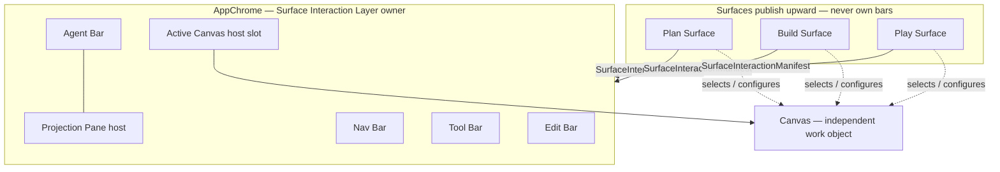

# Surface Interaction Layer — Architecture Authority

## Status and scope

This document is the **neutral architecture authority** for how DungeonBuddy surfaces
compose shared chrome (Nav Bar, Agent Bar, Tool Bar, Edit Bar, Projection Pane hosts)
around an independent **Canvas** work object.

| Concern | Authority |
|---|---|
| Shared bars and projection hosts | **This document** |
| Canvas / MarkdownCanvasSession | [`DESIGN-shared-markdown-canvas-surface-composition.md`](DESIGN-shared-markdown-canvas-surface-composition.md) |
| Plan domain composition, resolver, prep policy | [`ARCHITECTURE-plan-surface-toolbox.md`](ARCHITECTURE-plan-surface-toolbox.md) (demoted from universal bar owner) |
| Graph identity, writes, projections | [`ARCHITECTURE-campaign-supergraph.md`](ARCHITECTURE-campaign-supergraph.md) |
| UI execution sequence | [`PLAN-surface-interaction-hoist-build-first.md`](../Plans/PLAN-surface-interaction-hoist-build-first.md) |

**Shared does not mean identical.** Plan, Build, and Play publish different
capabilities into the same host regions. Surfaces own domain meaning, policy,
authorization, graph lens/admissibility, selected Canvas, and typed publication
into shared hosts. Surfaces do **not** own bars, projection host chrome, graph
identity/write semantics, private agent thread storage, or private capability stacks.

`SurfaceShell` / `SurfaceFrame` may **only compose layout** — they are not bar
owners and must not become hidden hosts for Nav/Tool/Edit/Agent/Projection.

## Decision

DungeonBuddy adopts a three-layer product model:

1. **AppChrome / Surface Interaction Layer** — owns Nav Bar, Agent Bar (+ Projection
   Pane host), Tool Bar, Edit Bar, and the Active Canvas **host slot**.
2. **Canvas** — independent work object (`MarkdownCanvasSession` /
   `MarkdownCanvas` today); document authority, admission, and document-bound commands.
3. **Surface** (Plan | Build | Play) — domain lens, policy, graph admissibility,
   capability registration/publication upward; **never** bar ownership.

Surfaces publish a conceptual **SurfaceInteractionManifest** (documentation term
only — **no runtime type** in this slice) describing what each shared host should
render for the active surface lease.

## Vocabulary

| Term | Meaning |
|---|---|
| **Surface Interaction Layer** | App-scoped shared chrome: Nav, Agent+Projection, Tool, Edit, Active Canvas host |
| **Canvas** | Independent document/work object; not a bar child |
| **Surface** | Named work mode (Plan, Build, Play) with domain policy and publication |
| **SurfaceInteractionManifest** | Conceptual upward publication: which tools, edit commands, agent context, and projection bindings the active surface contributes |
| **Publication / registration** | Surface binds capabilities into shared hosts for its lease; hosts render, surfaces do not own UI implementation |
| **Characterized consumer** | First surface that proves a shared contract (Plan for graphReference today) without becoming the shared API owner |
| **Landed primitive** | Merged, verified building block (e.g. Canvas #426) |
| **Current transitional implementation** | Runtime behavior not yet matching target ownership (e.g. Plan-local Tool/Edit assembly) |
| **Target ownership** | End-state described here and in the execution plan |

## Three-layer diagram



**Never** depict Nav, Tool, Edit, Agent, or Projection as children owned by Build
or Plan. Bars are AppChrome/Interaction Layer children; surfaces publish into them.

## Ownership table

| Region / concern | Owner | Surfaces may |
|---|---|---|
| Nav Bar | Surface Interaction Layer (AppChrome) | Publish nav entries, badges, surface switch targets |
| Agent Bar | Surface Interaction Layer | Publish ambient context pointers, thread handles |
| Projection Pane host | Surface Interaction Layer (`AgentInteractionProvider`) | Register projection kinds, content renderers, lease-scoped open/close |
| Tool Bar | Surface Interaction Layer | Register tool launchers, adaptive drawer content |
| Edit Bar | Surface Interaction Layer | Register edit commands for selected editable context |
| Active Canvas host slot | Surface Interaction Layer (layout) | Select which Canvas instance fills the slot |
| Canvas document authority | Canvas (`MarkdownCanvasSession`) | Configure admission policy, extensions |
| Graph lens / admissibility | Surface domain | Publish lens into shared graphReference / resolver bindings |
| Graph writes / identity | Campaign Supergraph / Kernel | Surfaces route through governed capabilities only |
| Private agent thread bodies | Server + bounded client pointers | Not surface-owned stores |
| SurfaceShell / SurfaceFrame | Layout only | Compose regions; **no** bar ownership |

## State scope table

| State | Scope | Persisted by | Notes |
|---|---|---|---|
| Selected Canvas document | Canvas session | Canvas + workspace registry | Surfaces pass policy, not duplicate authority |
| Dirty / revision / digest | Canvas session | Canvas | Tools receive admitted envelopes only |
| Active surface lease | AppChrome / AgentInteractionProvider | Transient; bounded localStorage later | Tokenized bind/unbind |
| Open projection | Interaction Layer host | Provider (Phase A localStorage target) | Lease-safe; clear on surface change |
| Tool Bar selection / drawer | Interaction Layer | Provider | Surfaces register, not own drawer DOM |
| Edit Bar commands | Interaction Layer | Provider | Build/Plan publish command sets |
| Agent thread / citations | Agent host | Server + pointer-only client | No corpus bodies in provider |
| Graph head / revision pin | Supergraph | Server | Surfaces publish lens, not head |
| Prep session / campaign focus | Surface domain | Surface descriptor + publication | Plan-specific; not Build-owned |

## Publication model (conceptual manifest)

A surface activating on a route publishes upward (conceptual fields only):

```text
SurfaceInteractionManifest {
  surfaceId: plan | build | play
  leaseToken: opaque bind identity
  nav: { entries, contextHeader? }
  agent: { ambientContextPointers, enabledModes? }
  projection: { enabledKinds, registrations, graphLensBinding? }
  tool: { launchers[], drawerPolicy? }
  edit: { commands[], lockPolicy? }
  canvas: { canvasSessionHandle, hostProps? }
}
```

Rules:

- One host per bar — no second Tool Bar under Build or Plan.
- Publication is lease-scoped; cleanup uses the same `leaseToken`.
- Inactive routes publish null/empty bindings (Build before MC-02b enables refs).
- Characterize before moving: Plan paths are mapped, not copied blindly into shared API.

## Current mapping (2026-08-01)

| Primitive | Status | Evidence |
|---|---|---|
| Canvas (`MarkdownCanvasSession` / `MarkdownCanvas`) | **Landed primitive** — MC-01 / PR #426 | Merge `7d98074d434a5310d21d4fe645e497789e0a3114` |
| App projection host (R10a) | **Landed primitive** — PR #441 | Merge `4ec74045f0b7878434e911fa73c407727d3e958c` |
| Neutral `graphReference` loop (MC-02a / #431) | **Landed primitive** | Merge `130104442b0ac7ad9a56c7e744014f1b8d56ad62` |
| Shared Nav / Tool / Edit hosts | **Target ownership** — partial runtime | Plan-local assembly; hoist is SI-02 |
| Agent Bar + Projection host | **Landed primitive**, **target partial** | Provider owns host; bottom bar/pane redesign is later |
| Plan as characterized consumer | **Current transitional** | Plan proves graphReference; not shared API owner |
| Build World Reference Loop | **Target** — SI-04 | After shared Tool/Edit hoist + Plan recompose |
| Build composition / Plan recomposition | **Not landed** | SI-03 / SI-04 |

Runtime does **not** yet implement the full target. Labels above distinguish
landed primitives, transitional implementation, and target ownership.

## Interaction contracts

### Tool launch

1. Operator activates Tool Bar affordance owned by Interaction Layer.
2. Active surface's published `tool.launchers` resolves workflow.
3. Adaptive container / projection host opens registered `tool` kind.
4. Surface change or lease expiry clears or revalidates open tool.

### Edit command

1. Edit Bar renders commands from active surface publication.
2. Commands target selected editable context (usually Canvas selection).
3. Canvas session arbitrates document-bound mutations.
4. Build baseline Markdown edit is shared; Plan graph/callout extensions are explicit.

### Graph search / view / insert

1. **Find existing** is a **Tool Bar** workflow (not Edit Bar).
2. Search uses surface-published graph lens + neutral `graphReference` contracts.
3. Insert invokes Canvas / edit command path → dirty → Save.
4. View/open uses Projection Pane host with lease-safe resolver states.

### Chip reopen

1. Canvas renders durable refs via `reference_render`.
2. Click → resolver state (`resolved_graph` | `resolved_corpus_fallback` |
   `ambiguous` | `unresolved`) — never silent auto-pick.
3. `reference_project` opens shared glance in Projection host.

### Surface switch / stale lease

1. Surface publishes bind with `leaseToken`.
2. On switch, prior lease cleanup runs before new bind applies.
3. Open projections clear or revalidate; async completions cannot mutate wrong lease.

### Failure / disabled states

- Missing publication → host renders empty/disabled; no stale Plan config on Build.
- Ambiguous graph ref → explicit operator choice; no first-ranked open.
- Canvas not admitted → tool/edit commands disabled with truthful reason.
- Projection host inactive → `openTool` / `openGraphReference` no-op or explicit error.

## Surface examples

### Plan (characterized consumer — not shared API owner)

- Publishes prep/session lens, Plan lock policy, callout extensions.
- Contributes graphReference consumer wiring, statblock/ingest tool registrations.
- Does **not** own Nav/Tool/Edit/Agent/Projection implementation.
- Canvas: planning board via shared Canvas host slot (transitional: Plan-local canvas).

### Build (first Canvas proof; target World Reference Loop)

- Publishes Build graph lens, extraction tool, baseline Markdown edit commands.
- **Find existing** → Tool Bar; insertion → Canvas edit command.
- Does **not** own bars, app/shared provider state, or graph writes.
- Loop: search → inspect → insert → save → reload → reopen (SI-04).
- Extraction inspector is separate tool projection; not Edit Bar.

## Migration and demolition principles

1. **Characterize before moving** — map Plan contributions before hoisting hosts.
2. **One host per bar** — no route-local second containers.
3. **Canvas independent** — hoisting bars never absorbs document authority.
4. **Plan is characterized consumer** — not the permanent shared API surface.
5. **Build is not bar owner** — publishes capabilities upward only.
6. **Demote, don't delete** — historical docs get banners + links; evidence preserved.
7. **Graph docs stay graph authority** — cross-link UI boundary only.

## Explicit non-goals

- No runtime `SurfaceInteractionManifest` type in SI-00 docs slice.
- No claim that shared Tool/Edit/Nav are fully hoisted in runtime yet.
- No SurfaceShell ownership of bars or projection registry.
- No Build-owned app/shared AgentInteraction state.
- No Find existing on Edit Bar.
- No graph write semantics in Interaction Layer docs.
- Play surface recomposition (SI-06+ / later).

## Graph and workspace authority boundaries

| Domain | Authority | Interaction Layer role |
|---|---|---|
| World Supergraph head, identity, writes | [`ARCHITECTURE-campaign-supergraph.md`](ARCHITECTURE-campaign-supergraph.md) | Surfaces publish lens; hosts never write |
| Workspace document registry | Server workspace contracts | Canvas consumes; surfaces set admission policy |
| Source artifacts / corpus prose | Corpus + source contracts | Resolved on demand; not stored in provider |
| Agent/Hermes thread continuity | Agent host + server | Pointer-only in client provider |
| Projection node views | Supergraph projection engine | Read via graphReference / resolver |

Cross-reference graph sequencing only via tracker/roadmap — do not sequence UI hoists
from graph PR tables.

## Verification pointers

- Canvas invariant: [`PLAN-shared-markdown-canvas-build-first.md`](../Plans/PLAN-shared-markdown-canvas-build-first.md) MC-01
- Interaction hoist sequence: [`PLAN-surface-interaction-hoist-build-first.md`](../Plans/PLAN-surface-interaction-hoist-build-first.md)
- Plan composition (domain): [`ARCHITECTURE-plan-surface-toolbox.md`](ARCHITECTURE-plan-surface-toolbox.md)
