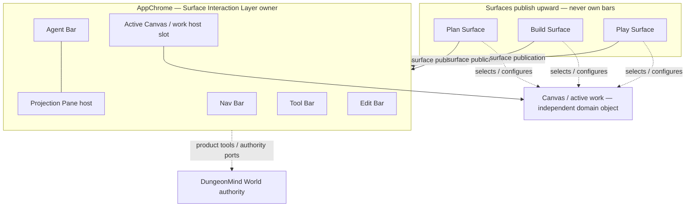

# Surface Interaction Layer — Architecture Authority

## Status and scope

This document is the **neutral architecture authority** for how DungeonBuddy surfaces compose shared chrome (Nav Bar, Agent Bar, Tool Bar, Edit Bar, Projection Pane hosts) around an independent **Canvas** / active work object.

| Concern | Authority |
|---|---|
| Shared bars and projection hosts | **This document** |
| Canvas / MarkdownCanvasSession | [`DESIGN-shared-markdown-canvas-surface-composition.md`](DESIGN-shared-markdown-canvas-surface-composition.md) |
| Plan domain composition, resolver, prep policy | [`ARCHITECTURE-plan-surface-toolbox.md`](ARCHITECTURE-plan-surface-toolbox.md) |
| Buddy durable application/work state | [`ARCHITECTURE-application-state-layer.md`](ARCHITECTURE-application-state-layer.md) |
| Playable / Play Runtime meaning | [`ARCHITECTURE-playable-material-and-runtime.md`](ARCHITECTURE-playable-material-and-runtime.md) |
| World product boundary / Buddy authority ports | [`ARCHITECTURE-campaign-supergraph.md`](ARCHITECTURE-campaign-supergraph.md) |
| Durable World/source/evidence authority | **DungeonMind current checked-in authority/contracts/state** |
| UI execution sequence | [`PLAN-surface-interaction-hoist-build-first.md`](../Plans/PLAN-surface-interaction-hoist-build-first.md) |

**Shared does not mean identical.** Plan, Build, and Play publish different capabilities into the same host regions. Surfaces own domain meaning, policy, authorization intent, graph lens/admissibility intent, selected Canvas/work object, and typed publication into shared hosts. Surfaces do **not** own bars, projection host chrome, DungeonMind World identity/write semantics, private agent thread bodies, or private capability stacks.

`SurfaceShell` / `SurfaceFrame` may **only compose layout** — they are not bar owners and must not become hidden hosts for Nav/Tool/Edit/Agent/Projection.

### Re-anchored authority law — 2026-08-26

The post-cutover architecture is:

```text
DungeonMind
  = durable World identity, revisions/head, source/evidence admissibility,
    scoped World projection/retrieval, governed World publication

DungeonBuddy
  = surfaces, product work, Buddy application/runtime state,
    Agent Interaction, tool policy, proposal/review UX

Agent harness
  = client-owned model/tool orchestration
```

The Surface Interaction Layer never becomes a second World or source/evidence authority.

The historical phrase “Campaign Supergraph / Kernel owns graph writes” is no longer sufficient. Current product code may route through Buddy `WorldGraphAuthority`-family ports, but durable World authority is DungeonMind.

## Decision

DungeonBuddy adopts a three-layer interaction composition model:

1. **AppChrome / Surface Interaction Layer** — owns Nav Bar, Agent Bar (+ Projection Pane host), Tool Bar, Edit Bar, and the Active Canvas/work **host slot**.
2. **Canvas / active work object** — independent work object; owns/expresses document/work identity, exact selection, admission, and document-bound commands through its domain service.
3. **Surface** (Plan | Build | Play) — domain lens, policy, graph admissibility intent, current-work/runtime context, capability registration/publication upward; **never** bar ownership.

Surfaces publish a conceptual **SurfaceInteractionManifest** (documentation term only — no claim that one universal runtime type must exist) describing what each shared host should render for the active surface lease.

## Vocabulary

| Term | Meaning |
|---|---|
| **Surface Interaction Layer** | App-scoped shared chrome: Nav, Agent+Projection, Tool, Edit, Active Canvas/work host |
| **Canvas / active work** | Independent document/work object; not a bar child |
| **Surface** | Named work mode (Plan, Build, Play) with domain policy and publication |
| **SurfaceInteractionManifest** | Conceptual upward publication: tools, edit commands, agent context, projection bindings, active work pointers |
| **Publication / registration** | Surface binds capabilities into shared hosts for its lease; hosts render, surfaces do not own UI implementation |
| **WorkSelectionAnchor** | Exact Buddy product/work selection identity: owning work object/revision/digest + selected span; not automatically World evidence |
| **EvidenceAnchor** | Optional DungeonMind source/evidence identity proving a selection is admissible evidence for a World operation |
| **Characterized consumer** | First surface that proves a shared contract without becoming the shared API owner |
| **Landed primitive** | Merged, verified building block |
| **Current transitional implementation** | Runtime behavior not yet matching target ownership |
| **Target ownership** | End-state described here and companion authorities |

## Three-layer diagram



**Never** depict Nav, Tool, Edit, Agent, or Projection as children owned by Build, Plan, or Play. Bars are AppChrome/Interaction Layer children; surfaces publish into them.

## Ownership table

| Region / concern | Owner | Surfaces may |
|---|---|---|
| Nav Bar | Surface Interaction Layer (AppChrome) | Publish nav entries, badges, surface switch targets |
| Agent Bar | Surface Interaction Layer | Publish ambient context pointers, thread handles, enabled contextual actions |
| Projection Pane host | Surface Interaction Layer (`AgentInteractionProvider`) | Register projection kinds, content renderers, lease-scoped open/close |
| Tool Bar | Surface Interaction Layer | Register tool launchers, adaptive drawer content |
| Edit Bar | Surface Interaction Layer | Register edit commands for selected editable context |
| Active Canvas/work host slot | Surface Interaction Layer (layout) | Select which Canvas/work instance fills the slot |
| Work/document identity and revision | Owning Buddy domain + APP-STATE where migrated | Publish handles; never duplicate storage authority |
| Canvas selection | Canvas / active work boundary | Publish an exact WorkSelectionAnchor |
| Source/evidence admission for World operations | DungeonMind | Request/resolve EvidenceAnchor through product tools; never broaden admission |
| Graph lens / admissibility intent | Surface domain | Publish requested lens into shared World bindings |
| World head / identity / writes | DungeonMind | Route through governed Buddy authority ports/capabilities only |
| Agent interaction semantics | DungeonBuddy Agent Interaction | Publish ambient context; never make harness memory World authority |
| Private agent thread bodies | Agent host + server / selected Buddy persistence if later earned | Not surface-owned stores |
| SurfaceShell / SurfaceFrame | Layout only | Compose regions; **no** bar ownership |

## State scope table

| State | Scope | Persisted by | Notes |
|---|---|---|---|
| Selected Plan/Runbook work | Buddy Content | APP-STATE WorkObject/WorkRevision/WorkingCopy | Stable identity independent of filesystem path |
| Dirty / working revision / digest | Owning work domain | APP-STATE / Canvas session as applicable | Tools receive exact work identity |
| Exact text selection | Current work lease | Transient WorkSelectionAnchor unless product behavior later requires durability | Selection identity is not World evidence by itself |
| Active Play Run/current position | Play domain | Buddy APP-STATE PostgreSQL | Play publishes current Beat/Scene pointers; Agent consumes |
| Active surface lease | AppChrome / AgentInteractionProvider | Transient; bounded client convenience | Tokenized bind/unbind |
| Open projection | Interaction Layer host | Provider / bounded client state | Lease-safe; clear or revalidate on surface change |
| Tool Bar selection / drawer | Interaction Layer | Provider | Surfaces register, not own drawer DOM |
| Edit Bar commands | Interaction Layer | Provider | Surface/work domain publishes commands |
| Agent thread / citations | Agent host | Server + pointer-only client; durable APP-STATE only if later justified | No corpus bodies in provider |
| Interaction attention | Agent Interaction | Minimum viable persistence; APP-STATE only if product correctness earns it | Pointers/intent, never World truth |
| World head / revision pin | DungeonMind | DungeonMind | Surfaces publish lens/pin request; hosts do not infer head |
| Evidence admission | DungeonMind source/provenance state | DungeonMind | Revision pin alone does not freeze future admissibility |
| Prep session / campaign focus | Surface domain | Surface descriptor/publication | Ambient product context |

## Publication model

A surface activating on a route may conceptually publish:

```text
SurfaceInteractionManifest {
  surfaceId: plan | build | play
  leaseToken: opaque bind identity
  nav: { entries, contextHeader? }
  agent: {
    ambientContextPointers,
    currentWork?,
    currentRuntimeContext?,
    enabledModes?
  }
  projection: { enabledKinds, registrations, graphLensBinding? }
  tool: { launchers[], drawerPolicy? }
  edit: { commands[], lockPolicy? }
  canvas: { canvasSessionHandle, hostProps? }
}
```

Rules:

- One host per bar — no second Tool Bar under Build, Plan, or Play.
- Publication is lease-scoped; cleanup uses the same lease identity.
- Inactive routes publish null/empty bindings.
- Surface context is pointer/identity oriented; do not copy World/source bodies into the provider.
- Characterize before moving: a first consumer does not become shared API owner.
- A surface may publish requested World scope/admissibility; DungeonMind still authorizes the actual World operation.

## Current mapping — re-anchored 2026-08-26

| Primitive | Status | Evidence / authority |
|---|---|---|
| Canvas (`MarkdownCanvasSession` / `MarkdownCanvas`) | **Landed primitive** | Existing shared Canvas work |
| App projection host | **Landed primitive** | `AgentInteractionProvider` host |
| Neutral `graphReference` loop | **Landed primitive** | Existing shared resolver/projection behavior |
| Plan durable work identity | **Landed / migrated** | APP-STATE AS1: WorkObject/WorkRevision/WorkingCopy |
| Runbook historical revisions | **Landed / migrated** | APP-STATE AS2 |
| Play Runtime / active continuity | **Landed / migrated** | APP-STATE AS3–AS5; legacy Play file authority demolished |
| DungeonMind native World reads | **Production authority** | CUTOVER R.3 / native projection + retrieval |
| DungeonMind governed existing-parent writes | **Production authority through Buddy ports** | CUTOVER D.1/D.2A/D.2B |
| Reviewed first-world initialization | **Landed provider + Buddy consumer** | DungeonMind #46 / Buddy D.2C2 |
| Native first-world continuity / manual authoring | **In-flight CUTOVER seams** | D.2C3 / D.2C4 before D.3 demolition |
| Agent Bar + Projection host | **Landed primitive, target partial** | Provider owns host; richer Agent Surface remains future work |
| Interaction Memory | **Design target, not yet durable authority** | Persistence to be selected only from dogfood evidence |
| Source→World Magic Moment | **Design target** | `DESIGN-magic-moment-contextual-source-to-world-graph.md` |

Runtime does not yet implement the full target. Labels above distinguish landed primitives, active authority, in-flight seams, and directional target ownership.

## Interaction contracts

### Tool launch

1. Operator activates Tool Bar affordance owned by Interaction Layer.
2. Active surface's published launcher resolves workflow.
3. Adaptive container / projection host opens registered tool content.
4. Surface change or lease expiry clears or revalidates open tool.

### Edit command

1. Edit Bar renders commands from active surface/work publication.
2. Commands target selected editable context.
3. Owning work domain arbitrates durable mutations.
4. Shared Markdown editing does not move Work/Source/World authority into AppChrome.

### Graph search / view / insert

1. **Find existing** is a shared Tool/Agent capability, not an Edit-Bar ownership claim.
2. Search uses surface-published World lens + DungeonMind-native scoped retrieval.
3. Inserting a durable graph reference into a document invokes the owning work edit path.
4. Viewing a World object uses Projection Pane host with lease-safe resolver states.
5. Hosts do not reconstruct a Buddy graph or broaden DungeonMind admission.

### Contextual Agent invocation from a selection

1. Canvas/work boundary establishes exact `WorkSelectionAnchor`.
2. Active Surface publishes ambient work/runtime context.
3. Agent Interaction assembles context; it does not claim work/source/World authority.
4. When needed, a product tool asks DungeonMind whether a valid `EvidenceAnchor` exists.
5. Agent uses DungeonMind-native World reads to assess existing identity/relationships/evidence.
6. Immediate result is noncanonical Graph Assessment.
7. Any durable proposal/write enters the accepted Buddy-governed publication path; it never writes from AppChrome/Canvas/harness directly.

### Play contextual publication

Play is a primary context producer for Agent Interaction.

Current semantics:

```text
Beat
  durable enclosing context

Scene?
  normal dominant central table workspace when current

Decision focus
  ephemeral; no durable currentDecisionId
```

Play may publish:

```text
run_ref
pinned_playable_revision
current_beat_ref
current_scene_ref?
resolved_beat_refs
selected_option_refs
contextual / At-a-Glance refs
linked_combat_handle?
```

Agent Interaction consumes these pointers. It must not infer or persist competing Play Runtime state.

### Chip reopen

1. Canvas renders durable refs through neutral reference rendering.
2. Click resolves exact/ambiguous/unresolved state — never silent auto-pick.
3. World object projection opens in the shared Projection host.
4. Current DungeonMind scope/admissibility is re-applied as required.

### Surface switch / stale lease

1. Surface publishes bind with lease identity.
2. On switch, prior lease cleanup runs before new bind applies.
3. Open projections clear/revalidate; async completions cannot mutate the wrong lease.
4. Interaction attention may preserve deliberate user continuity, but stale surface pointers do not become authority.

### Failure / disabled states

- Missing publication → host renders empty/disabled; no stale previous-surface config.
- Ambiguous graph ref → explicit operator choice; no first-ranked canonical open.
- Work not admitted/editable → commands disabled with truthful reason.
- Projection host inactive → open operations no-op or explicit error.
- DungeonMind unavailable/integrity failure → fail truthfully; never fall back to retired Buddy graph authority.
- WorkSelectionAnchor exists but no EvidenceAnchor → assessment may continue as contextual reasoning, but World publication cannot pretend the work is admitted evidence.
- Source/provenance state changed → revalidate EvidenceAnchor; graph revision pin alone is not enough.

## Surface examples

### Plan

- Publishes prep/session lens and active Plan WorkObject/WorkRevision.
- May publish exact Canvas selection as WorkSelectionAnchor.
- Contributes graphReference, statblock/ingest, and contextual Agent actions.
- Does **not** own Nav/Tool/Edit/Agent/Projection implementation.
- Planning prose remains work context unless separately admitted as World evidence.
- Preferred first proving surface for contextual source→World assessment because Plan revision identity is already stable.

### Play

- Publishes active Run + exact pinned Playable revision.
- Publishes current Beat and optional current Scene.
- Scene is dominant Agent working context when current; Beat remains enclosing context.
- Publishes contextual/At-a-Glance refs as retrieval seeds, not access control.
- Global/on-demand or Agent-assisted lookup may reach material not pre-authored into the Runbook.
- Combat remains Combat-owned and is projected by handle; Play/Agent do not duplicate its runtime authority.

### Build

- Publishes Build graph lens, active source/work identity, extraction/tool capabilities, and baseline editing.
- A worldbuilding selection may establish a WorkSelectionAnchor before its source family has a stable DungeonMind EvidenceAnchor.
- Does **not** own bars, app/shared provider state, DungeonMind writes, or source/evidence admission.

## Parallel Play + Agent lane contract

PLAY-SURFACE and AGENT-INTERACTION may proceed in parallel when write leases and runtime resources are disjoint.

The architectural direction is:

```text
Play produces current-work/current-runtime context
        ↓
Surface Interaction publishes pointers
        ↓
Agent Interaction consumes context
        ↓
DungeonMind supplies current World authority
```

Do not reverse this relationship:

```text
Agent memory chooses current Scene      # wrong
Play reads harness session as truth     # wrong
AppChrome stores copied World authority # wrong
```

Highest-risk shared collision paths:

- Canvas / TipTap selection plumbing;
- AppChrome / `AgentInteractionProvider`;
- projection registry/host;
- shared API types;
- source/provenance adapters.

A contested path is serialized or explicitly transferred between lanes. Git conflict resolution is not the ownership protocol.

Keep acceptance gates separable:

```text
PLAY
  proves current-moment behavior without Agent dependency

AGENT
  proves behavior against fixed context packets / current DungeonMind tools

INTEGRATION
  proves live surface publication produces the same useful Agent behavior
```

## Migration and demolition principles

1. **Characterize before moving** — map domain contributions before hoisting hosts.
2. **One host per bar** — no route-local second containers.
3. **Canvas/work independent** — hoisting bars never absorbs Work/Source authority.
4. **First consumer is not shared owner.**
5. **DungeonMind stays World authority** — no compatibility reconstruction in shared UI.
6. **Buddy APP-STATE stays product/runtime authority** — do not push Play/Agent state into DungeonMind.
7. **Agent harness stays replaceable** — interaction/product contracts cannot be Hermes-session contracts.
8. **Demote, don't silently rewrite history** — historical docs remain evidence; current authority is explicit.
9. **Serialize shared seams** — parallel work is encouraged only when write/runtime ownership is clear.

## Explicit non-goals

- No requirement for one universal runtime `SurfaceInteractionManifest` type.
- No SurfaceShell ownership of bars or projection registry.
- No surface-owned app/shared AgentInteraction store.
- No DungeonMind ownership of the agent harness.
- No AppChrome ownership of World/source/evidence truth.
- No graph write semantics defined inside Interaction Layer.
- No automatic promotion of WorkSelectionAnchor to EvidenceAnchor.
- No generic arbitrary JSON persistence for Agent memory.
- No requirement that every work/source family migrate before contextual Agent interactions begin.
- No reopening retired Buddy graph authority as a convenience fallback.

## World, work, and source authority boundaries

| Domain | Authority | Interaction Layer role |
|---|---|---|
| World identity, immutable revisions/head, scoped reads, source/evidence admission, governed publication | **DungeonMind** | Carry requested lens/pin and invoke product tools; never write directly |
| Buddy World product orchestration / authority ports | Campaign Supergraph/CUTOVER product boundary | Route product intent into DungeonMind; do not duplicate World truth |
| Plan/Runbook WorkObject/WorkRevision/WorkingCopy | Buddy Content / APP-STATE | Host/select work, expose exact identity/selection |
| Play Run/current position | Buddy Play / APP-STATE | Publish current-moment pointers |
| Combat mutable state | Combat domain | Project by handle only |
| SourceArtifact / evidence identity for World operations | Source + DungeonMind source/provenance authority | Resolve on demand; never infer from a filename or work title |
| WorkSelectionAnchor | Owning Buddy work domain | Publish exact selected work/span |
| EvidenceAnchor | DungeonMind | Resolve/revalidate when the selected work is admitted evidence |
| Agent/harness conversation execution | DungeonBuddy Agent Interaction / AgentRuntime | Host/persist pointers as product requires; never factual World authority |
| Projection views | Surface Interaction host + owning domain read service | Compose views without becoming authority |

Cross-reference CUTOVER sequencing only via current CUTOVER authorities. Do not sequence Surface Interaction work from stale historical graph PR tables.

## Verification pointers

- Canvas invariant: [`PLAN-shared-markdown-canvas-build-first.md`](../Plans/PLAN-shared-markdown-canvas-build-first.md) MC-01
- Interaction hoist sequence: [`PLAN-surface-interaction-hoist-build-first.md`](../Plans/PLAN-surface-interaction-hoist-build-first.md)
- Plan composition: [`ARCHITECTURE-plan-surface-toolbox.md`](ARCHITECTURE-plan-surface-toolbox.md)
- Buddy durable state: [`ARCHITECTURE-application-state-layer.md`](ARCHITECTURE-application-state-layer.md)
- Play semantics: [`ARCHITECTURE-playable-material-and-runtime.md`](ARCHITECTURE-playable-material-and-runtime.md)
- Source→World Agent target: [`DESIGN-magic-moment-contextual-source-to-world-graph.md`](DESIGN-magic-moment-contextual-source-to-world-graph.md)
