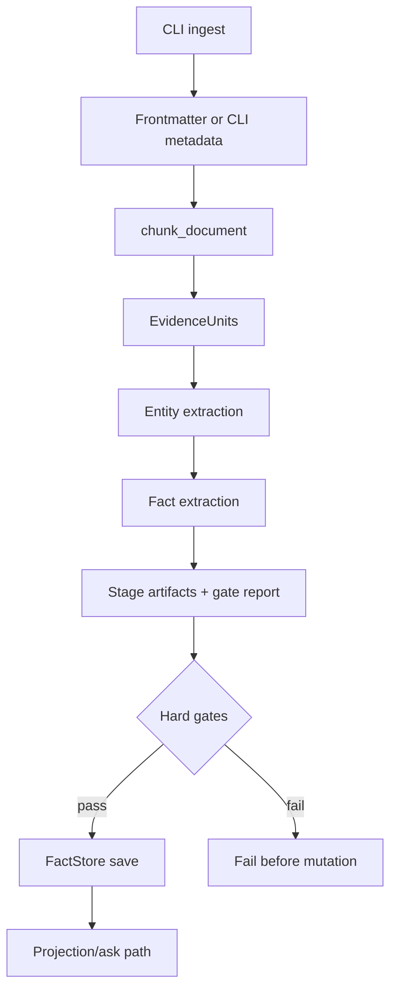
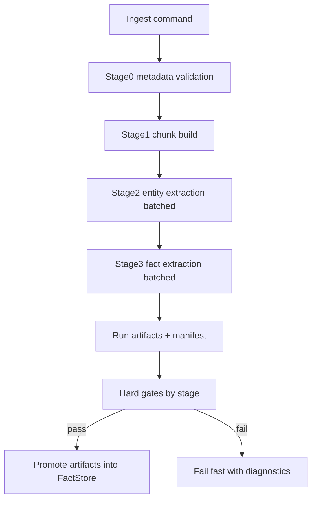

# Ingestion Pipeline Architecture and Refactor Assessment

Date: 2026-03-29
Scope: DungeonMindBuddy ingestion pipeline, compared with RulesIngestion pipeline patterns.
Status: Revised after frontmatter/chronology work and initial ingest refactor slices.

## Why this document exists

The current DungeonMindBuddy ingestion flow works, but cost and throughput are increasingly constrained by per-unit LLM calls and cache invalidation behavior. This document maps what the pipeline does today, compares it to RulesIngestion design choices, and identifies refactor actions that would materially improve efficiency without weakening correctness gates.

## DungeonMindBuddy ingestion architecture (today)

Primary entrypoint:

- `src/cli.py` (`ingest` command)

Core pipeline modules:

- `src/ingestion/chunker.py`
- `src/ingestion/frontmatter.py`
- `src/ingestion/frontmatter_inference.py`
- `src/ingestion/entity_extractor.py`
- `src/ingestion/fact_extractor.py`
- `src/store.py`
- `src/reducer/canon_projection.py` (downstream selection/projection)
- `schemas/v0.1/document_metadata.schema.json`
- `schemas/v0.1/evidence_unit.schema.json`

### Action flow (ingest)

1. `ingest` parses CLI args and validates frontmatter or inferred metadata.
2. `chunk_document` converts source text into evidence units and propagates document/session metadata.
3. Entity pass runs OpenAI structured extraction per evidence unit.
4. Fact pass runs OpenAI structured extraction per evidence unit.
5. Formal stage artifacts are emitted under `store/logs/ingest_artifacts/<run_id>/`.
6. Machine-readable gates validate stage outputs before any store mutation.
7. Only passing runs are promoted into `FactStore`.
8. Fingerprint recorded for duplicate-ingest protection.

### What is already improved versus the earlier design draft

- Frontmatter is now a first-class ingest contract for markdown sources, with schema validation and optional inference workflow.
- Evidence units now carry `document_session`, and fact extraction prefers document/session provenance for `asserted_in_session`.
- `ingest` now emits stage artifacts and a `gate_report.json` for each run.
- Store mutation is now gated on stage output validity rather than happening immediately after extraction.
- Ingest profiling now exposes `--entity-concurrency` and `--fact-concurrency`.

### Current artifact and audit model

Each ingest run now has both:

- Durable store state:
  - `evidence_units.json`
  - `entities.json`
  - `facts.json`
  - `canon_decisions.json`
  - `ingest_index.json`
- Per-run audit artifacts:
  - `store/logs/ingest_artifacts/<run_id>/stage_chunks.json`
  - `store/logs/ingest_artifacts/<run_id>/stage_entities.json`
  - `store/logs/ingest_artifacts/<run_id>/stage_facts.json`
  - `store/logs/ingest_artifacts/<run_id>/gate_report.json`
  - `store/logs/ingest_runs.jsonl`
  - `store/logs/model_calls.jsonl`

This means repeated ingests intentionally produce separate run artifacts even when only one promoted state ends up in the store.

## RulesIngestion architecture (reference pattern)

Primary design pattern:

- Explicit stage separation with deterministic artifacts and gate diagnostics.

Representative modules:

- `extraction/pipeline.py`
- `extraction/stage_a.py`
- `extraction/stage_b.py`
- `extraction/stage_a_prime.py`
- `retrieval_lab/run_experiment.py`

Key characteristics:

- Staged artifacts (`stageA.*`, `stageB.evidence_units.json`, summaries).
- Gate-first diagnostics and rerun scripts.
- Content-addressed cache for LLM enrichment stages.
- Embed/index/eval split from ingestion substrate construction.

## Similarities and differences

### Similarities

- Both pipelines are structured-stage systems with schema validation boundaries.
- Both use cache-driven behavior in LLM-heavy steps.
- Both have reproducibility concerns and deterministic IDs/fingerprints.

### Differences

- DungeonMindBuddy is still application-integrated, but it no longer mutates the live store immediately after raw extraction; it now emits artifacts and applies hard gates first.
- DungeonMindBuddy still treats extraction as per-unit operational flow; RulesIngestion more explicitly models stage promotion, rerunability, and richer substrate-first experimentation.
- DungeonMindBuddy cache strategy is still mostly local to extractor modules; RulesIngestion more consistently treats cache and artifact telemetry as experiment-level contracts.

## Observed inefficiency points in DungeonMindBuddy

1. Per-unit LLM call volume is still high for both entity and fact passes.
2. Large prompts are often built from broad entity context rather than tight local context.
3. Cache reuse can still be invalidated by context drift when unrelated entities change.
4. Store writes are still full-JSON rewrites after promotion, not incremental/appended state updates.
5. Stage diagnostics are now formalized enough to block bad promotions, but rerun ergonomics and manifest-level auditability are still behind RulesIngestion.

## Refactor assessment: does this need refactoring?

Short answer: yes, but targeted refactoring is sufficient. A full rewrite is not required.

### Refactor now (high ROI)

1. Add batch extraction mode for evidence bundles
  - Replace strictly one-call-per-unit with N-unit structured batch calls.
  - Keep deterministic per-unit outputs in stage artifacts.
  - Status: not started.
2. Promote staged artifact contracts in DungeonMindBuddy ingest
  - Persist deterministic intermediate artifacts:
    - `stage_chunks.json`
    - `stage_entities.json`
    - `stage_facts.json`
  - Add machine-readable gate diagnostics for each stage.
  - Status: implemented in initial refactor slice.
3. Strengthen cache boundaries
  - Keep cache key tied to prompt/model/input fingerprint.
  - Ensure unrelated context changes do not invalidate per-unit results.
  - Add explicit cache hit-rate metrics in run summaries.
  - Status: partially complete. Fingerprint-driven duplicate protection exists, but explicit cache hit-rate telemetry is still pending.
4. Add ingestion profile controls
  - Maintain chunk-collapse control (`--chunk-min-chars`).
  - Add explicit extraction bundle size and concurrency controls.
  - Status: partially complete. Concurrency controls are implemented; bundle size controls are still pending.
5. Preserve chronology/document identity as a hard ingest contract
  - Require frontmatter-validated document metadata for markdown ingest.
  - Preserve `document_session` through evidence and fact extraction.
  - Prefer document/session provenance in chronology-sensitive reducers.
  - Status: implemented.

### Refactor next (medium ROI)

1. Split substrate build from store mutation mode
  - Optional "build substrate only" run that does not immediately mutate live store.
  - Enables dry-run cost analysis, gate review, and promotion.
  - Status: pending.
2. Introduce stage rerun commands
  - Rerun from cached chunks/facts without full ingest.
  - Improve debugging speed and cost containment.
  - Status: pending.
3. Add run manifest contract
  - Record command/config/model/cache fingerprints in one run manifest.
  - Improve auditability for benchmark comparisons.
  - Status: pending.

### Refactor later (strategic)

1. Incremental storage backend for large runs (append or segmented stores).
2. Cross-document timeline ordering metadata and store migration strategy.
3. Expanded benchmark contract alignment for unknown corpora.

## Suggested target architecture for DungeonMindBuddy

Design intent:

- Deterministic artifacts first.
- Hard gates before store mutation.
- Batching + scoped context for LLM efficiency.
- Cache hit-rate and cost telemetry treated as acceptance metrics.

## Refactor status snapshot

### Completed

1. Frontmatter-backed markdown ingest contract.
2. `document_session` propagation into evidence/fact chronology metadata.
3. Hard-gated stage artifacts before store mutation.
4. Ingest concurrency controls for entity and fact extraction.

### In progress

1. Converging the design doc and implementation so future slices build on the new artifact contract.

### Next highest-value slices

1. Batched extraction mode with deterministic per-unit outputs preserved in artifacts.
2. Substrate-only mode to separate artifact generation from promotion.
3. Run manifest contract with model/config/cache fingerprints and cache hit-rate metrics.
4. Stage rerun commands for cheaper debugging and partial re-execution.

## Immediate action checklist

1. Keep current frontmatter and chronology guarantees intact while refactoring.
2. Implement extraction bundle mode (N evidence units per model call).
3. Add bundle-parity tests against the current single-unit behavior.
4. Add a substrate-only mode to separate evaluation from promotion.
5. Add run manifest with cache/model/chunking parameters.
6. Add cache hit-rate metrics to run summaries and acceptance gates.

## Decision

Refactor is warranted and should remain incremental:

- preserve the now-landed frontmatter/chronology guarantees,
- preserve the now-landed staged artifact and hard-gate behavior,
- add batched extraction and substrate/promotion separation next,
- then deepen manifest, rerun, and telemetry support.

This path keeps the recent correctness gains while reducing per-ingest cost and improving auditability.