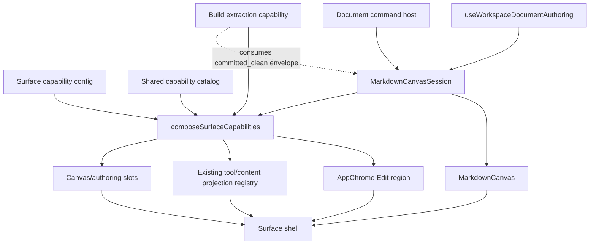

# Shared Markdown Canvas and Surface Capability Composition

## Decision

DungeonBuddy will not build a third Markdown authoring stack.

`/build` is the first consumer of a shared, document-bound Markdown canvas assembled
from the hardened workspace-document lifecycle that already serves Build, Plan, and
the TipTap runbook. Build-specific extraction remains a plugin that consumes canvas
authority; it is not part of the canvas.

The broader Surface architecture remains governed by
[`ARCHITECTURE-plan-surface-toolbox.md`](ARCHITECTURE-plan-surface-toolbox.md).
This document supplements that authority at the document/capability seam.

## Terminology correction

The original proposal called the second primitive “projection hydration.” That name
is rejected because `projection` already has two precise meanings in this repository:

1. graph read-model projections such as World Graph and union-supergraph views;
2. the app's `tool | content` projection registry rendered by
   `AdaptiveProjectionContainer`.

This design uses **surface capability composition** instead:

- `MarkdownCanvasSession` owns document authority and document-bound commands;
- `MarkdownCanvas` renders that session;
- `composeSurfaceCapabilities(...)` selects what fills the existing Edit, Tool, and
  authoring regions.

The existing tool/content projection registry remains the owner of adaptive projected
workflows and selected-object content.

## Review of the proposed direction

### What is correct and retained

- Build is the first proving consumer.
- The first migration is behavior-preserving.
- One canvas owns document readiness; tools do not reload snapshots or inspect editor
  local storage to reconstruct it.
- Extraction remains Build-owned and keeps ExtractionRun IDs, exact-run recovery,
  Graph Review handoff, and run persistence.
- Agent Interaction R10 is orthogonal. This work feeds the regions that exist today;
  it does not relocate the adaptive container.
- Plan and runbook migration waits until Build proves the primitive.

### Corrections required before implementation

| Proposal pressure | Decision |
|---|---|
| Treat the canvas as one large component | Split a headless `MarkdownCanvasSession` from the rendered `MarkdownCanvas`. |
| Treat every loaded document as admitted | Separate observable document state from policy-specific `AdmittedDocumentEnvelope`. |
| Move all extraction arbitration into generic canvas code | Canvas owns document-bound command arbitration; the plugin still owns run-domain state and validation. |
| Require Build Edit to equal every Plan action | Share baseline Markdown edit capabilities; Plan-only graph search/callouts remain explicit extensions. |
| Add node authoring in the same design certainty as the canvas | Keep `authoring.node` design-gated until Graph Review authoring ownership is inventoried. |
| Reuse the current Plan-shaped `SurfaceConfig.context` for Build | Generalize/discriminate surface context in the capability-composition slice; do not fabricate Plan session fields. |

## Current implementation facts

The need is concrete, not speculative:

- `BuildSurfacePage` mounts `BuildIngestToolbar` and `BuildSurfaceShell` as siblings.
- `BuildSurfaceShell` directly owns `useWorkspaceDocumentAuthoring`,
  `MarkdownEditorCore`, generic status/recovery rendering, save, and Agent Interaction
  publication.
- `useBuildExtraction` independently calls `getWorkspaceDocumentSnapshot`, reads
  workspace-document local storage, and re-proves clean/committed/revision/digest
  agreement before launch.
- `useBuildExtraction` separately owns launch/refresh generation counters and
  document-switch suppression.
- `PlanSurfaceCanvas` uses the same authoring hook but assembles its Edit dock model
  inside the Plan canvas.
- `useWorkspaceDocumentAuthoring` already owns the hardened open/reconcile/save/
  commit/verify lifecycle. The first slice wraps and exposes that authority; it does
  not rewrite the state machine.

## Three primitives

### 1. `MarkdownCanvasSession`

A headless document authority created from the existing workspace-document authoring
seam.

It owns:

- exact workspace document selection and surface/kind admission;
- server snapshot plus local-draft reconciliation;
- editor initialization and current editor handle;
- dirty state and local persistence;
- prepare/commit/receipt/verification authority;
- document-switch and unmount invalidation;
- generic conflict, failure, recovery, and status state;
- arbitration for commands that consume or mutate the selected document.

It does not own:

- ExtractionRun identity or status;
- Graph Review handoffs;
- worldbuilding profile selection;
- graph projections or graph publication;
- surface-specific metadata fields or controls.

### 2. `MarkdownCanvas`

The rendered document work object. It consumes a `MarkdownCanvasSession` and supplies
stable slots for:

- identity/status;
- editor;
- generic recovery;
- document actions;
- surface-owned adjacent tools.

The view must remain usable without Build. It renders no extraction terminology and
imports no Build, ExtractionRun, or Graph Review types.

### 3. Surface capability composition

A shared catalog maps capability IDs to region contributions. A surface enables
capabilities and provides typed parameters:

```ts
composeSurfaceCapabilities({
  surfaceId: "build",
  canvasSession,
  enabled: [
    { id: "edit.markdown", params: { lockMode: "always-editable" } },
    { id: "tool.build-extraction", params: { profileId, profileVersion } },
  ],
});
```

The result may contain:

- `editTools` for the existing AppChrome Edit dock;
- adaptive `tools` for the existing tool/content projection registry;
- optional canvas slots or authoring-host props.

This composition layer does not create another adaptive container or another graph
projection registry.

## Document state and admitted envelopes

The session always exposes truthful state:

```ts
interface CanvasDocumentState {
  documentId: string;
  phase: WorkspaceDocumentAuthoringPhase;
  record: WorkspaceDocumentRecord | null;
  snapshot: WorkspaceDocumentSnapshot | null;
  dirty: boolean;
  error: string | null;
}
```

A tool requests an admission policy. Only when the policy is satisfied does the
session return an immutable envelope:

```ts
interface AdmittedDocumentEnvelope {
  documentId: string;
  revision: number;
  contentSha256: string;
  contentStatus: "draft" | "committed";
  documentKind: WorkspaceDocumentLocalKind;
  surfaceId: SurfaceMode;
}
```

Initial admission policies include:

- `loaded`;
- `editable`;
- `committed_clean`.

Build extraction requires `committed_clean`. A dirty, conflicted, loading, rejected,
or mismatched document has no extraction envelope.

## Document-bound command arbitration

The session exposes one command host rather than leaking generation refs to every
tool:

```ts
runDocumentCommand({
  id: "build.extract",
  conflictsWith: ["document.save", "build.refresh-run"],
  admission: "committed_clean",
  invalidateOnDocumentChange: true,
  execute: async ({ envelope, signal }) => { ... },
});
```

The command host guarantees:

- synchronous same-command re-entry refusal;
- declared conflict exclusion;
- captured document identity and admitted envelope;
- abort/invalidation on document change or unmount;
- stale completion suppression;
- command status visible to the owning plugin.

It does not interpret returned run records or decide which run wins. Build extraction
continues to own exact-run validation, URL/local run persistence, status refresh, and
Graph Review handoff.

## Target composition



The shell composes canvas and plugins. Plugins do not own or wrap the canvas.

## Surface policy

### Build

Build v1 enables:

- baseline Markdown edit/save/recovery;
- Build extraction;
- exact-run status and Open in Graph Review.

Build does not inherit Plan graph search, callout insertion, or session policy unless
those capabilities are intentionally enabled later.

### Plan

Plan remains unchanged in the first slice. Later it may consume:

- baseline Markdown edit/save/recovery;
- Plan lock policy;
- Plan graph-reference search;
- callout/block actions;
- Plan commit handback.

### Ingest / Graph Review

Ingest remains the review/correction surface. It does not become a workspace-document
canvas merely because it renders Markdown.

`authoring.node` is a later capability whose ownership must be designed around the
existing Graph Review Author Draft and selection flows. It may not be copied into
`buildSurface/`.

## Relationship to floating chrome and R10

This design owns **what content is available to regions** and which document authority
that content consumes.

The floating-chrome / Agent Interaction track owns **where those regions live**:

- AppChrome Edit dock;
- AdaptiveProjectionContainer lifetime;
- optional Agent Interaction shell;
- R10 lift-then-replace.

The canvas work hydrates the current right-side regions first. R10 may later relocate
the one adaptive container without changing canvas or capability contracts.

## Delivery sequence

### MC-01 — Build-first Markdown canvas session

- Wrap the existing workspace-document authoring hook in a reusable session/provider.
- Render Build through `MarkdownCanvas`.
- Attach extraction through the document-command host.
- Remove snapshot/local-draft admission reads from `useBuildExtraction`.
- Preserve current Build behavior and exact-run semantics.
- Do not change Plan.

### MC-02 — Surface capability composition

- Add the shared capability catalog and composition result.
- Establish baseline `edit.markdown`.
- Give Build a real Surface capability config.
- Wire Build Edit and Build extraction through common region composition.
- Generalize the Plan-shaped surface context contract without fabricating session
  values.

### MC-03 — Node authoring design and migration

This slice is **design-gated**, not yet executable.

Before dispatch:

- inventory Graph Review Author Draft, selection, resolver, and commit ownership;
- decide whether Build is allowed to create, bind, or only inspect world objects;
- define one authoring capability contract and evidence/write boundary;
- prove no Graph Review identity or commit logic moves into the canvas.

## Invariants

1. One document authority drives editor, save, and document-consuming tools.
2. Tools receive admitted envelopes; they never inspect canvas local storage or
   reload snapshots to establish readiness.
3. Canvas and command-host modules import no extraction/run/Graph Review types.
4. Build extraction remains a plugin and preserves exact revision/digest launch.
5. Existing tool/content projection registry and adaptive container remain singular.
6. Baseline Markdown edit capability is shared; surface extensions are explicit.
7. The first Build migration changes no product behavior.
8. Plan remains on its current path until MC-01 is green.

## Falsification

| Failure | Verdict |
|---|---|
| Build extraction can launch from dirty, conflicted, rejected, or wrong-revision state | fail |
| `useBuildExtraction` still reads workspace local state or reloads a snapshot to prove launch readiness | fail |
| Canvas imports ExtractionRun, Graph Review handoff, or worldbuilding-profile types | fail |
| Build-specific labels, command ids, or product copy appear in the generic canvas | fail |
| Generic canvas hardcodes a surface plugin command id (e.g. extract) into save arbitration | fail |
| Plan behavior changes in MC-01 | fail |
| A second adaptive projection registry/container is introduced | fail |
| Node-authoring logic is copied into `buildSurface/` | fail |
| A command completion from document A mutates document B | fail |

## Explicitly later

- BLD-10c worldbuilding dispositions and prepare/confirm UX;
- BLD-09 PDF/OCR lineage;
- Plan and runbook migration to `MarkdownCanvas`;
- Agent Interaction R10;
- node-authoring capability implementation;
- broad Build visual redesign.

## Documentation authority and history

The original Build roadmap, slice plan, and completed BLD handoffs are historical
foundation records. Their full text is archived under:

`Docs/Plans/archive/2026-07-26/build-surface-foundation/`

The active execution authority is:

- this design;
- `Docs/Plans/PLAN-shared-markdown-canvas-build-first.md`;
- `Docs/Plans/HANDOFF-pr426-build-first-markdown-canvas.md`.

BLD-09 remains active and is not archived. BLD-10c remains undispatched.
