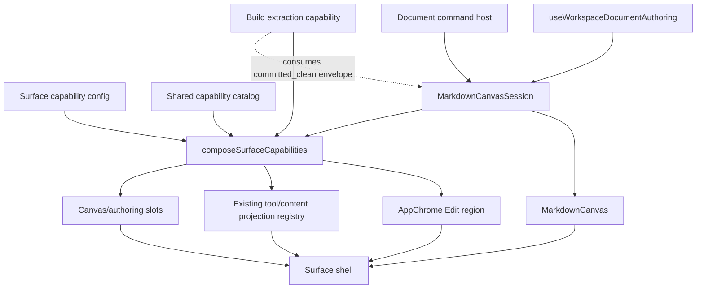

# Shared Markdown Canvas and Surface Capability Composition

## Decision

DungeonBuddy will not build a third Markdown authoring stack.

`/build` is the first consumer of a shared, document-bound Markdown canvas assembled
from the hardened workspace-document lifecycle that already serves Build, Plan, and
the TipTap runbook. Build-specific extraction remains a plugin that consumes canvas
authority; it is not part of the canvas.

The broader Surface architecture remains governed by
[`ARCHITECTURE-plan-surface-toolbox.md`](ARCHITECTURE-plan-surface-toolbox.md).
This document supplements that authority at the document/capability seam.

## Terminology correction

The original proposal called the second primitive “projection hydration.” That name
is rejected because `projection` already has two precise meanings in this repository:

1. graph read-model projections such as World Graph and union-supergraph views;
2. the app's `tool | content` projection registry rendered by
   `AdaptiveProjectionContainer`.

This design uses **surface capability composition** instead:

- `MarkdownCanvasSession` owns document authority and document-bound commands;
- `MarkdownCanvas` renders that session;
- `composeSurfaceCapabilities(...)` selects what fills the existing Edit, Tool, and
  authoring regions.

The existing tool/content projection registry remains the owner of adaptive projected
workflows and selected-object content.

## Review of the proposed direction

### What is correct and retained

- Build is the first proving consumer.
- The first migration is behavior-preserving.
- One canvas owns document readiness; tools do not reload snapshots or inspect editor
  local storage to reconstruct it.
- Extraction remains Build-owned and keeps ExtractionRun IDs, exact-run recovery,
  Graph Review handoff, and run persistence.
- Agent Interaction R10 is orthogonal. This work feeds the regions that exist today;
  it does not relocate the adaptive container.
- Plan and runbook migration waits until Build proves the primitive.

### Corrections required before implementation

| Proposal pressure | Decision |
|---|---|
| Treat the canvas as one large component | Split a headless `MarkdownCanvasSession` from the rendered `MarkdownCanvas`. |
| Treat every loaded document as admitted | Separate observable document state from policy-specific `AdmittedDocumentEnvelope`. |
| Move all extraction arbitration into generic canvas code | Canvas owns document-bound command arbitration; the plugin still owns run-domain state and validation. |
| Require Build Edit to equal every Plan action | Share baseline Markdown edit capabilities; Plan-only graph search/callouts remain explicit extensions. |
| Add node authoring in the same design certainty as the canvas | Keep `authoring.node` design-gated until Graph Review authoring ownership is inventoried. |
| Reuse the current Plan-shaped `SurfaceConfig.context` for Build | Generalize/discriminate surface context in the capability-composition slice; do not fabricate Plan session fields. |

## Current implementation facts

The need is concrete, not speculative:

- `BuildSurfacePage` mounts `BuildIngestToolbar` and `BuildSurfaceShell` as siblings.
- `BuildSurfaceShell` directly owns `useWorkspaceDocumentAuthoring`,
  `MarkdownEditorCore`, generic status/recovery rendering, save, and Agent Interaction
  publication.
- `useBuildExtraction` independently calls `getWorkspaceDocumentSnapshot`, reads
  workspace-document local storage, and re-proves clean/committed/revision/digest
  agreement before launch.
- `useBuildExtraction` separately owns launch/refresh generation counters and
  document-switch suppression.
- `PlanSurfaceCanvas` uses the same authoring hook but assembles its Edit dock model
  inside the Plan canvas.
- `useWorkspaceDocumentAuthoring` already owns the hardened open/reconcile/save/
  commit/verify lifecycle. The first slice wraps and exposes that authority; it does
  not rewrite the state machine.

## Three primitives

### 1. `MarkdownCanvasSession`

A headless document authority created from the existing workspace-document authoring
seam.

It owns:

- exact workspace document selection and surface/kind admission;
- server snapshot plus local-draft reconciliation;
- editor initialization and current editor handle;
- dirty state and local persistence;
- prepare/commit/receipt/verification authority;
- document-switch and unmount invalidation;
- generic conflict, failure, recovery, and status state;
- arbitration for commands that consume or mutate the selected document.

It does not own:

- ExtractionRun identity or status;
- Graph Review handoffs;
- worldbuilding profile selection;
- graph projections or graph publication;
- surface-specific metadata fields or controls.

### 2. `MarkdownCanvas`

The rendered document work object. It consumes a `MarkdownCanvasSession` and supplies
stable slots for:

- identity/status;
- editor;
- generic recovery;
- document actions;
- surface-owned adjacent tools.

The view must remain usable without Build. It renders no extraction terminology and
imports no Build, ExtractionRun, or Graph Review types.

### 3. Surface capability composition

A shared catalog maps capability IDs to region contributions. A surface enables
capabilities and provides typed parameters:

```ts
composeSurfaceCapabilities({
  surfaceId: "build",
  canvasSession,
  enabled: [
    { id: "edit.markdown", params: { lockMode: "always-editable" } },
    { id: "tool.build-extraction", params: { profileId, profileVersion } },
  ],
});
```

The result may contain:

- `editTools` for the existing AppChrome Edit dock;
- adaptive `tools` for the existing tool/content projection registry;
- optional canvas slots or authoring-host props.

This composition layer does not create another adaptive container or another graph
projection registry.

## Document state and admitted envelopes

The session always exposes truthful state:

```ts
interface CanvasDocumentState {
  documentId: string;
  phase: WorkspaceDocumentAuthoringPhase;
  record: WorkspaceDocumentRecord | null;
  snapshot: WorkspaceDocumentSnapshot | null;
  dirty: boolean;
  error: string | null;
}
```

A tool requests an admission policy. Only when the policy is satisfied does the
session return an immutable envelope:

```ts
interface AdmittedDocumentEnvelope {
  documentId: string;
  revision: number;
  contentSha256: string;
  contentStatus: "draft" | "committed";
  documentKind: WorkspaceDocumentLocalKind;
  surfaceId: SurfaceMode;
}
```

Initial admission policies include:

- `loaded`;
- `editable`;
- `committed_clean`.

Build extraction requires `committed_clean`. A dirty, conflicted, loading, rejected,
or mismatched document has no extraction envelope.

## Document-bound command arbitration

The session exposes one command host rather than leaking generation refs to every
tool:

```ts
runDocumentCommand({
  id: "build.extract",
  conflictsWith: ["document.save", "build.refresh-run"],
  admission: "committed_clean",
  invalidateOnDocumentChange: true,
  execute: async ({ envelope, signal }) => { ... },
});
```

The command host guarantees:

- synchronous same-command re-entry refusal;
- declared conflict exclusion;
- captured document identity and admitted envelope;
- abort/invalidation on document change or unmount;
- stale completion suppression;
- command status visible to the owning plugin.

It does not interpret returned run records or decide which run wins. Build extraction
continues to own exact-run validation, URL/local run persistence, status refresh, and
Graph Review handoff.

## Target composition



The shell composes canvas and plugins. Plugins do not own or wrap the canvas.

## Surface policy

### Build

Build after MC-01 enables:

- baseline Markdown edit/save/recovery;
- Build extraction;
- exact-run status and Open in Graph Review (handoff remains intentional, not the
  sole gravity for inspection).

After **MC-02b**, Build also enables the shared graph-reference capabilities
(`reference_render`, `reference_insert_existing`, `reference_project`) using a
**Build graph lens** (world/campaign/GM admissibility/published revision — not a
prep-session or Plan document target). Build does **not** inherit Plan session
policy, PlanGraphLoadPanel transitional loaders, or Graph Review dispositions.

**Exact-run inspection boundary (refined from BLD-06):** Build may host a
**read-only exact-run inspector** in the singular shared projection container.
Build does **not** own dispositions, evidence correction, identity decisions,
authority elevation, prepare/confirm, or publication.

### Plan

Plan remains the first characterized consumer of shared graph-reference
capabilities. It continues to supply Plan lock policy, prep/session lens where
required, callout/block actions, and Plan commit handback as **Plan extensions**,
not as the shared vocabulary.

### Ingest / Graph Review

Ingest remains the review/correction and disposition surface. It does not become a
workspace-document canvas merely because it renders Markdown.

`authoring.node` (MC-03) remains design-gated around Graph Review Author Draft. It
may not be copied into `buildSurface/`.

## Dogfood re-anchor (2026-07-26) — graph references and stay-on-Build

Dogfood after the preloaded Build canvas proved two **separate** product needs:

1. Wherever there is a Markdown canvas, an **existing** graph object can be
   referenced durably and opened interactively.
2. Build should inspect its own ExtractionRun without being forced onto `/ingest`.

**Framing (locked):** Plan and Build consume the same graph-reference capabilities,
configured for different surface contexts. Do **not** implement “Build behaves like
Plan” by copying Plan-named providers under Build.

### Graph-reference capability decomposition

Independently enabled:

| Capability ID | Contract |
|---|---|
| `reference_render` | Durable typed refs render as chips |
| `reference_insert_existing` | Docked search → operator inserts durable Markdown reference |
| `reference_project` | Resolved object opens in the singular app-scoped projection host |

Neutral names (targets): `GraphReferenceSearch`, `GraphReferenceRuntimeProvider`,
`insertMarkdownReference`, `openGraphReference`, `GraphReferenceResolver`.
`PlanGraphRefSearch` / `insertRunbookReference` are transitional Plan vocabulary,
not the permanent shared API.

### Reference resolution states

A chip is not a “graph-node chip” until status is `resolved_graph`. The resolver
returns a truthful state, never a silent first-ranked pick on ambiguity:

```text
resolved_graph | resolved_corpus_fallback | ambiguous | unresolved
```

Acceptance: an ambiguous Mireward chip must not silently open whichever node ranks
first.

### Shared object glance ownership

Chip click opens content in the singular AdaptiveProjectionContainer via the
existing shared [`GraphObjectCard`](../../apps/live-control-ui/src/graphObjectCard/)
shell (GraphReviewNodeGameCard-derived). Hosting surfaces inject actions. Do **not**
create a third selected-object card or route Build through a corpus-only Plan card
as the durable path.

### Candidate → document reference

Extraction candidates are not World Graph nodes. Insertion uses:

1. **Find existing object** — candidate seeds search text/type hints; operator
   selects a published node; then insert reference; document becomes dirty; Save
   required.
2. **Direct Insert** only when the candidate payload already carries an exact,
   admissible, validated durable node ID from an owning identity contract.

No implicit candidate→node mapping inside Build. No MC-03 create-from-highlight.

### Revision-pinned evidence

Exact-run evidence/highlights bind to the run’s pinned source revision/digest. If
the current canvas revision/digest differs (dirty edits, later save, document
switch, digest mismatch), highlights are unavailable on the current draft and the
UI offers pinned-source inspection — it must not attach evidence to the wrong
prose.

### Inspection readiness vs run lifecycle

`reviewable` must not mean “the only review representation cannot open.” Either:

- **Model A:** `reviewable` implies package-materializable; otherwise a blocked /
  invalid-evidence status; or
- **Model B:** separate `run_status` and `inspection_status` (+ structured
  diagnostics).

Do not weaken exact-evidence validation merely to open a UI.

## Relationship to floating chrome and R10

This design owns **what content is available to regions** and which document authority
that content consumes.

The floating-chrome / Agent Interaction track owns **where those regions live**:

- AppChrome Edit dock;
- AdaptiveProjectionContainer lifetime;
- optional Agent Interaction shell;
- R10 lift-then-replace.

**R10a (prerequisite before Build projection consumption):** lift the existing
projection registry, selected-projection state, and AdaptiveProjectionContainer
ownership **above** Plan/Build/Ingest route switching **without** changing Plan
behavior and **without** the future bottom-pane redesign or localStorage Phase A
expansion. Build must not mount a second container. Full R10 (bottom bar/pane +
persistence) remains later.

## Delivery sequence

### MC-01 — Build-first Markdown canvas session

- Wrap the existing workspace-document authoring hook in a reusable session/provider.
- Render Build through `MarkdownCanvas`.
- Attach extraction through the document-command host.
- Remove snapshot/local-draft admission reads from `useBuildExtraction`.
- Preserve current Build behavior and exact-run semantics.
- Do not change Plan.

### R10a — App-scoped projection host lift

- One provider instance and one AdaptiveProjectionContainer above the route switch.
- Plan (and Ingest Graph Review) behavior interaction-equivalent.
- Selected projection clears/revalidates on surface context change.
- No Build graph-reference enablement in this slice.

### MC-02a — Neutral graph-reference capability extraction

- Extract/wrap surface-neutral contracts for render / insert_existing / project.
- Plan remains the characterized consumer; Plan behavior unchanged.
- Shared GraphObjectCard glance path named and used; no third card.
- No Build enablement; no extraction inspector.

### MC-02b — Build enables shared reference capabilities

- Build Surface capability config enables `reference_render`,
  `reference_insert_existing`, `reference_project` with Build graph lens.
- Docked existing-object search; insert; save/reload persistence; chip → shared
  glance with truthful resolution states.
- Exclude: extraction candidates, run inspector, node creation, elevation, handoff
  redesign, PlanGraphLoadPanel.

### Stay-on-Build / BLD successors (after MC-02b)

1. **BLD inspection truth** — `false_anchor_quote` / reviewable vs package readiness.
2. **Stay-on-Build v1** — exact-run summary in-place; secondary Open full Graph Review.
3. **Stay-on-Build v2** — Build Extraction Run Inspector as a **tool projection** in
   the singular adaptive container (read-only; no dispositions).
4. **Candidate-assisted Find existing** — bridge inspector → MC-02 insert path.

### MC-03 — Node authoring design and migration

This slice is **design-gated**, not yet executable.

Before dispatch:

- inventory Graph Review Author Draft, selection, resolver, and commit ownership;
- decide whether Build is allowed to create, bind, or only inspect world objects;
- define one authoring capability contract and evidence/write boundary;
- prove no Graph Review identity or commit logic moves into the canvas.

## Invariants

1. One document authority drives editor, save, and document-consuming tools.
2. Tools receive admitted envelopes; they never inspect canvas local storage or
   reload snapshots to establish readiness.
3. Canvas and command-host modules import no extraction/run/Graph Review types.
4. Build extraction remains a plugin and preserves exact revision/digest launch.
5. Existing tool/content projection registry and adaptive container remain singular.
6. Baseline Markdown edit capability is shared; surface extensions are explicit.
7. The first Build migration changes no product behavior.
8. Plan remains on its current path until MC-01 is green.

## Falsification

| Failure | Verdict |
|---|---|
| Build extraction can launch from dirty, conflicted, rejected, or wrong-revision state | fail |
| `useBuildExtraction` still reads workspace local state or reloads a snapshot to prove launch readiness | fail |
| Canvas imports ExtractionRun, Graph Review handoff, or worldbuilding-profile types | fail |
| Build-specific labels, command ids, or product copy appear in the generic canvas | fail |
| Generic canvas hardcodes a surface plugin command id (e.g. extract) into save arbitration | fail |
| Plan behavior changes in MC-01 | fail |
| A second adaptive projection registry/container is introduced | fail |
| Node-authoring logic is copied into `buildSurface/` | fail |
| A command completion from document A mutates document B | fail |

## Explicitly later

- Stay-on-Build v1/v2 and candidate Find-existing (after MC-02b);
- BLD inspection-truth defect (`false_anchor_quote` / readiness split);
- BLD-10c worldbuilding dispositions and prepare/confirm UX;
- BLD-09 PDF/OCR lineage;
- Plan and runbook migration to `MarkdownCanvas`;
- Full R10 bottom bar/pane + localStorage Phase A (after R10a);
- node-authoring capability implementation (MC-03);
- broad Build visual redesign.

## Documentation authority and history

The original Build roadmap, slice plan, and completed BLD handoffs are historical
foundation records. Their full text is archived under:

`Docs/Plans/archive/2026-07-26/build-surface-foundation/`

The active execution authority is:

- this design;
- `Docs/Plans/PLAN-shared-markdown-canvas-build-first.md`;
- `Docs/Plans/HANDOFF-pr426-build-first-markdown-canvas.md`.

BLD-09 remains active and is not archived. BLD-10c remains undispatched.
