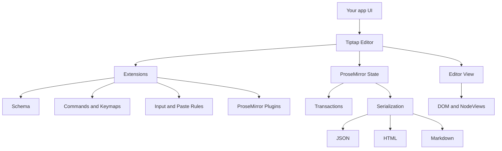
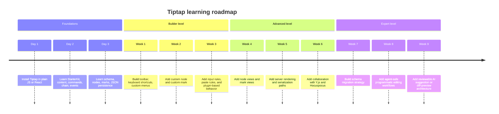

# Tiptap Deep Research Report

## Executive summary

Tiptap is a headless, framework-agnostic rich-text editor framework built on top of ProseMirror. Its core design goal is composability: you start with a small editor core, add the schema and behavior you need through extensions, and then mount it in plain JavaScript, React, Vue, Svelte, or other environments. The project’s public docs are currently organized as Tiptap 3.x, and the GitHub repository showed `v3.26.1` as the latest release on June 11, 2026. citeturn21search13turn17search4turn34view0

For a human developer, the fastest path to expertise is to internalize one mental model: **Tiptap is an extension-driven shell around ProseMirror’s document model, schema, state, view, transactions, and plugins**. Tiptap smooths the rough edges with an ergonomic `Editor` class, a large command system, chainable mutations, framework bindings, and extension authoring APIs. But the “real power layer” remains ProseMirror concepts such as schema constraints, plugin state, decorations, node views, and transactions. Tiptap explicitly ships `@tiptap/pm` so you can access ProseMirror packages without version skew. citeturn12view1turn41view0

For an AI agent, the most important lesson is that **JSON should usually be treated as the canonical machine format**, while HTML and Markdown should be treated as interchange or presentation formats. Tiptap validates JSON content more accurately than HTML, `setContent()` only renders content allowed by the schema, the HTML utilities convert between HTML and JSON, the Markdown package adds bidirectional Markdown support, and the Static Renderer can turn JSON into HTML, Markdown, or React elements without spinning up an editor instance. That combination makes Tiptap unusually strong for deterministic, schema-aware programmatic editing and AI review workflows. citeturn20view0turn19search1turn28view0turn20view2turn20view1

If your product goal is “editable text and formatting” with room for future AI assistance, Tiptap is a strong fit because it gives you a clean separation between persisted content, editor behavior, UI, and programmatic transformations. The main tradeoff is that real expertise requires understanding both Tiptap’s convenience APIs and ProseMirror’s lower-level model. citeturn21search13turn12view1turn30search8

### API surface at a glance

| Surface | What it is | When to use it |
|---|---|---|
| `Editor` methods | Lifecycle, reading, mounting, plugin registration, option updates. Examples: `getJSON()`, `getHTML()`, `getText()`, `setOptions()`, `registerPlugin()`, `mount()`, `unmount()`. citeturn43view1turn38view3turn43view4turn43view3 | Reading state, wiring lifecycle, host integration |
| Commands | Boolean-returning state mutations such as content, selection, marking, and attribute changes; command chains are supported with `editor.chain().…​.run()`. citeturn43view1turn19search15turn42view0 | Toolbar actions, keyboard actions, agent edits |
| Extensions and ProseMirror plugins | Schema, commands, keymaps, input rules, paste rules, plugin hooks, custom storage, global attributes, node/mark views. citeturn41view0turn42view0turn42view2turn42view3turn42view4turn42view5turn39view0 | Product-specific behavior and editor architecture |

## Architecture and core concepts

Tiptap is explicitly described as a headless, customizable editor built on ProseMirror. “Headless” matters: Tiptap does not prescribe a toolbar, menus, or CSS-heavy widget system. You own the UI, while Tiptap owns the editing engine and extension system. citeturn21search13turn17search12

At the foundation sits ProseMirror. Tiptap’s `@tiptap/pm` package re-exports the key ProseMirror modules, including `state`, `view`, `model`, `history`, `inputrules`, `keymap`, `transform`, and `tables`. Tiptap’s docs recommend using `@tiptap/pm` specifically to keep your ProseMirror versions aligned with Tiptap and avoid version clashes. citeturn12view1

The most important architectural idea is the **schema-first document model**. Tiptap’s schema is strict: only nodes, marks, and attributes declared by your installed extensions are allowed. That means the document’s structure is not an accident of pasted HTML; it is an explicit contract. The `Schema` page describes this as the mechanism that defines which nodes may occur, which attributes they carry, and how they may be nested. The `Nodes` and `Marks` docs frame nodes as content structure and marks as inline styling/annotation. citeturn19search2turn21search11

That strictness explains much of Tiptap’s behavior:

- **Nodes** are structural units such as `doc`, `paragraph`, `heading`, `image`, `table`, `taskItem`, and `text`. The `Text` node is required if you want actual editable text and is included by `StarterKit`. citeturn12view2turn22search2
- **Marks** are inline annotations such as `bold`, `italic`, `link`, and `underline`. citeturn12view2
- **State** is the editor’s current document and selection snapshot, exposed in Tiptap through commands, events, `useEditorState`, editor methods, and ProseMirror plugin access. citeturn16view0turn43view6turn12view1
- **Transactions** are the atomic state changes. Tiptap surfaces them through `onTransaction`, synchronous command execution, and command chaining. citeturn43view6turn43view1
- **View** is the DOM-facing rendering and interaction layer. Tiptap lets you control it through `editorProps`, node views, mark views, decorations, and plugins. citeturn38view3turn29search0turn29search5turn22search10



`StarterKit` is the default “batteries included” extension bundle for learning and prototyping. In Tiptap 3 it includes common nodes, common marks, and several editor-behavior extensions such as Dropcursor, Gapcursor, Undo/Redo, ListKeymap, and TrailingNode. That makes it a good starting point, but advanced products almost always evolve toward explicit extension lists so the schema and bundle stay intentional. citeturn12view2

A practical mental model for advanced work is this:

- Persist **document truth** in JSON.
- Define **policy** in the schema and extension list.
- Express **user and agent mutations** as commands or transactions.
- Use **plugins and decorations** for ephemeral UI state that should not dirty the document.
- Use **node views / mark views** for in-editor interactivity, not as the persisted output format. citeturn20view0turn41view0turn22search10turn29search0turn29search5

## API surface and build patterns

The `Editor` constructor is the center of the runtime API. It accepts an `extensions` array, optional initial `content`, editability flags, autofocus, parsing options, input/paste-rule gates, injected CSS/CSP options, and raw ProseMirror `editorProps`. A subtle but important rule is that you **must** pass extensions, even for minimal documents. citeturn38view2turn38view1turn38view0turn38view3turn38view7turn38view8

The docs draw a clear distinction between **methods** and **commands**. Methods are general-purpose and can return arbitrary values. Commands mutate state and return `true` or `false`. Tiptap then layers `editor.can()` for dry-run capability checks and `editor.chain()` for composing several mutations into one fluent action. citeturn43view1turn43view0

### Comparing the main API layers

| Layer | Typical examples | Best use |
|---|---|---|
| Methods | `getJSON()`, `getHTML()`, `getText()`, `setOptions()`, `mount()`, `unmount()`, `registerPlugin()` citeturn43view1turn38view3turn43view3turn43view4 | Host integration, reads, lifecycle |
| Commands | `setContent`, `insertContent`, `insertContentAt`, selection commands, node/mark toggles, `updateAttributes` citeturn19search15turn12view3 | Editing actions and agent operations |
| Events | `onCreate`, `onUpdate`, `onSelectionUpdate`, `onTransaction`, `onFocus` citeturn43view6 | Persistence, analytics, sync, UI state |
| Extensions | `addCommands`, `addKeyboardShortcuts`, `addInputRules`, `addPasteRules`, `addProseMirrorPlugins` citeturn42view0turn42view2turn42view3turn42view4 | Reusable product behavior |

### Minimal plain JavaScript setup

The official vanilla guide recommends modern ES modules with a build tool such as Vite, Webpack, or Rollup. The minimal package set is `@tiptap/core`, `@tiptap/pm`, and `@tiptap/starter-kit`. citeturn12view0

```js
import { Editor } from '@tiptap/core'
import StarterKit from '@tiptap/starter-kit'

const editor = new Editor({
  element: document.querySelector('.editor'),
  extensions: [StarterKit],
  content: '<p>Hello world</p>',
})

document.querySelector('[data-bold]').addEventListener('click', () => {
  editor.chain().focus().toggleBold().run()
})
```

That example is idiomatic because it uses `StarterKit` for the initial schema and the chainable API for toolbar behavior. The docs also confirm that `editor.chain().focus().toggleBold().run()` is the standard pattern for multiple state changes at once. citeturn12view0turn43view0

### Minimal TypeScript setup

Tiptap’s codebase is written in TypeScript, and the docs explicitly recommend TypeScript for stricter typing in Tiptap 3. Extension options, storage, and commands are all designed to be type-augmentable through generics and module augmentation. citeturn32view0turn33view1

```ts
import { Editor, type JSONContent } from '@tiptap/core'
import StarterKit from '@tiptap/starter-kit'

const initialContent: JSONContent = {
  type: 'doc',
  content: [
    {
      type: 'paragraph',
      content: [{ type: 'text', text: 'Typed content' }],
    },
  ],
}

const editor = new Editor({
  extensions: [StarterKit],
  content: initialContent,
  autofocus: 'end',
})

const canUndo: boolean = editor.can().undo()
const doc: JSONContent = editor.getJSON()

if (canUndo) {
  editor.commands.undo()
}
```

### React setup and SSR

The official React guide uses Vite in `react-ts` mode, installs `@tiptap/react`, `@tiptap/pm`, and `@tiptap/starter-kit`, and presents both the classic `useEditor() + <EditorContent />` pattern and a newer declarative `<Tiptap>` composable API. The Next.js guide additionally recommends `'use client'` plus `immediatelyRender: false` to avoid hydration mismatches. citeturn37view2turn15search7turn12view3

```tsx
'use client'

import { useEditor, EditorContent } from '@tiptap/react'
import StarterKit from '@tiptap/starter-kit'

export function RichTextEditor() {
  const editor = useEditor({
    extensions: [StarterKit],
    content: '<p>Hello from React</p>',
    immediatelyRender: false,
  })

  if (!editor) return null

  return (
    <div>
      <button
        onClick={() => editor.chain().focus().toggleBold().run()}
        aria-pressed={editor.isActive('bold')}
      >
        Bold
      </button>

      <EditorContent editor={editor} />
    </div>
  )
}
```

That same setup scales into more advanced React architecture: the docs recommend isolating the editor in its own component, using `useEditorState` for selective subscriptions, and using the composable API for complex child-tree UIs. citeturn16view0turn14search2

### Vue and Svelte integration patterns

Vue 3 has a first-party binding package, `@tiptap/vue-3`, and the official guide shows both object-style and Composition API patterns. Svelte’s official guide, by contrast, uses `@tiptap/core` directly inside Svelte lifecycle hooks rather than a separate `@tiptap/svelte` package. That difference matters when you are selecting a framework abstraction level. citeturn37view0turn37view1

```vue
<template>
  <editor-content :editor="editor" />
</template>

<script setup>
import { useEditor, EditorContent } from '@tiptap/vue-3'
import StarterKit from '@tiptap/starter-kit'

const editor = useEditor({
  extensions: [StarterKit],
  content: '<p>Hello from Vue</p>',
})
</script>
```

```svelte
<script>
  import { onMount, onDestroy } from 'svelte'
  import { Editor } from '@tiptap/core'
  import StarterKit from '@tiptap/starter-kit'

  let element
  let editor

  onMount(() => {
    editor = new Editor({
      element,
      extensions: [StarterKit],
      content: '<p>Hello from Svelte</p>',
    })
  })

  onDestroy(() => {
    editor?.destroy()
  })
</script>

<div bind:this={element}></div>
```

### Bundlers, SSR, and package layout

The official docs recommend ESM workflows. Vanilla JS is documented for build tools such as Vite, Rollup, and Webpack, while Tiptap 3’s “What’s new” page notes that UMD builds were removed and ESM should be preferred. For SSR, Tiptap 3 added better server-side support, including `element: null` for server creation and a more explicit `unmount()` method for preserving editor instances across mounts. citeturn12view0turn15search6turn33view0turn33view1turn43view3

## Extension authoring and serialization

Tiptap’s extension system is the main reason to choose it over a simpler editor wrapper. The base `Extension` API is used for behavior-only modules, while `Node` and `Mark` APIs extend that with schema-specific fields and rendering hooks. Tiptap’s own docs say that everything is based on extensions and that nodes and marks are just specialized extension types. citeturn41view0turn39view1

### Comparing extension kinds

| Kind | Adds to schema | Typical job |
|---|---|---|
| `Extension` | No | Commands, keymaps, paste transforms, plugins, global attrs, storage, listeners citeturn41view0turn42view0turn42view4turn42view5 |
| `Node` | Yes | Block/inline structure such as paragraphs, headings, embeds, widgets citeturn39view1 |
| `Mark` | Yes | Inline annotations such as bold, link, custom highlight, metadata spans citeturn31search6 |

The extension API supports:
- `addOptions()` for configurable install-time options. citeturn42view6
- `addStorage()` for namespaced extension state accessible through `editor.storage.<name>`. citeturn42view5
- `addCommands()` for editor commands, including chainable ones. citeturn42view0
- `addKeyboardShortcuts()` for keymaps. citeturn42view1
- `addInputRules()` and `addPasteRules()` for pattern-driven transforms. citeturn42view2turn42view3
- `addProseMirrorPlugins()` for raw PM plugin integration. citeturn42view4

### A custom node example

The Node API shows the essential triad: `name`, `parseHTML()`, and `renderHTML()`, plus node-specific schema flags such as `group`, `inline`, `atom`, `selectable`, `draggable`, `code`, `whitespace`, `isolating`, and `defining`. Those map directly onto ProseMirror schema concepts. citeturn39view1turn39view0

```ts
import { Node, mergeAttributes } from '@tiptap/core'

export interface CalloutOptions {
  HTMLAttributes: Record<string, unknown>
}

export const Callout = Node.create<CalloutOptions>({
  name: 'callout',
  group: 'block',
  content: 'block+',
  defining: true,
  isolating: true,

  addOptions() {
    return {
      HTMLAttributes: {},
    }
  },

  addAttributes() {
    return {
      tone: {
        default: 'info',
        parseHTML: element => element.getAttribute('data-tone') ?? 'info',
        renderHTML: attributes => ({
          'data-tone': attributes.tone,
        }),
      },
    }
  },

  parseHTML() {
    return [{ tag: 'div[data-callout]' }]
  },

  renderHTML({ HTMLAttributes }) {
    return ['div', mergeAttributes({ 'data-callout': '' }, HTMLAttributes), 0]
  },
})
```

This is the right pattern when the content needs to be part of the persisted schema. If the node also needs a rich in-editor UI, add `addNodeView()` and render a DOM-backed node view or a React/Vue component. citeturn39view0turn29search1turn29search3

### A custom mark example

The mark-creation guide demonstrates the expected TypeScript pattern: define the mark, add attributes, then augment `Commands<ReturnType>` so your custom commands become typed autocomplete. citeturn31search6turn32view0

```ts
import { Mark, mergeAttributes } from '@tiptap/core'

declare module '@tiptap/core' {
  interface Commands<ReturnType> {
    reviewTag: {
      setReviewTag: (attrs: { author: string }) => ReturnType
      unsetReviewTag: () => ReturnType
    }
  }
}

export const ReviewTag = Mark.create({
  name: 'reviewTag',

  addAttributes() {
    return {
      author: {
        default: null,
        parseHTML: element => element.getAttribute('data-author'),
        renderHTML: attrs => ({ 'data-author': attrs.author }),
      },
    }
  },

  parseHTML() {
    return [{ tag: 'span[data-review-tag]' }]
  },

  renderHTML({ HTMLAttributes }) {
    return ['span', mergeAttributes({ 'data-review-tag': '' }, HTMLAttributes), 0]
  },

  addCommands() {
    return {
      setReviewTag:
        attrs =>
        ({ commands }) =>
          commands.setMark(this.name, attrs),
      unsetReviewTag:
        () =>
        ({ commands }) =>
          commands.unsetMark(this.name),
    }
  },
})
```

### Node views and mark views

Node views are for in-editor behavior, not persisted output. Tiptap explicitly warns that node views are “unrelated to the HTML output by design,” which is one of the most important expert-level distinctions in the entire framework. React and Vue have dedicated `ReactNodeViewRenderer` and `VueNodeViewRenderer` helpers, plus optional `trackNodeViewPosition` when your component must react to position changes. Mark views exist as a lighter-weight equivalent for marks. citeturn29search0turn29search1turn29search3turn29search5

A best practice follows from that design: **store semantic content in the schema, and only use node views for the editing experience**. If you encode business meaning only in a bespoke DOM widget instead of schema fields, serialization and AI tooling become brittle. That is an inference from the separation Tiptap documents between node-view rendering and HTML output. citeturn29search0turn39view1

### Serialization and parsing formats

Tiptap gives you several serialization routes, each with a different role. JSON is the strictest machine format. HTML is flexible and useful for import/export, rendering, and clipboard workflows. Markdown is improving quickly but is still documented as Beta. Plain text and clipboard serializers are useful for search, indexing, and user copy/paste expectations. citeturn20view0turn28view0turn20view2turn21search0turn22search10

| Format | Strengths | Main tradeoff |
|---|---|---|
| JSON | Schema-aware, best for persistence, validation, programmatic editing, AI pipelines. Tiptap says content checking is fully accurate for JSON. citeturn20view0 | Less human-readable |
| HTML | Easy interchange, browser-native, clipboard-friendly, can initialize editor and be generated from JSON. citeturn28view0turn19search1 | Validation is weaker than JSON in Tiptap’s own docs |
| Markdown | Human-readable, bidirectional support via `@tiptap/markdown`, supports `getMarkdown()` and parse/serialize helpers. citeturn20view2turn21search0turn21search3 | Officially Beta and may have unsupported edge cases |
| Plain text / clipboard | Simple downstream processing, custom block separators, custom clipboard text serializer. citeturn43view1turn22search4turn22search10 | Loses structure and rich marks |

### HTML, JSON, Markdown, and clipboard patterns

The HTML utility supports `generateHTML()` and `generateJSON()` without an editor instance. A critical nuance is that `@tiptap/core` exports browser-only helpers, while `@tiptap/html` works on server or browser via a virtual DOM. citeturn28view0

```ts
import { generateHTML, generateJSON } from '@tiptap/html'
import StarterKit from '@tiptap/starter-kit'

const json = generateJSON('<p>Hello <strong>world</strong></p>', [StarterKit])
const html = generateHTML(json, [StarterKit])
```

The Static Renderer is even more interesting for server rendering and AI pipelines because it can render JSON to HTML strings, Markdown, or React elements **without a browser, DOM, or editor instance**. It also allows custom node and mark mappings. citeturn20view1

```ts
import StarterKit from '@tiptap/starter-kit'
import { renderToMarkdown } from '@tiptap/static-renderer/pm/markdown'

const markdown = renderToMarkdown({
  extensions: [StarterKit],
  content: {
    type: 'doc',
    content: [
      { type: 'paragraph', content: [{ type: 'text', text: 'Hello world' }] },
    ],
  },
})
```

The Markdown package adds `getMarkdown()`, `editor.markdown.parse()`, `editor.markdown.serialize()`, plus `contentType: 'markdown'` / `'html'` / `'json'`. That makes it suitable for products that need both a WYSIWYG surface and text-oriented downstream systems. But the docs call it an “early release” and explicitly warn that it may still have edge cases. citeturn20view2turn21search0turn21search3

For clipboard behavior, plain text serialization can be customized with `getText({ blockSeparator })`, `clipboardTextSerializer`, or raw ProseMirror editor props such as `transformPastedText`. Tiptap’s FAQ even shows a `coreExtensionOptions.clipboardTextSerializer` customization for single-newline block separation. citeturn43view1turn22search4turn22search10turn38view3

## Performance, testing, accessibility, security, and migration

Tiptap’s performance guidance is refreshingly direct: when teams hit performance problems, the problem is often not the editor engine itself but the way it is integrated into the surrounding app. The docs explicitly say Tiptap is performant enough to edit “an entire book,” and the examples include a long-text demo with more than 200,000 words. citeturn16view0turn14search5

In React, the documented best practices are:

- isolate the editor in its own component so unrelated state does not re-render it;  
- use `useEditorState` to subscribe only to the slices of editor state you need;  
- use the rendering controls (`immediatelyRender`, `shouldRerenderOnTransaction`) when appropriate;  
- profile with React DevTools or even `console.count()`;  
- be careful with large numbers of synchronous React node views. citeturn16view0turn16view1turn29search1

A high-confidence performance rule for advanced builds is to treat **node views as expensive** and reserve them for cases where plain schema rendering is not enough. Tiptap’s performance guide says React node views are rendered synchronously and can become expensive when many are present. citeturn16view0

A second expert rule is to batch related edits. Tiptap’s chain API exists specifically to combine multiple commands into a single fluent action, and the editor exposes transaction-capture state. A reasonable engineering inference is that agent and UI code should prefer a single command chain for related changes instead of firing separate independent mutations where possible. citeturn43view0turn43view1

There is one area where the official material is thinner: **virtualization**. The docs show impressive long-document performance and focus heavily on integration discipline, but they do not present a first-party “virtualized editor viewport” strategy in the material reviewed. For very large, heavily decorated, or widget-rich documents, you should treat virtualization as an architectural experiment rather than an officially documented Tiptap pattern. citeturn14search5turn16view0

### Testing and debugging

The Tiptap monorepo’s own contributor guide says it uses Vitest for unit tests and Playwright for end-to-end tests, with demos auto-discovered in a Vite app. That is a strong hint for downstream teams: use deterministic unit tests for schema logic, command behavior, and serialization; reserve browser E2E tests for interaction-heavy paths, node views, copy/paste, and keyboard behavior. citeturn36view0

For document-structure testing, ProseMirror’s `prosemirror-test-builder` provides helpers for building test documents and custom builders for your own schema. That is especially useful when you are validating commands, transaction transforms, and plugin behavior without brittle HTML fixtures. citeturn26search2

For debugging, Tiptap’s performance guide explicitly recommends React DevTools Profiler and `console.count()` for render hunting. For deeper editor questions, the best community channels are the Tiptap GitHub Discussions forum and the official ProseMirror discussion forum. citeturn16view0turn35search1turn35search0

### Accessibility

Because Tiptap is headless, accessibility is your responsibility. The accessibility guide says all editor features should be keyboard-accessible, recommends semantic output and explicit ARIA roles, and even documents known VoiceOver behavior on macOS. Examples include `role="textbox"` for the editor, `role="toolbar"` for the toolbar, `role="menu"` for menus, and `role="menuitem"` for menu items. It also warns against keyboard traps. citeturn18view0

A strong product pattern is therefore to treat accessibility as a first-class UI layer on top of Tiptap rather than something the framework “handles for you.” Tiptap gives you semantic markup from default extensions, but it does not give you an accessible product shell for free. citeturn18view0

### Security

Tiptap’s strict schema helps with structural integrity, but it is **not** a complete XSS strategy for untrusted HTML. Tiptap’s own docs say JSON validation is most accurate, HTML validation is less exact, and pasted HTML can be transformed via `transformPastedHTML` or `editorProps` hooks. Separately, Tiptap’s `@tiptap/pm` changelog notes a ProseMirror XSS vulnerability patch, which is a reminder to keep dependencies current. citeturn20view0turn42view3turn38view3turn11search2

For sanitization, a common and well-supported practice is to sanitize untrusted HTML before converting it into Tiptap JSON or setting it as content. DOMPurify’s official materials describe it as an HTML/MathML/SVG sanitizer designed to prevent XSS and DOM-clobbering attacks. citeturn27search0turn27search7

A practical security checklist for Tiptap deployments is:

- sanitize untrusted HTML before ingest;  
- prefer JSON as the canonical stored content format;  
- enable content checking and handle `contentError` for incompatible content, especially in collaborative setups;  
- use CSP and `injectNonce` when your environment requires it;  
- stay current on `@tiptap/pm` and related dependency upgrades. citeturn20view0turn25search20turn38view8turn11search2

### Migration and versioning

As of the current repository metadata, Tiptap’s latest GitHub release was `v3.26.1` on June 11, 2026. Tiptap 3 introduced several important migration points: utility extensions moved into `@tiptap/extensions`, `History` became `UndoRedo`, `CollaborationCursor` became `CollaborationCaret`, SSR support improved, typing became stricter, and the editor gained `unmount()` plus rendering controls relevant to React. citeturn34view0turn33view0turn33view1

The highest-value migration pitfalls are these:

- If you are on v2, audit imports for the new `@tiptap/extensions` package. citeturn33view0turn33view3
- If you use collaboration, disable `UndoRedo` from `StarterKit` because the collaboration extension provides its own history. citeturn24view0
- If you use SSR, verify `immediatelyRender`, `element: null`, and `unmount()` behavior in your exact runtime. citeturn12view3turn33view0turn43view3
- If you directly import raw ProseMirror packages, prefer `@tiptap/pm` unless you explicitly need an un-reexported package, to avoid version skew. citeturn12view1turn11search8

## Collaboration and AI-agent interoperability

Tiptap’s collaboration stack centers on Y.js and Hocuspocus. The open-source `Collaboration` extension binds a Y document or fragment into the editor, while Hocuspocus provides a WebSocket backend and provider utilities. The official docs emphasize that Y.js merges changes in real time and supports offline-first workflows as well. citeturn24view0turn24view1turn24view2turn24view3

A minimal collaboration setup looks like this conceptually:

```ts
import * as Y from 'yjs'
import { Editor } from '@tiptap/core'
import StarterKit from '@tiptap/starter-kit'
import Collaboration from '@tiptap/extension-collaboration'

const ydoc = new Y.Doc()

const editor = new Editor({
  extensions: [
    StarterKit.configure({
      undoRedo: false, // important with collaboration
    }),
    Collaboration.configure({
      document: ydoc,
      field: 'body',
    }),
  ],
})
```

That `undoRedo: false` detail is not optional hand-waving; the collaboration docs explicitly say the `Collaboration` extension comes with its own history and that you should disable `UndoRedo` when using `StarterKit`. citeturn24view0

If you want presence, remote carets, and selections, `CollaborationCaret` layers that on top of a collaboration provider. If you want offline persistence, the official guide shows Y IndexedDB persisting the Y document locally so edits survive reconnects and tab closes. citeturn24view4turn24view3

### What AI agents should treat as the canonical interface

For AI agents, the safest operating contract is:

- **Read** with `getJSON()`, `getText()`, `getHTML()`, or `getMarkdown()` depending on downstream need.  
- **Observe context** with `onSelectionUpdate`, `onTransaction`, and formatting queries such as `isActive()`.  
- **Preflight** commands with `editor.can()`.  
- **Mutate** using commands or command chains rather than ad hoc DOM editing.  
- **Validate** against the schema and `contentError` handling. citeturn43view1turn20view2turn43view6turn43view3turn43view0turn20view0

That leads to a strong rule: **agents should operate on stable, schema-aware representations, not by rewriting arbitrary HTML strings whenever possible**. This is partly an inference, but it is strongly supported by Tiptap’s stricter JSON validation, schema enforcement, and machine-friendly JSON/Markdown/Static Renderer APIs. citeturn20view0turn19search1turn20view1turn20view2

### Selection-aware programmatic editing

Tiptap exposes selection-related events and commands, including selection updates and commands such as `setTextSelection`. In practice, that means an agent can operate on a precise range instead of replacing the whole document. That is usually better for undo history, collaboration, and review UX, because the mutate surface matches user intent more closely. citeturn43view6turn12view3turn19search15

```ts
function rewriteSelection(editor: import('@tiptap/core').Editor, replacement: string) {
  const ok = editor.can().focus()
  if (!ok) return false

  return editor
    .chain()
    .focus()
    .insertContent(replacement)
    .run()
}
```

For richer edits, the commands API includes content insertion/replacement, selection operations, node/mark toggles, and attribute updates. An expert agent should prefer those to free-form HTML because they preserve schema semantics. citeturn19search15turn12view3

### Suggestions, diff, and patch strategies

For **non-destructive AI review workflows**, the best pattern is to keep proposed changes separate from committed document truth. In ProseMirror/Tiptap terms, there are two high-confidence ways to do that:

- use **decorations** or plugins for ephemeral highlights and previews;  
- use a **suggestion/review layer** that lets users accept or reject changes. citeturn22search10turn42view4turn15search15

This is exactly why decorations matter: ProseMirror documents them as view-level structures that can provide contextual UI information without adding it to the document itself. That makes decorations ideal for agent highlights, preview underlines, linting marks, or “pending changes” visuals. citeturn22search10

If you later adopt Tiptap’s paid AI stack, the official AI Suggestion workflow already implements preview/accept/reject behavior, which is a strong signal for what Tiptap’s own team considers a good AI-editing UX. Even if you remain on the open-source stack, that architecture is worth copying: produce a proposed diff first, then commit only after human approval. citeturn15search15turn17search16

### The best patterns for human-plus-agent systems

A disciplined Tiptap agent should usually follow this sequence:

1. Read compact context from JSON plus surrounding plain text or Markdown.  
2. Observe the current selection and formatting state.  
3. Generate a minimal structured edit.  
4. Preflight with `can()`.  
5. Apply with commands or a command chain.  
6. Validate against schema/content errors.  
7. Prefer preview mode for larger edits. citeturn43view1turn20view2turn43view6turn43view0turn20view0turn15search15

That is the pattern most likely to scale cleanly into agentic features such as “rewrite selection,” “apply formatting to current block,” “insert widget node,” “accept suggestion,” “reject suggestion,” or “explain current formatting state.”

## Learning path and resources

A beginner can be productive with Tiptap in a day. An expert becomes productive when they stop thinking of it as “a React text editor” and start thinking of it as “an extension-driven ProseMirror system with several serialization and rendering front doors.” The learning path below is optimized for both humans and AI agents that need to build or reason over Tiptap-based editors. citeturn17search4turn35search10turn21search13



### Milestones and exercises

- **Milestone: first editor.** Install `StarterKit`, build a toolbar with `toggleBold`, `toggleItalic`, `undo`, and `redo`, and persist `editor.getJSON()` on `onUpdate`. This teaches setup, commands, and persistence. citeturn12view0turn43view1turn43view6
- **Milestone: schema fluency.** Replace `StarterKit` with an explicit minimal schema and then add back only the nodes/marks you want. Learn what breaks when a node or mark is absent. This teaches schema control. citeturn38view2turn19search2
- **Milestone: extension fluency.** Write one behavior-only extension with `addCommands`, `addKeyboardShortcuts`, and `addProseMirrorPlugins`, then one custom node and one custom mark. citeturn42view0turn42view1turn42view4turn39view1turn31search6
- **Milestone: serialization fluency.** Implement the same content round trip through JSON, HTML, Markdown, and plain text. Then render JSON server-side with the Static Renderer. citeturn28view0turn20view2turn20view1turn43view1
- **Milestone: performance fluency.** Profile a React editor, isolate it, add `useEditorState`, and then compare a plain-rendered node with a React node view. citeturn16view0turn29search1
- **Milestone: collaboration fluency.** Wire a Y document into `Collaboration`, disable `UndoRedo`, add `CollaborationCaret`, then add offline persistence with IndexedDB. citeturn24view0turn24view4turn24view3
- **Milestone: agent fluency.** Build three agent actions only with commands: rewrite selection, normalize headings, and insert a callout node. Then add a preview layer using decorations or a staged suggestion model. citeturn43view0turn43view6turn22search10turn15search15

### Official and community resources

The most valuable official entry points are the main Tiptap docs, the editor API reference, the Tiptap GitHub repo, the examples gallery, the ProseMirror guide/reference, and the collaboration docs. The most useful community resources are Tiptap GitHub Discussions and the ProseMirror discussion forum. citeturn17search4turn19search13turn34view0turn15search14turn35search10turn25search2turn23search9turn35search1turn35search0

A compact “expert starter pack” is:

- Official docs overview and guides. citeturn17search4
- Editor instance API and commands reference. citeturn19search13turn19search15
- Custom extension, node, mark, node-view, and mark-view docs. citeturn30search8turn41view0turn39view1turn31search6turn29search0turn29search5
- HTML utility, Markdown docs, and Static Renderer docs. citeturn28view0turn21search0turn20view2turn20view1
- React/Vue/Svelte install pages and React composable/performance guides. citeturn37view2turn37view0turn37view1turn15search7turn16view0
- GitHub repo, changelogs, and migration guides. citeturn34view0turn33view2turn33view3turn33view0turn33view1
- ProseMirror guide and reference. citeturn35search10turn25search2
- Tiptap Discussions and discuss.ProseMirror. citeturn35search1turn35search0

## Open questions and limitations

The Markdown package is documented as Beta / early release and may still have unsupported edge cases. If Markdown becomes central to your product or agent workflows, treat it as a capability to validate carefully against your own schema rather than assuming perfect parity with HTML/JSON behavior. citeturn21search0turn20view2

The official Svelte material clearly documents integration, but the dedicated node-view helper docs are published for JavaScript, React, and Vue. In the material reviewed, Svelte node-view ergonomics are not documented with the same first-party convenience layer as React/Vue. That does not mean Svelte is incapable; it means you should expect to work closer to the core APIs. citeturn37view1turn29search1turn29search3turn30search2

The React performance/rerender story spans docs that reference both modern rendering controls and older behavior. The safe takeaway is to verify the current default behavior for `shouldRerenderOnTransaction` and `useEditor` in the exact version you ship, especially when migrating from v2 to v3 or when reading older examples. citeturn16view0turn15search6turn15search8

The official materials reviewed do not present a first-party virtualization strategy for very large editors. They show strong large-document performance, and they focus on component isolation and controlled subscriptions instead. If you need viewport virtualization, that remains an advanced custom architecture area rather than a mainstream documented pattern. citeturn14search5turn16view0