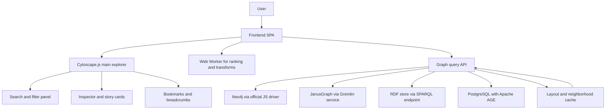

# Open-Source Graph Visualization Options for a Worldbuilding and Campaign Union Super Graph

## Executive Summary

For an **interactive, novel, and fun** graph-navigation UI on a **low-resource laptop**, the strongest open-source choices are **Cytoscape.js**, **Sigma.js with Graphology**, and **vis-network**. Cytoscape.js is the best overall balance of maturity, extensibility, graph-native features, and practical integration into a production web app. Sigma.js is the best choice when visible subgraphs may get larger and you want **WebGL-first speed**. vis-network is the easiest “ship something good quickly” option for modest hardware because it uses Canvas, has built-in clustering, and supports dynamic data updates without forcing a heavy architectural commitment. citeturn7search0turn11search3turn12search0turn12search2turn6search2turn21search14

For your specific “worldbuilding and campaign union super graph,” the most important architectural lesson is that **no client library should be asked to render the whole world at once**. The practical pattern is a **progressively revealed super graph**: render a focused region, chapter, faction neighborhood, or story slice; use server-side ranking and filtering to decide what appears next; preserve stable node positions when possible; and only switch to heavier layouts or 3D views on demand. That strategy aligns especially well with Cytoscape.js preset layouts and compound nodes, vis-network clustering, and Sigma.js’s Graphology-backed incremental interaction model. citeturn5search3turn25search3turn25search1turn21search14turn21search22turn21search1turn12search8

The libraries that are the **most fun or visually novel** are not always the best primary renderer for an Intel Core i3-class machine. In particular, **3d-force-graph** is excellent as a secondary “wow-mode” or constellation view, but its WebGL/Three.js stack is usually better as an optional immersive layer than as the main day-to-day navigation surface on modest hardware. Conversely, **Graphviz plus d3-graphviz** is not the right core engine for continuous exploratory force navigation, but it is outstanding for deterministic quest trees, chapter maps, faction hierarchies, and animated “story reveal” sequences. citeturn20search1turn29search4turn16search0turn16search1turn16search2

## How I Evaluated the Options

Because the projects surveyed rarely publish standardized CPU and RAM benchmark tables, the **memory and CPU footprint labels below are engineering estimates** based on each library’s renderer, default simulation model, DOM pressure, official large-graph guidance, and update model. In practice, the biggest performance drivers are not just renderer choice but also **visible node count, active labels, animation frequency, and whether layouts are recomputed on every interaction**. Cytoscape.js’s own performance test page, vis-network’s “few thousand elements” guidance plus clustering support, Sigma.js’s WebGL focus for thousands of nodes, and ECharts’s progressive rendering documentation all point in the same direction: low-end success depends at least as much on **viewport and data-window design** as on library selection. citeturn25search17turn6search2turn12search1turn1search1turn24search20

On backend integration, the decisive question is whether the visualization layer can ingest generic node/edge JSON and whether the graph store offers a reasonable query API. **Neo4j** has an official JavaScript driver, including a browser WebSocket variant. **JanusGraph** is typically reached through JanusGraph Server and Gremlin over WebSockets, with Gremlin-JavaScript oriented primarily to Node.js. **RDF stores** expose SPARQL over HTTP and standardized JSON results. **PostgreSQL graph stacks** often mean Apache AGE-style deployments, where openCypher sits inside PostgreSQL and is usually exposed through an application API. That means nearly all browser-first JavaScript graph libraries integrate well with Neo4j and RDF, integrate acceptably with AGE, and integrate best with JanusGraph when you put a small backend service in front of Gremlin rather than calling it directly from the browser. citeturn3search2turn3search17turn3search23turn4search0turn4search1turn4search8turn4search9turn4search2turn4search3turn4search7

Accessibility also tracks renderer choice. SVG and HTML-based systems are generally easier to pair with DOM semantics, focus management, and assistive-tech overlays. Canvas and WebGL systems can still be made accessible, but they usually need a **parallel UI layer** for keyboard navigation, structured focus, descriptions, and action menus. React Flow and Apache ECharts are notable here because both have explicit first-party accessibility guidance or features, while many graph-specific Canvas/WebGL libraries are effectively “DIY accessibility.” citeturn2search4turn14search0turn14search1turn14search15

## Comparison Table

| Candidate | OS license | Language and platform | Rendering | Estimated low-end footprint | Browser or native | Backend fit | Real-time and extensibility | Accessibility and mobile | Community and best fit |
|---|---|---|---|---|---|---|---|---|---|
| **Cytoscape.js** | MIT | JavaScript; browser and headless Node workflows | Canvas in stable releases; WebGL preview work underway | **Medium** overall; good if you avoid relayouts and keep views focused | Browser-first | **High** for Neo4j/RDF/AGE-style JSON APIs; good through server mediation for JanusGraph | Strong extension ecosystem, many layouts, compound graphs, expand/collapse, context menus | Better than pure WebGL in practice, but still requires custom a11y layer; usable on mobile browsers | Very active releases into 2025–2026; best all-rounder for exploratory + narrative UIs. citeturn7search0turn21search16turn11search0turn25search0turn25search1turn25search6 |
| **Sigma.js + Graphology** | MIT | JavaScript/TypeScript; browser | WebGL plus supporting Canvas layers | **Low to medium** for rendering large visible subgraphs; excellent framerate orientation | Browser-first | **High** for API-driven graph stores; strongest when your app already uses JS/TS data flows | Graphology events and algorithms, custom layers, React ecosystem, strong for search-driven interaction | Accessibility is mostly custom because rendering is WebGL/Canvas; mobile exploration is feasible but fine control needs care | Active docs and 2026 alpha work; best for fast, large-subgraph exploration. citeturn12search0turn12search2turn12search8turn21search1turn12search7 |
| **vis-network** | MIT | JavaScript; browser | HTML Canvas | **Low to medium**; officially smooth to a few thousand nodes and can cluster for more | Browser-first | **High** for JSON APIs; especially easy if you want simple node/edge feeds | Built-in DataSet updates, events, clustering, physics tuning | Touch support is documented; accessibility is mostly custom due to Canvas | Active 2026 releases; best “quickest good result” on modest hardware. citeturn6search2turn21search14turn21search22turn21search17turn10search1 |
| **VivaGraphJS** | BSD-3-Clause | JavaScript; browser | SVG by default, optional WebGL and CSS | **Low** for raw core overhead, but feature work is more manual | Browser-first | **Medium to high** if you are comfortable writing custom adapters | Extensible renderer and layout model; graph changes propagate to the scene | Accessibility is mostly DIY; mobile read-only exploration is more realistic than heavy editing | Lower current activity; best for lean, hacker-friendly custom explorers. citeturn23search0turn0search3turn23search1turn10search14 |
| **AntV G6** | MIT | TypeScript/JavaScript; browser and SSR | Canvas default, plus SVG and WebGL; optional 3D extension | **Medium to high** because it is a richer framework | Browser-first | **High** for API-driven stores; particularly good when you want UI behaviors and editing affordances | Strong plugin, behavior, layout, combo, animation, and update APIs | Mobile/browser support is good, but accessibility still needs project-level work due to renderer choice | Very active through 2026; best for feature-rich production apps and graph editors. citeturn1search0turn1search4turn22search10turn22search22turn26search1turn7search2 |
| **Apache ECharts Graph** | Apache-2.0 | JavaScript; browser and SSR-friendly workflows | Canvas or SVG; progressive rendering and stream loading | **Low to medium** for dashboard-like graph views; less graph-native than dedicated libraries | Browser-first | **High** for API-driven stores; especially strong when the graph lives beside timelines, heatmaps, or other charts | Real-time updates via `setOption`, asynchronous data loading, broad plugin ecosystem | Explicit ARIA support and official accessibility features; good mobile story | Very active 2026 releases; best for analytics-heavy graph views rather than dense exploratory graph apps. citeturn1search1turn1search5turn24search20turn24search24turn14search0turn14search1turn7search7 |
| **D3.js with d3-force** | ISC | JavaScript; browser | SVG, Canvas, and HTML, depending on how you design it | **Variable**: can be light and very fast, or very heavy if you choose poorly | Browser-first | **High** for any backend that can emit JSON | Maximum extensibility; official examples include Canvas and Web Worker force layouts | Can be the most accessible option if you choose SVG/HTML and build semantics carefully; mobile depends on your implementation | Enormous mature community; best for fully bespoke storytelling metaphors. citeturn9search1turn9search8turn15search1turn15search8turn15search14 |
| **force-graph** | MIT | JavaScript; browser | HTML5 Canvas | **Low to medium**; intentionally lightweight, playful force rendering | Browser-first | **High** for simple API feeds | Straightforward interaction model; React bindings expose useful perf switches | Accessibility is mostly custom; mobile exploration is fine, small-node editing less so | Active ecosystem around React bindings; best for playful 2D force exploration with minimal ceremony. citeturn19search1turn19search4turn20search0turn29search2 |
| **3d-force-graph** | MIT | JavaScript; browser | Three.js/WebGL | **Medium to high** on integrated graphics; great as secondary mode, risky as primary i3 mode | Browser-first | **Medium to high** for simple API feeds | Strong immersion, VR/AR relatives, shared ecosystem with React bindings | Accessibility is hard; mobile and low-end hardware are the weakest points here | Active ecosystem; best for optional 3D immersion and “wow” views. citeturn20search1turn19search9turn20search7turn20search15turn20search8 |
| **Graphviz plus d3-graphviz** | Graphviz EPL; d3-graphviz BSD-3-Clause | Graphviz in native toolchains; d3-graphviz in browser via WASM | CPU layout to SVG; animated transitions in browser | **Low during interaction, higher during layout generation** | Native and browser/WASM | **Medium** because you usually need a DOT-generation layer | Excellent deterministic layouts and animated state transitions; weak for large continuously manipulated force scenes | SVG output helps accessibility and DOM tooling; mobile read-only is workable | Active official Graphviz project and maintained browser wrapper; best for hierarchical storytelling and export-quality maps. citeturn9search3turn16search0turn16search1turn16search2turn8search7 |

A practical simplification of the table is this: **Canvas** is the safest default for low-resource interactive graph UIs, **WebGL** is best when visible subgraphs get materially larger, and **SVG** is best when you want semantic richness, export quality, or deterministic narrative views. Sigma.js wins hardest on renderer efficiency; Cytoscape.js wins hardest on graph-native product design; Graphviz wins hardest on deterministic structure; ECharts and D3 win hardest when the graph is only one part of a richer visual language. citeturn12search1turn21search16turn16search2turn1search1turn9search1

## Candidate Review

**Cytoscape.js** is the strongest single-library foundation if you need a serious graph application rather than only a demo or a visual effect. It is a full graph theory library in JavaScript, it has a large layout ecosystem, it supports headless/server workflows, and it has a long-running performance culture including an official performance-test page. On modest hardware, its main strengths are stable Canvas rendering, preset-position workflows, compound-graph support, and rich extensions such as ELK layouts, expand/collapse, and circular context menus. Its main weakness is that full automatic layouts on larger visible subgraphs can become the expensive part of the experience, so it rewards a “precompute positions, reveal incrementally” architecture. Demo URLs: `https://cytoscape.org/cytoscape.js-tutorial-demo/` and `https://cytoscape.org/js-perf/`. Notable downstream ecosystem projects include Dash Cytoscape. Recommended use-cases: the **primary exploratory UI**, region/faction folding, lore navigation, and story-guided expansion. citeturn11search3turn25search17turn25search0turn25search1turn25search6turn27search2turn27search6

**Sigma.js with Graphology** is the best fit when you expect the visible neighborhood to grow or when search, filtering, and rapid pan/zoom fluidity matter more than built-in graph-editor conveniences. Sigma.js is explicitly designed for thousands of nodes and edges using WebGL, and its official architecture leans on Graphology for graph state, algorithms, and events. On low-end hardware, that WebGL orientation is a real advantage, but you pay for it with more implementation work around layouts, accessibility overlays, and highly bespoke node widgets. Demo URLs: `https://www.sigmajs.org/demo/` and `https://www.sigmajs.org/storybook/`. Notable ecosystem pieces are Graphology and React Sigma. Recommended use-cases: **high-speed exploratory UI**, investigation/search workflows, and “jump to related cluster” navigation. citeturn12search1turn12search3turn12search8turn21search1turn27search19

**vis-network** remains one of the best “practical low-end laptop” answers because its tradeoffs are easy to understand. It uses HTML Canvas, officially targets a few thousand nodes and edges smoothly, and offers built-in clustering plus a dynamic DataSet update model. That combination is excellent when the graph explorer needs to feel alive but not overengineered. Its styling and graph semantics are less sophisticated than Cytoscape.js, and it is less modern as a framework surface than G6, but the productivity-to-performance ratio is very good. Demo URLs: `https://visjs.github.io/vis-network/examples/` and `https://visjs.github.io/vis-network/examples/network/clustering/clusterByZoomLevel.html`. Notable official example applications include neighborhood highlighting, disassembler-style views, and World Cup networks. Recommended use-cases: **ship-fast graph explorer**, admin-facing tooling, and progressive reveal on modest machines. citeturn6search1turn6search2turn21search14turn21search22turn10search13turn10search1

**VivaGraphJS** is the lean experimentalist’s choice. The project is built around extensibility and can render via SVG, CSS, or WebGL, with a notably small conceptual core compared with newer “batteries included” frameworks. Its official examples page is especially useful because it shows real projects built with different renderers, including Amazon-related products, YouTube-related videos, sparse matrix views, and VK social-graph visualization. On low-end hardware it can be impressively efficient, especially if you use the WebGL renderer, but the project’s weaker recent activity means you should choose it because you want its model, not because you want the safest long-term default. Demo URL: `https://anvaka.github.io/VivaGraphJS/`. Recommended use-cases: **lightweight custom explorer**, experimental interactions, and very bespoke renderer work. citeturn23search0turn23search1turn0search3turn10search14

**AntV G6** is the most “framework-like” of the candidates. It offers Canvas by default, SVG and WebGL renderers, server-side rendering, formal behavior and plugin systems, many layouts, and even optional 3D support in the current major generation. Those features make it powerful for graph products with many interaction affordances, but they also make it heavier than the simpler options. On an i3-class machine, G6 can work well if you value its richer behaviors more than raw minimalism and if you keep visible subgraphs bounded. Demo URL: `https://g6.antv.antgroup.com/en/examples`. Official site material also shows dynamic-relationship analysis applications and states trust across the Ant/Alibaba ecosystem. Recommended use-cases: **feature-rich production UI**, graph editing, combo/group mechanics, and guided enterprise-style apps. citeturn1search0turn1search4turn22search10turn22search25turn26search1turn27search1

**Apache ECharts Graph** is a little different from the others because it is first a general visualization system and only then a graph library. That is a strength if your super graph is going to live alongside timelines, geographic views, encounter metrics, faction heatmaps, inventory charts, or session analytics. ECharts supports Canvas and SVG rendering, progressive rendering, stream loading, asynchronous updates, and explicit ARIA support. The downside is that its graph series is not as graph-application-native as Cytoscape.js or Sigma.js. Demo URLs: `https://echarts.apache.org/examples/en/index.html` and the graph examples under that gallery. Notable ecosystem usage includes Apache Superset’s ECharts-based visualization stack. Recommended use-cases: **analytics-plus-graph UIs**, dashboard-linked graph storytelling, and timeline-driven lore viewers. citeturn1search1turn14search8turn24search20turn24search24turn14search0turn28search3

**D3.js with d3-force** is the correct answer when your main differentiator is the interaction idea itself. D3 is low-level, flexible, and can target SVG, Canvas, or HTML, and its official examples include Canvas force graphs, drag and zoom behaviors, and even a Web Worker example for off-main-thread layout computation. That means D3 can absolutely power a superb low-end graph UI, but only if you are comfortable being your own framework author. Demo URLs: `https://observablehq.com/@d3/force-directed-graph-component`, `https://observablehq.com/@d3/force-directed-graph-canvas/2`, and `https://observablehq.com/@d3/force-directed-web-worker`. Notable downstream reality is that D3 is a foundational building block for a huge slice of the web-visualization ecosystem. Recommended use-cases: **highly bespoke storytelling**, hybrid map/timeline/graph metaphors, and experimental visual grammar. citeturn9search1turn9search8turn15search1turn15search8turn15search14turn9search6

**force-graph** from Vasco Asturiano is one of the nicest lightweight options if you want a graph to feel alive with minimal setup. It uses Canvas, supports pan/zoom/drag/hover/click, and has a clean family relationship with the author’s React bindings and 3D variants. It is generally easier to make feel “fun” than it is to make feel “enterprise,” which may actually fit your campaign/lore use case well. The cost is fewer built-in graph-management tools than Cytoscape.js or vis-network. Demo URLs: `https://vasturiano.github.io/force-graph/` and `https://vasturiano.github.io/react-force-graph/`. Recommended use-cases: **playful 2D exploration**, animated relationship maps, and aesthetically lively neighborhood browsing. citeturn19search1turn19search4turn20search0turn20search4turn29search2

**3d-force-graph** is the “special mode” library. It is genuinely compelling when you want constellations, planes of existence, deep-space faction views, genealogies as floating sculptures, or other immersion-heavy graph metaphors. It uses Three.js/WebGL and can switch physics engines, with React, VR, and AR relatives in the same ecosystem. The cost is obvious: 3D makes everything harder on modest hardware, from GPU pressure to text legibility to accessibility. Demo URL: `https://vasturiano.github.io/3d-force-graph/`. Recommended use-cases: **3D immersion**, cosmology view, dreamspace/cosmos lore mode, or optional “cinematic explorer” rather than the main operating surface. citeturn20search1turn19search9turn20search5turn20search6turn20search8

**Graphviz plus d3-graphviz** is the best deterministic storytelling option in the set. Graphviz is native open-source graph-visualization software, and d3-graphviz renders DOT-driven Graphviz layouts to SVG in the browser via WASM while also supporting animated transitions. That makes it fantastic for hand-authored or server-generated quest graphs, chapter trees, dependency maps, faction hierarchies, and animated state reveals. It is not the right engine for continuously manipulated, force-heavy, high-frequency exploratory browsing. Demo URLs: `https://graphviz.org/gallery/`, `https://magjac.com/graphviz-visual-editor/`, and `https://observablehq.com/@magjac/introduction-to-d3-graphviz`. Notable ecosystem pieces include the Graphviz Visual Editor and the Discourse d3-graphviz theme component. Recommended use-cases: **storytelling sequences**, deterministic quest trees, printable artifacts, and structured reveal UIs. citeturn2search1turn9search3turn16search0turn16search1turn16search2turn16search10turn16search13

## Ranked Recommendation

My ranking for your case is:

**Cytoscape.js** is the best overall fit. It gives you the broadest path to a durable product on modest hardware: graph-native abstractions, many layouts, compound nodes, extension support, mature production use, and enough headroom to support both exploratory and narrative modes in one codebase. Its main tradeoff is that you must design around layout cost and avoid dumping the entire corpus into one live view. citeturn7search0turn11search0turn25search0turn25search1

**Sigma.js with Graphology** is the best performance-first fit. If you expect bigger visible neighborhoods, highly dynamic filtering, or a heavier search/investigation workflow, Sigma is the renderer I would trust most after Cytoscape. The tradeoff is that you will build more of your product yourself: behaviors, overlays, accessibility, and some layout choices. citeturn12search1turn12search8turn21search1

**vis-network** is the best fast-path fit. If your immediate goal is to produce a responsive and pleasant explorer quickly on an i3-class machine, vis-network is hard to beat. The tradeoff is a lower ceiling for graph-specific richness and less elegant extensibility than Cytoscape.js or G6. citeturn6search2turn21search14turn10search1

If I were making a more playful hybrid stack, my “creative sidecar” recommendation would be **Cytoscape.js as the primary explorer** plus **3d-force-graph as an optional constellation/cosmos mode** and **Graphviz/d3-graphviz for chapter maps and quest reveals**. That combination gives you practicality in the default workflow and novelty where novelty actually pays off. citeturn20search1turn16search0turn16search1turn7search0

## Implementation Plan for the Top Pick

For the top pick, I recommend a **browser-first TypeScript app using Cytoscape.js**, plus a small API that returns **focused subgraphs** rather than the whole union graph. Cytoscape.js can take element JSON directly, and its preset layout mode lets you preserve known positions so the graph feels like a stable place rather than a constantly reshuffled machine. For hierarchical or quest-tree slices, add the ELK adapter; for complexity management, add expand/collapse; for “fun” interaction, add a radial or circular context menu extension. citeturn5search3turn25search3turn25search0turn25search1turn25search6

A good stack is: **React or plain TypeScript SPA**, **Cytoscape.js** for the main renderer, **Cytoscape-ELK** for deterministic structural layouts, a **Web Worker** for search-result ranking or nontrivial client transforms, and a backend query service that talks to **Neo4j via the official JavaScript driver**, **JanusGraph via a server-side Gremlin client**, **an RDF store via SPARQL HTTP/JSON**, or **PostgreSQL/Apache AGE** behind a server API. Keep your frontend contract simple: `{nodes: [], edges: [], bookmarks: [], suggestedExpansions: []}`. citeturn25search0turn3search2turn4search0turn4search1turn4search9turn4search2turn4search3

A practical target hardware profile for this design is **a modern dual-core or low-end quad-thread Intel Core i3-class CPU, 8 GB RAM, integrated graphics, and a current Chromium or Firefox build**. That is not a vendor-published minimum; it is a practical engineering target inferred from Cytoscape.js’s Canvas renderer and official performance-test corpus. On that profile, I would design for **hundreds of visible elements as the comfortable default**, allow excursions into the low-thousands for special cases, and make everything beyond that an explicit filtered expansion rather than a default render. citeturn21search16turn25search17

Performance-wise, the most important moves are simple. Use **stable stored positions** whenever you can and let Cytoscape’s preset layout honor them. Use **compound nodes or expand/collapse** so a kingdom, faction, session arc, or continent can fold into one visual unit. Use ELK only for the slices that want structure, not for every exploratory neighborhood. Keep heavier calculations off the main interaction path. When you need large-graph “overview mode,” switch to a simplified visual language instead of trying to show every label and ornament at once. Those choices line up directly with Cytoscape’s preset-layout model, ELK adapter, expand/collapse extension, and context-menu ecosystem. citeturn5search3turn25search3turn25search0turn25search1turn25search6

If you decide Cytoscape.js is still too feature-rich for a first iteration, the simpler fallbacks are straightforward. **vis-network** is the fastest route to a serviceable explorer with clustering and live updates. **force-graph** is the fastest route to a playful, animated 2D explorer. **Graphviz plus d3-graphviz** is the fastest route to a deterministic narrative graph system where authors, not physics, decide the shape of the world. If you want true novelty later, add **3d-force-graph** as an optional scene mode instead of asking it to be the daily driver. citeturn6search2turn21search14turn19search1turn16search0turn16search1turn20search1