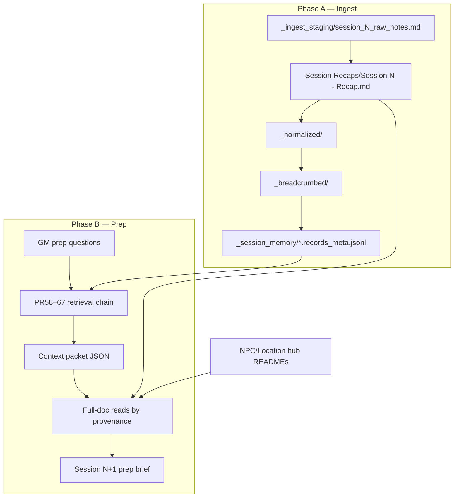
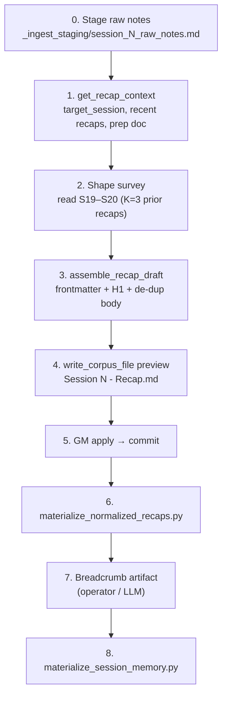

# C2 Session 21–22 — Demo Architect session notes

**Purpose:** Living architecture + learnings log while dogfooding the ingest → session-memory → retrieval → prep pipeline. Use this to rebuild the flow intentionally, not only to ship one recap.

**Status:** ACTIVE (updated each phase step).

### Related docs

| Role | Path |
|------|------|
| Dispatch / commands | [`HANDOFF-prep-agent-c2-ingest-s21-plan-s22-cursor-first.md`](HANDOFF-prep-agent-c2-ingest-s21-plan-s22-cursor-first.md) |
| Proof discipline / prep brief | [`DEMO-ARCHITECT-AGENT-MANUAL-c2s21-s22.md`](DEMO-ARCHITECT-AGENT-MANUAL-c2s21-s22.md) |
| Prior manual ingest precedent | [`archive/2026-05-09/operational-notes/PROCESSING-NOTES-Session-20-Manual-Ingest.md`](archive/2026-05-09/operational-notes/PROCESSING-NOTES-Session-20-Manual-Ingest.md) |
| Recap-write skill | `.cursor/skills/recap-write/SKILL.md` |

---

## 1. End-to-end architecture (target demo story)



**Architectural claim we are trying to prove:**

> Raw play notes → blessed recap → indexed memory → bounded retrieval packet (with admitted context + known gaps) → corpus-grounded prep the GM can audit.

**Not the success path:** grep-only prep, legacy top-k preview, Hermes v0 lexical search, or treating pre-play prep drafts as post-play recap.

---

## 2. Artifact layers (do not collapse)

| Layer | What it is | C2S21 status |
|-------|------------|--------------|
| **Ground truth (raw)** | Unprocessed GM notes | ✅ `Longmont Campaign/Campaign 2/_ingest_staging/session_21_raw_notes.md` |
| **Canonical recap** | Frontmatter + de-duped play prose | ⬜ pending recap-write |
| **Normalized** | Mechanical sibling under `_normalized/` | ⬜ |
| **Breadcrumb** | Unit-tagged artifact under `_breadcrumbed/` | ⬜ (operator/LLM cost) |
| **Session memory** | JSONL retrieval index | ⬜ |
| **Retrieval packet** | admitted_context + gaps + rendered sections | ⬜ Phase B |
| **Prep brief** | GM-facing S22 plan + proof ledger | ⬜ Phase B |

---

## 3. Step log

### Step 0 — Stage raw ground truth (2026-05-23)

**Action:** Moved repo-root `Campaign_2_Session_21.md` as-is to ingest staging.

| Field | Value |
|-------|--------|
| Source | `Campaign_2_Session_21.md` (repo root) |
| Target | `Longmont Campaign/Campaign 2/_ingest_staging/session_21_raw_notes.md` |
| Shape | 6 numbered paragraphs (single `\n` between items, no blank-line separation) |
| Pre-play drafts (context only) | `Session Prep/Session 21 - *.md` (4 files) — **not** ground truth |

**Learning L0 — staging convention is real, not ad hoc:** C2 ingest staging lives at `{campaign_hub}/_ingest_staging/session_{N}_raw_notes.md`. Same pattern as Scope-B gold (`session_20_raw_notes.md`). `assemble_recap_draft` reads this path; recap-write skill blocks direct `read_corpus_file` on staging (model must use the tool).

**Learning L0b — raw artifact shape differs from S20:** S21 source uses numbered lines (`1. …`, `2. …`) with single newlines, not blank-line-separated paragraphs. `recap_ingest_helpers.assemble_recap` paragraph splitting will matter — watch duplicate detection and paragraph boundaries in Step 1 preview.

### Step 1 — Recap-write preview (pending)

Optional pre-step: run **ingest-hints-sidecar** (`.cursor/skills/ingest-hints-sidecar/SKILL.md`) to emit review-only `_ingest_staging/session_21_raw_notes.ingest_hints.json`. Not wired into recap-write in v1 — operator reviews hints before recap-write uses them as seeds.

*(Fill after mechanical preprocess → `get_recap_context` → shape survey → `assemble_recap_draft` → `write_corpus_file` dry_run.)*

### Step 2 — GM apply + commit (pending)

### Step 3 — Normalize (pending)

```bash
uv run python scripts/materialize_normalized_recaps.py
```

### Step 4 — Breadcrumb (pending)

### Step 5 — Session memory (pending)

```bash
uv run python scripts/materialize_session_memory.py --campaign 2 --session 21
uv run python scripts/materialize_session_memory.py --campaign 2 --session 21 --check
```

### Step 6 — Phase B retrieval dogfood (pending)

### Step 7 — Session 22 prep brief (pending)

---

## 4. Deterministic vs judgment (running tally)

Track per step. Expand as we execute.

### Deterministic (tool could do without LLM judgment)

| ID | Step | Notes |
|----|------|-------|
| D0 | Move raw notes to `_ingest_staging/` | Done Step 0 |
| D1 | Discover next session N | max recap filename → 21 |
| D2 | Target recap path | `Session Recaps/Session 21 - Recap.md` |
| D3 | Emit 8-field frontmatter | From surveyed S19–S20 |
| D4 | Strip leading title / split paragraphs | `assemble_recap_draft` |
| D5 | Duplicate paragraph detection | Same helper |
| D6 | Two-phase preview diff | `write_corpus_file` dry_run |
| D7 | Normalize → breadcrumb → session memory | Scripts (post-commit) |

### Judgment (human or LLM must choose)

| ID | Step | Notes |
|----|------|-------|
| J1 | Title/H1 normalization | Survey picks clean exemplar |
| J2 | Keep vs drop duplicate paragraphs | Usually drop; surface in payload |
| J3 | Timeline append candidates | recap-write payload only |
| J4 | New hub proposals | text only today |
| J5 | Plot artifact placement | text only today |
| J6 | Breadcrumb LLM annotation | operator-owned cost |
| J7 | S22 prep synthesis | after packet review |

---

## 5. Architecture / rebuild backlog

Items surfaced during this exercise that should inform a cleaner orchestrator (not blocking current slice).

| ID | Observation | Rebuild direction |
|----|-------------|-----------------|
| R1 | Raw notes arrive at repo root; manual mv to staging | Single CLI: `dmb ingest stage --session 21 --from <path>` |
| R2 | S20 processing notes + recap-write skill + HANDOFF overlap | One **ingest runbook** with links, not three partial copies |
| R3 | Phase B has no `c2_prep_retrieval_packet.py` yet | HANDOFF §5.3 scratch wrapper → permanent CLI (manual §13 slice 1) |
| R4 | C2S1–S19 recaps exist but no session memory | Bulk materialization is optional depth; document tradeoff in every prep run |
| R6 | Numbered-list raw notes ( `1. …` / `2. …` ) collapse to one paragraph in `assemble_recap` | Extend `split_paragraphs_robust` or ingest pre-processor for numbered GM transcripts |

---

## 6. Learnings index (quick lookup)

| ID | Summary | Step |
|----|---------|------|
| L0 | `_ingest_staging/session_{N}_raw_notes.md` is ground-truth staging for recap-write | 0 |
| L0b | Numbered single-newline paragraphs — verify `assemble_recap` split behavior | 0 |
| L1 | **`assemble_recap` collapses C2S21 raw to 1 paragraph** — numbered lines (`2. They…`) don't trigger `split_paragraphs_robust`; embedded title on line 1 not stripped | 0 (empirical) |
| L2 | **Mechanical preprocess** (title line + strip `N.` + blank-line join) → 6 paragraphs; `title_stripped: true` — matches S20 ingest shape | preprocess design |

*(Append one row per learning as we go.)*

---

## 7. Operator decisions log

| Date | Decision | Rationale |
|------|----------|-----------|
| 2026-05-23 | Document flow in this file while executing HANDOFF | Rebuild ingest/prep architecture intentionally |
| 2026-05-23 | Minimum ingest depth (S21 only) unless operator overrides | HANDOFF §0.1 default |

---

## 8. Session 21 raw artifact — structural snapshot

*(For rubric/tool design; not canon prose.)*

- **Paragraph count:** 6 numbered blocks
- **Duplicate paragraphs detected (manual scan):** none obvious at staging
- **Notable entities (first pass):** Mossford, Edge of the World, Mireward, Mirathorn, young drakes, Boots of Crowing Wings, Frank (Mirathorn contact), storm/magic rain
- **Open thread at end:** press on to swamp vs turn back to Mirathorn — sets up S22 prep

---

## 9. Ingestion architecture (detailed reference)

This section describes the **full ingest pipeline** — layers, contracts, tools, and where judgment vs mechanics split. Update when we learn something new (see §6 learnings index).

### 9.1 What “ingestion” means here

Ingestion is **not** one write. It is a **stack of derivative artifacts** over play canon:

```text
raw ground truth  →  canonical recap  →  normalized  →  breadcrumbed  →  session memory (JSONL)
     (staging)         (Session Recaps/)    (_normalized/)  (_breadcrumbed/)   (_session_memory/)
```

Each layer has a different job:

| Layer | Role | Mutability |
|-------|------|------------|
| **Raw staging** | Immutable GM transcript as captured at the table | Ground truth input; never edited by recap-write |
| **Canonical recap** | Table-facing play record (`document_class: play`) | Created once via two-phase commit; prose is identity transform only |
| **Normalized** | Narrative-only, byte-stable body for downstream tooling | Mechanical extract from canonical recap |
| **Breadcrumb** | Inline unit tags for retrieval (`dmb_recap_breadcrumbs_v1`) | LLM or manual annotation; promoted from eval staging |
| **Session memory** | Compiled JSONL records + meta JSON for PR58–67 retrieval | Rebuildable from breadcrumb; `--check` verifies drift |

**Out of scope for ingest:** dossier, seed, statblock edits; timeline row appends (future `recap-timeline-append` skill); new NPC hub creation (proposal only in recap-write payload).

### 9.2 Phase A stages (execution order)



#### Stage 0 — Raw ground truth (operator / agent, direct file move)

- **Path:** `{campaign_hub}/_ingest_staging/session_{N}_raw_notes.md`
- **C2S21:** `Longmont Campaign/Campaign 2/_ingest_staging/session_21_raw_notes.md`
- **Not** under `Session Recaps/` — staging is input, not canon.
- **Not** the same as pre-play prep (`Session Prep/Session 21 - *.md` or `session_21_*.md`).

#### Stage 1 — Context resolution (deterministic)

- **Tool:** `get_recap_context()` → `src/agent/recap_context.py::resolve_recap_context`
- **Returns:** `campaign_id`, `target_session` (max session + 1), **3** prior recaps by frontmatter `session:` (not filename), optional `prep_doc_path`.
- **Prep doc convention:** exactly one `Session Prep/session_{N}_*.md` (or `session_{N}.md`). Files named `Session 21 - …md` **do not** match — C2S21 returns `prep_doc_path: null` despite four pre-play drafts.
- **Hard rule:** model must not list `Session Recaps/` or glob prep docs itself.

#### Stage 2 — Shape survey (read-only discovery)

- Read paths from context tool only: recent recaps (+ prep doc if non-null).
- Confirm invariant 8-field frontmatter, H1 form, no TLDR/section headings, interleaved prose paragraphs.
- **Skip:** dossier, seed, statblock (Lesson 11).

#### Stage 3 — Mechanical recap assembly (deterministic)

- **Tool:** `assemble_recap_draft` → `src/agent/recap_ingest_helpers.py::assemble_recap`
- **Steps inside helper:**
  1. Optional strip of standalone first line matching `Session {N} Recap[:]?`
  2. `split_paragraphs_robust` — blank lines **or** single newline after sentence-complete line + next line starts new paragraph (uppercase or quote-wrapped uppercase)
  3. `detect_duplicate_paragraphs` — exact match after whitespace normalize; keep first
  4. Emit 8-field YAML frontmatter + `# Session {N} Recap` + body joined with `\n\n`
- **Dispatch guard:** recap-write skill blocks `read_corpus_file` on staging path — must use `assemble_recap_draft`.

**C2S21 empirical note (L1):** Raw artifact uses numbered lines (`1. …`, `2. …`) with single newlines, no blank lines. Title is embedded in line 1 (`1. Session 21 Recap While still waiting…`), not a standalone title line. **`assemble_recap` currently produces 1 paragraph (7917 chars), not 6.** Numbered prefixes do not satisfy `_starts_new_paragraph_line`. Decision needed before commit: extend splitter for numbered-list GM notes, or pre-process raw file, or accept single-paragraph recap for this session.

#### Stage 4–5 — Canonical recap write (two-phase commit)

- **Tool:** `write_corpus_file` `mode='create'`, `dry_run=true` first
- **Allowlist path:** `Longmont Campaign/Campaign 2/Session Recaps/Session 21 - Recap.md` (generic title → filename `Session 21 - Recap.md` unless slug chosen at write time)
- **GM gate:** explicit `apply` before `dry_run=false` + matching `confirm_token`
- **Structured payload:** `recap_write` JSON — timeline candidates, new hubs, plot artifacts, duplicates, `unsure_queue`, `notes_for_gm` (judgment; not auto-written)

#### Stage 6 — Normalization (script, semi-deterministic)

```bash
uv run python scripts/materialize_normalized_recaps.py
```

- **Input:** canonical recap under `Session Recaps/`
- **Output:** `_normalized/Session NN - <Title Case Slug>.md` with `dmb_recap_normalized_v1` frontmatter
- **Slug:** from `_SLUGS` dict in script + `session_recap_paths.py`, or derived from recap title. Generic `Session 21 - Recap` title requires **`_SLUGS` entry for `(longmont-c2, 21)`** or a descriptive recap title before normalize runs.
- **Body:** narrative-only extract; strips prep chrome headings if present in source (N/A for clean recaps)

#### Stage 7 — Breadcrumb (operator-owned, LLM cost)

- **Output:** `_breadcrumbed/Session NN - <slug>.breadcrumbed.md` (`dmb_recap_breadcrumbs_v1`)
- **Staging:** often generated under `evals/sentence_routing_retrieval_falsification/manual_labels/artifacts/` then promoted to corpus
- **Contract:** tag-stripped body must match normalized recap body (strict equality)
- **Convention:** `Docs/CONVENTION-Session-Recap-Breadcrumbs-Session-Memory-And-Tokens.md`

#### Stage 8 — Session memory materialization

```bash
uv run python scripts/materialize_session_memory.py --campaign 2 --session 21
uv run python scripts/materialize_session_memory.py --campaign 2 --session 21 --check
```

- **Input:** breadcrumb file (hard dependency — fails if missing)
- **Output:** `_session_memory/*.records_meta.jsonl` + `.records_meta.json`
- **Pilot blessed:** `PILOT_BLESSED_SESSIONS` includes `(2, 20)` only for bulk `--all-blessed --check`; S21 materializes when breadcrumb exists regardless

### 9.3 Tooling map (ingest-specific)

| Component | Path | Phase |
|-----------|------|-------|
| Context resolver | `src/agent/recap_context.py` | 1 |
| Ingest helpers | `src/agent/recap_ingest_helpers.py` | 3 |
| Corpus writer + allowlist | `src/agent/corpus_writer.py` | 4–5, 6–8 writes |
| Recap-write skill | `.cursor/skills/recap-write/SKILL.md` | 1–5 orchestration |
| Normalize script | `scripts/materialize_normalized_recaps.py` | 6 |
| Session memory script | `scripts/materialize_session_memory.py` | 8 |
| Path resolver / slugs | `src/corpus/session_recap_paths.py` | 6–8 |
| Breadcrumb normalize | `src/session_memory/breadcrumb_normalize.py` | 8 |

### 9.4 Writer allowlist (what ingest may create)

From `corpus_writer.py` — default deny:

| Pattern | Purpose |
|---------|---------|
| `Session Recaps/Session NN - *.md` | Canonical recap **create** |
| `Session Recaps/_normalized/Session NN - *.md` | Normalized sibling |
| `Session Recaps/_breadcrumbed/Session NN - *.{breadcrumbed,frontmatter_seed}.md` | Breadcrumb |
| `Session Recaps/_session_memory/Session NN - *.records_meta.{jsonl,json}` | Session memory |
| `NPCs/<slug>/timeline.md` | **Append only** — not recap-write turn |

**Denied:** dossier, seed, statblock, arbitrary `Session Prep/` paths.

### 9.5 Deterministic vs judgment (ingest-only)

| Deterministic | Judgment |
|---------------|----------|
| Next session N from corpus | Recap title / slug choice when generic |
| Frontmatter 8-field schema | Title normalization exemplar (S19 clean form) |
| Paragraph split + de-dup (given rules) | Keep vs drop duplicate (usually drop) |
| Two-phase diff preview | GM `apply` |
| Normalize body extract | Breadcrumb LLM tagging |
| JSONL record compilation | Timeline rows, new hubs, plot artifact placement |
| | `unsure_queue` items for ambiguities |

### 9.8 Raw-notes preprocess template (before `assemble_recap_draft`)

**Authority:** Derived from S20 gold fixture + canonical S19–S20 recaps vs C2S21 numbered transcript.

#### What `assemble_recap` expects (staging shape)

The Scope-B gold input (`evals/session_recap_ingest_vertical_slice/fixtures/session_20_raw_notes.txt`) is the reference **staging template** — not the final recap file:

```text
Session N Recap

[paragraph one — GM prose, verbatim]

[paragraph two — GM prose, verbatim]

...
```

| Rule | S20 fixture | S21 raw (broken) | After mechanical preprocess |
|------|-------------|------------------|----------------------------|
| Standalone title line | ✅ line 1 | ❌ embedded in `1. Session 21 Recap While…` | ✅ `Session 21 Recap` |
| Blank line after title | ✅ | ❌ | ✅ |
| Paragraph separators | ✅ mostly `\n\n` | ❌ single `\n` + `N.` prefixes | ✅ `\n\n` between blocks |
| Numbered list prefixes | none | `1.` … `6.` | stripped |
| Frontmatter / H1 | none (tool adds) | none | none |
| Prose edits | none | none | none (identity transform on layout only) |

**Do not** put YAML frontmatter or `# Session N Recap` in staging — `assemble_recap` adds both.

#### Mechanical preprocess algorithm (deterministic — no LLM)

1. **Preserve original** as `session_{N}_raw_notes.orig.md` (optional lineage; ground truth immutable).
2. **Split** non-empty lines; strip leading `^\d+\.\s*` from each line.
3. **First block only:** strip leading `Session {N} Recap\s*` if present after number strip.
4. **Join** blocks with `\n\n` (double newline).
5. **Prefix** with `Session {N} Recap\n\n`.
6. **Write** `session_{N}_raw_notes.md` (or `session_{N}_raw_notes.prepared.md` if keeping orig untouched).

Empirical: S21 → **6 paragraphs**, `title_stripped: true` — ready for `assemble_recap_draft`.

#### Optional LLM sidecar (metadata only — separate file)

**Implementation:** `src/agent/ingest_hints_output_schema.py`, `src/prompts/ingest_hints_sidecar.py`, `.cursor/skills/ingest-hints-sidecar/SKILL.md` (PR #68 / `HANDOFF-pr68-ingest-hints-sidecar.md`).

**Path:** `_ingest_staging/session_{N}_raw_notes.ingest_hints.json` (or `.md` for human skim)

**Purpose:** first-pass **hints** for downstream judgment steps — not canon, not merged into staging prose.

| Field | Use | Consumer |
|-------|-----|----------|
| `suggested_slug` | e.g. `"Drake Nest Mirathorn Call"` → `_SLUGS` / normalize filename | Stage 6 normalize |
| `suggested_title` | `"Session 21 - <slug>"` if not generic Recap | recap-write / normalize |
| `entities` | `{npcs, locations, items}` with evidence spans | seeds `recap_write` npc_audit / plot_artifacts |
| `open_threads` | one-liners for operator | S22 prep / recap-write `notes_for_gm` |
| `spelling_variants` | e.g. Karsemine/Karesmine | audit only — do not auto-correct prose |
| `prep_cross_refs` | which `Session Prep/Session N - *.md` drafts relate | pointer proposals |

**LLM contract for sidecar:**

- Input: raw or **preprocessed** staging text only.
- Output: structured JSON; **must not** rewrite or paraphrase recap prose.
- Human review before any hint promotes to canon (slug commit, timeline, hubs).

**When LLM preprocess is worth it:** yes for **metadata sidecar**; **no** for paragraph layout (mechanical is sufficient and safer).

**When to skip LLM sidecar:** single-session ingest where operator picks slug manually and recap-write turn already runs entity audit.

#### Preprocess vs later LLM stages

| Stage | LLM? | Touches prose? |
|-------|------|----------------|
| Mechanical preprocess | No | Layout only |
| Ingest hints sidecar | Optional | No |
| recap-write payload | Yes | No (recap body via assemble only) |
| Breadcrumb tagging | Yes | Adds inline tags to derivative artifact |
| S22 prep synthesis | Yes | New prep doc only |

---

| Stage | Status | Blocker |
|-------|--------|---------|
| 0 Raw staging | ✅ Done | — |
| 1–5 Recap-write | ⬜ Pending | Paragraph split behavior (L1); GM notes paste not required (on disk) |
| 6 Normalize | ⬜ | Needs committed recap + likely `_SLUGS` entry for S21 |
| 7 Breadcrumb | ⬜ | Operator/LLM step |
| 8 Session memory | ⬜ | Needs breadcrumb |

**Prep drafts (context only, not ingest input):**

- `Session Prep/Session 21 - Mossford Saltfen rumor shop.md`
- `Session Prep/Session 21 - brainstorming dump.md`
- `Session Prep/Session 21 - prep exercise agentic trace.md`
- `Session Prep/Session 21 - Session intro.md`

None match `session_21_*.md` — resolver correctly ignores them for recap-write.

### 9.7 Known gaps after minimum ingest

- **C2S1–S19:** recaps exist; no `_session_memory/` unless bulk materialization follow-on
- **Retrieval for S22:** minimum path uses S20 + S21 JSONL + full-doc reads; hub chunks need C2 materializer allowlist (future)

---

*Update this file at the end of each step before reporting status to the operator.*
