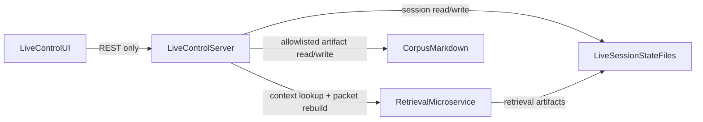

# C2 Live Control L5 — Pane, State, and Service Boundaries

## Purpose

Capture the high-level design for the L5 UI pivot without implementation detail: one shared pane model, balanced client/server/state-manager responsibilities, and clear integration boundaries for retrieval as a microservice.

## Product Constraints (Locked)

- Projection is derived, not authoritative; no new session-plan source-of-truth file.
- UI remains a product control surface, not a dashboard/file-browser.
- Live play should not be interrupted by mandatory reconciliation workflows.
- Client never becomes corpus source-of-truth; writes flow through server contracts.

## Current Architecture (Anchor)

- **Server boundary:** `apps/live_control_server` owns session packet/layout/events/jobs and API routes (`/api/live/*`).
- **Client boundary:** `apps/live-control-ui` renders modular surface from server snapshots and persists layout via `PUT /api/live/surface/layout`.
- **State split today:**
  - App-level snapshot state in `App.tsx`.
  - Layout draft/write state in `LayoutDraftContext.tsx`.
- **Gap:** no plan-view endpoint, no universal inspector pane, no artifact read/write contract for pane-driven editing.

## Target High-Level Architecture

## Responsibility Balance

### Central Live Server

- Owns product-facing API and orchestrates all read/write operations used by UI.
- Builds and returns derived projection (`plan-view`) from source truth.
- Enforces allowlists and file-state safety for artifact edits.
- Insulates fast-live flows from retrieval-service latency.

### Client (UI)

- Renders modules and shared pane from typed API responses.
- Holds ephemeral interaction state (selection, pane mode, local form edits).
- Does not read corpus files directly and does not persist projection artifacts.

### Client State Manager

- Keep two explicit domains:
  - **LiveSession domain (new):** server snapshot, refresh orchestration, pane selection.
  - **LayoutDraft domain (existing):** layout edits and persistence workflow.
- Incremental evolution via React context split; no mandatory state-library migration in v1.

### Retrieval Microservice (Sibling)

- Remains a sibling subsystem invoked by live server for context lookup/rebuild operations.
- Not directly called by browser client.
- Returns artifacts/candidates that the live server can package for UI-safe consumption.

## Universal Pane Design

- Pane is app chrome, not a single module implementation detail.
- One typed target model serves all constituent parts:
  - event
  - roll_table
  - npc
  - location
  - runbook_section
  - source_packet (later)
- Read-first rollout: open/view targets before enabling any writes.
- Write scope v1: roll-table editing only, with server-side validation and source refresh.

## API Shape (High Level)

- `GET /api/live/plan-view` — derived timeline projection payload.
- `GET /api/live/artifact` — read an allowlisted pane target.
- `PUT/PATCH /api/live/artifact` — scoped write path for approved artifact types.

All pane writes must include file-state token/etag semantics to avoid stale overwrites.

## Delivery Sequencing (Design-Level)

1. Lock server contracts (`plan-view`, artifact read/write).
2. Introduce client LiveSession state domain while preserving LayoutDraft domain.
3. Add shared pane shell and read-only target rendering.
4. Enable scoped roll-table write path through pane.
5. Integrate retrieval microservice adapter behind live server for context workflows.

## Risks and Guardrails

- **Scope creep:** keep v1 write support limited to roll tables.
- **Split-brain state:** projection always rebuilt from source after writes.
- **Safety:** strict allowlists, token checks, and server-only file access.
- **Latency bleed:** retrieval stays off the fast-live critical path.
- **UX drift:** pane remains inline conversational support, not an all-data dashboard.

## Success Criteria (Design)

- A single pane interaction model can support all L5 constituents.
- State ownership is explicit and avoids overlap between session snapshots and layout drafts.
- Client/server responsibilities remain clear under read and write flows.
- Retrieval integration is additive and does not weaken live-control API coherence.
