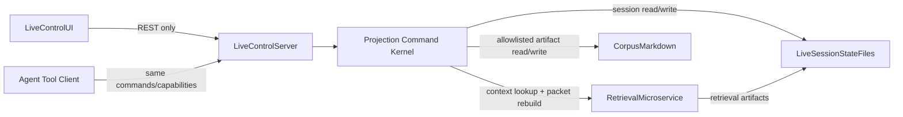

# C2 Live Control L5 — Pane, State, and Service Boundaries

## Purpose

Capture the high-level design for the L5 UI pivot without implementation detail: one shared pane model, a Python-first projection/command kernel, balanced client/server/state-manager responsibilities, and clear integration boundaries for retrieval as a sibling service.

## Product Constraints (Locked)

- Projection is derived, not authoritative; no new session-plan source-of-truth file.
- UI remains a product control surface, not a dashboard/file-browser.
- Live play should not be interrupted by mandatory reconciliation workflows.
- Client never becomes corpus source-of-truth; writes flow through server contracts.
- Pane interactions and agent tools must share the same typed command layer; neither may bypass server-side validation, audit, conflict handling, or invalidation.

## Current Architecture (Anchor)

- **Server boundary:** `apps/live_control_server` owns session packet/layout/events/jobs and API routes (`/api/live/*`).
- **Client boundary:** `apps/live-control-ui` renders modular surface from server snapshots and persists layout via `PUT /api/live/surface/layout`.
- **State split today:**
  - App-level snapshot state in `App.tsx`.
  - Layout draft/write state in `LayoutDraftContext.tsx`.
- **Gap:** no plan-view endpoint, no universal inspector pane, no projection target/capability model, no shared command bus for pane-driven and agent-driven writes.

## Target High-Level Architecture



## Responsibility Balance

### Central Live Server

- Owns product-facing API and orchestrates all read/write operations used by UI and agent tools.
- Builds and returns derived projections (`plan-view`, pane artifacts, source cards, open-loop summaries) from source truth.
- Enforces allowlists, file-state safety, write lanes, command validation, audit rows, conflict behavior, and projection invalidation.
- Insulates fast-live flows from retrieval-service latency.

### Python Projection / Command Kernel

The next foundation should live primarily in Python. React should render and submit commands, not decide where writes land.

Recommended pure-ish domain layer:

```text
src/live_play/projections/
  targets.py
  capabilities.py
  commands.py
  write_results.py
  invalidation.py
  plan_view.py
  artifact_read.py
  command_bus.py
```

Core functions should be testable without FastAPI or React:

```python
build_projection(packet, events, jobs, corpus_index) -> Projection
resolve_capabilities(target, context) -> list[ProjectionCapability]
execute_command(command, context) -> ProjectionWriteResult
```

FastAPI remains a thin transport adapter.

### Client (UI)

- Renders modules and shared pane from typed API responses.
- Holds ephemeral interaction state: selection, pane mode, local form edits, optimistic disclosure state.
- Renders server-provided capabilities as human affordances.
- Submits typed commands and refreshes projections from server invalidation hints.
- Does not read corpus files directly and does not persist projection artifacts.

### Agent Tool Client

- Uses the same projection targets, capabilities, commands, write lanes, and write results as the human UI.
- May inspect capabilities before acting.
- Must declare lane, target, payload, evidence, and requested command type.
- Must not receive a universal filesystem/corpus editor that bypasses the command layer.

### Client State Manager

- Keep two explicit domains:
  - **LiveSession domain (new):** server snapshot, projection refresh orchestration, pane selection, command result invalidations.
  - **LayoutDraft domain (existing):** layout edits and persistence workflow.
- Incremental evolution via React context split; no mandatory state-library migration in v1.

### Retrieval Microservice (Sibling)

- Remains a sibling subsystem invoked by live server for context lookup/rebuild operations.
- Not directly called by browser client.
- Returns artifacts/candidates that the live server can package for UI-safe consumption.

## Universal Pane Design

- Pane is app chrome, not a single module implementation detail.
- One typed target model serves all constituent parts:
  - event
  - roll_table
  - npc
  - location
  - runbook_section
  - job
  - open_loop
  - source_packet (later)
- Read-first rollout: open/view targets before enabling writes.
- Write rollout proceeds by capability, not by bespoke pane endpoints.
- Each pane target returns the commands it supports; disabled capabilities explain why they are disabled.

## Projection + Command Model

Panes are projections. Writes are commands against authoritative backing stores. Projection text itself is not authoritative.

```text
GET projection/read model
→ render human surface
→ user or agent chooses capability
→ POST typed command
→ server validates lane/target/evidence
→ server writes to proper source(s)
→ server emits audit + conflicts + invalidations
→ UI/agent refreshes affected projections
```

### Core Types

```text
ProjectionTarget
  type, id, label, source_status

ProjectionCapability
  command_type, label, lane, enabled, required_fields, risk_level, disabled_reason?

ProjectionCommand
  command_type, target, lane, payload, evidence, requested_by

ProjectionWriteResult
  write_id, events_appended, jobs_queued, artifacts_changed, invalidations, conflicts

ProjectionInvalidation
  projection_key, target_id?, reason
```

### Write Lanes

Every write must declare intent before touching a backing store:

| Lane | Meaning | Typical backing store |
|------|---------|-----------------------|
| `observed_play` | Something happened or was asserted at the table. | `event_log.jsonl`, staging job |
| `canon_patch` | Proposed or applied long-term campaign memory change. | canon markdown via patch job or allowlisted artifact write |
| `prep_note` | Future-facing GM prep, not table fact. | prep docs, packet rebuild job, staging/prep artifact |
| `live_state_pin` | Temporary/session-current orientation. | event log/state derivation, not `current_state.json` mutation |
| `job_queue` | Deferred system work. | `job_queue.jsonl` |
| `retrieval_curation` | Source admission/rejection/rebuild guidance. | retrieval artifacts/job queue |
| `layout_config` | Runtime UI layout. | `surface_layout.json` |
| `rules_ruling` | Table ruling or house-rule note. | event log, ruling artifact, review job |

### Command Bus

Prefer one typed command endpoint over many pane-specific write endpoints:

```text
POST /api/live/commands
```

Example commands:

```text
append_observation
queue_canon_patch
patch_artifact
create_open_loop
update_open_loop
pin_scene_state
update_job_status
record_ruling
request_retrieval_refresh
update_layout
```

`PUT/PATCH /api/live/artifact` may remain as an implementation detail for tightly scoped artifact writes, but pane and agent clients should normally submit `ProjectionCommand` objects through the command bus.

## Pane Write Matrix (Design Seed)

| Pane / Target | Projection inputs | Likely commands | Backing stores touched | Invalidation examples |
|---------------|-------------------|-----------------|------------------------|-----------------------|
| Chat / Command | user text + live session | `append_observation`, `queue_canon_patch`, `create_open_loop`, `request_retrieval_refresh` | event log, job queue | record, queue, now, open loops, plan view |
| Record / Event | event log | `append_observation`, `queue_canon_patch`, event annotation/correction | event log, job queue | record, inspector:event, plan view |
| Now / Scene | packet + events + jobs | `pin_scene_state`, `append_observation`, `create_open_loop` | event log, possibly job queue | current_state, now, timeline |
| Roll Stack | packet/runbook + roll events | `append_observation`, `patch_artifact`, `pin_scene_state` | event log, roll table artifact, job queue | roll_stack, plan_view, inspector:roll_table |
| Timeline / Plan | corpus + packet + events/jobs | `pin_scene_state`, `create_open_loop`, `queue_canon_patch`, `patch_artifact` | event log, job queue, allowlisted artifacts | plan_view, now, open_loops, sources |
| Inspector:event | event log | event correction/annotation, `queue_canon_patch` | event log, job queue | record, plan_view |
| Inspector:roll_table | roll table source | `patch_artifact`, `append_observation` | allowlisted table file, event log | roll_stack, plan_view, artifact:roll_table |
| Inspector:npc | NPC hub + events + prep | `append_observation`, `queue_canon_patch`, later `patch_artifact` | event log, job queue, NPC hub when enabled | npc_focus, timeline, sources |
| Inspector:location | location hub + events + prep | `append_observation`, `queue_canon_patch`, later `patch_artifact` | event log, job queue, location hub when enabled | location_context, timeline, sources |
| Queue | job queue | `update_job_status`, `create_job`, `request_retrieval_refresh` | job queue | queue, current_state, related pane projections |
| Open Loops | packet + events | `create_open_loop`, `update_open_loop`, `queue_canon_patch` | event log, job queue | open_loops, now, timeline |
| Sources / Evidence | retrieval artifacts + provenance | source pin/reject, `request_retrieval_refresh` | retrieval artifacts, job queue | sources, context cards, plan_view |
| Layout Controls | surface layout | `update_layout` | `surface_layout.json` | surface layout only |

## API Shape (High Level)

- `GET /api/live/plan-view` — derived timeline projection payload.
- `GET /api/live/artifact` — read an allowlisted pane target.
- `GET /api/live/capabilities` — return supported commands for a target.
- `POST /api/live/commands` — submit typed pane/agent command and receive write result + invalidations.
- `PUT/PATCH /api/live/artifact` — optional internal/scoped implementation path for approved artifact writes.

All artifact writes must include file-state token/etag semantics to avoid stale overwrites. All commands that change state must return audit identity and invalidation hints.

## Delivery Sequencing (Design-Level)

1. Lock Python projection/command contracts: targets, capabilities, commands, write results, invalidations.
2. Add read-only `plan-view` endpoint and Session 22 sample projection.
3. Add timeline module and shared pane shell in React.
4. Add artifact/capability read endpoints and read-only pane renderers.
5. Add command bus with first safe commands: append observation, update job status, pin scene state.
6. Add pane actions that submit commands and refresh invalidated projections.
7. Add scoped artifact patching, starting with roll tables.
8. Integrate retrieval microservice adapter behind live server for context workflows.

## Risks and Guardrails

- **Scope creep:** grow writes by command capability and backing-store safety, not by making every pane a document editor.
- **Split-brain state:** projection always rebuilt from source after writes.
- **Intent loss:** every write declares lane; ambiguous edits become review jobs rather than silent canon changes.
- **Safety:** strict allowlists, token checks, server-only file access, and append-only correction where mutation would corrupt auditability.
- **Latency bleed:** retrieval stays off the fast-live critical path.
- **UX drift:** pane remains inline conversational support, not an all-data dashboard.
- **Agent overreach:** agent tools share the command layer but do not gain raw corpus edit power.

## Success Criteria (Design)

- A single pane interaction model can support all L5 constituents.
- State ownership is explicit and avoids overlap between session snapshots and layout drafts.
- Client/server responsibilities remain clear under read and write flows.
- Human pane actions and agent tools share the same typed command/capability layer.
- Write results tell the UI what changed and which projections to refresh.
- Retrieval integration is additive and does not weaken live-control API coherence.

## Changelog

### v0.2 — 2026-05-28

- Refined L5 from pane-only artifact editing into a Python-first projection/command architecture.
- Added shared command bus, projection capability model, write lanes, invalidation model, and agent-tool reuse boundary.
- Expanded pane write matrix so future modules can grow without bespoke write paths or raw corpus editing.

### v0.1 — 2026-05-28

- Created initial L5 pane/state/service boundary design.
