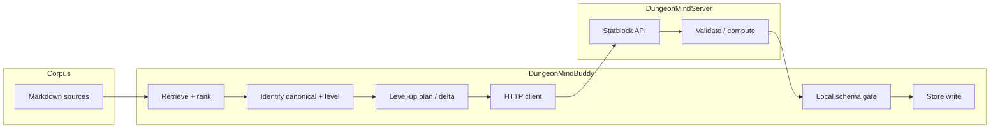

# Design: Lysandra statblock vertical slice — stepped benchmark with gates

**Status:** Draft (implementation not locked)  
**Scope:** DungeonMindBuddy corpus + retrieval path, optional synthesis, DungeonMindServer StatblockGenerator (or successor HTTP surface), and a durable **store** record.  
**Primary NPC:** Captain Lysandra Ironveil (corpus naming; avoid alternate spellings in fixtures).

### Planner alignment — one line (read when this work resurfaces)

**DungeonMindBuddy already selects documents in a tight tool loop:** OpenAI `responses.create` + corpus manifest in `instructions` + the `read_corpus_file` tool + `PlanningTurnDetail.tool_trace`. **This vertical slice should treat that as the primary retrieval story:** hang gates (and optional keyword/BM25 baselines) off `**tool_trace` and the user prompt** via `run_planning_turn_detailed` / planner-live-eval patterns—not only offline keyword scans—unless you explicitly split “benchmark without model” vs “benchmark with model.”

**Code:** `src/agent/planner.py` (`run_planning_turn_detailed`, `make_tool_dispatcher`, `_planner_tools_responses`).

---

## 1. Executive summary

We define an end-to-end **vertical slice benchmark** whose **aggregate pass** means:

1. The pipeline **grounded** itself on the latest agreed campaign corpus (session-scoped policy below).
2. It **resolved** which in-corpus representation of Lysandra’s statblock is **canonical** for “current sheet before level up.”
3. It **derived** a **target level** (or explicit level delta) with evidence tied to corpus text.
4. It produced a **level-up mechanical description** (and/or structured intermediate) suitable for the statblock service.
5. It called the **real StatblockGenerator HTTP contract** (or a **contract-identical mock** in CI) and received a **structured** creature payload.
6. That payload passed **schema validation** and **legality validation** (rules-aware checks on the server or a shared validator).
7. A **store** accepted the object **once**, with **provenance** (sources, request ids, schema version), and the benchmark verifier **read it back** and confirmed equality (or semantic equivalence) to the gated result.

Until all step gates pass, the benchmark **fails**; partial progress is reported **per step** for debugging.

---

## 2. Success criterion (single sentence)

**Benchmark pass** iff a **received, validated, legal** structured statblock for Captain Lysandra Ironveil **after level up** is **persisted** in the configured store and **re-read** within the benchmark with **no gate violations** on the stored object.

---

## 3. Definitions


| Term                              | Meaning                                                                                                                                                                                                                                                                                            |
| --------------------------------- | -------------------------------------------------------------------------------------------------------------------------------------------------------------------------------------------------------------------------------------------------------------------------------------------------- |
| **Grounding corpus**              | `corpus/eldyrwild-markdown/` (or successor root) with a **pinned fingerprint** (hash of relevant subtree or full corpus per existing planner practice).                                                                                                                                            |
| **Canonical pre-level statblock** | The single authoritative prior sheet **selected by policy** (Section 4), not merely the first search hit.                                                                                                                                                                                          |
| **Structured object**             | JSON (or equivalent) matching a **versioned schema** (e.g. `statblock_project.state.statblock` shape or a narrowed **NPC export** schema agreed with StatblockGenerator). Markdown alone is **not** sufficient for final success.                                                                  |
| **Valid**                         | Parses against the JSON schema for the agreed `schema_version`.                                                                                                                                                                                                                                    |
| **Legal**                         | Passes deterministic **5e legality** checks appropriate to the data we send (class/level bounds, proficiency bonus consistency, skill cap rules, etc.). Exact rule depth is a **product knob**; the design requires a **named** legality profile (e.g. `legality_profile: "npc_sheet_v1_strict"`). |
| **Level up**                      | Increase in NPC **power state**. By default this is CR-oriented for NPC statblocks; class-level progression is optional and must be explicit. Ambiguous user language (“level her up”) requires intent disambiguation before legality gates are applied.                                           |


### 3.1 Target corpus hierarchy (setting seed vs campaign lives)

This is the **directory schema we want when serious writing and ingestion catch up**. It separates **world bible** (pre–player-contact) from **table canon** (what happened in each Longmont campaign), so statblocks and timelines do not fight each other.

**1. Elderwyld / Mirathorn (setting — character seed)**  

- **Purpose:** Who the NPC is in *your* narrative world **before** meaningful contact with the players; Mirathorn-local context.  
- **Suggested layout** (under something like `Elderwyld/Cities and Towns/Mirathorn/NPCs/<npc_slug>/`):  
  - `README.md` — one-screen map of files below.  
  - **Character seed** (prose or structured notes): baseline concept, role in the city, hooks before the party arrives.  
  - **Original statblock** — first mechanical export you treat as the setting’s “day zero” sheet.  
  - **Mirathorn-facing CR2 sheet** (or equivalent) — the concrete **CR 2** (or other fixed tier) statblock that belongs to the *setting* presentation (e.g. city guard stat block as published in the world), distinct from “whatever the table is using after six sessions.”
- **Rule:** Do not bury the only copy of a **campaign-specific level-up** here; those belong under the campaign that earned them (below).

**2. Longmont Campaign / Campaign `<n>` / NPCs / `<npc_slug>` (per-campaign package)**  

- **Purpose:** Everything the **table** needs for that campaign: continuity, prep, mechanical history **for that timeline**.  
- **Suggested layout** (e.g. `Longmont Campaign/Campaign 2/NPCs/captain_lysandra_ironveil/`):  
  - `README.md` — links into recaps, Mirathorn seed folder, and “which statblock is current for C2.”  
  - `timeline.md` (or session-indexed notes) — what changed **in this campaign** and when.  
  - **Character dossier** — voice, psychology, table-use (can remain one canonical `*_character_dossier.md`).  
  - **Level-up statblocks** — **one file per campaign-locked mechanical state** (e.g. after a specific arc or session); name with campaign + tier or level so gates and humans agree (`*_statblock_c2_post_sess17_cr3.md`, etc.). If the same NPC levels in **Campaign 1** and **Campaign 2**, each level-up sheet lives **only** under the folder for the campaign where that progression happened.

**3. Policy / benchmark implication**  

- `corpus_policy` (or gold) should be able to name **several** mechanical paths with **roles**: e.g. `setting_original_statblock`, `setting_mirathorn_cr2`, `campaign_c2_current_statblock`, so retrieval does not conflate “CR as creature” with “class level at the table.”  
- Fingerprint and eval gold must be refreshed whenever files move under `corpus/eldyrwild-markdown/`.

**4. Current corpus (implemented hub layout)**  

- **Setting:** `Elderwyld/Cities and Towns/Mirathorn/NPCs/captain_lysandra_ironveil/` — `character_seed.md`, `captain_lysandra_ironveil_statblock_cr2.md`, `README.md`.  
- **Campaign 2 table:** `Longmont Campaign/Campaign 2/NPCs/captain_lysandra_ironveil/` — `captain_lysandra_ironveil_character_dossier.md`, `README.md`, `timeline.md`.  
- **C2 level-up exports:** add under the C2 hub when authored. **Distinct `statblock_original`:** add under the Mirathorn hub when you split it from CR2.

---

## 4. Canonical sheet policy (must be fixed before Step 2 gates)

Retrieval cannot define “most recent” without a **policy object**. The benchmark loads a **gold policy file** (committed JSON/YAML), e.g. `evals/lysandra_vertical_slice/gold/corpus_policy.json`:

Suggested fields:

- `entity_primary_names`: `["Captain Lysandra Ironveil", "Lysandra Ironveil", …]`  
- `statblock_candidate_globs` or explicit `candidate_paths[]` (maintainer-curated inventory of every file that might contain a statblock).  
- `recency_key`: one of `path_session_number`, `git_mtime`, `frontmatter_updated`, `explicit_rank_order`.  
- `canonical_path`: optional override if policy is “always this file regardless of others.”  
- `session_anchor`: path or id of the **latest session recap or prep** that bounds “current campaign moment” for this slice.

**Gate 2** (below) asserts the selected canonical path **equals** `gold.canonical_path` **or** matches `gold.selection_rule` evaluated deterministically on the candidate set.

---

## 5. Pipeline overview




---

## 6. Steps and gates

Each step produces a **structured trace record** (`step_id`, `inputs_sig`, `outputs_sig`, `latency_ms`, `gate_results[]`). A step **fails closed**: later steps **do not run** unless earlier steps pass (or are explicitly marked optional in the manifest; default is strict).

### Step 0 — Environment and corpus pin


| Gate ID | Predicate                                                                                                                                                         |
| ------- | ----------------------------------------------------------------------------------------------------------------------------------------------------------------- |
| `G0.1`  | Corpus root exists and matches `gold.corpus_root` (or env override documented).                                                                                   |
| `G0.2`  | `corpus_fingerprint` matches `gold.expected_fingerprint` **or** benchmark run documents `allow_fingerprint_drift: true` with explicit waiver (default **false**). |
| `G0.3`  | Required env for live server (`DUNGEONMIND_STATBLOCK_URL`, API key if required) present **or** run mode is `mock_statblock_server` with fixture path set.         |


### Step 1 — Retrieval (recall + grounding)

Step 1 is intentionally **two lanes**. Only **Lane A** is the product-shaped retrieval story; **Lane B** is an optional **cheap, model-free** check unless you explicitly require both (e.g. CI without API keys).

#### Lane A — Planner retrieval (primary; “Step 1” in the one-line sense)

**Mechanism:** One bounded `run_planning_turn_detailed` call (or harness-identical loop) with a **gold `user_line`** (Lysandra level-up ask) + normal planner `instructions` + tools + `dispatch_tool` → `**PlanningTurnDetail.tool_trace**`.

**Inputs:** Pinned `user_line`, corpus root (Step 0), model id policy (or scripted client for determinism).  
**Outputs:** `tool_trace` (ordered `read_corpus_file` rows), `steps`, `final_text` (may be ignored for Step 1-only scoring), `hit_tool_round_limit`.

**What a passing Lane A must convince us of**

1. **Grounded file choice under the real manifest + tool contract** — the model actually **opened** markdown via `read_corpus_file` with valid relative paths, not only hallucinated paths in prose.
2. **Recall adequacy for the slice** — every path in `gold.planner_step1.required_read_paths` (maintainer set: dossier, session anchor, etc.) appears **somewhere** in the **deduped** `read_corpus_file` path list (order-agnostic), or appears within the **first N** reads if you want to penalize “read the whole corpus.”
3. **No runaway loop** — `hit_tool_round_limit` is false for this scenario (or you document an allowed waiver and still assert minimal reads).
4. **Optional efficiency / focus** — caps on `read_corpus_file` count or token estimate, or “must not open paths on denylist” (product knobs).

**Suggested gate IDs (Lane A)** — rename in implementation as you like:


| Gate ID | Predicate                                                                                                                                                                                                                                         |
| ------- | ------------------------------------------------------------------------------------------------------------------------------------------------------------------------------------------------------------------------------------------------- |
| `P1.1`  | Deduped `read_corpus_file` paths from `tool_trace` ⊇ `gold.planner_step1.required_read_paths` (subset as defined in gold).                                                                                                                        |
| `P1.2`  | If `corpus_policy.canonical_statblock_relpath` is set, that path appears in deduped reads; else **both** `primary_reference_relpath` and `session_anchor_relpath` appear (same rule as offline G1.2, but applied to **trace**, not keyword rank). |
| `P1.3`  | Every read path is under allowed corpus prefixes (same spirit as G1.3).                                                                                                                                                                           |
| `P1.4`  | `hit_tool_round_limit` is false (unless gold documents an exception).                                                                                                                                                                             |


**What passing does *not* prove:** final answer quality, correct level-up math, or statblock legality — only **which files the tight loop chose to load** for this user prompt.

**Split “with model” vs “without”:** Lane A needs either a **live model** (integration) or a **scripted `responses` harness** that replays tool calls (`tests/test_planner_eval_scenarios.py` style). Same gate predicates on `tool_trace`; different cost and flake profile.

---

#### Lane B — Offline keyword / BM25 baseline (optional)

**Mechanism:** No planner; score markdown files under scoped subtrees (today: `evals/lysandra_vertical_slice/step1_retrieval.py`).

**What passing convinces us of:** **Lexical signal exists** in the corpus for the NPC and anchors — useful for **gold authoring**, **regressions when corpus text moves**, and **CI without LLM**. It does **not** prove the production planner would open those files under the same `user_line`.


| Gate ID | Predicate                                                                                                                      |
| ------- | ------------------------------------------------------------------------------------------------------------------------------ |
| `G1.1`  | `gold.required_paths_retrieved` ⊆ top-`K` paths (set inclusion).                                                               |
| `G1.2`  | Canonical path from Step 2’s **deterministic** selector is in the retrieved candidate set (or in top-`K` if policy uses rank). |
| `G1.3`  | No retrieved path is outside corpus roots (`Elderwyld/`, `Longmont Campaign/`).                                                |


### Step 2 — Identify canonical pre-level statblock

**Inputs (full target):** Step 1 candidate set + `corpus_policy.json`.  
**Inputs (Buddy v1 harness):** `corpus_policy.json` only — canonical path is `**canonical_statblock_relpath`**. Whether that path sits in Step 1’s top‑`K` remains **G1.2** (Lane B), not a Step 2 selector input.

**Outputs (full target):** `canonical_path`, `extracted_markdown` or `extracted_section_span`, `selection_reason` (machine-readable).  
**Outputs (Buddy v1 harness):** `canonical_path`, `**selection_reason`** (dict: `rule_id`, `outcome`, policy path), `**extracted_markdown**` (full UTF-8 body or truncated when `detail_max_extracted_markdown_chars` is set in gold), `**extracted_section_span**` (`corpus_relative_path`, `start_char`, exclusive `end_char`, aligned with the extract), marker pass/fail map, parsed **Challenge Rating** from the **full** file on disk (gates are not shortened by extract truncation).

**Non‑goals for v1 (not blockers for Step 2.4):** intersecting Step 1 ranks inside Step 2, sub‑file / semantic slices (only whole‑file extract + 0..len span today), richer `selection_reason` branches (multi‑candidate tie‑break), and multi‑candidate tie‑break diagnostics. Those matter for richer **Step 3–4**, not for shipping the current **2.4 intent** gates.


| Gate ID | Predicate                                                                                                                                                    |
| ------- | ------------------------------------------------------------------------------------------------------------------------------------------------------------ |
| `G2.1`  | Selected `canonical_path` matches gold policy (`canonical_path` or deterministic rule).                                                                      |
| `G2.2`  | Extracted content contains **required markers** from gold (e.g. creature name line, `Armor Class`, `Hit Points`, or structured block delimiters if present). |
| `G2.3`  | **Single** selection: selector does not return ties without a documented tie-break; if ties, fail with diagnostic.                                           |


### Step 2.4 — Intent disambiguation (level language)

**Inputs (full target):** Original user ask + canonical statblock selection from Step 2 + corpus policy defaults.  
**Inputs (Buddy v1 harness):** **User ask only** (`classify_intent(user_line)`). Canonical file content is **not** fed back into the classifier yet; policy defaults beyond the user string are also unused. That keeps 2.4 cheap and deterministic; wiring parsed CR or dossier hints into classification is optional hardening for **Step 4** quality, not a prerequisite for the current gold fixtures.

**Outputs:** `intent_mode`, `power_axis`, optional `clarifier_question`, `clarifier_required`.


| Gate ID  | Predicate                                                                                                                                                                                  |
| -------- | ------------------------------------------------------------------------------------------------------------------------------------------------------------------------------------------ |
| `G2.4.1` | Classifier emits one of: `factual_lookup`, `upgrade_request`, `comparison_request`.                                                                                                        |
| `G2.4.2` | `power_axis` is one of: `challenge_rating`, `class_level`, `hybrid`, `unknown`.                                                                                                            |
| `G2.4.3` | If mode implies **upgrade** and axis is `unknown` or ambiguous from corpus/user text, `clarifier_required == true` and `clarifier_question` is non-empty (single concise question).        |
| `G2.4.4` | If mode is **factual lookup**, system does not force a class-level interpretation when only CR evidence exists; output must permit `class_level_current: null` with CR evidence preserved. |


**G2.4.4 vs v1:** Step 2’s intent harness does not emit `power_baseline`; **Step 3** (`step3_power_baseline.py`) emits it from the canonical statblock body. Step 2.4 remains satisfied by the classifier never forcing a **class_level** `power_axis` on purely CR‑shaped factual asks (gold fixtures + heuristics).

### Step 3 — Identify current power baseline (pre-upgrade)

**Status (Buddy repo):** **Implemented (deterministic v1)** — `evals/lysandra_vertical_slice/step3_power_baseline.py`, `gold/step3_power_baseline.json`, `tests/test_lysandra_vertical_slice_step3.py`. Step 2 supplies `**parsed_challenge_rating`** / canonical extract; Step 3 re-parses CR from the same UTF-8 body used for spans, promotes it into `**power_baseline**`, and emits `**evidence_spans**` for configured logical lines (path + char offsets, exclusive `end_char`).

**Inputs:** Canonical content (and optionally recap text from `session_anchor`).  
**Outputs:** `power_baseline`, `evidence_spans[]` (path + char offsets or quoted snippets).

Suggested `power_baseline` shape (illustrative values aligned to current Lysandra **CR 4** canonical export):

```json
{
  "challenge_rating_current": 4,
  "class_level_current": null,
  "axis_source": "canonical_statblock",
  "extraction_method": "statblock_marker_parse"
}
```


| Gate ID | Predicate                                                                                                                                                                                            |
| ------- | ---------------------------------------------------------------------------------------------------------------------------------------------------------------------------------------------------- |
| `G3.1`  | `challenge_rating_current` equals gold expectation when CR is present in canonical statblock.                                                                                                        |
| `G3.2`  | Evidence spans resolve to **verbatim** slices of the extraction body (full logical line per field; `start_char` / `end_char` with exclusive end, checked against the same string used for CR parse). |
| `G3.3`  | `class_level_current` may be `null`; if non-null, source evidence and extraction method must be explicit and gold-approved.                                                                          |
| `G3.4`  | If CR is absent in canonical sheet, fallback rule documented in gold is applied and `axis_source` reflects fallback source (e.g. recap/dossier).                                                     |


### Step 4 — Level-up specification

**Status (Buddy repo, v1):** **Context bundle implemented** — `evals/lysandra_vertical_slice/step4_levelup_context.py` assembles `power_baseline` (from Step 3), gold `target_challenge_rating`, statblock + dossier + **timeline** excerpts (`corpus_policy.timeline_relpath` for gates), optional `session_anchor` excerpt, and **keyword-ranked** session recap snippets (default snippet = **best-scoring paragraph** per file). Structured excerpts are for **gates and inspection only**; the harness does **not** emit any assembled string for agent prompts (see `.cursor/rules/llm-context-discovery.mdc`). StatblockGenerator is fed **LLM-authored prose** plus API fields—not this bundle as a prompt. **Deferred:** strict validation of model-written prose (`G4.3`), structured `level_up_request` JSON (`G4.4`), and clarifier-gated runs (`G4.2`) until the product path needs them.

**Inputs:** Step 3 output + `corpus_policy` + gold `step4_levelup_context.json` (target CR, recap scan dirs, snippet mode, substring assertions).  
**Outputs:** `levelup_context_bundle` (`power_target`, excerpts, `session_recap_snippets[]` with file offsets, `recap_ranking_meta`).

**Full LLM → statblock-generator context (slice contract):** the **conceptual** data the live pipeline may rely on includes **most recent canonical statblock**, **campaign dossier**, **NPC timeline** (continuity; same hub as the dossier, e.g. `timeline.md` beside the dossier), **time-linked recap evidence** (snippet union plus optional `session_anchor_relpath` from `corpus_policy`), and explicit **target CR** (`power_target`). Session-specific beats (e.g. Session 18 rocky-talkie / overheard warnings) are **in addition to** that stack. The **agent** obtains that data only via discovery (corpus READMEs + permanent planner instructions + `read_corpus_file` tool results). Step 4 JSON reproduces excerpts and snippets for **gates and inspection**; StatblockGenerator is fed **prose the LLM wrote**, not a harness-built inlined-corpus prompt.


| Gate ID    | Predicate                                                                                                                                                                                                     |
| ---------- | ------------------------------------------------------------------------------------------------------------------------------------------------------------------------------------------------------------- |
| `G4.1`     | Target is monotonic on the chosen axis (`target_cr > challenge_rating_current` for CR mode, `target_class_level > class_level_current` for class-level mode when class-level exists).                         |
| `G4.2`     | If `clarifier_required == true` from `G2.4.3`, Step 4 cannot proceed until clarifier answer is supplied (fail closed with actionable diagnostic). **(Not enforced in context-bundle v1 harness.)**            |
| `G4.3`     | Description includes **only** claims supported by allowed corpus paths (deterministic checks preferred over LLM judge for v1). **(Deferred:** bundle supplies corpus excerpts; model output unchecked in v1.) |
| `G4.4`     | If structured intermediate exists, it validates against `schemas/level_up_request_v*.json` and includes `power_axis`. **(Deferred in v1 bundle.)**                                                            |
| *(bundle)* | Recap union meets gold substring / “one of” checks; minimum snippet count.                                                                                                                                    |


### Step 5 — Statblock service call (DungeonMindServer)

**Inputs:** Request body per **Versioned API contract** (Section 7).  
**Outputs:** HTTP status, JSON body, timing, raw body hash.


| Gate ID | Predicate                                                                                                              |
| ------- | ---------------------------------------------------------------------------------------------------------------------- |
| `G5.1`  | HTTP 2xx within timeout.                                                                                               |
| `G5.2`  | Response JSON parses and contains a **designated** structured key path (e.g. `statblock` object, not only `markdown`). |
| `G5.3`  | Server returns `schema_version` matching supported set **or** client maps known versions.                              |


### Step 6 — Shape validation (client or shared package)

**Inputs:** Parsed JSON from Step 5.  
**Outputs:** `StatblockStructured` model instance (Pydantic or equivalent).


| Gate ID | Predicate                                                                                                                                                   |
| ------- | ----------------------------------------------------------------------------------------------------------------------------------------------------------- |
| `G6.1`  | JSON Schema / Pydantic validation passes for `schema_version`.                                                                                              |
| `G6.2`  | Required fields for Lysandra present (`name` matches gold canonical name pattern, `level` or class-level structure equals `target_level` per schema rules). |
| `G6.3`  | No unknown top-level keys beyond allowed extension bag (if you allow `x_` extras).                                                                          |


### Step 7 — Legality validation (rules)

**Inputs:** Structured object from Step 6.  
**Outputs:** `legality_report` (`pass`, `violations[]`).


| Gate ID | Predicate                                                                                                                               |
| ------- | --------------------------------------------------------------------------------------------------------------------------------------- |
| `G7.1`  | `legality_report.pass == true` for `legality_profile` from gold.                                                                        |
| `G7.2`  | If server performs legality, duplicate check on client is optional but recommended with **same** golden violations list for regression. |


*Implementation note:* Prefer StatblockGenerator’s existing or planned `**/validate`** + `**/compute`** style endpoints so “legal” is not defined only by an LLM rubric.

### Step 8 — Store write and read-back

**Inputs:** Validated structured object + provenance blob.  
**Outputs:** `store_id`, round-trip object.


| Gate ID | Predicate                                                                                                                                                                                   |
| ------- | ------------------------------------------------------------------------------------------------------------------------------------------------------------------------------------------- |
| `G8.1`  | Write succeeds exactly once (idempotent write key = `gold.run_key` or content hash).                                                                                                        |
| `G8.2`  | Read-back returns bytes that validate identically to Step 6 output (**or** canonical JSON equality after normalization).                                                                    |
| `G8.3`  | Stored provenance includes at least: `canonical_path`, `corpus_fingerprint`, `pre_level`, `target_level`, `statblock_request_id`, `schema_version`, `legality_profile`, `pipeline_version`. |


---

## 7. API contract (Buddy ↔ StatblockGenerator) — design placeholders

Today Buddy’s planner path accepts flexible JSON keys (`statblock`, `markdown`, `text`, `content`). **This benchmark requires a stricter contract** for success:


| Concern      | Requirement                                                                                                                                                                   |
| ------------ | ----------------------------------------------------------------------------------------------------------------------------------------------------------------------------- |
| **Request**  | Versioned POST body, e.g. `{ "schema_version": "…", "creature_name": "…", "description": "…", "prior_statblock": {…} optional, "target_level": N, "legality_profile": "…" }`. |
| **Response** | Must include **structured** statblock JSON under a fixed key (e.g. `statblock_json`) **in addition to** optional Markdown for human display.                                  |
| **Errors**   | Non-2xx returns JSON `{ "error_code", "message", "details" }` without silent partial success.                                                                                 |
| **Auth**     | Align with `DUNGEONMIND_STATBLOCK_API_KEY` or service-specific scheme; document in contract.                                                                                  |


StatblockGenerator **rework** (out of scope for this doc’s implementation, in scope for **dependency**): add or extend endpoints so the benchmark does not depend on scraping Markdown for the final stored object.

---

## 8. Gold data and versioning


| Artifact                     | Role                                                     |
| ---------------------------- | -------------------------------------------------------- |
| `gold/corpus_policy.json`    | Canonical path selection, aliases, session anchor.       |
| `gold/expected_levels.json`  | `pre_level`, `target_level`, extraction method.          |
| `gold/required_paths.json`   | Sets for Step 1–2 gates.                                 |
| `gold/legality_fixture.json` | Optional: known violation cases for negative tests.      |
| `gold/README.md`             | How to refresh gold when corpus changes (human process). |


When campaign text changes, **gates fail until gold is updated**; that is intentional (prevents silent drift).

---

## 9. Benchmark harness behavior

- **Modes:** `live` (hits real server), `mock` (fixture JSON for Step 5–7), `corpus_only` (Steps 0–4 only).  
- **Reporting:** Machine-readable `run_report.json` + optional `run_report.md` with per-gate pass/fail and excerpts (no secrets).  
- **Aggregate pass:** `all(G0…G8)` for selected mode.  
- **CI default:** `mock` for Steps 5–7; nightly optional `live`.

---

## 10. Risks and mitigations


| Risk                                 | Mitigation                                                                                 |
| ------------------------------------ | ------------------------------------------------------------------------------------------ |
| Multiple statblocks, ambiguous canon | Gold `corpus_policy` + explicit `G2.1`.                                                    |
| Level not in statblock text          | Gold documents fallback; `G3.3`.                                                           |
| LLM invents mechanics                | Prefer server `/validate` + deterministic compute; constrain Step 4 output template in v1. |
| Schema drift between services        | Shared `schema_version` + contract tests in both repos.                                    |
| Flaky retrieval                      | Deterministic reranker or fixed candidate set mode for benchmark v1.                       |
| Illegal but valid JSON               | `G7.`* legality profile; never skip.                                                       |


---

## 11. Open questions (to lock before implementation)

1. **Final JSON schema:** StatblockGenerator project state vs a slim **NPC export** schema?
2. **NPC “level” language policy:** Default to CR axis, class-level axis, or require clarifier for ambiguous “level up” asks every time?
3. **Store backend:** Local JSON under `out/`, SQLite, or Firestore namespace; who owns writes in CI?
4. **Who runs legality:** Server only, client duplicate, or both?
5. **Copyright:** SRD-safe output requirement vs full homebrew names in traits?

---

## 12. Implementation phases (suggested)

1. **Gold pack + Step 0** (**DONE** — `evals/lysandra_vertical_slice/GATES.md`, `gold/step0_status.json`): corpus survey, `gold/corpus_policy.json`, `gold/step0_environment.json`, `step0_corpus_environment.py`, `tests/test_lysandra_vertical_slice_step0.py`.
2. **Step 1 retrieval** (**DONE** — `gold/step1_status.json`): `gold/step1_retrieval.json`, `step1_retrieval.py`, `tests/test_lysandra_vertical_slice_step1.py` (keyword scan + G1.1–G1.3).
3. **Step 2 + 2.4 (v1 deterministic scaffold — DONE in Buddy repo):** `evals/lysandra_vertical_slice/step2_canonical_intent.py` + `gold/step2_canonical_and_intent.json` — policy canonical path on disk, marker substrings + parsed CR, heuristic **intent** fixtures (G2.4.*), and **planner bridge** after `run_planner_step1_turn` (`step2_bridge` on `LiveEvalResult`). Deferred items in §Step 2 (extracts, `selection_reason`, Step‑1‑inside‑selector) are intentionally out of scope for this milestone.
4. **Step 3** (**DONE** — `gold/step3_status.json`): formal `power_baseline` JSON + G3.* (`challenge_rating_current`, line-level `evidence_spans`, `fallback_when_cr_absent`). **Step 4** (**DONE** — `gold/step4_status.json`): deterministic **level-up context bundle** + G4.1 / recap union gates (`step4_levelup_context.py`); strict model-output / `level_up_request` schema deferred.
5. **Contract + mock server** for Steps 5–7 (schema + legality fixtures).
6. **StatblockGenerator** changes for structured response + validate/compute.
7. **Step 8** store + read-back + full integration gate.
8. **Optional:** planner or CLI entrypoint that runs the full pipeline for human demos.

---

## 13. Related documents and code

- Planner statblock HTTP expectations: `src/agent/planner.py` (`_generate_statblock_http`).  
- Stepped eval pattern: `evals/planner_slice/live_eval.py`, `evals/planner_slice/EVAL_DEFINITION.md`.  
- Engineering triad reference: workspace `QUICK-REFERENCE-DungeonMind.mdc` (`/constraints` → `/validate` → `/compute` pattern for rules-heavy generators).  
- **Corpus survey + Step 0 gold:** `evals/lysandra_vertical_slice/SURVEY-captain_lysandra_corpus.md`, `evals/lysandra_vertical_slice/README.md`.  
- **Gate completion signpost:** `evals/lysandra_vertical_slice/GATES.md`, `evals/lysandra_vertical_slice/gold/step0_status.json`, `evals/lysandra_vertical_slice/gold/step1_status.json`, `evals/lysandra_vertical_slice/gold/step2_status.json`, `evals/lysandra_vertical_slice/gold/step3_status.json`, `evals/lysandra_vertical_slice/gold/step4_status.json`.

---

**Document owner:** DungeonMindBuddy / vertical slice workstream.  
**Next action:** Lock Open Questions §11.1–11.3; implement **Step 5** Statblock HTTP contract gates (or extend Step 4 bundle into planner tool injection); optional deeper NLU if slice outgrows keyword rules.