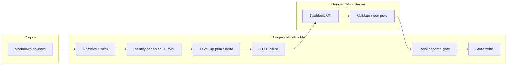

# Design: Lysandra statblock vertical slice — stepped benchmark with gates

**Status:** Draft (implementation not locked)  
**Scope:** DungeonMindBuddy corpus + retrieval path, optional synthesis, DungeonMindServer StatblockGenerator (or successor HTTP surface), and a durable **store** record.  
**Primary NPC:** Captain Lysandra Ironveil (corpus naming; avoid alternate spellings in fixtures).

---

## 1. Executive summary

We define an end-to-end **vertical slice benchmark** whose **aggregate pass** means:

1. The pipeline **grounded** itself on the latest agreed campaign corpus (session-scoped policy below).
2. It **resolved** which in-corpus representation of Lysandra’s statblock is **canonical** for “current sheet before level up.”
3. It **derived** a **target level** (or explicit level delta) with evidence tied to corpus text.
4. It produced a **level-up mechanical description** (and/or structured intermediate) suitable for the statblock service.
5. It called the **real StatblockGenerator HTTP contract** (or a **contract-identical mock** in CI) and received a **structured** creature payload.
6. That payload passed **schema validation** and **legality validation** (rules-aware checks on the server or a shared validator).
7. A **store** accepted the object **once**, with **provenance** (sources, request ids, schema version), and the benchmark verifier **read it back** and confirmed equality (or semantic equivalence) to the gated result.

Until all step gates pass, the benchmark **fails**; partial progress is reported **per step** for debugging.

---

## 2. Success criterion (single sentence)

**Benchmark pass** iff a **received, validated, legal** structured statblock for Captain Lysandra Ironveil **after level up** is **persisted** in the configured store and **re-read** within the benchmark with **no gate violations** on the stored object.

---

## 3. Definitions

| Term                              | Meaning                                                                                                                                                                                                                                                                                            |
| --------------------------------- | -------------------------------------------------------------------------------------------------------------------------------------------------------------------------------------------------------------------------------------------------------------------------------------------------- |
| **Grounding corpus**              | `corpus/eldyrwild-markdown/` (or successor root) with a **pinned fingerprint** (hash of relevant subtree or full corpus per existing planner practice).                                                                                                                                            |
| **Canonical pre-level statblock** | The single authoritative prior sheet **selected by policy** (Section 4), not merely the first search hit.                                                                                                                                                                                          |
| **Structured object**             | JSON (or equivalent) matching a **versioned schema** (e.g. `statblock_project.state.statblock` shape or a narrowed **NPC export** schema agreed with StatblockGenerator). Markdown alone is **not** sufficient for final success.                                                                  |
| **Valid**                         | Parses against the JSON schema for the agreed `schema_version`.                                                                                                                                                                                                                                    |
| **Legal**                         | Passes deterministic **5e legality** checks appropriate to the data we send (class/level bounds, proficiency bonus consistency, skill cap rules, etc.). Exact rule depth is a **product knob**; the design requires a **named** legality profile (e.g. `legality_profile: "npc_sheet_v1_strict"`). |
| **Level up**                      | Monotonic increase in character level (or explicit “add N class levels” to a defined multiclass) **justified** by a corpus-attested event or an explicit **benchmark-injected** scenario note (see Section 8).                                                                                     |

---

## 4. Canonical sheet policy (must be fixed before Step 2 gates)

Retrieval cannot define “most recent” without a **policy object**. The benchmark loads a **gold policy file** (committed JSON/YAML), e.g. `evals/lysandra_vertical_slice/gold/corpus_policy.json`:

Suggested fields:

- `entity_primary_names`: `["Captain Lysandra Ironveil", "Lysandra Ironveil", …]`  
- `statblock_candidate_globs` or explicit `candidate_paths[]` (maintainer-curated inventory of every file that might contain a statblock).  
- `recency_key`: one of `path_session_number`, `git_mtime`, `frontmatter_updated`, `explicit_rank_order`.  
- `canonical_path`: optional override if policy is “always this file regardless of others.”  
- `session_anchor`: path or id of the **latest session recap or prep** that bounds “current campaign moment” for this slice.

**Gate 2** (below) asserts the selected canonical path **equals** `gold.canonical_path` **or** matches `gold.selection_rule` evaluated deterministically on the candidate set.

---

## 5. Pipeline overview

---

## 6. Steps and gates

Each step produces a **structured trace record** (`step_id`, `inputs_sig`, `outputs_sig`, `latency_ms`, `gate_results[]`). A step **fails closed**: later steps **do not run** unless earlier steps pass (or are explicitly marked optional in the manifest; default is strict).

### Step 0 — Environment and corpus pin

| Gate ID | Predicate                                                                                                                                                         |
| ------- | ----------------------------------------------------------------------------------------------------------------------------------------------------------------- |
| `G0.1`  | Corpus root exists and matches `gold.corpus_root` (or env override documented).                                                                                   |
| `G0.2`  | `corpus_fingerprint` matches `gold.expected_fingerprint` **or** benchmark run documents `allow_fingerprint_drift: true` with explicit waiver (default **false**). |
| `G0.3`  | Required env for live server (`DUNGEONMIND_STATBLOCK_URL`, API key if required) present **or** run mode is `mock_statblock_server` with fixture path set.         |

### Step 1 — Retrieval (recall + grounding)

**Inputs:** Query pack from gold (keywords, entity id if graph-backed, optional embedding seed).  
**Outputs:** Ranked list of `{path, score, spans}` (minimum: ordered paths).

| Gate ID | Predicate                                                                                                                      |
| ------- | ------------------------------------------------------------------------------------------------------------------------------ |
| `G1.1`  | `gold.required_paths_retrieved` ⊆ top-`K` paths (set inclusion).                                                               |
| `G1.2`  | Canonical path from Step 2’s **deterministic** selector is in the retrieved candidate set (or in top-`K` if policy uses rank). |
| `G1.3`  | No retrieved path is outside corpus roots (`Elderwyld/`, `Longmont Campaign/`).                                                |

### Step 2 — Identify canonical pre-level statblock

**Inputs:** Step 1 candidate set + `corpus_policy.json`.  
**Outputs:** `canonical_path`, `extracted_markdown` or `extracted_section_span`, `selection_reason` (machine-readable).

| Gate ID | Predicate                                                                                                                                                    |
| ------- | ------------------------------------------------------------------------------------------------------------------------------------------------------------ |
| `G2.1`  | Selected `canonical_path` matches gold policy (`canonical_path` or deterministic rule).                                                                      |
| `G2.2`  | Extracted content contains **required markers** from gold (e.g. creature name line, `Armor Class`, `Hit Points`, or structured block delimiters if present). |
| `G2.3`  | **Single** selection: selector does not return ties without a documented tie-break; if ties, fail with diagnostic.                                           |

### Step 3 — Identify current level (pre-level-up)

**Inputs:** Canonical content (and optionally recap text from `session_anchor`).  
**Outputs:** `pre_level: int`, `evidence_spans[]` (path + char offsets or quoted snippets).

| Gate ID | Predicate                                                                                                                                                      |
| ------- | -------------------------------------------------------------------------------------------------------------------------------------------------------------- |
| `G3.1`  | `pre_level == gold.pre_level` (gold is source of truth for benchmark v1).                                                                                      |
| `G3.2`  | Evidence spans resolve to **verbatim** substrings in corpus files (substring check).                                                                           |
| `G3.3`  | If level absent from statblock, fallback rule documented in gold (e.g. parse from recap) and gate asserts that rule was applied (`extraction_method` matches). |

### Step 4 — Level-up specification

**Inputs:** `pre_level`, gold `target_level` or `level_delta`, optional narrative constraint text from corpus.  
**Outputs:** `target_level`, `description_for_statblock` (rich text per existing planner tool expectations) **or** structured `level_up_request` if server accepts JSON body.

| Gate ID | Predicate                                                                                                                                                                                    |
| ------- | -------------------------------------------------------------------------------------------------------------------------------------------------------------------------------------------- |
| `G4.1`  | `target_level > pre_level` and within `gold.max_level` / system caps.                                                                                                                        |
| `G4.2`  | Description includes **only** claims supported by allowed corpus paths (automated check: proper nouns / numbers whitelist or LLM-judge **disabled** for v1; prefer deterministic templates). |
| `G4.3`  | If structured intermediate exists, it validates against `schemas/level_up_request_v*.json`.                                                                                                  |

### Step 5 — Statblock service call (DungeonMindServer)

**Inputs:** Request body per **Versioned API contract** (Section 7).  
**Outputs:** HTTP status, JSON body, timing, raw body hash.

| Gate ID | Predicate                                                                                                              |
| ------- | ---------------------------------------------------------------------------------------------------------------------- |
| `G5.1`  | HTTP 2xx within timeout.                                                                                               |
| `G5.2`  | Response JSON parses and contains a **designated** structured key path (e.g. `statblock` object, not only `markdown`). |
| `G5.3`  | Server returns `schema_version` matching supported set **or** client maps known versions.                              |

### Step 6 — Shape validation (client or shared package)

**Inputs:** Parsed JSON from Step 5.  
**Outputs:** `StatblockStructured` model instance (Pydantic or equivalent).

| Gate ID | Predicate                                                                                                                                                   |
| ------- | ----------------------------------------------------------------------------------------------------------------------------------------------------------- |
| `G6.1`  | JSON Schema / Pydantic validation passes for `schema_version`.                                                                                              |
| `G6.2`  | Required fields for Lysandra present (`name` matches gold canonical name pattern, `level` or class-level structure equals `target_level` per schema rules). |
| `G6.3`  | No unknown top-level keys beyond allowed extension bag (if you allow `x_` extras).                                                                          |

### Step 7 — Legality validation (rules)

**Inputs:** Structured object from Step 6.  
**Outputs:** `legality_report` (`pass`, `violations[]`).

| Gate ID | Predicate                                                                                                                               |
| ------- | --------------------------------------------------------------------------------------------------------------------------------------- |
| `G7.1`  | `legality_report.pass == true` for `legality_profile` from gold.                                                                        |
| `G7.2`  | If server performs legality, duplicate check on client is optional but recommended with **same** golden violations list for regression. |

*Implementation note:* Prefer StatblockGenerator’s existing or planned `**/validate`** + `**/compute**` style endpoints so “legal” is not defined only by an LLM rubric.

### Step 8 — Store write and read-back

**Inputs:** Validated structured object + provenance blob.  
**Outputs:** `store_id`, round-trip object.

| Gate ID | Predicate                                                                                                                                                                                   |
| ------- | ------------------------------------------------------------------------------------------------------------------------------------------------------------------------------------------- |
| `G8.1`  | Write succeeds exactly once (idempotent write key = `gold.run_key` or content hash).                                                                                                        |
| `G8.2`  | Read-back returns bytes that validate identically to Step 6 output (**or** canonical JSON equality after normalization).                                                                    |
| `G8.3`  | Stored provenance includes at least: `canonical_path`, `corpus_fingerprint`, `pre_level`, `target_level`, `statblock_request_id`, `schema_version`, `legality_profile`, `pipeline_version`. |

---

## 7. API contract (Buddy ↔ StatblockGenerator) — design placeholders

Today Buddy’s planner path accepts flexible JSON keys (`statblock`, `markdown`, `text`, `content`). **This benchmark requires a stricter contract** for success:

| Concern      | Requirement                                                                                                                                                                   |
| ------------ | ----------------------------------------------------------------------------------------------------------------------------------------------------------------------------- |
| **Request**  | Versioned POST body, e.g. `{ "schema_version": "…", "creature_name": "…", "description": "…", "prior_statblock": {…} optional, "target_level": N, "legality_profile": "…" }`. |
| **Response** | Must include **structured** statblock JSON under a fixed key (e.g. `statblock_json`) **in addition to** optional Markdown for human display.                                  |
| **Errors**   | Non-2xx returns JSON `{ "error_code", "message", "details" }` without silent partial success.                                                                                 |
| **Auth**     | Align with `DUNGEONMIND_STATBLOCK_API_KEY` or service-specific scheme; document in contract.                                                                                  |

StatblockGenerator **rework** (out of scope for this doc’s implementation, in scope for **dependency**): add or extend endpoints so the benchmark does not depend on scraping Markdown for the final stored object.

---

## 8. Gold data and versioning

| Artifact                     | Role                                                     |
| ---------------------------- | -------------------------------------------------------- |
| `gold/corpus_policy.json`    | Canonical path selection, aliases, session anchor.       |
| `gold/expected_levels.json`  | `pre_level`, `target_level`, extraction method.          |
| `gold/required_paths.json`   | Sets for Step 1–2 gates.                                 |
| `gold/legality_fixture.json` | Optional: known violation cases for negative tests.      |
| `gold/README.md`             | How to refresh gold when corpus changes (human process). |

When campaign text changes, **gates fail until gold is updated**; that is intentional (prevents silent drift).

---

## 9. Benchmark harness behavior

- **Modes:** `live` (hits real server), `mock` (fixture JSON for Step 5–7), `corpus_only` (Steps 0–4 only).  
- **Reporting:** Machine-readable `run_report.json` + optional `run_report.md` with per-gate pass/fail and excerpts (no secrets).  
- **Aggregate pass:** `all(G0…G8)` for selected mode.  
- **CI default:** `mock` for Steps 5–7; nightly optional `live`.

---

## 10. Risks and mitigations

| Risk                                 | Mitigation                                                                                 |
| ------------------------------------ | ------------------------------------------------------------------------------------------ |
| Multiple statblocks, ambiguous canon | Gold `corpus_policy` + explicit `G2.1`.                                                    |
| Level not in statblock text          | Gold documents fallback; `G3.3`.                                                           |
| LLM invents mechanics                | Prefer server `/validate` + deterministic compute; constrain Step 4 output template in v1. |
| Schema drift between services        | Shared `schema_version` + contract tests in both repos.                                    |
| Flaky retrieval                      | Deterministic reranker or fixed candidate set mode for benchmark v1.                       |
| Illegal but valid JSON               | `G7.`* legality profile; never skip.                                                       |

---

## 11. Open questions (to lock before implementation)

1. **Final JSON schema:** StatblockGenerator project state vs a slim **NPC export** schema?
2. **Multiclass / NPC “levels”:** Do we use CR + spellcaster level, or true class levels only?
3. **Store backend:** Local JSON under `out/`, SQLite, or Firestore namespace; who owns writes in CI?
4. **Who runs legality:** Server only, client duplicate, or both?
5. **Copyright:** SRD-safe output requirement vs full homebrew names in traits?

---

## 12. Implementation phases (suggested)

1. **Gold pack + Step 0** (implemented): corpus survey, `gold/corpus_policy.json`, `gold/step0_environment.json`, `evals/lysandra_vertical_slice/step0_corpus_environment.py` + `tests/test_lysandra_vertical_slice_step0.py`. **Step 1–2** next: retrieval + canonical selection gates.
2. **Step 3–4** with frozen gold levels and templated level-up description.
3. **Contract + mock server** for Steps 5–7 (schema + legality fixtures).
4. **StatblockGenerator** changes for structured response + validate/compute.
5. **Step 8** store + read-back + full integration gate.
6. **Optional:** planner or CLI entrypoint that runs the full pipeline for human demos.

---

## 13. Related documents and code

- Planner statblock HTTP expectations: `src/agent/planner.py` (`_generate_statblock_http`).  
- Stepped eval pattern: `evals/planner_slice/live_eval.py`, `evals/planner_slice/EVAL_DEFINITION.md`.  
- Engineering triad reference: workspace `QUICK-REFERENCE-DungeonMind.mdc` (`/constraints` → `/validate` → `/compute` pattern for rules-heavy generators).  
- **Corpus survey + Step 0 gold:** `evals/lysandra_vertical_slice/SURVEY-captain_lysandra_corpus.md`, `evals/lysandra_vertical_slice/README.md`.

---

**Document owner:** DungeonMindBuddy / vertical slice workstream.  
**Next action:** Lock Open Questions §11.1–11.3; implement **Step 1** retrieval gate using `gold/corpus_policy.json` aliases + `required_paths` from the survey inventory; add an authored statblock path when ready (`canonical_statblock_relpath`).