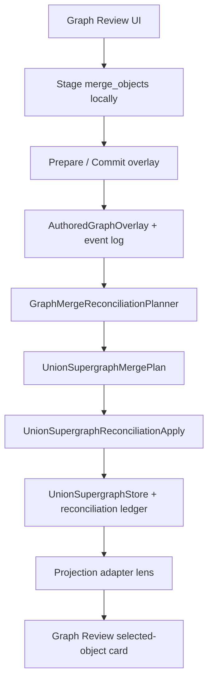

# HANDOFF — A10m Implement authored merge reconciliation into union supergraph

> Historical note: This handoff captures the pre-PR #305 implementation plan, including an explicit-pass reconciliation assumption that is no longer the default operator path. Current architecture: `Docs/Reports/SPIKE-CLOSEOUT-graph-review-authored-memory-2026-07.md`.

**Created:** 2026-07-08  
**Repo:** `Drakosfire/DungeonMindBuddy`  
**Design PR:** docs-only slice on `codex/design-a10m-union-supergraph-merge-reconciliation`  
**Target base:** `main` (after PR #296)  
**Suggested implementation branch:** `codex/a10m-union-identity-redirect-model` (PR A first)  
**Mode:** implementation handoff — **no code in the design PR**; coding PRs follow this doc.

---

## 0. Pickup prompt (implementer)

```markdown
You are implementing A10m for DungeonMindBuddy Graph Memory.

A10i–A10l proved the authored overlay merge workflow (search, canonical/duplicate
selection, stage, commit, projection-time collapse/hydration). PR #296 locked
GM-chosen survivor ids at staging time.

A10m materializes committed `merge_objects` assertions into durable
union-supergraph identity so projections stop relying on runtime fuzzy repair.

Resolved decisions (do not re-litigate):
1. GM-chosen survivor always wins.
2. Reconciliation is a separate pass/job after overlay commit — not inside commit.
3. Scope is `merge_objects` only. No `link_existing` durable materialization.
4. Retract/undo is follow-up; event model must leave room for it.
5. No corpus markdown mutation, no hard delete of evidence or merged-away provenance.

Start with PR A (identity redirect model + lookup tests). Do not jump to
projection adapter simplification before apply + dogfood pass.
```

---

## 1. Problem statement

### Today

```text
GM stages merge_objects → prepare/commit → AuthoredGraphOverlay + event log
  → graph_authoring_overlay_projection.py builds merge map at reload
  → survivor hydrates from merged-away evidence (fuzzy id repair allowed)
```

Parallel identities can persist in the union read model:

- `party:captain_lysandra_ironveil` (party registry anchor)
- `character_lysandra` (ingest projection node)
- `node:lysandra` (legacy ingest candidate id)

Projection glue can make the **view** look merged; the **durable graph** does not.

### Target

```text
GM stages merge_objects → prepare/commit (unchanged)
  → reconciliation pass reads committed merge_objects assertions
  → writes durable union identity redirects + survivor hydration + edge rewiring
  → projection adapter reads reconciled union + thin overlay for unmaterialized assertions
```

Identity cleanup becomes graph memory, not projection patchwork.

---

## 2. Resolved product decisions

| Decision | Rule |
|---|---|
| Survivor authority | **GM-chosen survivor ref from workbench is authoritative.** Rich ingest nodes contribute evidence/adjacency/summary material; they do not replace the survivor id. |
| Commit boundary | Overlay commit writes assertions + event log only. **No union store mutation in commit.** |
| Reconciliation trigger | Explicit pass/job (CLI or server endpoint first). Not background automation in v1. |
| Scope | **`merge_objects` only.** `link_existing` recap alias materialization is a later slice. |
| Undo | Not implemented in first coding wave. State must support future `retract_merge_objects`. |
| Deletion | No hard delete of corpus prose, evidence refs, or original edge provenance. |

---

## 3. Non-goals (A10m)

- `link_existing` alias materialization into union store
- Automatic / LLM identity merge
- Fuzzy matching policy expansion beyond existing overlay projection bridge
- Editable recap / corpus markdown writes
- Hard deletion of merged-away nodes or evidence
- Full retract/undo implementation
- Existing Object workbench UI redesign
- Relationship picker polish (separate READY backlog item)

---

## 4. Architecture

### 4.1 Layers (unchanged vs new)



### 4.2 Overlay commit — keep unchanged

`graph_object_authoring_commit.py` continues to:

- validate overlay token
- append `AuthoredGraphMergeObjectsAssertion` records (`status: authored`)
- append graph authoring event log entries
- backup prior overlay file

**Must not:** mutate `preview_union_store.json`, live ingest artifacts, corpus markdown, or candidate graph gold.

### 4.3 Reconciliation pass — new

**Recommended v1 trigger:** explicit server endpoint + developer CLI wrapper.

```text
POST /api/live/graph-authoring/reconcile-merge-objects
  or
python -m graph_memory.union_supergraph.reconcile_merge_objects --campaign-id ... --union-store-path ...
```

**Inputs:**

- committed authored overlay (`merge_objects` assertions with `status == "authored"`)
- current `UnionSupergraphStore` (file-backed v0)
- optional focus session id for diagnostics

**Outputs:**

- updated union store (or sidecar reconciliation artifact in PR A–B before write)
- reconciliation event ledger entry
- diagnostics (conflicts, skipped assertions, hydrated evidence counts)

**Not in v1:** automatic post-commit hook, background queue, or silent apply on projection reload.

### 4.4 Relationship to overlay projection

Until reconciliation runs, **existing** `graph_authoring_overlay_projection.py` merge behavior remains the bridge for unmaterialized assertions.

After reconciliation materializes an assertion:

- overlay assertion stays in overlay (audit trail)
- union store holds durable redirects
- projection adapter prefers union redirects; overlay merge map applies only to **unmaterialized** assertions

This allows incremental dogfood: commit → reconcile one campaign → verify → simplify projection glue in PR D.

---

## 5. Data model

### 5.1 Terminology

| Term | Meaning |
|---|---|
| **Survivor** | Canonical node id chosen by GM (`party:captain_lysandra_ironveil`) |
| **Merged-away id** | Old graph node id collapsed into survivor (`node:lysandra`, `character_lysandra`) |
| **Identity redirect** | Durable mapping `from_node_id → to_node_id` (not recap text alias) |
| **Text alias** | Human label on survivor node (`aliases: ["Lysandra"]`) — separate concern |

Do **not** overload `UnionSupergraphStore.aliases: dict[str, str]` for identity redirects without schema clarity. That field today is populated by preview import with mixed semantics. A10m introduces an explicit redirect table.

### 5.2 Proposed: `UnionIdentityRedirect`

Add to union supergraph store (new top-level key `identity_redirects`):

```python
class UnionIdentityRedirect(BaseModel):
    redirect_id: str                    # stable id, e.g. hash(assertion_id, from_node_id)
    campaign_id: str
    from_node_id: str                   # node:lysandra
    to_node_id: str                     # party:captain_lysandra_ironveil (survivor)
    assertion_id: str                   # authored merge assertion
    event_id: str | None                # graph authoring event log entry
    merge_reason: str | None
    created_at: str                     # ISO-8601
    status: Literal["active", "retracted"]
    materialization_pass_id: str        # reconciliation run id
```

**Lookup contract:**

```python
def resolve_union_node_id(node_id: str, redirects: Mapping[str, UnionIdentityRedirect]) -> str:
    """Transitive resolution; active redirects only; cycle-safe."""
```

Merged-away ids with `status: active` must not appear as normal nodes in projection output.

### 5.3 Proposed: `UnionSupergraphMergeRecord` (audit)

Per applied assertion:

```python
class UnionSupergraphMergeRecord(BaseModel):
    merge_record_id: str
    assertion_id: str
    survivor_node_id: str
    merged_away_node_ids: list[str]
    merged_away_original_refs: list[str]   # assertion ref ids before projection resolution
    evidence_ref_ids_unioned: list[str]
    edges_rewired_count: int
    edges_deduped_count: int
    aliases_unioned: list[str]
    applied_at: str
    status: Literal["applied", "retracted"]
```

Stored in `identity_merge_records: list[UnionSupergraphMergeRecord]` or sidecar ledger file in v0.

### 5.4 Survivor node materialization

After apply:

- **Survivor node remains** at GM-chosen id in `nodes[survivor_id]`.
- If survivor was external to ingest (`party:*`), **create or enrich** union node entry:
  - union text `aliases` += merged-away labels (per `alias_policy: preserve_all_aliases`)
  - `evidence_ref_ids` += merged-away evidence (deduped)
  - `source_domains` unioned
- Merged-away node entries move to **non-projectable** state:
  - remove from `nodes` active projection set, **or**
  - keep with `state.memory_state = "merged_away"` + redirect (preferred for retract replay)

**Recommended v1:** keep merged-away node stubs with `memory_state: merged_away` and `merged_into: survivor_id` for audit; projection filters them out.

### 5.5 Edge rewiring

**Rule:** materialize effective edges in union read model; preserve provenance.

For each edge touching merged-away id `M` with survivor `S`:

1. Compute redirected endpoints: `M → S`.
2. If equivalent edge already exists on survivor (same predicate + other endpoint + direction family), **dedupe** — union evidence refs onto existing edge.
3. Else **create redirected edge** with new `edge_id` suffix or deterministic id (`edge:{S}:{predicate}:{T}:merged_from:{M}`).
4. Store provenance on edge state:

```python
edge.state["rewired_from_node_ids"] = ["node:lysandra"]
edge.state["merge_assertion_id"] = "..."
```

Do not delete original edge records from reconciliation ledger; mark inactive if superseded.

### 5.6 Evidence preservation

Policies from assertion (defaults already in overlay schema):

- `evidence_policy: preserve_all_evidence`
- `relationship_policy: preserve_all_relationships`
- `alias_policy: preserve_all_aliases`

**Lysandra acceptance shape:**

```text
party:captain_lysandra_ironveil shows:
  - party registry identity (label, kind, role)
  - recap evidence from node:lysandra / character_lysandra
  - adjacency from merged-away nodes
  - merge provenance badge (assertion_id, merged_away ids)
```

### 5.7 Markdown / dmb-node redirect

Redirects apply at three read points (implement incrementally):

1. **Union store** — merged-away ids filtered; redirects in lookup table.
2. **Projection adapter** — `dmb-node` link targets resolved through `resolve_union_node_id`.
3. **Overlay projection** — only for assertions not yet materialized.

After reconciliation, `node:lysandra` links in Session 23 recap markdown should open `party:captain_lysandra_ironveil`.

---

## 6. Reconciliation planner

### 6.1 `GraphMergeReconciliationPlanner`

**Location:** `src/graph_memory/union_supergraph/merge_reconciliation.py` (proposed)

**Input:**

- `AuthoredGraphOverlay`
- `UnionSupergraphStore`
- optional ingest projection node index (for hydration source lookup)

**Output:** `UnionSupergraphMergePlan`

```python
@dataclass
class UnionSupergraphMergePlan:
    campaign_id: str
    plans: list[MergeAssertionPlan]
    diagnostics: list[ReconciliationDiagnostic]

@dataclass
class MergeAssertionPlan:
    assertion_id: str
    survivor_node_id: str              # from assertion ref node_id — authoritative
    merged_away_node_ids: list[str]    # resolved projection ids + original ref ids
    redirects: list[UnionIdentityRedirect]
    evidence_to_union: list[str]
    edges_to_rewire: list[EdgeRewireOp]
    aliases_to_union: list[str]
    survivor_hydration: SurvivorHydrationPatch | None
```

### 6.2 Validation rules

| Check | On failure |
|---|---|
| Survivor ref present | diagnostic error; skip assertion |
| ≥1 merged-away ref | diagnostic error; skip assertion |
| Survivor ∉ merged-away set | diagnostic error; skip assertion |
| No active redirect targets survivor as merged-away | diagnostic warning |
| Merged-away id not already redirected to different survivor | diagnostic error (conflict) |
| Transitive merge chains | flatten to ultimate survivor |

**Survivor resolution:** use `survivor_object_ref.node_id` exactly. Do **not** fuzzy-resolve survivor to richer projection node (matches PR #296 frontend rule).

**Merged-away resolution:** may map assertion ref to projection node id (e.g. `node:lysandra` → `character_lysandra`) for hydration **only**; both ids get redirects to survivor.

### 6.3 Conflicts

If `node:lysandra` already redirects to `character_foo` and new assertion says survivor `party:lysandra`, emit `hard_conflict` diagnostic; do not apply assertion without GM retract or supersede flow (future).

---

## 7. Reconciliation apply

### 7.1 `UnionSupergraphReconciliationApply`

**Writes:**

1. Append/update `identity_redirects`
2. Append `identity_merge_records`
3. Patch survivor node (evidence, aliases, summary)
4. Mark merged-away nodes `memory_state: merged_away`
5. Rewire edges per plan
6. Rebuild `adjacency` index for affected nodes
7. Append reconciliation event:

```python
class UnionReconciliationEvent(BaseModel):
    event_kind: Literal["merge_objects_applied"]
    materialization_pass_id: str
    campaign_id: str
    assertion_ids: list[str]
    applied_at: str
    operator: str | None  # future
```

**File layout v0:** update `preview_union_store.json` in campaign graph ingest artifact dir, with timestamped backup (mirror overlay commit backup pattern).

### 7.2 Idempotency

Re-running reconciliation for same assertion id:

- if `identity_merge_records` contains `assertion_id` with `status: applied` → skip (diagnostic info)
- replan from scratch allowed in dev CLI with `--force` (not product default)

---

## 8. Replay and re-ingest

### 8.1 Invariant

```text
Any node id with an active identity redirect must resolve to canonical survivor
before union read model and projection output.
```

### 8.2 Pipeline hook points (ordered)

1. **Preview union import** (`preview_import.py`) — after candidate nodes materialized, consult active redirects; collapse duplicates before store write.
2. **Union store load** — build redirect index.
3. **Projection adapter** — resolve node ids on read.

Raw extraction may still emit `node:lysandra` internally; union/projection must not surface it as a separate normal node after reconciliation.

### 8.3 Diagnostics on collision

When ingest creates a node id matching active `from_node_id`:

```text
diagnostic: identity_redirect_absorbed
  from_node_id: node:lysandra
  to_node_id: party:captain_lysandra_ironveil
  assertion_id: ...
```

---

## 9. Future retract hook (design only)

### 9.1 Future assertion kind

```text
retract_merge_objects
  target_assertion_id: <original merge assertion>
  reason: ...
```

### 9.2 Data required now

Store enough to replay:

- full `MergeAssertionPlan` snapshot in `identity_merge_records`
- edge rewire ops with before/after endpoints
- redirect records with `status` field (retracted, not deleted)
- merged-away node stubs retained

### 9.3 Retract behavior (future)

- mark redirects `retracted`
- mark merge record `retracted`
- restore merged-away nodes to projectable state (if stubs kept)
- reverse edge rewire using stored ops
- overlay assertion status → `retracted` (separate slice)

---

## 10. Implementation PR sequence

### PR A — Union identity redirect model

**Branch:** `codex/a10m-union-identity-redirect-model`  
**Scope:**

- Add `UnionIdentityRedirect`, `UnionSupergraphMergeRecord` to `src/graph_memory/union_supergraph/model.py`
- Add `resolve_union_node_id` + transitive lookup in `src/graph_memory/identity/` or `union_supergraph/redirects.py`
- Extend store load/validate for new keys (backward compatible — empty defaults)
- Tests: redirect lookup, transitive chain, cycle safety, retracted ignored

**No UI. No overlay changes. No apply.**

### PR B — Reconciliation planner

**Scope:**

- `GraphMergeReconciliationPlanner` reads overlay + union store
- Builds `UnionSupergraphMergePlan`
- Validates conflicts; survivor id exact match
- Tests: Lysandra fixture (party survivor + node:lysandra merged-away), conflict cases

**No writes.**

### PR C — Reconciliation apply

**Scope:**

- Apply plan to union store file
- Edge rewire + evidence union + node state `merged_away`
- Reconciliation event ledger
- Server endpoint or CLI entry point
- Tests: round-trip store mutation on fixture

### PR D — Projection adapter simplification

**Scope:**

- Union projection adapter consults `identity_redirects` first
- Overlay merge map only for assertions without `identity_merge_records`
- Reduce fuzzy repair paths where redirect exists
- Tests: Session 23 projection payload uses survivor id

### PR E — Dogfood / Session 23 validation

**Manual script:**

1. Commit Lysandra merge via Graph Review (party survivor ← node:lysandra)
2. Run reconciliation pass
3. Reload Session 23 graph review
4. Click survivor — evidence, adjacency, summary present
5. Confirm `node:lysandra` / `character_lysandra` not normal selectable nodes
6. Re-run graph extraction — duplicate not resurrected in projection

---

## 11. User story validation

| Story | Design answer |
|---|---|
| GM survivor persists | `survivor_node_id` in plan = assertion `survivor_object_ref.node_id`; union `nodes[survivor_id]` is canonical |
| Rich ingest hydrates survivor | planner copies evidence/adjacency/summary from resolved merged-away projection nodes onto survivor patch |
| Old ids redirect | `identity_redirects` + projection adapter link resolution |
| Re-ingest no duplicate | preview import + load-time redirect absorption |
| Audit trail | `identity_merge_records` + overlay assertion + event log + edge `rewired_from_node_ids` |
| Future undo | retract marks redirects inactive; merge record stores rewiring ops |

---

## 12. Files to touch (by PR)

```text
PR A:
  src/graph_memory/union_supergraph/model.py
  src/graph_memory/union_supergraph/load.py
  src/graph_memory/union_supergraph/validate.py
  src/graph_memory/union_supergraph/redirects.py          # new
  tests/test_graph_memory_union_identity_redirects.py     # new

PR B:
  src/graph_memory/union_supergraph/merge_reconciliation.py  # new
  tests/test_graph_memory_merge_reconciliation_planner.py  # new

PR C:
  src/graph_memory/union_supergraph/merge_reconciliation_apply.py  # new
  apps/live_control_server/routes/graph_authoring.py                 # endpoint
  apps/live_control_server/services/graph_merge_reconciliation.py  # new
  tests/test_graph_memory_merge_reconciliation_apply.py

PR D:
  apps/live_control_server/services/graph_authoring_overlay_projection.py
  apps/live_control_server/services/union_supergraph_projection_adapter.py
  tests/test_graph_authoring_overlay_projection_merge.py
  tests/test_live_union_supergraph_projection_api.py

PR E:
  Docs/Reports/DOGFOOD-a10m-lysandra-union-reconciliation.md  # new manual report
```

**Read-only context:**

- `apps/live_control_server/models/graph_authoring_overlay.py` — `AuthoredGraphMergeObjectsAssertion`
- `apps/live_control_server/services/graph_object_authoring_commit.py`
- `apps/live-control-ui/.../graphExistingObjectIdentityWorkbench.ts` — survivor id preservation
- `tests/test_graph_authoring_overlay_projection_merge.py` — Lysandra hydration tests

---

## 13. Acceptance criteria (implementation complete)

- [ ] Committed `merge_objects` assertion reconciles into union store without overlay commit changes
- [ ] GM-chosen survivor id (`party:captain_lysandra_ironveil`) remains canonical after reconciliation
- [ ] Merged-away ids have active redirects; not shown as normal projection nodes
- [ ] Survivor selected-object card shows merged evidence, adjacency, summary
- [ ] `dmb-node` links to merged-away ids open survivor
- [ ] Reconciliation is idempotent and auditable (merge records + events)
- [ ] Re-ingest does not resurrect merged-away id as separate normal node
- [ ] `link_existing` materialization explicitly out of scope
- [ ] Retract hook data present; retract not required to ship A10m

---

## 14. Design judgment

A10m is where identity cleanup graduates from projection glue to durable graph memory.

Keep the first implementation wave narrow:

```text
merge_objects only
GM-chosen survivor wins
separate reconciliation pass
durable identity redirects (not text aliases)
edge/evidence preservation with provenance
replayable / auditable state
retract-ready, not retract-implemented
```

Projection-time fuzzy repair becomes a bridge for **unmaterialized** assertions only, then shrinks as reconciliation coverage grows.
