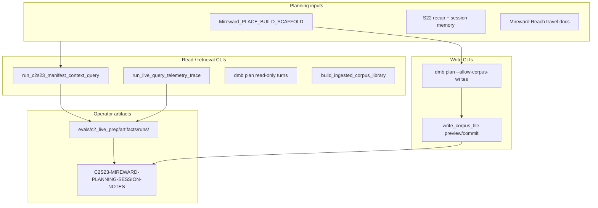

# HANDOFF — C2S23 Mireward planning (Cursor-first, CLI-backed)

**Created:** 2026-06-02 (UTC).  
**Status:** ACTIVE — dispatch to a fresh Cursor agent with zero prior chat context.  
**Operator constraint:** Out of table time; planning happens **in Cursor** with **living notes**, not as a full live-control dogfood round.  
**Parent context:** Hub+world retrieval on `main`; Mireward write allowlist landed (`0a5c4ed`); Session 22 play canon ingested.

### Document map (read both)

| Role | Document |
|------|----------|
| **Dispatch / CLI execution** (this file) | `Docs/Plans/HANDOFF-c2s23-mireward-planning-cursor-first.md` |
| **Living session notes** (update each step) | [`Docs/Plans/C2S23-MIREWARD-PLANNING-SESSION-NOTES.md`](C2S23-MIREWARD-PLANNING-SESSION-NOTES.md) |
| **Prior re-anchor (retrieval landed)** | [`Docs/Plans/HANDOFF-self-continuity-2026-06-02-c2s23-hub-world-dogfood.md`](HANDOFF-self-continuity-2026-06-02-c2s23-hub-world-dogfood.md) |
| **Capability truth** | [`Docs/Plans/CAPABILITY-INVENTORY-c2s23-planning-artifact-actions.md`](CAPABILITY-INVENTORY-c2s23-planning-artifact-actions.md) |
| **Location hub convention** | [`Docs/CONVENTION-Location-Hub.md`](../CONVENTION-Location-Hub.md) |
| **Mireward scaffold (read, do not treat as canon)** | `corpus/eldyrwild-markdown/Elderwyld/Cities and Towns/Mireward/Mireward_PLACE_BUILD_SCAFFOLD.md` |
| **Promotion target shape** | `corpus/eldyrwild-markdown/Elderwyld/Cities and Towns/Mossford/` |

**How to use the pair:** run planning from **this HANDOFF**; record decisions, packets, writes, and friction in **session notes**. Do not treat chat history as canonical.

---

## §0 Re-anchor (read first every session)

| Field | Value |
|-------|--------|
| **Campaign** | Longmont Campaign 2 (`longmont-c2`) |
| **Planning target** | **Session 23** — party north on Mireward Reach; **Mireward** is the primary location build surface |
| **Agent surface** | **Cursor** (Read, Grep, SymDex) + **CLI harnesses** below — primary for this handoff |
| **Write surface** | Cursor agent driving `write_corpus_file` via `dmb plan --allow-corpus-writes` **or** autonomous preview/commit in agent tool loop — **not** Live Control UI (still missing) |
| **Retrieval surface** | `run_c2s23_manifest_context_query.py` + optional `run_live_query_telemetry_trace.py` — review packets **before** synthesizing prep |
| **Last green (writer)** | `0a5c4ed` — Mireward hub allowlist in `src/agent/corpus_writer.py` |
| **Last green (retrieval)** | `9f7ef87` — dogfood-full manifest, hub-world gold **10/10** |
| **S22 play canon** | `Session 22 - Mireward Road and Lysandro.md` + normalized / breadcrumbed / `_session_memory` family |
| **Mireward hub state** | README + large scaffold + `lysandro_ironveil/character_seed.md`; gazetteer + dossiers **pending** |

**Operator goals (ordered):**

1. **Ground** — read scaffold, S22 play canon, reach/travel context; run manifest queries on real S23 prep questions.
2. **Promote** — move **selected** scaffold sections into allowlisted Mireward hub files (preview → operator `apply` → commit).
3. **Plan** — draft Session 23 prep beats from promoted hub material + play canon; log open loops in session notes.
4. **Capture friction** — update session notes + capability inventory gaps for a future live-control dogfood pass.

**Explicit mode:** This is **Cursor-first planning**. It does **not** satisfy the full charter in `BENCHMARK-c2s23-dogfood-planning-charter.md` (which requires live-control surface use). Label outputs `DEGRADED: Cursor+CLI planning` in session notes so a later instrumented dogfood re-run can compare.

---

## §0.1 Operator pre-flight

Before the agent reads corpus or runs CLIs:

- [ ] Confirm `.env` / `.env.development` loads (`load_dungeonmindbuddy_dotenv` — do not export keys in shell history).
- [ ] Skim `CAPABILITY-INVENTORY` — know what is **supported** vs **missing** on Live UI.
- [ ] Open `C2S23-MIREWARD-PLANNING-SESSION-NOTES.md` and append Step 0 row.
- [ ] Prepare **3–8 natural-language Session 23 prep questions** (real GM asks). Examples:
  - "What does the party see when they reach Mireward's gate after S22?"
  - "Who runs day-to-day order in Mireward — garrison, council, or something else?"
  - "What Ironveil family beats are still open after Lysandro at the gate?"
  - "What prep hooks exist for swamp / fen travel north of town?"
- [ ] Decide promotion scope for this session (recommended: **one gazetteer skeleton + 1–2 dossiers**, not whole scaffold).

**Corpus writes:** always two-phase. Operator must see preview diff and reply **`apply`** before commit. See `.cursor/skills/recap-write/SKILL.md` pattern; location promotion uses same `write_corpus_file` contract.

**Do not:**

- Treat `Mireward_PLACE_BUILD_SCAFFOLD.md` as play canon.
- Treat S22 prep/runbook as proof of what happened (S22 **recap** is play canon).
- Paste multi-step runbooks into `user_message` / operator ask lines (discovery principle).

---

## §1 Mission

Build **Mireward** from partial hub + scaffold into a **Mossford-style** location package safe for Session 23 prep:

```text
scaffold (planning)  →  review  →  promote  →  gazetteer + dossiers + README index
S22 play canon       →  cite for gate/Lysandro/Ironveil facts only
S22 session memory   →  retrieval index for played beats
```

The agent **helps transform** scaffold material; it does **not** invent and commit a whole town in one shot.

---

## §2 CLI tooling map (use these, not chat memory)



| Tool | Command | When to use |
|------|---------|-------------|
| **Manifest query / admission** | `uv run python -m evals.c2_live_prep.run_c2s23_manifest_context_query --manifest evals/c2_live_prep/benchmarks/c2s23_dogfood_full_manifest.json --questions <path-or-inline> --output-dir evals/c2_live_prep/artifacts/runs/2026-06-02` | **Before** answering each prep question batch — produces reviewable context packets |
| **Packet eval (regression only)** | `uv run python -m evals.c2_live_prep.evaluate_c2s23_context_packets ...` | After harness runs — **not** as oracle during live planning |
| **Live query + LLM answer** | `DMB_C2S23_DOGFOOD_DEFAULTS=1 uv run python -m evals.c2_live_prep.run_live_query_telemetry_trace --question "..." --no-enhancement --output evals/c2_live_prep/artifacts/runs/2026-06-02/<name>.json` | When operator wants grounded **answer text** + trace (costs API) |
| **Planner dogfood batch** | `uv run python evals/c2_live_prep/run_c2s23_dogfood_planner.py --question-ids ... --limit N` | Batch planner turns on seed questions; artifacts under `artifacts/runs/` |
| **Planner REPL (interactive)** | `uv run python -m src.cli plan --allow-corpus-writes` | Operator-driven turns; write tools registered |
| **Corpus writer (agent tools)** | `write_corpus_file` via planner dispatcher | Mireward promotion — preview default |
| **Ingested corpus library** | `uv run python scripts/build_ingested_corpus_library.py` | Orientation / what's on disk (canvas optional) |
| **Recap ingest (if S22 incomplete)** | `uv run python -m src.live_play.recap_ingest_pipeline ...` | Only if derivatives missing — see RUNBOOK §2 |
| **Live workspace bootstrap** | `uv run python -m src.live_play.session_bootstrap ...` | Optional orientation; **not required** for this Cursor-first pass |

**Default manifest for retrieval:** `evals/c2_live_prep/benchmarks/c2s23_dogfood_full_manifest.json` (182 routes). Slim manifest remains regression path: `c2s23_planning_corpus_manifest.json`.

**Primary surface:** Cursor agent reads corpus + runs manifest query CLI + drives writes.  
**Secondary (optional):** Live Control UI for reads if server already running — do not block planning on UI.

---

## §3 Mireward write allowlist (landed `0a5c4ed`)

Planner / `write_corpus_file` **allowed** (preview → commit):

| Path pattern | Mode |
|--------------|------|
| `Elderwyld/Cities and Towns/Mireward/README.md` | append |
| `Elderwyld/Cities and Towns/Mireward/Mireward_Map_Key_and_Gazetteer.md` | create, append |
| `Elderwyld/Cities and Towns/Mireward/Mireward_Location_Dossiers/<safe_slug>.md` | create |
| `Elderwyld/Cities and Towns/Mireward/NPCs/<slug>/character_seed.md` | create (existing pattern) |
| `Elderwyld/Cities and Towns/Mireward/NPCs/<slug>/README.md` | create (existing city NPC pattern) |

**Denied by design:** scaffold file edits via writer, dossiers/statblocks outside allowlist, arbitrary `Cities and Towns/<OtherTown>/`, Session Recaps, session memory JSONL.

Implementation: `src/agent/corpus_writer.py`; tests: `tests/test_corpus_writer.py`.

---

## §4 Planning runbook (phases)

### Phase A — Orient (read-only)

1. Read hub `README.md` first, then scaffold (large — read in sections).
2. Read S22 play canon recap (not prep) for gate/Lysandro beats.
3. Read reach context: `mireward_reach_road_d100_encounter_table.md`, `Journey - Mireward Reach (Campaign 2).md`, `lysandra_ironveil_mireward_history.md`.
4. Skim Mossford hub as promotion target shape.
5. Log Step A in session notes.

### Phase B — Retrieve before synthesizing

For each operator prep question (or batch of 2–3 related asks):

```bash
# Single-question packet (create a small questions JSON or use seed subset)
uv run python -m evals.c2_live_prep.run_c2s23_manifest_context_query \
  --manifest evals/c2_live_prep/benchmarks/c2s23_dogfood_full_manifest.json \
  --questions evals/c2_live_prep/benchmarks/c2s23_dogfood_questions.seed.json \
  --output-dir evals/c2_live_prep/artifacts/runs/2026-06-02
```

Agent workflow:

1. Open emitted `c2s23_manifest_query_context_packet_<id>.json`.
2. Review `admitted_evidence`, `rejected_evidence`, `diagnostics`, role labels.
3. **Then** open full corpus files for admitted paths (README-first, statblock if mechanics).
4. Record packet path + roles in session notes § Retrieval packets reviewed.
5. Synthesize prep answer; cite admitted sources only for play facts.

Optional grounded answer (API cost):

```bash
DMB_C2S23_DOGFOOD_DEFAULTS=1 uv run python -m evals.c2_live_prep.run_live_query_telemetry_trace \
  --question "<operator question>" \
  --no-enhancement \
  --output evals/c2_live_prep/artifacts/runs/2026-06-02/live_query_<slug>.json
```

### Phase C — Promote scaffold → hub files

Recommended order:

1. **Gazetteer skeleton** — `Mireward_Map_Key_and_Gazetteer.md` (map key table + district stubs from scaffold § promotion checklist).
2. **First dossiers** — 1–2 high-table-value sites (gate district, market/refugee quarter, garrison — pick from scaffold).
3. **README append** — link new files in § Hub contents table + Suggested reads.
4. **NPC seeds** — only if prep questions require new faces; Lysandro seed already exists.

Write protocol (each file):

```text
write_corpus_file(path, mode=create|append, content=..., dry_run=true)
→ show operator unified diff
→ operator: apply
→ write_corpus_file(..., dry_run=false, confirm_token=...)
```

After each commit:

- Log path + scaffold § source in session notes § Authority ledger.
- Strike or mark promoted sections in scaffold **manually** (scaffold is not writer-allowlisted).

### Phase D — Session 23 prep brief

Deliverable (in session notes or operator doc — not auto-committed unless operator asks):

- **Next beats** at/near Mireward (3–5 bullets).
- **Open loops** from S22 (Ironveil, refugees, garrison, fen north).
- **Prep gaps** still missing from corpus.
- **Friction table** — what CLI did well vs what Live UI would have needed.

---

## §5 Authority rules (non-negotiable)

| Source | Role | Use for play facts? |
|--------|------|---------------------|
| S22 recap family | `canon_play` / `derived_memory` | **Yes** — gate, Lysandro, road beats |
| Mireward scaffold | `planning_scaffold` | **No** — design only until promoted |
| S22 prep / runbook | `planning_scaffold` | **No** |
| Reach d100 table | `reference_tool` | **No** — prep tool |
| Promoted gazetteer/dossiers | world `reference_tool` | **No** for retroactive play — yes for planning grounding |
| Live observations (if any) | `live_observation` | **No** for past-session facts |

---

## §6 Files in scope

| Allowlist | Path |
|-----------|------|
| Writer | `src/agent/corpus_writer.py`, `tests/test_corpus_writer.py` |
| Retrieval | `src/live_play/manifest_context_query.py`, `evals/c2_live_prep/run_c2s23_manifest_context_query.py` |
| Mireward corpus | `corpus/eldyrwild-markdown/Elderwyld/Cities and Towns/Mireward/**` |
| S22 canon | `corpus/.../Session Recaps/Session 22 - Mireward Road and Lysandro.md` (+ derivatives) |
| Notes | `Docs/Plans/C2S23-MIREWARD-PLANNING-SESSION-NOTES.md` |

**Out of scope for this handoff:**

- Wiring `write_corpus_file` through Live Control command bus (follow-up PR).
- Full live-control dogfood charter compliance.
- Generalizing write allowlist to all `Cities and Towns/**`.
- Auto-promoting entire scaffold.
- `live_query_turn.jsonl` persistence (backlog).

---

## §7 Verification commands

```bash
# Writer allowlist regression
uv run pytest tests/test_corpus_writer.py -q

# Manifest query unit suite
uv run pytest tests/test_manifest_context_query.py -q

# Hub-world cohort (deterministic — no API key)
uv run pytest tests/test_planning_corpus_manifest.py \
  tests/test_manifest_context_query.py tests/test_ingested_corpus_library.py -q

# After a promotion write — spot-check allowlist path still passes
uv run pytest tests/test_corpus_writer.py -k mireward -q
```

**Success signals for this planning pass:**

- At least one gazetteer or dossier file committed via two-phase writer.
- Session notes contain ≥3 retrieval packet reviews with admitted roles logged.
- Session 23 prep brief drafted with explicit source roles.
- No play-fact claims sourced from scaffold/prep alone.

---

## §9 Rubric (agent + operator)

1. **Retrieve before answer** — manifest packet reviewed; no grep-only prep for play-fact questions.
2. **Promote, don't inflate** — scaffold sections copied intentionally; scaffold not cited as canon.
3. **Two-phase writes** — no silent disk mutation; operator `apply` required.
4. **Notes are the audit trail** — chat is ephemeral; session notes hold packets, writes, friction.
5. **Truthful capabilities** — if Live UI would be needed, log as friction; do not pretend pane writes exist.

---

## §10 Open questions (decide in session)

1. Which scaffold §§ promote first — gate/apron vs refugee economy vs garrison festival?
2. How many dossiers minimum for S23 table (1 vs 3)?
3. Run live-query telemetry for every question or only manifest packets?
4. Schedule follow-up live-control dogfood after Mireward hub has gazetteer skeleton?

---

## §11 Worktree note (2026-06-02)

Uncommitted local changes may exist for Live UI manifest wiring (`liveApi.ts`, `live_packet.json`, `session_bootstrap.py`). **Not required** for this Cursor-first planning handoff. Merge or stash before a live-control dogfood pass.
