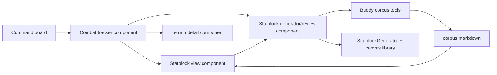

# Handoff: command-board combat + statblock generator design pass

**Status:** Design handoff for a main-branch design agent  
**Captured:** 2026-06-07  
**Reference merge:** PR #102, merge commit `17b162b` (`Add Mireward combat command board tracker`)  
**Primary goal:** Distill what live dogfooding taught us, then use it to revise the command-board combat surface and StatblockGenerator integration plan.

---

## 1. Why this handoff exists

The Mireward combat tracker was the first DungeonMindBuddy dogfood surface that felt materially helpful during live prep/play. The specific value was narrow and operational:

- active turn + next turn context was visible;
- HP/AC stayed in view;
- statblocks were one click away from combat rows;
- grouped enemies reduced table noise;
- local save/import/export kept at-table edits alive;
- the circular initiative barrel with virtual Top/Bottom of Round markers matched how the GM wanted to think.

The next design agent should not treat this as “a static HTML page to polish.” Treat it as evidence for the command board’s product shape: a live operational surface with fast drilldown into mechanics, canon, terrain, and generation.

---

## 2. Read these files first

### Dogfood product evidence

1. `Backlog.md`
   - Read the entry: **Command board — live combat drilldown proved useful at table**.
   - This is the distilled product lesson from the live session.

2. `evals/c2_live_prep/mireward-prep/combat.html`
   - Current combat tracker layout.
   - Pay attention to the visible columns and toolbar, not just markup:
     - `Move`
     - `Entity`
     - `Init`
     - `AC`
     - `HP`
     - `Damage / Heal`
     - `Notes`
   - This is the shape that worked: live row first, deeper information behind row links.

3. `evals/c2_live_prep/mireward-prep/assets/prep.js`
   - Combat state and behavior.
   - Key areas:
     - `COMBAT_QUEUE_MODEL`
     - `freshCombatState`
     - `normalizeCombatState`
     - `sortEntitiesByInitiative`
     - `buildCombatSegmentsFromItems`
     - `livingItemsInTurnOrder`
     - `buildLivingDisplayRows`
     - `renderLivingDisplayRows`
     - `nextLivingIndex`
     - `previousLivingIndex`
     - combat action handlers (`sort-init`, `next-turn`, `previous-turn`, `reset-turn`, `export-state`, `import-state`)
   - The important design concept is not the exact DOM code; it is the **hybrid initiative barrel**:
     - explicit sort creates baseline order;
     - manual reorder mutates the barrel;
     - active turn is a pointer into the barrel;
     - Top/Bottom of Round are virtual nodes inside the same cycle.

4. `evals/c2_live_prep/mireward-prep/assets/prep.css`
   - Read the combat table, group, dead bucket, round marker, and floating-control styles.
   - This is useful as a lightweight interaction inventory: what needed styling once the tool was actually used.

5. `evals/c2_live_prep/mireward-prep/statblocks.html`
   - Current static statblock view.
   - Use this as the “read-only drilldown” baseline before designing generation/review.

6. `evals/c2_live_prep/mireward-prep/saves/mireward-north-reach-gate-combat-state.json`
   - Example persisted at-table combat state.
   - The save shape is important because the product version should preserve state across live interruptions.

### Existing statblock / power-increase pipeline references

7. `Docs/Design/DESIGN-lysandra-statblock-vertical-slice-benchmark.md`
   - Read sections 1–6, especially:
     - future scope around structured statblock JSON, legality checks, persistence;
     - corpus hierarchy and canonical baseline policy;
     - “agent retrieval” vs “generator/store” boundary.
   - This doc says the benchmark currently proves grounded retrieval/prose, not a finished generator/store loop.

8. `Docs/Guides/FLOW-npc-power-skill-pipeline.md`
   - Read the target pipeline:
     - user text → intent → skill → research → attach → prose → combine.
   - The key gap is the typed handoff object from planner/corpus context into generator/review/store.

9. `.cursor/skills/npc-power-increase/SKILL.md`
   - Read before designing any NPC power/statblock generation flow.
   - It encodes the current operator workflow: research first, attach canonical statblock, then write prose. Do not design a generator flow that bypasses corpus grounding.

### Command-board / live-control references

10. `Docs/Plans/PLAN-c2-live-control-surface-query-pane.md`
11. `Docs/Plans/CHECKLIST-c2-live-control-surface-query-pane.md`
12. `apps/live-control-ui/`
13. `src/live_play/session_bootstrap.py`
14. `evals/c2_live_prep/live/session_23/live_packet.json`

Read these to understand the existing live-control direction. The combat tracker should either move into this surface or become a first-class adjacent pane launched from it.

### External implementation reference

15. The standalone StatblockGenerator project / canvas library is not visible in this Buddy workspace search.
   - Before proposing component APIs, open the actual StatblockGenerator repo and the home-built canvas library it uses.
   - Confirm what is already componentized before recommending a rewrite.
   - The design target is likely revision and modularization, not replacement.

---

## 3. Lessons from dogfooding

### What worked

- **Rows first, drilldown second.** Combat rows carried enough information to run the fight; statblocks were available without switching mental modes.
- **Narrow corpus access beats broad browsing mid-combat.** The GM needed “this monster’s statblock,” not a general corpus search UI.
- **The circular initiative barrel matters.** The tool became useful only after turn order matched how the GM reasoned at the table.
- **Local persistence matters.** Live state must survive reloads and agent edits.
- **Grouped enemies are essential.** Ten meatwings as ten full rows is noise; grouped rows plus individual HP/dead state is the right tension.
- **Reference and generation want to live near each other.** Once statblocks are one click away, the next natural action is “make one more like this and add it to the fight.”

### What did not work cleanly

- Independent overlay rules for Top/Bottom of Round caused confusion. Treat markers as virtual queue nodes, not annotations with separate authority.
- Recomputing round start from highest initiative during render was wrong once the barrel had state.
- Physically moving the active entity to top corrupted persistence. The active row should be a rendered view from a stable queue pointer.
- Static prep pages are good proving slices but should not become the long-term product architecture by accident.

---

## 4. Desired product direction

Design the command board as a live operational surface that can host focused components:

1. **Combat tracker component**
   - Circular initiative barrel.
   - HP/AC/notes visible.
   - Dead bucket.
   - Grouped enemy stacks.
   - Terrain/detail panel.
   - Statblock drilldowns from entity rows.

2. **Statblock view component**
   - Read current corpus markdown statblocks.
   - Render in a compact combat-use layout.
   - Provide “generate variant” / “revise” affordances near the rendered statblock.

3. **Statblock generator/review component**
   - Should be mountable/configurable, not a full-screen separate app assumption.
   - Should support constrained modes:
     - generate from corpus context;
     - revise an existing statblock;
     - generate a quick combatant from a combat tracker row or button;
     - review/accept/edit before writing.
   - Should emit:
     - markdown suitable for corpus;
     - structured combat entity fields (`name`, `team`, `init`, `ac`, `hp`, `maxHp`, `statblockPath`, notes/tags);
     - optional provenance/context bundle for audit.

4. **Corpus export/write flow**
   - Do not hand-write directly to arbitrary corpus paths.
   - Use Buddy’s corpus writer safety pattern:
     - preview/diff;
     - allowlist;
     - confirm token;
     - commit.
   - Statblock output belongs in the appropriate corpus hub, with README/index updates as a separate deliberate step unless the writer path supports it safely.

5. **Terrain detail surface**
   - Extend combat board with a terrain/zone panel:
     - terrain traits;
     - cover / elevation / choke points;
     - hazards;
     - interactables;
     - dynamic changes during combat.
   - Terrain should be drilldown-friendly like statblocks: compact operational row/card first, deeper details one click away.

---

## 5. Concrete design questions for the next agent

Answer these before coding:

1. **Where should combat live?**
   - Inside `apps/live-control-ui` as a command-board module?
   - As a launched pane from the command board?
   - As a component library consumed by both the static prep harness and live-control UI?

2. **What is the StatblockGenerator component boundary?**
   - What is already componentized in the external generator/canvas library?
   - What should be extracted into a reusable mountable component?
   - What remains app-specific?

3. **What is the minimal integration payload?**
   - From combat tracker → generator:
     - encounter context;
     - desired CR/role;
     - terrain pressure;
     - existing faction/statblock references;
     - optional “add to fight after accept.”
   - From generator → combat tracker:
     - reviewed statblock markdown path or pending markdown;
     - initiative roll;
     - AC/HP/max HP;
     - entity display name;
     - team/grouping metadata.

4. **How does generation stay corpus-grounded?**
   - Use the existing research/attach/prose pipeline.
   - Avoid hidden prompt provisioning of corpus paths in user asks.
   - The model should discover relevant corpus files or receive tool results from an explicit research step.

5. **How does terrain become data?**
   - Is terrain a combat-state field, a location dossier drilldown, a session-prep artifact, or all three?
   - What is the smallest data shape that helps during the next several combat-heavy sessions?

---

## 6. Suggested architecture sketch

Design note: the command board does not need to own all complexity. It needs to host/launch focused components that preserve the live-play flow.

---

## 7. Proposed next slice

Do not start by rebuilding everything. Prove the integration with one narrow slice:

**Slice: “Generate a reinforcement from combat tracker.”**

Flow:

1. GM clicks **Generate combatant** from the combat tracker.
2. UI opens an inline generator panel with:
   - encounter context;
   - desired role/CR/pressure;
   - optional source statblock reference.
3. Generator produces a reviewed statblock draft.
4. GM accepts or edits.
5. Accepted output can:
   - add a live entity to the combat barrel;
   - optionally preview corpus markdown write;
   - optionally export JSON/markdown without writing.

This slice tests the highest-value loop without requiring the whole command board to be finished.

---

## 8. Verification / evidence to require

For any implementation plan that follows this handoff, require:

- A component API sketch for the StatblockGenerator integration.
- A concrete combat entity payload shape.
- A corpus markdown write/preview path that respects Buddy writer safety.
- A terrain data shape, even if minimal.
- A live-use smoke: start from existing `mireward-north-reach-gate-combat-state.json`, generate one reinforcement, add it to the fight, and export state.
- A design note explaining what remains in the static prep harness vs command board product.

---

## 9. Non-goals for the first revision

- Do not build a general corpus browser.
- Do not make statblock generation write directly to arbitrary files.
- Do not replace the existing StatblockGenerator before auditing its component boundaries.
- Do not require the GM to leave the combat context to generate/review a combatant.
- Do not turn terrain into a full map editor before proving compact terrain details help at the table.

