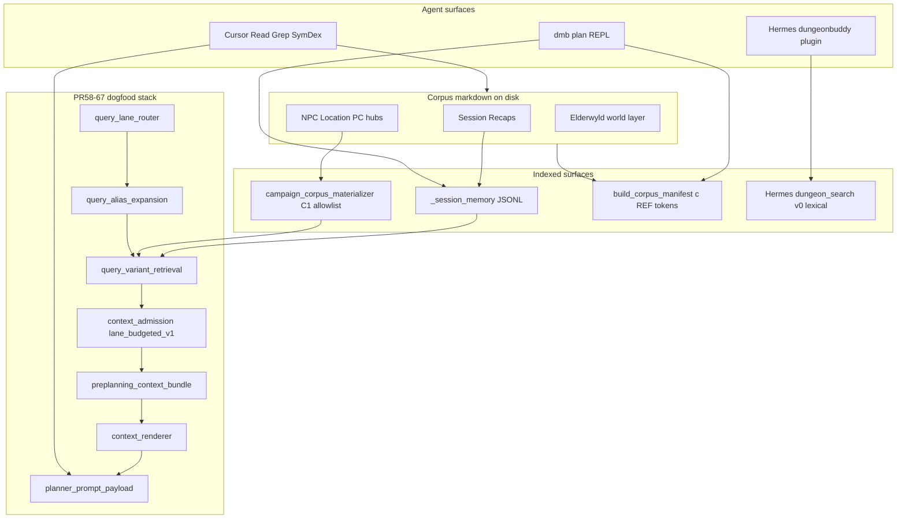
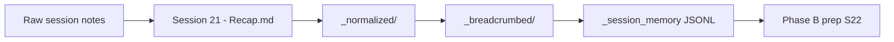

# HANDOFF — Prep agent (Cursor-first): ingest C2S21, plan C2S22, dogfood retrieval

**Created:** 2026-05-22 (UTC).
**Status:** ACTIVE — dispatch to a fresh Cursor agent with zero prior chat context.
**Parent agent:** Operator / prior session; this document is the re-anchor surface per `.cursor/rules/anchor.mdc`.

### Document map (read both)

| Role | Document |
|------|----------|
| **Dispatch / repo execution** (this file) — commands, modules, verification, Python entry pattern | `Docs/Plans/HANDOFF-prep-agent-c2-ingest-s21-plan-s22-cursor-first.md` |
| **Operating manual** — proof surfaces, ledgers, Session 22 prep brief shape, demo-readiness rubric, fallback ladder | [`Docs/Plans/DEMO-ARCHITECT-AGENT-MANUAL-c2s21-s22.md`](DEMO-ARCHITECT-AGENT-MANUAL-c2s21-s22.md) |
| **Living session notes** — architecture map, step log, D/J tally, rebuild backlog (update each step) | [`Docs/Plans/C2S21-S22-DEMO-ARCHITECT-SESSION-NOTES.md`](C2S21-S22-DEMO-ARCHITECT-SESSION-NOTES.md) |
| **Ingest hints sidecar (optional LLM triage)** | [`HANDOFF-pr69-ingest-hints-sidecar.md`](HANDOFF-pr69-ingest-hints-sidecar.md), `.cursor/skills/ingest-hints-sidecar/SKILL.md` |
| **Plan anchor** | [`Docs/Plans/PLAN-split-corpus-retrieval-to-autonomous-demo.md`](PLAN-split-corpus-retrieval-to-autonomous-demo.md) |
| **Retrieval milestones (PR58–67)** | [`Docs/Plans/CHECKLIST-c1s4-preplanning-vertical-slice.md`](CHECKLIST-c1s4-preplanning-vertical-slice.md) |

**How to use the pair:** run Phase A/B from **this HANDOFF**; report prep and judge demo-readiness using the **Demo Architect manual** (§4 proof surfaces, §7 packet review, §9 prep brief, §10 demo rubric, §12 fallback ladder).

---

## §0 Re-anchor block (read first every session)

| Field | Value |
|-------|--------|
| **Campaign** | Longmont Campaign 2 (`longmont-c2`) |
| **Phase A — ingest target** | **Session 21** (play recap → corpus + session-memory index) |
| **Phase B — prep target** | **Session 22** (corpus-grounded prep after S21 is ingested) |
| **Agent surface** | **Cursor** (Read, Grep, SymDex) — primary; Hermes is phase-2 orchestration only |
| **Dogfood requirement** | Phase B **must** run PR58–67 retrieval → review constructed packet → read full docs → synthesize |
| **Last indexed session memory (C2)** | **S20 only** — `Longmont Campaign/Campaign 2/Session Recaps/_session_memory/Session 20 - Gnat Swarm Marla Lysandra.records_meta.jsonl` |
| **S21 play recap on disk** | **Not yet** — no `Session Recaps/Session 21 - *.md`; raw ground truth staged at `_ingest_staging/session_21_raw_notes.md` |
| **S21 pre-play drafts** | `Session Prep/Session 21 - *.md` (inputs only, not play recap) |
| **Session memory gap** | C2S1–S19 recaps exist but are **not** in `_breadcrumbed/` / `_session_memory/` |
| **Newest retrieval stack** | C1S4 Step 2C through **PR #67** on `main` — see §5 |
| **Canonical trackers** | `Docs/Plans/CHECKLIST-c1s4-preplanning-vertical-slice.md` (Reanchor); `Docs/Plans/PLAN-split-corpus-retrieval-to-autonomous-demo.md` v33 |

**Three operator goals (ordered):**

1. **Phase A — Ingest Session 21** — canonical recap + derivative session-memory index.
2. **Phase B — Dogfood retrieval for Session 22 prep** — run the PR58–67 preplanning retrieval stack on GM prep questions; review constructed packets before synthesis.
3. **Phase B — Synthesize prep** — read full corpus documents where retrieval/provenance points; deliver S22 prep output.

**Dogfooding is not optional for Phase B.** Grep-only or README-only prep without running the retrieval pipeline and reviewing the constructed packet is a **degraded fallback**, not the success path.

---

## §0.1 Operator pre-flight (before dispatch)

### Phase A prerequisites (ingest S21)

- Raw session notes from last night's play (paste into agent message).
- Optional: existing `Session Prep/Session 21 - *.md` drafts as shape/context — **not** as the canonical play recap.
- Corpus writes: enable via `dmb plan --allow-corpus-writes` or Cursor-driven recap-write workflow (see `.cursor/skills/recap-write/SKILL.md`).

### Phase B prerequisites (plan S22)

- S21 recap committed: `Longmont Campaign/Campaign 2/Session Recaps/Session 21 - <slug>.md`
- S21 session memory materialized (breadcrumb + `_session_memory` for S21).
- Operator supplies **3–8 natural-language S22 prep questions** (real GM asks — not gold JSON).
- Agent runs retrieval **before** answering each prep question batch.
- Agent reviews `admitted_context`, `source_derived_context_gaps`, and admission lineage before full-doc reads.

### Ingestion depth decision (operator picks one)

1. **Minimum (S21 only):** recap + breadcrumb + session memory for S21; prep S22 via full-doc reads of S20–S21 recaps + hubs; retrieval over S20+S21 session memory only.
2. **Better:** S21 ingest + materialize S16–S20 session memory (recent continuity window).
3. **Full:** C2S1–S21 through breadcrumb pipeline (enables `query_session_memory` across the campaign).

Do not start Phase B until Phase A recap exists, unless the operator explicitly accepts prep-from-raw-notes-only as degraded mode.

---

## §1 Project anchor (how to think about DungeonMindBuddy)

### What this project is building toward

DungeonMindBuddy is a **corpus-grounded GM prep assistant**. The Eldyrwild / Longmont campaign lives in markdown on disk under `corpus/eldyrwild-markdown/`. The agent **discovers** facts by reading files — it does not invent plot from chat memory.

Long-term goal (see `Docs/Plans/PLAN-split-corpus-retrieval-to-autonomous-demo.md`):

- Blessed session recaps → session-memory JSONL (retrieval index).
- Hub READMEs + dossiers + timelines (entity discovery).
- A **production-intent retrieval stack** (PR58–67) that constructs bounded, reviewable **context packets** for prep questions — lane routing, query variants, budgeted admission, rendered sections, admission diagnostics.

### Standing rules (non-negotiable)

| Rule | Source |
|------|--------|
| **Discovery, not provisioning** — agent reads files; no path laundry lists in user messages | `.cursor/rules/llm-context-discovery.mdc` |
| **Hub README first** — suggested reads, then dossier/timeline/statblock before citing mechanics | `.cursor/rules/corpus-layout-conventions.mdc` |
| **Corpus is canon** — not Hermes memory, not chat history | `.hermes.md` |
| **Two-phase commit** for corpus writes — preview → GM `apply` → commit | `.cursor/skills/recap-write/SKILL.md`, `src/agent/corpus_writer.py` |
| **Eval gold is forbidden** in planner-visible text | `evals/c1s4_preplanning_vertical_slice/gold/*` |

### Mission for this handoff

- **Phase A:** Ingest Session 21 into the corpus cleanly — one canonical recap, then derivative indexes.
- **Phase B:** Dogfood the production-intent retrieval path built in C1S4 PR #58–#67 — lane routing, query variants, budgeted admission, rendered planner packets, admission diagnostics — **not** the older `legacy_top_k` preview or Hermes v0 lexical search. Then synthesize Session 22 prep from retrieved provenance + full-document reads.

---

## §2 Tooling map



| Layer | Purpose | Key paths / commands | Maturity |
|-------|---------|----------------------|----------|
| **Newest retrieval (PR58–67)** | Construct planner-visible context packets | `evals/c1s4_preplanning_vertical_slice/query_lane_router.py`, `query_alias_expansion.py`, `query_variant_retrieval.py`, `context_admission.py`, `source_derived_context_gaps.py`, `preplanning_context_bundle.py`, `context_renderer.py`, `planner_prompt_payload.py`, `pr67_required_group_diagnostics.py` | **Dogfood target**; wired through C1S4 eval harness today |
| **Session memory index** | Recap-unit candidates for retrieval | `scripts/materialize_session_memory.py`; `src/agent/session_memory_query.py` | C2: **S20 only** (+ S21 after Phase A) |
| **Hub chunk index** | Section-level corpus records | `evals/c1s4_preplanning_vertical_slice/campaign_corpus_materializer.py` | C1 allowlist only — C2 extension is follow-on |
| **Corpus tree index** | Navigate without long paths | `src/agent/planner.py::build_corpus_manifest_and_ref_index` | Used by `dmb plan` |
| **Full-doc reads** | Verify / deepen after packet review | Cursor Read; hub README convention | Production-ready |
| **Hermes v0** | Lexical search spike | `integrations/hermes/plugins/dungeonbuddy/__init__.py` | **Not** the dogfood path |
| **Eval packet review (C1 reference)** | Visual review of retrieval + admission | `scripts/c1s4_update_expected_context_canvas.sh` | Pattern for C2 JSON review until C2 canvas exists |

**Primary surface:** Cursor agent for Phase A ingest and Phase B synthesis.
**Dogfood surface:** C1S4 retrieval modules (§5) — run and review packets before answering prep questions.

---

## §3 Ingestion runbook (Phase A: Session 21)

**Proof / output shape:** [`DEMO-ARCHITECT-AGENT-MANUAL-c2s21-s22.md`](DEMO-ARCHITECT-AGENT-MANUAL-c2s21-s22.md) §5 (Phase A ledger).



### Step 1 — Canonical play recap

Use `.cursor/skills/recap-write/SKILL.md`:

1. Resolve recap context (`get_recap_context` / `src/agent/recap_context.py`) for C2, target session **21**.
2. Survey recent recap shape (S19–S20) via `read_corpus_file`.
3. Draft recap from operator notes; **two-phase preview** via `write_corpus_file` (`mode='create'`, `dry_run=true`).
4. Wait for GM **`apply`** before commit.
5. Target path: `Longmont Campaign/Campaign 2/Session Recaps/Session 21 - <slug>.md`

**Do not** treat pre-play prep drafts as the play recap:

- `Session Prep/Session 21 - Mossford Saltfen rumor shop.md`
- `Session Prep/Session 21 - brainstorming dump.md`
- `Session Prep/Session 21 - prep exercise agentic trace.md`
- etc.

Recap-write also emits a structured follow-up payload (timeline candidates, new hub proposals, plot artifacts) — surface to GM; do not auto-append timelines or create hubs without separate approval/skills.

### Step 2 — Normalized recap

```bash
uv run python scripts/materialize_normalized_recaps.py
```

Writes `_normalized/` siblings. Convention: `Docs/CONVENTION-Session-Recap-Normalization.md`.

### Step 3 — Breadcrumb artifact

Promote or generate `_breadcrumbed/Session 21 - <slug>.breadcrumbed.md`.

Convention: `Docs/CONVENTION-Session-Recap-Breadcrumbs-Session-Memory-And-Tokens.md`.

LLM breadcrumb generation is operator-owned (cost ≈ prior C1S13 unit-annotation runs). Staging under `evals/sentence_routing_retrieval_falsification/manual_labels/artifacts/`; blessed copies land in corpus `_breadcrumbed/`.

### Step 4 — Session memory

```bash
uv run python scripts/materialize_session_memory.py --campaign 2 --session 21
uv run python scripts/materialize_session_memory.py --campaign 2 --session 21 --check
```

Output:

- `Longmont Campaign/Campaign 2/Session Recaps/_session_memory/Session 21 - <slug>.records_meta.jsonl`
- companion `.records_meta.json`

**Note:** `PILOT_BLESSED_SESSIONS` in `src/corpus/session_recap_paths.py` currently blesses C2S20 only among C2 sessions. Materializing S21 works when breadcrumb exists; extending blessed sessions for bulk `--all-blessed --check` is a follow-on slice.

### Step 5 — Optional beat enrichment

Pattern from `Docs/Plans/HANDOFF-pr24-canonical-beat-enriched-session-memory-c1s1-to-c1s3.md`: unit annotation sidecars + `enrich_records_with_beat_ids`. Not required for minimum Phase A.

### Session memory gap (C2S1–S19)

Play recaps for C2S1–S20 exist under `Session Recaps/`, but only **S20** has `_session_memory/` today. Retrieval over "full campaign continuity" requires either:

- Full-doc reads of older recaps/hubs (Cursor discovery), or
- Bulk materialization follow-on (§10).

---

## §4 Cursor workflow: Phase A (ingest S21)

1. **Re-anchor** — read this handoff §0–§1; `git rev-parse HEAD` on `main`.
2. **Recap context** — resolve C2 target session 21; confirm `Session Recaps/` max session is 20 before ingest.
3. **Shape survey** — read S19–S20 recap files for frontmatter + prose shape.
4. **Draft + preview** — recap-write two-phase commit; stop at preview until GM `apply`.
5. **Derivatives** — normalize → breadcrumb → session memory (§3 steps 2–4).
6. **Report to GM:**
   - Recap path committed
   - Session-memory record count (`records_meta.json` → `unit_count`)
   - Follow-up payload summary (timeline candidates, new hubs, plot artifacts)
   - Remaining gap (C2S1–S19 not indexed unless operator chose depth option 2/3)

**Example GM message (Phase A):**

> Here are my raw notes from last night — write Session 21 recap.

---

## §5 Dogfooding the newest retrieval (Phase B core)

**Packet review + prep brief:** [`DEMO-ARCHITECT-AGENT-MANUAL-c2s21-s22.md`](DEMO-ARCHITECT-AGENT-MANUAL-c2s21-s22.md) §6–§7 (retrieval loop), §9 (prep brief), §4 (proof surfaces).

**This is the load-bearing section.** Phase B prep that skips this section is incomplete.

### 5.1 What "newest retrieval" means (PR58–67)

Pipeline order (same chain as `evals/c1s4_preplanning_vertical_slice/step2_build_question_context_packets.py::_retrieve`):

| Step | Module | Function |
|------|--------|----------|
| 1 | Record union | Session-memory JSONL rows + optional hub chunks (`load_campaign_corpus_records_for_c1s4` pattern; C2 needs equivalent loader) |
| 2 | Lane plan | `query_lane_router.build_lane_plan` |
| 3 | Query variants | `query_alias_expansion.build_step2c_query_variants` |
| 4 | Variant retrieval | `query_variant_retrieval.retrieve_query_variants` |
| 5 | Admission | `context_admission.build_lane_budgeted_admission` (`admission_policy: lane_budgeted_v1`) |
| 6 | Source-derived gaps | `source_derived_context_gaps.build_source_derived_context_gaps` |
| 7 | Context bundle | `preplanning_context_bundle.build_preplanning_context_bundle` |
| 8 | Render | `context_renderer.render_context_packet` → sectioned markdown |
| 9 | Planner payload | `planner_prompt_payload.build_planner_prompt_payload` (sanitized; no gold leakage) |

**Default policy:** `lane_budgeted_v1`. **Not** `legacy_top_k`.

Legacy top-9 (`retrieved_context[:9]`) is compatibility preview only — see packet field `grading_surface_labels.legacy_retrieved_context_role: compatibility_preview_only`. When `admitted_context` exists, treat **admitted** items as the canonical retrieval surface.

Rendered sections (from `context_renderer.py`):

- Known Gaps and Safety Constraints
- Support / Adaptation Context
- Prior Campaign Memory
- Character / Party Behavior Context
- Location / Worldbuilding Context

### 5.2 How to review the constructed packet

Inspect these JSON fields **before** synthesizing prep answers:

| Field | Meaning |
|-------|---------|
| `admitted_context` | What retrieval **committed** to the planner surface |
| `candidate_context` | Pre-admission pool (deeper than legacy top-9) |
| `admission_decision_diagnostics` | PR67 lineage: `first_admitted_match`, `first_raw_match`, `failure_stage`, `miss_root_cause` |
| `source_derived_context_gaps` | Evidence the system knows it **does not** have |
| `rendered_context_packet.provenance_map` | `source_path` / recap anchors → open next with Read |
| `rendered_context_packet.rendered_text` | Sectioned markdown preview of what a planner would see |
| `query_variant_diagnostics` | Which query variants fired |
| `lane_plan` | Lane routing decision for this question |
| `grading_surface_labels.effective_grading_surface` | Should be `admitted_context` when admission ran |

**Reference review UI (C1 — learn the pattern):**

```bash
bash scripts/c1s4_update_expected_context_canvas.sh
```

Open the generated canvas; inspect PR67 admission panels on tier-A cards. Mimic this review manually on C2 packet JSON until a C2 canvas exists.

**C1 smoke artifacts (on `main`):**

- `evals/c1s4_preplanning_vertical_slice/artifacts/last_c1s4_step2c_multimode_report.json`
- `evals/c1s4_preplanning_vertical_slice/artifacts/pr67/pr67_required_group_admission_diagnostics.json`
- `evals/c1s4_preplanning_vertical_slice/artifacts/last_c1s4_expected_context_canvas_payload.json`

### 5.3 C2 Session 22 prep — dogfood invocation

**Honest gap:** `step2_build_question_context_packets.py` is **C1-bound**:

- `campaign_id: longmont-c1`
- `session_max: 3` (C1S1–S3 only)
- C1S4 oracle holdout policy in `gold/kb_policy.json`
- Beat-question gold in `gold/c1s4_beat_question_targets.json`

It cannot be run verbatim for C2S22. **The dogfood contract still applies** — invoke the **same module chain** with C2 parameters.

#### Operator prep question templates

Write 3–8 natural asks, for example:

- *What open threads from Session 21 should carry into Session 22?*
- *Which NPCs from last session need dialogue prep?*
- *What locations are hot for the next session?*
- *What did the party commit to that I need to honor?*
- *Any mechanical prep (statblocks) for entities likely to appear?*

#### Python entry pattern (until C2 live-prep CLI lands)

Run from repo root inside `uv run python` or a short script. Adapt `_retrieve` from `step2_build_question_context_packets.py`:

```python
from evals.c1s4_preplanning_vertical_slice.query_lane_router import build_lane_plan
from evals.c1s4_preplanning_vertical_slice.query_alias_expansion import build_step2c_query_variants
from evals.c1s4_preplanning_vertical_slice.query_variant_retrieval import retrieve_query_variants
from evals.c1s4_preplanning_vertical_slice.context_admission import build_lane_budgeted_admission
from evals.c1s4_preplanning_vertical_slice.source_derived_context_gaps import build_source_derived_context_gaps
from evals.c1s4_preplanning_vertical_slice.preplanning_context_bundle import build_preplanning_context_bundle
from evals.c1s4_preplanning_vertical_slice.context_renderer import render_context_packet
from evals.c1s4_preplanning_vertical_slice.planner_prompt_payload import build_planner_prompt_payload
from src.agent.session_memory_query import load_session_memory_records_jsonl

CAMPAIGN_ID = "longmont-c2"
SESSION_MIN = 0
SESSION_MAX = 21  # after Phase A
RETRIEVAL_MODE = "prior_only"  # or prior_plus_support_* when C2 support cards exist
MAX_HITS = 50
BUDGET_CHARS = 8000

def build_live_prep_packet(*, question: str, combined_records: list, records_by_unit_id: dict) -> dict:
    lane_plan = build_lane_plan(
        question_text=question,
        retrieval_mode=RETRIEVAL_MODE,
        candidate_depth=MAX_HITS,
        total_budget_chars=BUDGET_CHARS,
    )
    variants = build_step2c_query_variants(
        question_text=question,
        retrieval_mode=RETRIEVAL_MODE,
        lane_plan=lane_plan,
    )
    merged_hits, query_variant_diagnostics = retrieve_query_variants(
        records=combined_records,
        query_variants=variants,
        campaign_id=CAMPAIGN_ID,
        session_min=SESSION_MIN,
        session_max=SESSION_MAX,
        candidate_depth=MAX_HITS,
    )

    class _Merged:
        hits = merged_hits

    bundle = build_preplanning_context_bundle(
        kb_id=f"{CAMPAIGN_ID}-live-prep-v1",
        campaign_id=CAMPAIGN_ID,
        allowed_sessions=list(range(1, SESSION_MAX + 1)),
        heldout_sessions=[],  # no oracle holdout for live prep
        query=question,
        retrieval_result=_Merged(),
        forbidden_oracle_relpaths=[],
        records_by_unit_id=records_by_unit_id,
        max_items=MAX_HITS,
    )
    candidate_context = bundle["items"]

    admission = build_lane_budgeted_admission(
        question_text=question,
        retrieval_mode=RETRIEVAL_MODE,
        candidates=candidate_context,
        lane_plan=lane_plan,
        candidate_depth=MAX_HITS,
        total_budget_chars=BUDGET_CHARS,
    )

    packet = {
        "schema": "dmb_c2_live_prep_context_packet_v0",
        "campaign_id": CAMPAIGN_ID,
        "question": question,
        "retrieval_mode": RETRIEVAL_MODE,
        "candidate_context": candidate_context,
        "query_variant_diagnostics": query_variant_diagnostics,
        "lane_plan": lane_plan,
        **admission,
    }

    gaps = build_source_derived_context_gaps(
        question_id="live_prep",
        question_text=question,
        retrieval_mode=RETRIEVAL_MODE,
        candidate_context=packet.get("candidate_context") or candidate_context,
        admitted_context=packet.get("admitted_context") or [],
        query_features=lane_plan.get("query_features"),
    )
    if gaps:
        packet["source_derived_context_gaps"] = gaps

    rendered = render_context_packet(packet)
    packet["rendered_context_packet"] = rendered
    packet["planner_prompt_payload"] = build_planner_prompt_payload(
        context_packet=packet,
        rendered_context_packet=rendered,
    )
    return packet
```

**Loading C2 session memory records:**

```python
from pathlib import Path

ROOT = Path("corpus/eldyrwild-markdown")
records = []
for session in (20, 21):  # expand as more sessions are materialized
    rel = f"Longmont Campaign/Campaign 2/Session Recaps/_session_memory/Session {session:02d} - *.records_meta.jsonl"
    # resolve exact path from tree — only S20 exists today pre-Phase-A
    ...
```

After Phase A, load S20 + S21 JSONL paths explicitly. Hub chunks require a future C2 `campaign_corpus_materializer` allowlist.

#### Dogfood loop (per question batch)

1. Run `build_live_prep_packet` for each GM question.
2. **Show GM the packet** — at minimum: `admitted_context` count, top items, `source_derived_context_gaps`, `rendered_context_packet.rendered_text` excerpt.
3. Open full `.md` files from `provenance_map` / hub READMEs for admitted items and gap follow-ups.
4. Synthesize prep — cite only opened files; surface retrieval gaps explicitly.

Write packet JSON to `evals/c2_live_prep/artifacts/` (create dir) for operator review — default artifact per benchmark convention.

### 5.4 Anti-patterns (dogfood)

| Do not | Do instead |
|--------|------------|
| Phase B prep by Cursor grep alone | Run retrieval → review packet → read docs |
| Treat `retrieved_context` legacy top-9 as canonical | Use `admitted_context` when present |
| Use Hermes `dungeon_search` as substitute for lane-budgeted stack | Dogfood PR58–67 modules |
| Paste gold/eval artifacts into planner text | Natural GM questions only |
| Invent proper nouns absent from opened files | State unknowns; use `source_derived_context_gaps` |

---

## §6 Cursor workflow: Phase B synthesis (after retrieval)

**Output template + demo rubric:** [`DEMO-ARCHITECT-AGENT-MANUAL-c2s21-s22.md`](DEMO-ARCHITECT-AGENT-MANUAL-c2s21-s22.md) §9 (Session 22 prep brief), §10 (demo-readiness), §14 (response contract).

1. Run dogfood loop (§5.3) for operator's prep question batch.
2. Read **Session 21 recap** (primary continuity); **Session 20 recap** for carryover.
3. Entity-centric discovery: for each thread in S21, open hub `README.md` first, then dossier/timeline/statblock per `.cursor/rules/corpus-layout-conventions.mdc`.
4. World layer: follow `Elderwyld/` cross-links when campaign hubs point there; respect `canon_layer`.
5. **Output shape:**
   - Open threads for S22
   - Scene / beat candidates
   - Required reads (corpus-relative paths actually opened)
   - **Retrieval gaps** (from `source_derived_context_gaps`)
   - Mechanical prep pointers (statblock paths if applicable)
6. Optional: create **one** `Session Prep/session_22_<slug>.md` only if operator requests a write.

**Example GM message (Phase B):**

> Session 21 is ingested — run retrieval for these S22 prep questions, show me the constructed packet, then tell me what to prep.

---

## §7 Verification commands

**Demo-readiness judgment:** [`DEMO-ARCHITECT-AGENT-MANUAL-c2s21-s22.md`](DEMO-ARCHITECT-AGENT-MANUAL-c2s21-s22.md) §10 (rubric), §12 (fallback ladder).

Run after Phase A and/or Phase B as applicable.

```bash
# Phase A — after S21 materialization
uv run python scripts/materialize_session_memory.py --campaign 2 --session 21 --check

# Existing S20 still valid
uv run python scripts/materialize_session_memory.py --campaign 2 --session 20 --check

# Dogfood stack literacy (C1 reference — proves modules work on main)
uv run pytest tests/test_c1s4_expected_context_canvas_payload.py::test_canvas_payload_includes_pr67_admission_diagnostics -q
uv run pytest tests/test_c1s4_planner_prompt_payload.py -q

# Optional: full C1S4 Step 2C benchmark run (writes artifacts/)
uv run python evals/c1s4_preplanning_vertical_slice/step2c_expected_context_benchmark.py

# Corpus hub lint (read-only)
uv run python scripts/lint_corpus_hubs.py

# Hermes plugin unit tests (no Hermes binary required)
uv run pytest tests/test_hermes_dungeonbuddy_plugin.py -q
```

**Cost:** Phase A breadcrumb LLM steps are operator-owned (see C1S13 unit-annotation envelope in PLAN). Retrieval dogfood on main is **$0** (deterministic harness).

---

## §8 Explicit non-goals

- Do not skip Phase A and treat S21 prep drafts as the play recap.
- Do not bulk-ingest C2S1–S19 unless operator expands scope in §0.1.
- Do not edit C1S4 gold/eval artifacts or use C1S4 oracle material for C2 prep.
- Do not merge multiple Session 21 prep files without operator approval.
- Do not append timeline rows or create NPC hubs in the recap-write turn without dedicated skill/approval.
- **Do not treat grep-only prep as satisfying Phase B** — dogfood retrieval + packet review is required.
- Do not implement the C2 live-prep CLI in this handoff execution turn (documented pattern only).

---

## §9 Hermes path (phase-2 orchestration)

Hermes is **conversation + tool orchestration**, not campaign canon. See `.hermes.md`.

### Install (spike harness)

```bash
export HERMES_HOME="$PWD/.hermes-runtime"
export DUNGEONBUDDY_REPO="$PWD"
export DUNGEONBUDDY_CORPUS_ROOT="$PWD/corpus"
./scripts/hermes_spike_install_plugin.sh
```

Chat smoke: `hermes chat --toolsets "dungeonbuddy,memory,file"`. Prefer `hermes memory off`.

### v0 tools (today)

| Tool | Behavior |
|------|----------|
| `dungeon_search` | Lexical rglob over markdown — retrieval **candidates**, not canon |
| `dungeon_get_document` | Read one doc by relative path |
| `dungeon_check_continuity` | Evidence candidates for a claim — not adjudication |

Source: `integrations/hermes/plugins/dungeonbuddy/__init__.py` (explicitly "v0 dumb lexical search").

Skill: `integrations/hermes/plugins/dungeonbuddy/skills/dungeonbuddy-corpus-qa/SKILL.md`.

Manual eval questions: `evals/hermes_spike/questions.jsonl`.

### Upgrade roadmap (not this handoff)

Replace Hermes v0 internals with the **same APIs** the dogfood stack uses:

- `query_session_memory_candidate` + PR58–67 admission/render pipeline
- `build_corpus_manifest_and_ref_index` for `c:REF` reads
- `read_corpus_file` / corpus writer parity from `src/agent/planner.py`

Cursor-first prep validates the workflow; Hermes wiring follows once C2 live-prep retrieval CLI exists.

---

## §10 Recommended follow-on slices

1. **C2 live-prep retrieval CLI** — `scripts/c2_prep_retrieval_packet.py` or `evals/c2_live_prep/` wrapping §5.3 pattern for ad-hoc GM questions (`longmont-c2`, sessions 1–21).
2. **C2 hub materializer allowlist** — port `campaign_corpus_materializer.py` for C2 hubs referenced in S21/S22 threads.
3. **C2 bulk session-memory** — materialize C2S1–S20 breadcrumbs + `_session_memory/`.
4. **C2 prep review canvas** — port expected-context canvas + PR67 admission panels for live prep packets.
5. **Hermes plugin v1** — delegate to dogfood retrieval APIs, not lexical rglob.
6. **recap-timeline-append skill** — close loop on recap-write `timeline_append_candidates`.

---

## §11 Authoritative reads (before acting)

Read in order:

1. This handoff §0 Re-anchor block
2. [`DEMO-ARCHITECT-AGENT-MANUAL-c2s21-s22.md`](DEMO-ARCHITECT-AGENT-MANUAL-c2s21-s22.md) — proof discipline, prep brief shape, demo rubric, reporting templates
3. `.cursor/rules/anchor.mdc` — re-anchor discipline
4. `.cursor/rules/llm-context-discovery.mdc` — discovery, not provisioning
5. `.cursor/skills/recap-write/SKILL.md` — Phase A write protocol
6. `Docs/Plans/CHECKLIST-c1s4-preplanning-vertical-slice.md` — PR58–67 milestone context
7. `evals/c1s4_preplanning_vertical_slice/README.md` — Step 2 packet harness overview
8. `.hermes.md` — Hermes hard rules

---

## §12 Reporting contract (end of turn)

Full templates (Phase A proof ledger, packet review note, Session 22 prep brief, demo-readiness review, fallback banners): [`DEMO-ARCHITECT-AGENT-MANUAL-c2s21-s22.md`](DEMO-ARCHITECT-AGENT-MANUAL-c2s21-s22.md) §5–§12.

After Phase A, report:

- Recap path + session-memory record count
- Follow-up payload summary
- `--check` pass/fail

After Phase B dogfood, report:

- Prep questions run
- Per-question: admitted count, gap list, top provenance paths opened
- One failure or gap sample + one success sample (evidence-first)
- Paths to saved packet JSON artifacts

**Cost:** surface any LLM spend from breadcrumb generation; retrieval harness $0.
