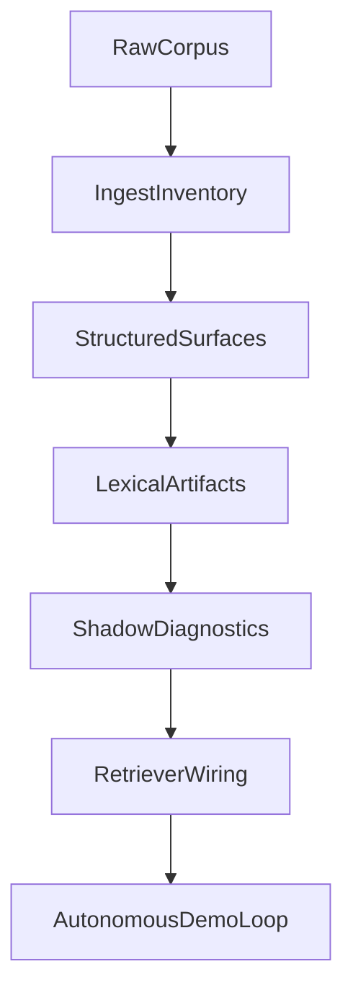

---
# Canonical super-plan for split-corpus retrieval through autonomous demo.
# Update `last_updated_at` and `changelog` on every substantive edit.
document_id: dmb-plan-split-corpus-autonomous-demo
title: Split-corpus retrieval to autonomous C1S1–C1S3 demo
document_class: plan
plan_kind: execution_super_plan
status: active
version: 15
created_at: "2026-05-09T00:00:00Z"
last_updated_at: "2026-05-11T03:46:00Z"
timezone_note: "Timestamps are UTC; local work may use America/Denver."
supersedes: []
superseded_by: null
related_documents:
  - path: Docs/Plans/CHECKLIST-dynamic-lexical-retrieval-rollout.md
    role: operational_tracker
  - path: Docs/Design/DECISION-world-campaign-knowledge-hierarchy.md
    role: decision_anchor
cursor_plan_mirror:
  path: .cursor/plans/phasebtoagenticdemo_16f63efa.plan.md
  note: >-
    Cursor may regenerate this file; this PLAN doc is the repo-canonical
    narrative. When rebaselining from IDE plans, diff against this file and
    merge intentional edits here.
demo_scope:
  campaign: Longmont Campaign 1
  sessions: [1, 2, 3]
  autonomy: fully_autonomous_with_benchmark_gates
milestones:
  - id: M1
    label: Phase A complete
  - id: M2
    label: Phase B lexical artifacts
  - id: M3
    label: Phase C-ready shadow gates
  - id: M4
    label: Demo-ready autonomous loop
execution_state:
  active_phase: B
  milestone_progress:
    M1: complete
    M2: in_progress
    M3: in_progress
    M4: not_started
  blockers: []
  next_gate_command: >-
    uv run python scripts/build_route_equivalence_manifests.py --check
    && uv run pytest tests/lexicon_phase_b/ -q
    && uv run pytest tests/test_breadcrumb_query_run_lexicon_records_jsonl.py -q
    && uv run pytest tests/test_cohort_baseline_run.py -q
    && uv run python -m evals.sentence_routing_retrieval_falsification.cohort_baseline_run --check
    (PR #4 + #5 + #6 + #7 + #8 regression bundle on main). **PR #8 merged** — committed
    `route_equivalence_longmont_c*_v1.jsonl` are **`schema_version` `0.3.0`** with
    per-file **`route_equivalence_manifest_hash`** (SHA-256 over the §6.2 preimage)
    plus **`producer_registry_path`** (workspace-relative POSIX) and
    **`producer_registry_sha256`** on every line; harness and cohort runners unchanged.
    **Next slices:** (a) **wider cohort** — records for `c1s13_v1` / `natural_v1` plus
    manifest + baseline (prerequisite before non-null L2 signal); (b) **derive canvas
    `--skip-*` flags** from `scenario_id` / manifest in `cohort_baseline_run` (PR #7
    rubric carry-forward) **before** widening the cohort manifest; (c) **Phase C exit**
    slice — minimal additive ranking-input wiring + true A/B cohort when benchmarking
    queue says so.
  flagged_followups:
    - >-
      Content quality of `location_hierarchy_equivalences` in
      `evals/sentence_routing_retrieval_falsification/gold/breadcrumb_query_natural_c1s13_v1.json`
      looks copy-pasted across two of three location-context scenarios; the
      audit only checks structure, not semantic correctness. Not a Phase A
      blocker. Tracked in `Backlog.md`.
    - >-
      `uv run python scripts/audit_world_campaign_alignment.py` can fail in a
      clean checkout when `out/evals/corpus_remote/normalization_manifest.json`
      is absent; document or generate that manifest before treating the audit as
      a portable gate (separate from route-equivalence JSONL lane).
  integration_notes:
    - >-
      PR #8 is MERGED to main (merge commit adeb060911be35f4f477cb15eaf701ab7d409fbf,
      2026-05-11T03:45:24Z): producer route-equivalence JSONL **`0.3.0`** —
      `RouteEquivalenceRecord` gains `producer_registry_path`, `producer_registry_sha256`,
      `route_equivalence_manifest_hash`; `build_route_equivalence_manifest` computes
      preimage per handoff §6.2 (sorted `record_id`, `model_dump(exclude={hash})`,
      `json.dumps(..., sort_keys=True)`, joined SHA-256); committed
      `evals/.../artifacts/lexicon/route_equivalence_longmont_c{1,2}_v1.jsonl` regenerated;
      loader admits `0.3.0`; lexicon tests + byte-stable + manifest preimage test extended.
      Pre-merge verification on PR head `91fb12ee1b09e03b6653148124e5a2f8816dbcdc`: lexicon
      **25** passed; byte-stable **10**; loader **6**; manifest **4**; record defaults **1**;
      `build_route_equivalence_manifests.py --check` OK both; breadcrumb harness **12**;
      cohort **13**; `cohort_baseline_run --check` OK v2; probes: one manifest hash per file,
      schema `0.3.0`, one registry sha256 per c1 file, workspace-relative `producer_registry_path`.
      No edits to `breadcrumb_query_run.py`, `cohort_baseline_run.py`, `route_equivalence_shadow.py`,
      gold, or baselines. Verdict APPROVE demoted to COMMENTED (self-review fallback, review id
      `4260634217`). One non-blocking review note: preimage-sensitivity test mutates registry file
      (registry sha256 co-changes); future test can isolate semantic edge-only mutation in-memory.
    - >-
      PR #7 is MERGED to main (merge commit 0036df30e5f53abd7ba76ab510483a9e1df0d3fa,
      2026-05-11T02:59:47Z): A/B sprint **L2** — additive per-row
      `expected_route_substring_breakdown` in `breadcrumb_query_run.py` (reuses
      `hits_cover_expected_routes`); `cohort_baseline_run.py` derives
      `recall_via_equivalence` + `recall_via_equivalence_aggregate`; schema bump to
      `dmb_breadcrumb_query_cohort_summary_v2`; frozen baseline
      `artifacts/baselines/cohort_baseline_c1s1_to_c1s3_v2.json` (v1 file removed).
      Tests: breadcrumb harness 12, cohort runner 13, combined with lexicon 22
      -> 47 passed on PR head `2bc6ad9e`; cohort `--check` OK; `--write` smoke
      BYTE-IDENTICAL vs committed v2 baseline; `canvases/` clean. APPROVE demoted to
      COMMENTED (self-review fallback, review id `4260504200`). No retrieval, grader,
      gold, producer JSONL, or shadow-module edits. Tight cohort: all three scenarios
      `recall_via_equivalence: null` (denominator zero — load-bearing readout).
    - >-
      PR #6 is MERGED to main (merge commit 9af4741a635125d3403d66a9f266564f25bad746,
      2026-05-11T01:49:53Z): A/B sprint **L1** — `cohort_baseline_run.py` CLI,
      committed cohort manifest `cohorts/c1s1_to_c1s3_v1.json`, frozen curated
      byte-stable summary `artifacts/baselines/cohort_baseline_c1s1_to_c1s3_v1.json`
      (`dmb_breadcrumb_query_cohort_summary_v1`), `tests/test_cohort_baseline_run.py`
      (9 tests including harness-boundary CWD invariance on the full curated JSON).
      Single round (PR head `06280c87`); APPROVE demoted to COMMENTED (self-review
      fallback, review id `4260316552`). §7 green: lexicon 22, breadcrumb harness 11,
      manifest `--check` OK, cohort 9 + CWD test, `--check` OK baseline,
      `--write` vs committed file BYTE-IDENTICAL, `canvases/` clean. No changes to
      `breadcrumb_query_run.py`, `route_equivalence_shadow.py`, producer paths,
      gold, or grader. Cost $0 (`--retrieval-only`).
    - >-
      PR #5 is MERGED to main (merge commit 40be747a87d0eecb4dc1c865f236f3728cf1d4d4,
      2026-05-10T21:09Z): makes `shadow_route_equivalences.source_paths`
      workspace-relative POSIX strings rendered at the harness boundary, so
      the field is byte-identical regardless of operator CWD or absolute
      install path. Adds `_workspace_relative_posix(path, workspace_root)` to
      `evals/sentence_routing_retrieval_falsification/route_equivalence_shadow.py`;
      `build_route_equivalence_shadow_payload` gains a required
      `workspace_root: Path` kwarg; the harness passes
      `_HARNESS_WORKSPACE_ROOT = Path(__file__).resolve().parents[2]` from
      `evals/sentence_routing_retrieval_falsification/breadcrumb_query_run.py`.
      New harness-boundary test
      `test_route_equivalence_source_paths_are_workspace_relative_and_cwd_invariant`
      spawns `breadcrumb_query_run` from `_REPO_ROOT` and from
      `_REPO_ROOT / "tests"` via `uv run --directory _REPO_ROOT …` and asserts
      full-payload byte-identity, not just source_paths equality. Single round
      of review (commit ec1f55fa); APPROVE demoted to COMMENTED via the
      standard self-review fallback. Pre-merge verification:
      `uv run pytest tests/lexicon_phase_b/ -q` -> 22 passed (unchanged from
      main; producer-side untouched);
      `uv run pytest tests/test_breadcrumb_query_run_lexicon_records_jsonl.py -q`
      -> 11 passed (was 10; the new harness-boundary test is the +1);
      `uv run python scripts/build_route_equivalence_manifests.py --check`
      -> OK both manifests; smoke run + `python -c` byte-string assertion
      printed the expected workspace-relative POSIX list. Unblocks the next
      slice: a byte-stable cohort `shadow_route_equivalences` baseline for
      C1S1-C1S3.
    - >-
      PR #2 is MERGED to main (merge commit 545cf37, 2026-05-10T02:59Z): adds
      `src/lexicon_phase_b/` (`RouteEquivalenceRecord` + deterministic manifest
      builder) and `tests/lexicon_phase_b/` test layout that does not collide
      with `main`'s token-resolution tests; filters `entity_kind == "unknown"`
      edges; documents `source_type="npc_registry"` as registry-file lineage,
      not an NPC-only constraint.
    - >-
      PR #1 is CLOSED on GitHub (superseded by PR #2). Old branch
      `codex/implement-dynamic-lexical-artifact-generation` is no longer the
      canonical source for Phase 1 + early Phase 2 work.
    - >-
      Pre-merge gate runs: `uv run pytest tests/lexicon_phase_b/
      tests/test_token_resolution_resolver.py
      tests/test_token_resolution_contracts.py
      tests/test_benchmark_lexicon_seeds.py` -> 28 passed;
      `uv run python scripts/audit_world_campaign_alignment.py` -> PASS when
      the normalization manifest exists under the default path.
    - >-
      PR #3 is MERGED to main (merge commit 98c09aaf0fead2aaaf4b3a7c90afcb09bae8026f,
      2026-05-10T05:06Z): committed
      `evals/sentence_routing_retrieval_falsification/artifacts/lexicon/route_equivalence_longmont_c1_v1.jsonl`
      and `route_equivalence_longmont_c2_v1.jsonl`;
      `scripts/build_route_equivalence_manifests.py` (`--write` / `--check`);
      `tests/lexicon_phase_b/test_route_equivalence_artifacts_byte_stable.py`;
      `_is_campaign_path` treats relative `Longmont Campaign/...` registry paths
      as campaign (fixes wrong `elderwyld` prefix on `from_route_id`).
    - >-
      Route-id slug derivation for directory-style hub_path values lives in
      `src/lexicon_phase_b/route_equivalence_manifest.py` (`_entity_folder_name`
      + bucket-folder fallback) and is covered by
      `tests/lexicon_phase_b/test_route_id_path_shapes.py`.
    - >-
      PR #4 is MERGED to main (merge commit 21e84392da03095377b4de36defb82edfc37c741,
      2026-05-10T16:22Z): adds `src/lexicon_phase_b/route_equivalence_loader.py`
      (pure JSONL -> RouteEquivalenceRecord loader, exported via `__init__.py`),
      `evals/sentence_routing_retrieval_falsification/route_equivalence_shadow.py`
      (per-scenario `dmb_route_equivalence_shadow_v1` payload builder), and a
      `--route-equivalence-jsonl` (repeatable) CLI flag on `breadcrumb_query_run`.
      Field `shadow_route_equivalences` is emitted only when the flag is set;
      legacy retrieval / grading / `shadow_token_resolution` paths are unchanged.
      Pre-merge verification: `uv run python scripts/build_route_equivalence_manifests.py
      --check` -> OK; `uv run pytest tests/lexicon_phase_b/ -q` -> 17 passed;
      `uv run pytest tests/test_breadcrumb_query_run_lexicon_records_jsonl.py -q`
      -> 10 passed (round 2 added byte-identity-when-flag-unset and
      load-failure-emits-error harness-boundary tests).
changelog:
  - at: "2026-05-11T03:46:00Z"
    version: 15
    summary: >-
      PR #8 merged (adeb060911be35f4f477cb15eaf701ab7d409fbf): producer **`0.3.0`**
      route-equivalence JSONL — `route_equivalence_manifest_hash` + `producer_registry_path`
      + `producer_registry_sha256` on every line; §6.2 preimage in
      `route_equivalence_manifest.py`; loader + tests; no harness/cohort/shadow edits.
      `external_pull_requests` gains `github-pr-8` with four NEW rubric bullets (preimage
      normative definition; per-file hash constancy; workspace-relative path + registry-byte
      tie; sensitivity tests must hold other preimage inputs constant). `next_gate_command`
      and integration_notes updated; lexicon regression count **25** on verified head.
      Handoff `HANDOFF-pr8-producer-route-equivalence-manifest-hash.md` archived under
      `archive/2026-05-11/handoffs/`. Checklist Reanchor + Phase B header + session log synced.
      Next queue: wider cohort and/or canvas `--skip-*` derivation before manifest expansion.
  - at: "2026-05-11T03:05:00Z"
    version: 14
    summary: >-
      PR #7 merged (0036df30): A/B sprint **L2** — shadow recall-via-equivalence on
      `dmb_breadcrumb_query_cohort_summary_v2`, baseline
      `cohort_baseline_c1s1_to_c1s3_v2.json`, additive `expected_route_substring_breakdown`
      in `breadcrumb_query_run.py`, cohort-runner bridging helpers + tests (47 passed
      regression bundle). `external_pull_requests` gains `github-pr-7` with four NEW
      rubric bullets (denominator-zero contract; OR-aggregation across questions needs
      focused tests when wider cohort lands; anti-oracle diagnostic-only; derive
      canvas skip flags from manifest before widening cohort). PLAN narrative renumber:
      former PR 6.5 L2 slice is **PR #7**; producer `manifest_hash` lane is **PR #8**.
      Re-sequencing: L2 on tight cohort shows null signal — wider cohort or PR #8 next.
      Handoff archived `2026-05-11/handoffs/HANDOFF-pr7-shadow-recall-via-equivalence-c1s1-to-c1s3.md`.
      Checklist Reanchor + session log + PR header synced.
  - at: "2026-05-11T02:05:00Z"
    version: 13
    summary: >-
      PR #6 merged (9af4741a): A/B sprint **L1** — cohort baseline runner
      `cohort_baseline_run.py`, manifest `cohorts/c1s1_to_c1s3_v1.json`, frozen
      curated summary `artifacts/baselines/cohort_baseline_c1s1_to_c1s3_v1.json`,
      `tests/test_cohort_baseline_run.py` (harness-boundary CWD invariance on full
      curated JSON). `external_pull_requests` gains `github-pr-6` with three NEW
      rubric bullets (committed baseline byte-identity + `--check`; cohort-runner
      subprocess CWD contract; curated-field exclusions + no canvas perturbation).
      `next_gate_command` now includes cohort pytest + `cohort_baseline_run --check`
      and points next work to L2 / PR #7 / Phase C exit. Checklist Reanchor +
      session log + PR header synced; `HANDOFF-pr6-cohort-baseline-runner-c1s1-to-c1s3.md`
      archived under `archive/2026-05-11/handoffs/`. Open-scope question in A/B
      sprint section resolved **tight** (C1S1–C1S3 only) by shipped manifest.
  - at: "2026-05-10T21:50:00Z"
    version: 12
    summary: >-
      Capture the **A/B Benchmarking Sprint** as the current active
      workstream — a skeptical, intentionally annoying-when-wrong benchmarking
      surface for this vertical slice that lets us compare the new
      lexical-artifact architecture against the original ad-hoc retrieval
      design. New `## A/B Benchmarking Sprint (post-PR #5)` section between
      Phase 5 and Phase 6 describes the three comparison-fidelity levels
      mapped to PRs (PR 6 = baseline; PR 6 + recall metric = leading
      indicator; minimal Phase C exit slice = true A/B), the open scope
      question (C1S1-C1S3 only vs include c1s13 / natural_v1), and the
      re-sequencing question (additive retrieval wiring before vs after the
      producer-side / entity-candidate lanes). `next_gate_command` rewritten
      to lead with the sprint framing. Workstream checklist gains explicit
      sprint sub-items. Architectural seed captured separately in
      `Docs/Design/DESIGN-dungeonbuddy-client-seed.md` (status: SEED) — the
      observation that the benchmarking-retrieval wrapper has bones to be
      abstracted into a thin DungeonBuddy client serving LLM and benchmarking
      calls out, learning from DungeonMindServer.
  - at: "2026-05-10T21:10:00Z"
    version: 11
    summary: >-
      PR #5 merged (40be747a): `shadow_route_equivalences.source_paths` is now
      workspace-relative POSIX strings rendered at the harness boundary.
      Adds `_workspace_relative_posix(path, workspace_root)` to
      route_equivalence_shadow.py; required `workspace_root: Path` kwarg on
      `build_route_equivalence_shadow_payload`; harness wires
      `_HARNESS_WORKSPACE_ROOT = Path(__file__).resolve().parents[2]`. New
      harness-boundary test asserts full-payload byte-identity across two
      different operator CWDs via subprocess. Closes the PR #4
      machine-dependent-source_paths follow-up. Producer-side untouched
      (lexicon_phase_b stays at 22 passed). Single round of review;
      `external_pull_requests` gains `github-pr-5` with the new rubric bullet
      "provenance fields in shadow diagnostics are rendered at the harness
      boundary, with CWD-invariance tested by spawning subprocesses from at
      least two different CWDs and asserting full-payload equality."
      `next_gate_command` rewritten: cohort `shadow_route_equivalences`
      baseline for C1S1-C1S3 is now byte-stable-able and is priority (a).
      Checklist top header / Reanchor / Phase C provenance-hardening evidence
      / session log synced; `HANDOFF-route-equivalence-shadow-source-paths-workspace-relative.md`
      archived with completion banner.
  - at: "2026-05-10T16:35:00Z"
    version: 10
    summary: >-
      PR #4 merged (21e84392): Phase C entry shadow consumer lands. Adds
      route_equivalence_loader.py (pure JSONL -> RouteEquivalenceRecord),
      route_equivalence_shadow.py (per-scenario dmb_route_equivalence_shadow_v1
      payload), and `--route-equivalence-jsonl` CLI flag on breadcrumb_query_run.
      Shadow-only: `shadow_route_equivalences` field appears only when flag set;
      legacy retrieval / grading / shadow_token_resolution unchanged. Round 2
      added harness-boundary tests (byte-identity when flag unset; structured
      error payload on load failure, never raises). milestone_progress: M3
      not_started -> in_progress. external_pull_requests gains github-pr-4 with
      rubric bullet for "test the boundary that owns the rubric". Checklist
      Reanchor / Phase C Evidence / Session log synced in companion edit;
      HANDOFF-phase-c-route-equivalence-shadow-consumer.md archived with
      completion banner.
  - at: "2026-05-10T06:00:00Z"
    version: 9
    summary: >-
      PR #3 merged (98c09aaf): committed route-equivalence JSONL under
      evals/.../artifacts/lexicon/, build_route_equivalence_manifests.py CLI
      with --check, byte-stable regression test, _is_campaign_path fix for
      relative Longmont paths. execution_state next_gate_command and snapshot
      updated; external_pull_requests gains github-pr-3; PR #2 judgment_record
      note corrected (Phase A gate verified before Phase B advance). Checklist
      Evidence/Reanchor synced in companion edit.
  - at: "2026-05-10T03:30:00Z"
    version: 8
    summary: >-
      Phase A re-verified green on current main (audit PASS, all C1S13
      hierarchy fields structurally present). Active phase advanced A -> B,
      M1 marked complete, M2 marked in_progress. C1S13 hierarchy content
      quality concern moved from blocker to flagged_followup tracked in
      Backlog.md. Old combined Phase A + route-id handoff retired and
      archived; replaced by narrow Phase B handoff.
  - at: "2026-05-10T03:10:00Z"
    version: 7
    summary: >-
      PR #2 merged to main (merge commit 545cf37) with `src/lexicon_phase_b/`
      and collision-safe `tests/lexicon_phase_b/` layout; PR #1 closed as
      superseded. Phase 1 contract surface and early Phase 2 builder now land
      on main without test-namespace collisions.
  - at: "2026-05-09T20:52:00Z"
    version: 6
    summary: >-
      Added explicit execution_state snapshot (active phase, milestones, blocker,
      next gate command, and PR/integration notes) to reflect current state.
  - at: "2026-05-09T20:41:00Z"
    version: 5
    summary: >-
      Status correction after GitHub check: PR #1 remains OPEN while equivalent
      code is integrated on main; review state renamed accordingly.
  - at: "2026-05-09T20:39:00Z"
    version: 4
    summary: >-
      Post-merge doc sync: PR #1 moved from parked to merged + evaluated with
      follow-up on route-id derivation for directory-style hub_path values.
  - at: "2026-05-09T20:00:00Z"
    version: 3
    summary: >-
      PR #1 scope clarified (Phase 1 + early Phase 2); rubric adds registry
      hub_path shape check after reviewing PR diff vs live _npc_registry.json.
  - at: "2026-05-09T12:00:00Z"
    version: 2
    summary: >-
      Anchor GitHub PR #1 as deferred Phase 1 work with explicit judgment
      notation (parked_until_phase_gate + rubric).
  - at: "2026-05-09T00:00:00Z"
    version: 1
    summary: Initial canonical document from agreed super-plan.

# External PR anchor (post-integration state)
# Notation: plan_phase_primary / plan_phase_also_touches map work to phases;
# review_status captures current merge/review disposition.
external_pull_requests:
  - id: github-pr-8
    url: https://github.com/Drakosfire/DungeonMindBuddy/pull/8
    plan_phase_primary: "2"
    plan_phase_also_touches: "1"
    plan_phase_label: >-
      Phase B producer provenance: bump committed `route_equivalence_longmont_c*_v1.jsonl`
      to **`schema_version` `0.3.0`** with deterministic **`route_equivalence_manifest_hash`**
      (SHA-256 over sorted-by-`record_id` JSON lines excluding the hash field), plus
      **`producer_registry_path`** (workspace-relative POSIX) and **`producer_registry_sha256`**
      (registry file bytes at build time). Extends `RouteEquivalenceRecord`, `build_route_equivalence_manifest`,
      loader supported versions, byte-stable and manifest tests. No harness, cohort runner, shadow,
      gold, or baseline edits.
    review_status: merged
    review_status_meaning: >-
      Merged to main on 2026-05-11T03:45:24Z (merge commit
      adeb060911be35f4f477cb15eaf701ab7d409fbf) after a single round of review.
      Parent verification on PR head 91fb12ee1b09e03b6653148124e5a2f8816dbcdc: §7 suite green
      (lexicon 25; byte-stable 10; loader 6; manifest 4; record defaults 1; manifest --check OK both;
      breadcrumb harness 12; cohort tests 13; cohort --check OK v2 baseline; JSONL probes: one manifest
      hash per file, schema 0.3.0, c1 registry sha256 distinct 1, workspace-relative producer_registry_path).
      Verdict APPROVE demoted to COMMENTED under self-review fallback (review id 4260634217).
    judgment_record:
      verdict: accepted
      evaluated_at: "2026-05-11T03:44:00Z"
      evaluator: cursor-agent
      notes: >-
        Closes the producer-side manifest-hash lane deferred from PR #5 narrative. Every JSONL row
        is cryptographically tied to the registry bytes and to a file-level self-consistency hash
        for drift detection beyond raw byte compare. Loader policy drops stale `0.2.0` for committed
        artifacts in favor of `0.3.0`. Follow-up captured on PR: preimage-sensitivity unit test could
        hold registry bytes constant by mutating in-memory records instead of rewriting the registry file.
    rubric_when_we_judge:
      - >-
        **Wider-cohort prerequisite — canvas skip flags (carry-forward from PR #7):** Before adding
        scenarios beyond `c1s1`/`c1s2`/`c1s3` to the cohort manifest, `cohort_baseline_run.run_one_scenario`
        MUST NOT rely on a hardcoded `--skip-c1s1-canvas-refresh` / `--skip-c2s*` triple; derive skip flags
        from `scenario_id` (or manifest) so argv stays valid when the manifest expands.
      - >-
        **§6.2 manifest preimage (normative):** Sort materialized records by `record_id`. For each record,
        `json.dumps(record.model_dump(mode="json", exclude={"route_equivalence_manifest_hash"}), sort_keys=True, ensure_ascii=False)`;
        join lines with `\n`; SHA-256 UTF-8 digest → lowercase hex; assign the **same** digest string to every
        record's `route_equivalence_manifest_hash` before `write_route_equivalence_manifest`. Emission order
        remains `sorted(records, key=lambda r: r.record_id)`.
      - >-
        **Per-file constancy:** Within one committed JSONL file, `route_equivalence_manifest_hash` and
        `producer_registry_sha256` MUST each resolve to exactly one distinct value across all non-blank lines
        (probes + byte-stable tests).
      - >-
        **Workspace-relative `producer_registry_path` tied to registry bytes:** The path string MUST be
        repo-root-relative POSIX (no drive letters, no `/home/...` prefixes for default builds); `producer_registry_sha256`
        MUST be the SHA-256 of `Path(producer_registry_path).resolve().read_bytes()` at build time.
      - >-
        **Sensitivity tests and preimage inputs:** A test asserting that the manifest hash changes when a
        semantic edge field changes MUST hold all other preimage inputs constant — rewriting the registry file
        changes `producer_registry_sha256` and confounds "edge-only" discrimination; prefer in-memory
        `RouteEquivalenceRecord` mutation or pair equality-before-mutation with inequality-after.
  - id: github-pr-7
    url: https://github.com/Drakosfire/DungeonMindBuddy/pull/7
    plan_phase_primary: "3"
    plan_phase_also_touches: "5"
    plan_phase_label: >-
      A/B Benchmarking Sprint L2: shadow recall-via-equivalence — additive
      `expected_route_substring_breakdown` per harness row (reuses
      `hits_cover_expected_routes`); `cohort_baseline_run.py` derives per-scenario
      `recall_via_equivalence` and aggregate `recall_via_equivalence_aggregate` from
      loaded `RouteEquivalenceRecord` edges; cohort summary schema bumps to
      `dmb_breadcrumb_query_cohort_summary_v2`; frozen baseline
      `artifacts/baselines/cohort_baseline_c1s1_to_c1s3_v2.json` (v1 removed).
      No retrieval, grader, gold, producer JSONL, or `route_equivalence_shadow.py` edits.
    review_status: merged
    review_status_meaning: >-
      Merged to main on 2026-05-11T02:59:47Z (merge commit
      0036df30e5f53abd7ba76ab510483a9e1df0d3fa) after a single round of review.
      Parent verification on PR head 2bc6ad9e3dc602a6b34f055f642fb504193ecdf5:
      §7 suite green (lexicon 22; breadcrumb harness 12; manifest --check OK both;
      cohort tests 13 + CWD harness; cohort --check OK v2 baseline; --write smoke
      BYTE-IDENTICAL; v1 baseline absent; canvases/ clean). Verdict APPROVE demoted
      to COMMENTED under self-review fallback (review id 4260504200). Tight cohort
      shows per-scenario recall null and aggregate min/mean/max null
      (scenarios_with_misses: 0) — expected denominator-zero contract.
    judgment_record:
      verdict: accepted
      evaluated_at: "2026-05-11T03:00:00Z"
      evaluator: cursor-agent
      notes: >-
        Lands L2 leading indicator without flipping the retriever. Tight C1S1–C1S3
        cohort produces no integration signal for the rescue metric (all scenarios
        all_ok; recall fields null) — correct per handoff §9 and strengthens the case
        for wider cohort or producer-side work next. Bridging helpers unit-tested;
        scenario-level OR aggregation across questions is integration-covered only
        via byte-identity until wider cohort adds focused tests.
    rubric_when_we_judge:
      - >-
        **L2 denominator-zero contract:** When a scenario has zero gold route misses
        (all `expect_route_substrings` matched at scenario level), per-scenario
        `recall_via_equivalence` MUST be JSON `null` and `recall_via_equivalence_aggregate`
        MUST report `scenarios_with_misses: 0` with `min`/`mean`/`max` as `null` — never
        `0.0` or `1.0` placeholders. An all-pass tight cohort hitting this arm is the
        expected readout ("no headroom here"), not a defect; the first integration
        exercise of non-null recall MUST be on a cohort that actually has misses.
      - >-
        **Scenario-level substring aggregation across questions** (`_aggregate_question_breakdowns`):
        treat a gold substring as scenario-matched if it matched on **at least one**
        question row that listed it. When the cohort widens beyond C1S1–C1S3, add
        focused unit tests for OR-aggregation (not only indirect byte-identity coverage).
      - >-
        **Anti-oracle (`.cursor/rules/anti-oracle-leakage.mdc`):** `expected_route_substring_breakdown`
        and `recall_via_equivalence` are diagnostic-only on benchmarking harness output;
        they MUST NOT be wired into retrieval, ranking, or legacy lexical-seed paths as
        a ranking signal.
      - >-
        **Wider-cohort prerequisite — canvas skip flags:** Before adding scenarios beyond
        `c1s1`/`c1s2`/`c1s3` to the cohort manifest, `cohort_baseline_run.run_one_scenario`
        MUST NOT rely on a hardcoded `--skip-c1s1-canvas-refresh` / `--skip-c2s*` triple;
        derive skip flags from `scenario_id` (or manifest) so argv stays valid when the
        manifest expands.
  - id: github-pr-6
    url: https://github.com/Drakosfire/DungeonMindBuddy/pull/6
    plan_phase_primary: "3"
    plan_phase_also_touches: "5"
    plan_phase_label: >-
      A/B Benchmarking Sprint L1: cohort baseline runner for C1S1–C1S3
      (`cohort_baseline_run.py`), committed manifest
      `cohorts/c1s1_to_c1s3_v1.json`, frozen curated summary
      `artifacts/baselines/cohort_baseline_c1s1_to_c1s3_v1.json` (schema
      `dmb_breadcrumb_query_cohort_summary_v1`), `--check` regression mode.
      Drives `breadcrumb_query_run --retrieval-only` with route-equivalence
      JSONL per manifest row. No edits to harness, shadow module, producer
      JSONL, gold, or grader.
    review_status: merged
    review_status_meaning: >-
      Merged to main on 2026-05-11T01:49:53Z (merge commit
      9af4741a635125d3403d66a9f266564f25bad746) after a single round of review.
      Parent verification on PR head 06280c87099f4896ff65c31f6c9c48ea3065c8eb:
      §7 suite green (lexicon 22 passed; breadcrumb_query_run harness tests 11;
      manifest --check OK both; cohort_baseline_run tests 9 + CWD harness test;
      cohort --check OK; fresh --write vs committed baseline BYTE-IDENTICAL;
      canvases/ clean). Verdict APPROVE demoted to COMMENTED under self-review
      fallback (review id 4260316552).
    judgment_record:
      verdict: accepted
      evaluated_at: "2026-05-11T01:50:00Z"
      evaluator: cursor-agent
      notes: >-
        Lands the L1 frozen pre-plan retrieval baseline for the A/B sprint: cohort
        manifest scopes exactly C1S1, C1S2, C1S3; curated summary omits volatile
        and CWD-dependent fields; harness-boundary test asserts full curated JSON
        byte-identity across two operator CWDs. `--check` mirrors PR #3 producer UX.
        No LLM calls; legacy retriever unchanged.
    rubric_when_we_judge:
      - "Shadow-only contract: when the new flag is unset, harness output is byte-identical (modulo the absent shadow field) to a run without the flag. **Must be tested at the harness boundary, not the loader.**"
      - "Load-failure mode: missing or malformed manifest emits a structured error payload in `shadow_route_equivalences` and the run survives; no exception leaks into retrieval/grading."
      - "New field `shadow_route_equivalences` uses an explicit schema id (`dmb_route_equivalence_shadow_v1`) and is omitted entirely when the flag is unset (no `null` placeholder)."
      - "Existing diagnostic field (`shadow_token_resolution`) and grading remain untouched; legacy lexical seeds remain the active retrieval source."
      - "Lexicon-only loader/tests live under `src/lexicon_phase_b/` and `tests/lexicon_phase_b/`; harness-level tests live next to the existing `tests/test_breadcrumb_query_run_lexicon_records_jsonl.py`."
      - "Allowlist held: PR diff exactly matches §4 of the handoff; nothing in the §5 denylist was touched (especially gold files, schemas, manifest builder)."
      - >-
        **Provenance fields in shadow diagnostics are rendered at the harness
        boundary, not at the loader, and the boundary's CWD invariance is
        tested by spawning a subprocess from at least two different CWDs and
        asserting full-payload equality (not just the field under test).**
        Loader-side or single-CWD unit coverage is necessary but not sufficient
        — payload byte-identity is the contract. (Carry-forward from PR #5.)
      - >-
        **Committed cohort baseline summary (`dmb_breadcrumb_query_cohort_summary_v1`)
        must match `cohort_baseline_run --write` output byte-for-byte on a clean checkout;
        `cohort_baseline_run --check` must exit 0 against that file.** (NEW from PR #6.)
      - >-
        **Cohort-runner CWD invariance is tested at the harness boundary** by spawning
        `cohort_baseline_run --write` from at least two different operator CWDs and asserting
        full curated summary JSON byte-identity — not only an in-process unit call to the
        summary builder. (NEW from PR #6; extends PR #5's full-payload subprocess contract.)
      - >-
        **Curated cohort summary must exclude** CWD-dependent absolute paths, LLM cost fields,
        and per-question volatile retrieval payloads; cohort runs must not perturb `canvases/`
        without explicit opt-in. (NEW from PR #6.)
  - id: github-pr-5
    url: https://github.com/Drakosfire/DungeonMindBuddy/pull/5
    plan_phase_primary: "5"
    plan_phase_also_touches: "2"
    plan_phase_label: >-
      Phase C entry hardening: `shadow_route_equivalences.source_paths` is
      rendered as workspace-relative POSIX strings at the harness boundary,
      so the field is byte-identical regardless of operator CWD or absolute
      install path. Closes the PR #4 machine-dependent-source_paths
      follow-up and unblocks a byte-stable cohort `shadow_route_equivalences`
      baseline for C1S1-C1S3 (the next planned slice).
    review_status: merged
    review_status_meaning: >-
      Merged to main on 2026-05-10T21:09Z (merge commit
      40be747a87d0eecb4dc1c865f236f3728cf1d4d4) after a single round of
      review. Round 1 (commit ec1f55fa) shipped the harness-side
      `_workspace_relative_posix` helper, the required `workspace_root: Path`
      kwarg on `build_route_equivalence_shadow_payload`, the harness wiring
      via `_HARNESS_WORKSPACE_ROOT = Path(__file__).resolve().parents[2]`,
      and the new harness-boundary test
      `test_route_equivalence_source_paths_are_workspace_relative_and_cwd_invariant`
      that spawns `breadcrumb_query_run` from `_REPO_ROOT` and from
      `_REPO_ROOT / "tests"` via `uv run --directory _REPO_ROOT …` and
      asserts full-payload equality (not just `source_paths` equality). Final
      verification on ec1f55fa: §7 suite green
      (`tests/lexicon_phase_b/ -q` -> 22 passed;
      `tests/test_breadcrumb_query_run_lexicon_records_jsonl.py -q` -> 11
      passed (10 -> 11 from the new harness-boundary test);
      `--check` OK on both manifests; smoke + `python -c` byte-string
      assertion printed the expected workspace-relative POSIX list).
      Verdict delivered as COMMENT banner + APPROVE intent due to the
      standard self-review GitHub policy block (review id 4259919574).
    judgment_record:
      verdict: accepted
      evaluated_at: "2026-05-10T21:08:33Z"
      evaluator: cursor-agent
      notes: >-
        Closes the PR #4 known follow-up that `shadow_route_equivalences.source_paths`
        stored `Path.__str__` of the resolved input (machine-dependent: absolute
        vs corpus-relative depended on operator CWD). PR makes the field
        workspace-relative POSIX rendered at the harness boundary, with the
        invariant tested by spawning two subprocesses from different CWDs and
        comparing the full payload (not just the field under test). Producer-side
        artifacts and tests were untouched as required by §5 denylist; signature
        change to `build_route_equivalence_shadow_payload` (required `workspace_root`
        kwarg) is safe — caller audit confirmed only the harness call site and the
        four updated unit tests reach this function. Stale rubric line in the
        original handoff (§9 bullet #6 quoted "17 passed" for `tests/lexicon_phase_b/`;
        actual is 22 passed at both main and PR head) was a benign authoring miscount,
        not a PR defect — the substantive claim "producer-side untouched" holds
        (no diff in those paths). Defensive `path.name` fallback in
        `_workspace_relative_posix` covers the unlikely outside-workspace path
        case; not exercised in the smoke and not worth gating on.
      followups_not_blocking_merge:
        - >-
          Sibling lane: producer-side `manifest_hash` + provenance fields on
          `route_equivalence_longmont_c*_v1.jsonl`. Would let the consumer
          payload surface `manifest_hash` alongside the now-stable
          `source_paths`. Out of scope for PR #5 (consumer-side only); next
          worker can dispatch in parallel with the cohort-baseline lane since
          file scopes don't overlap.
    rubric_when_we_judge:
      - "Shadow-only contract: when the new flag is unset, harness output is byte-identical (modulo the absent shadow field) to a run without the flag. **Must be tested at the harness boundary, not the loader.**"
      - "Load-failure mode: missing or malformed manifest emits a structured error payload in `shadow_route_equivalences` and the run survives; no exception leaks into retrieval/grading."
      - "New field `shadow_route_equivalences` uses an explicit schema id (`dmb_route_equivalence_shadow_v1`) and is omitted entirely when the flag is unset (no `null` placeholder)."
      - "Existing diagnostic field (`shadow_token_resolution`) and grading remain untouched; legacy lexical seeds remain the active retrieval source."
      - "Lexicon-only loader/tests live under `src/lexicon_phase_b/` and `tests/lexicon_phase_b/`; harness-level tests live next to the existing `tests/test_breadcrumb_query_run_lexicon_records_jsonl.py`."
      - "Allowlist held: PR diff exactly matches §4 of the handoff; nothing in the §5 denylist was touched (especially gold files, schemas, manifest builder)."
      - >-
        **Provenance fields in shadow diagnostics are rendered at the harness
        boundary, not at the loader, and the boundary's CWD invariance is
        tested by spawning a subprocess from at least two different CWDs and
        asserting full-payload equality (not just the field under test).**
        Loader-side or single-CWD unit coverage is necessary but not sufficient
        — payload byte-identity is the contract. (NEW from PR #5.)
  - id: github-pr-4
    url: https://github.com/Drakosfire/DungeonMindBuddy/pull/4
    plan_phase_primary: "5"
    plan_phase_also_touches: "2"
    plan_phase_label: >-
      Phase C entry: shadow-only consumption of route-equivalence JSONL by the
      breadcrumb_query_run harness behind --route-equivalence-jsonl, emitting a
      per-scenario `shadow_route_equivalences` diagnostic alongside the existing
      `shadow_token_resolution` lane. Legacy lexical seeds remain the active
      retrieval source. Opens M3.
    review_status: merged
    review_status_meaning: >-
      Merged to main on 2026-05-10T16:22Z (merge commit
      21e84392da03095377b4de36defb82edfc37c741) after two rounds of review.
      Round 1 (commit e36b5a1) landed the loader, shadow module, CLI flag, and
      loader-level tests but was REQUEST_CHANGES'd (demoted to COMMENT due to
      self-review GitHub policy) for not testing the harness-boundary safety
      contract. Round 2 (commit a5f3c1c) added two harness-level tests:
      `test_route_equivalence_flag_is_additive_only_at_harness_boundary` (proves
      byte-identity of all non-shadow fields when flag is unset) and
      `test_route_equivalence_load_failure_emits_error_payload_and_run_survives`
      (proves harness emits a structured error payload and never raises into
      the run). Final verification on a5f3c1c: §7 suite green
      (`tests/lexicon_phase_b/ -q` -> 17 passed; `tests/test_breadcrumb_query_run_lexicon_records_jsonl.py
      -q` -> 10 passed; `--check` OK on both manifests). Approved (verdict
      delivered as COMMENT banner + APPROVE intent due to self-review block).
    judgment_record:
      verdict: accepted
      evaluated_at: "2026-05-10T16:22:43Z"
      evaluator: cursor-agent
      notes: >-
        Round 1 illustrated the failure mode the rule now names explicitly
        (rubric bullet promised "byte-identical when flag unset" but no test
        exercised that property at the harness boundary; only the loader was
        unit-tested). Round 2 closed it. PR converts PR #3's committed
        artifacts from "produced" to "consumed" in shadow mode. Known parent-spec
        defect to track separately (not blocking merge): the
        `shadow_route_equivalences.source_paths` field stores Path.__str__ of
        the resolved input which is machine-dependent (absolute vs relative
        depends on the operator's CWD). Capture as a follow-up to make
        provenance fields workspace-relative when manifest-hash / provenance
        lane lands.
    rubric_when_we_judge:
      - "Shadow-only contract: when the new flag is unset, harness output is byte-identical (modulo the absent shadow field) to a run without the flag. **Must be tested at the harness boundary, not the loader.**"
      - "Load-failure mode: missing or malformed manifest emits a structured error payload in `shadow_route_equivalences` and the run survives; no exception leaks into retrieval/grading."
      - "New field `shadow_route_equivalences` uses an explicit schema id (`dmb_route_equivalence_shadow_v1`) and is omitted entirely when the flag is unset (no `null` placeholder)."
      - "Existing diagnostic field (`shadow_token_resolution`) and grading remain untouched; legacy lexical seeds remain the active retrieval source."
      - "Lexicon-only loader/tests live under `src/lexicon_phase_b/` and `tests/lexicon_phase_b/`; harness-level tests live next to the existing `tests/test_breadcrumb_query_run_lexicon_records_jsonl.py`."
      - "Allowlist held: PR diff exactly matches §4 of the handoff; nothing in the §5 denylist was touched (especially gold files, schemas, manifest builder)."
  - id: github-pr-3
    url: https://github.com/Drakosfire/DungeonMindBuddy/pull/3
    plan_phase_primary: "2"
    plan_phase_also_touches: "1"
    plan_phase_label: >-
      Phase B route-equivalence slice: committed JSONL artifacts, reproducible
      CLI (`--write` / `--check`), byte-stable regression on real registries,
      campaign-path classification fix for relative hub_path values.
    review_status: merged
    review_status_meaning: >-
      Merged to main on 2026-05-10T05:06Z (merge commit
      98c09aaf0fead2aaaf4b3a7c90afcb09bae8026f) after verification:
      `uv run python scripts/build_route_equivalence_manifests.py --check` OK;
      `uv run pytest tests/lexicon_phase_b/ -q` -> 16 passed.
    judgment_record:
      verdict: accepted
      evaluated_at: "2026-05-10T05:06:30Z"
      evaluator: cursor-agent
      notes: >-
        Lands canonical artifacts next to the falsification eval suite; does not
        change live retrieval. Complements PR #2 schema/builder with operator
        reproducibility and regression locks.
    rubric_when_we_judge:
      - "Committed JSONL matches `uv run python scripts/build_route_equivalence_manifests.py --check` on main."
      - "Byte-stable test pins real-registry outputs; no silent drift in from_route_id / campaign prefixing."
      - "Lexicon-only tests remain under tests/lexicon_phase_b/."
  - id: github-pr-2
    url: https://github.com/Drakosfire/DungeonMindBuddy/pull/2
    plan_phase_primary: "1"
    plan_phase_also_touches: "2"
    plan_phase_label: >-
      Phase 1 (RouteEquivalenceRecord schema + authority_effect) plus early
      Phase 2 (build/write route equivalence manifest from NPC registry),
      delivered with collision-safe tests/lexicon_phase_b/ layout.
    review_status: merged
    review_status_meaning: >-
      Merged to main on 2026-05-10T02:59Z (merge commit 545cf37) after fresh
      verification: lexicon_phase_b + token_resolution + benchmark_lexicon_seeds
      pytest suite (28 passed) and audit_world_campaign_alignment (PASS).
    judgment_record:
      verdict: accepted
      evaluated_at: "2026-05-10T02:59:15Z"
      evaluator: cursor-agent
      notes: >-
        PR supersedes PR #1. Adds directory-style hub_path handling via
        `_entity_folder_name` (and related helpers), filters entity_kind=="unknown"
        edges, documents source_type ("npc_registry" = registry file lineage,
        not NPC-only). Phase A structural gate was verified green before advancing
        active work to Phase B; PR #3 extends the route-equivalence lane with
        committed artifacts + CLI + byte-stable tests.
    rubric_when_we_judge:
      - "Schemas are versioned; JSON/YAML shape is documented and test-covered."
      - "Authority semantics match DECISION (campaign authority vs world fallback); no silent flattening."
      - "No ungated live retrieval / ranking behavior change unless behind an explicit flag agreed in Phase 5."
      - "CI and targeted pytest for touched modules green; evidence pasted or linked in PR or checklist session log."
      - "Scope matches Phase 1 contract surface; unrelated refactors called out explicitly if present."
      - >-
        Route ID derivation matches real registry hub_path shapes (corpus-relative
        hub **directories** ending in …/NPCs/<slug>/); tests cover both
        directory-shaped and README.md-shaped paths.
      - >-
        New test files do not collide with existing token-resolution test
        basenames on main; lexicon-only tests live under tests/lexicon_phase_b/.
  - id: github-pr-1
    url: https://github.com/Drakosfire/DungeonMindBuddy/pull/1
    plan_phase_primary: "1"
    plan_phase_also_touches: "2"
    plan_phase_label: >-
      Original Phase 1 + early Phase 2 attempt. Closed in favor of PR #2.
    review_status: closed_superseded
    review_status_meaning: >-
      Closed without merge on 2026-05-10. PR #2 (branch
      codex/implement-dynamic-lexical-artifact-generation-1br3xu) replaces it
      with collision-safe test layout, unknown-kind filter, and source_type
      docstring.
    judgment_record:
      verdict: superseded_by_pr_2
      evaluated_at: "2026-05-10T02:38:00Z"
      evaluator: cursor-agent
      notes: >-
        PR #1 added test files at tests/test_token_resolution_*.py /
        tests/test_benchmark_lexicon_seeds.py paths that already host different
        suites on main. Closing prevents wrong-side merge resolution from
        wiping main's token_resolution test coverage.
---

# Split-corpus retrieval to autonomous demo

## Purpose

Build a stepwise, benchmark-first path from current Phase A state to a **fully autonomous** agentic loop demo for **Campaign 1 sessions 1–3**, using split-corpus semantics (campaign authority + world fallback) **without** flattening authority. Treat benchmarking as a **reusable engine** (cohorts, diagnostics, artifacts), not one-off scripts.

## How to maintain this document

1. **Canonical copy lives here** (`Docs/Plans/PLAN-split-corpus-retrieval-to-autonomous-demo.md`).
2. On substantive change: bump `version` or append `changelog`, set `last_updated_at` to the edit time (UTC).
3. If a Cursor plan file diverges, **merge into this file** and treat the checklist + this PLAN as source of truth for the team.

## Goal and scope

- Deliver a fully autonomous agentic loop demo for C1S1–C1S3 with split-corpus semantics.
- Keep retrieval behavior stable until shadow diagnostics prove safety; benchmark expansion is a first-class deliverable.
- Anchor on:
  - [CHECKLIST-dynamic-lexical-retrieval-rollout.md](CHECKLIST-dynamic-lexical-retrieval-rollout.md) (phases A–E, reanchor block).
  - [DECISION-world-campaign-knowledge-hierarchy.md](../Design/DECISION-world-campaign-knowledge-hierarchy.md) (world vs campaign authority, roadmap).

## Current state snapshot

- Active phase is **B**; **M1 complete**, **M2 in progress** (route-equivalence **sub-lane landed**; broader M2: manifest hash / provenance on the JSONL artifacts, entity-candidate + lexical-handle surfaces still open), **M3 in progress** (Phase C entry shadow consumer landed via PR #4 — flag-gated, shadow-only; provenance hardening landed via PR #5; retriever wiring stays gated for Phase 5 exit), **M4 not started**.
- No Phase A structural blockers on a machine that has the alignment audit inputs. `scripts/audit_world_campaign_alignment.py` is **PASS** when `out/evals/corpus_remote/normalization_manifest.json` exists at the default path; see `flagged_followups` for clean-checkout caveat.
- **A/B sprint L2 recall metric is merged:** **PR #7** (`main` merge commit `0036df30e5f53abd7ba76ab510483a9e1df0d3fa`, 2026-05-11T02:59:47Z) bumps the frozen cohort summary to `dmb_breadcrumb_query_cohort_summary_v2` at `artifacts/baselines/cohort_baseline_c1s1_to_c1s3_v2.json`, adds per-row `expected_route_substring_breakdown` + per-scenario `recall_via_equivalence` / aggregate on `cohort_baseline_run.py`, and extends `breadcrumb_query_run.py` + tests (47-pass regression bundle). No retrieval flip; grader unchanged; shadow module and producer JSONL untouched. Tight cohort: all three scenarios `recall_via_equivalence: null` (denominator zero). Handoff `Docs/Plans/archive/2026-05-11/handoffs/HANDOFF-pr7-shadow-recall-via-equivalence-c1s1-to-c1s3.md`.
- **A/B sprint L1 cohort baseline is merged:** **PR #6** (`main` merge commit `9af4741a635125d3403d66a9f266564f25bad746`, 2026-05-11T01:49:53Z) adds `evals/sentence_routing_retrieval_falsification/cohort_baseline_run.py`, committed manifest `cohorts/c1s1_to_c1s3_v1.json`, frozen curated summary `artifacts/baselines/cohort_baseline_c1s1_to_c1s3_v1.json` (superseded as regression anchor by PR #7's v2 file), and `tests/test_cohort_baseline_run.py`. `--check` mirrors PR #3's producer UX. L1 shipped with no harness / shadow / producer / gold edits (PR #7 later touched `breadcrumb_query_run.py` additively for L2 only). Handoff `Docs/Plans/archive/2026-05-11/handoffs/HANDOFF-pr6-cohort-baseline-runner-c1s1-to-c1s3.md` is the historical context.
- **Phase C entry provenance hardening is merged:** **PR #5** (`main` merge commit `40be747a87d0eecb4dc1c865f236f3728cf1d4d4`, 2026-05-10T21:09Z) makes `shadow_route_equivalences.source_paths` workspace-relative POSIX strings rendered at the harness boundary, so the field is byte-identical regardless of operator CWD or absolute install path. Adds `_workspace_relative_posix` helper to `route_equivalence_shadow.py`; required `workspace_root: Path` kwarg on `build_route_equivalence_shadow_payload`; harness wires `_HARNESS_WORKSPACE_ROOT = Path(__file__).resolve().parents[2]`. New harness-boundary test `test_route_equivalence_source_paths_are_workspace_relative_and_cwd_invariant` spawns the harness from two different operator CWDs and asserts full-payload byte-identity. Closes the PR #4 known follow-up. Handoff `Docs/Plans/archive/2026-05-10/handoffs/HANDOFF-route-equivalence-shadow-source-paths-workspace-relative.md` is the historical context.
- **Phase C entry shadow consumer is merged:** **PR #4** (`main` merge commit `21e84392da03095377b4de36defb82edfc37c741`, 2026-05-10T16:22Z) adds `src/lexicon_phase_b/route_equivalence_loader.py`, `evals/sentence_routing_retrieval_falsification/route_equivalence_shadow.py`, and a `--route-equivalence-jsonl` (repeatable) CLI flag on `breadcrumb_query_run`. Per-scenario `shadow_route_equivalences` field is emitted only when the flag is set; legacy retrieval, grading, and `shadow_token_resolution` paths are unchanged. Handoff `Docs/Plans/archive/2026-05-10/handoffs/HANDOFF-phase-c-route-equivalence-shadow-consumer.md` is the historical context.
- **Route-equivalence artifact lane is merged:** **PR #3** (`main` merge commit `98c09aaf0fead2aaaf4b3a7c90afcb09bae8026f`, 2026-05-10T05:06Z) adds committed JSONL under `evals/sentence_routing_retrieval_falsification/artifacts/lexicon/`, `scripts/build_route_equivalence_manifests.py`, and `tests/lexicon_phase_b/test_route_equivalence_artifacts_byte_stable.py`. Handoff `Docs/Plans/archive/2026-05-10/handoffs/HANDOFF-phase-b-route-equivalence-artifact-output.md` describes the same slice; treat it as historical context for PR #3.
- **PR #2 merged** (`main` merge commit `545cf37`, 2026-05-10T02:59Z): `src/lexicon_phase_b/` (schema + deterministic manifest builder), `tests/lexicon_phase_b/` collision-safe layout, `unknown`-kind filter, documented `source_type="npc_registry"` lineage.
- **PR #1 closed** as superseded by PR #2.
- Flagged content-quality follow-up (not a phase blocker): `location_hierarchy_equivalences` in `breadcrumb_query_natural_c1s13_v1.json` looks copy-pasted across two of three scenarios. Tracked in `Backlog.md`; the structural audit cannot detect this.

## Architecture track

## Phase 0: Reanchor and close remaining Phase A red gate

- Re-run the deterministic alignment lane and close remaining hierarchy contract gaps before Phase B work.
- Confirm `audit_world_campaign_alignment` is green; record artifact path in the checklist session log.
- Advance checklist **Active phase** from A to B only after this gate is green.

**Primary files**

- [CHECKLIST-dynamic-lexical-retrieval-rollout.md](CHECKLIST-dynamic-lexical-retrieval-rollout.md)
- `evals/sentence_routing_retrieval_falsification/gold/breadcrumb_query_natural_c1s13_v1.json`
- `scripts/audit_world_campaign_alignment.py`

## Phase 1: Define Phase B contracts (schema-first)

- Versioned contracts for: route records, route-equivalence edges, entity candidates/resolution, lexical artifacts, shadow diagnostic rows.
- Encode authority explicitly (`campaign_authority`, `setting_fallback`, routing-only effects).
- Strict validation tests so malformed artifacts fail early.

### PR anchor (post-merge status)

| Field | Value |
|-------|--------|
| **A/B sprint L2 recall PR** | [Drakosfire/DungeonMindBuddy#7](https://github.com/Drakosfire/DungeonMindBuddy/pull/7) — **MERGED** (merge commit `0036df30e5f53abd7ba76ab510483a9e1df0d3fa`, 2026-05-11T02:59:47Z). Additive `breadcrumb_query_run.py` + `cohort_baseline_run.py` extensions; frozen `dmb_breadcrumb_query_cohort_summary_v2` baseline `cohort_baseline_c1s1_to_c1s3_v2.json`; v1 baseline removed. No shadow / producer / gold / grader edits. |
| **A/B sprint L1 cohort baseline PR** | [Drakosfire/DungeonMindBuddy#6](https://github.com/Drakosfire/DungeonMindBuddy/pull/6) — **MERGED** (merge commit `9af4741a635125d3403d66a9f266564f25bad746`, 2026-05-11T01:49:53Z). `cohort_baseline_run.py` + manifest + frozen `dmb_breadcrumb_query_cohort_summary_v1` baseline + harness tests at ship time; regression anchor superseded by PR #7 v2 file. |
| **Phase C entry provenance hardening PR** | [Drakosfire/DungeonMindBuddy#5](https://github.com/Drakosfire/DungeonMindBuddy/pull/5) — **MERGED** (merge commit `40be747a87d0eecb4dc1c865f236f3728cf1d4d4`, 2026-05-10T21:09Z). Workspace-relative POSIX `source_paths` rendered at harness boundary + new harness-boundary CWD-invariance test. Closes PR #4 known follow-up. |
| **Phase C entry shadow consumer PR** | [Drakosfire/DungeonMindBuddy#4](https://github.com/Drakosfire/DungeonMindBuddy/pull/4) — **MERGED** (merge commit `21e84392da03095377b4de36defb82edfc37c741`, 2026-05-10T16:22Z). Loader + shadow module + `--route-equivalence-jsonl` flag + harness-boundary safety tests. Shadow-only. |
| **Route-equivalence artifacts PR** | [Drakosfire/DungeonMindBuddy#3](https://github.com/Drakosfire/DungeonMindBuddy/pull/3) — **MERGED** (merge commit `98c09aaf0fead2aaaf4b3a7c90afcb09bae8026f`, 2026-05-10T05:06Z). Committed JSONL + CLI `--check` + byte-stable regression. |
| **Schema + builder PR** | [Drakosfire/DungeonMindBuddy#2](https://github.com/Drakosfire/DungeonMindBuddy/pull/2) — **MERGED** (merge commit `545cf37`, 2026-05-10T02:59Z). |
| **Superseded PR** | [Drakosfire/DungeonMindBuddy#1](https://github.com/Drakosfire/DungeonMindBuddy/pull/1) — **CLOSED**, superseded by #2 due to test-namespace collision risk on `main`. |
| **Plan mapping** | **PR #2:** Phase 1 + early Phase 2 builder. **PR #3:** Phase 2 route-equivalence committed artifacts + reproducibility gates. **PR #4:** Phase 5 entry (Phase C entry, shadow-only) — consumes PR #3 artifacts via `--route-equivalence-jsonl` and emits `shadow_route_equivalences` diagnostic alongside the existing `shadow_token_resolution` lane. Opens M3. **PR #5:** Phase 5 entry hardening — `source_paths` byte-stable across operator CWDs. **PR #6:** Phase 3 / A/B sprint L1 — frozen pre-plan cohort baseline for C1S1–C1S3 (`cohort_baseline_run` + committed manifest + baseline JSON + tests). **PR #7:** Phase 3 / A/B sprint L2 — recall-via-equivalence on v2 cohort summary + additive harness row field (no retrieval flip). |
| **Review status** | PR #7: §7 at head `2bc6ad9e` — lexicon 22, breadcrumb harness 12, manifest `--check` OK, cohort tests 13 + CWD harness, cohort `--check` OK v2, `--write` BYTE-IDENTICAL vs `cohort_baseline_c1s1_to_c1s3_v2.json`, v1 absent, `canvases/` clean; cost $0; per-scenario recall all `null` on tight cohort. PR #6: §7 at head `06280c87` — lexicon 22, breadcrumb harness 11, manifest `--check` OK, cohort tests 9 + CWD harness, cohort `--check` OK v1 baseline at ship time, `--write` BYTE-IDENTICAL, `canvases/` clean; cost $0. PR #5: `tests/lexicon_phase_b/ -q` -> 22 passed (producer-side untouched); `tests/test_breadcrumb_query_run_lexicon_records_jsonl.py -q` -> 11 passed (10 -> 11 from new harness-boundary CWD-invariance test); `--check` OK; smoke + `python -c` byte-string assertion green. PR #4: `tests/lexicon_phase_b/ -q` -> 17 passed (count grew before PR #5; both PR #4 and PR #5 substantively held "producer-side untouched"); `tests/test_breadcrumb_query_run_lexicon_records_jsonl.py -q` -> 10 passed (round 2 added harness-boundary safety tests after round 1 had only loader-level coverage). PR #3: `build_route_equivalence_manifests.py --check` OK; `tests/lexicon_phase_b/ -q` -> 16 passed. PR #2 pre-merge: combined pytest 28 passed + audit PASS when manifest present. |
| **Verdict (YAML)** | `github-pr-7`, `github-pr-6`, `github-pr-5`, `github-pr-4`, `github-pr-3`, `github-pr-2` → `accepted`. PR #1 → `superseded_by_pr_2`. |

**Judgment rubric reference:** the bullets under `rubric_when_we_judge` on **PR #7** (newest), **PR #6**, **PR #5**, **PR #4**, **PR #3**, and **PR #2** in the YAML `external_pull_requests` list are the acceptance baseline for related future PRs, including lexicon-only tests under `tests/lexicon_phase_b/` and harness-boundary contracts for shadow and cohort surfaces.

**Primary files (now landed on main)**

- `src/lexicon_phase_b/schemas.py` (`RouteEquivalenceRecord`, `EntityKind`, `AuthorityEffect`)
- `src/lexicon_phase_b/route_equivalence_manifest.py` (`_entity_folder_name`, `_is_campaign_path`, `build_route_equivalence_manifest`, `write_route_equivalence_manifest`)
- `scripts/build_route_equivalence_manifests.py` (`--write`, `--check`, `--out-dir`)
- `evals/sentence_routing_retrieval_falsification/artifacts/lexicon/route_equivalence_longmont_c1_v1.jsonl`
- `evals/sentence_routing_retrieval_falsification/artifacts/lexicon/route_equivalence_longmont_c2_v1.jsonl`
- `tests/lexicon_phase_b/test_route_equivalence_manifest.py`
- `tests/lexicon_phase_b/test_route_id_path_shapes.py`
- `tests/lexicon_phase_b/test_route_equivalence_record_defaults.py`
- `tests/lexicon_phase_b/test_route_equivalence_entity_kind_inference.py`
- `tests/lexicon_phase_b/test_route_equivalence_artifacts_byte_stable.py`
- `evals/sentence_routing_retrieval_falsification/cohort_baseline_run.py` (PR #6 + PR #7)
- `evals/sentence_routing_retrieval_falsification/cohorts/c1s1_to_c1s3_v1.json` (PR #6)
- `evals/sentence_routing_retrieval_falsification/artifacts/baselines/cohort_baseline_c1s1_to_c1s3_v2.json` (PR #7; v1 file removed)
- `tests/test_cohort_baseline_run.py` (PR #6 + PR #7)

**Preserved on main (not touched by PR #2)**

- `src/token_resolution/resolver.py`
- `tests/test_token_resolution_contracts.py`
- `tests/test_token_resolution_resolver.py`
- `tests/test_benchmark_lexicon_seeds.py`

## Phase 2: Deterministic lexical artifact generator (shadow-only)

- Deterministic generator: lexical handles and route equivalences from ingestion outputs and registries.
- Start with highest-confidence links (registry-backed campaign hub ↔ world fallback).
- Emit artifacts under `evals/sentence_routing_retrieval_falsification/artifacts/lexicon/` with manifest hash and provenance.
- Regression test: same inputs ⇒ byte-stable artifact.

**Status (2026-05-10):** Route-equivalence JSONL for Longmont C1 and C2 is **committed** with `scripts/build_route_equivalence_manifests.py --check` and `test_route_equivalence_artifacts_byte_stable.py` (PR #3). PR #4 added the **shadow consumer** path: a pure JSONL loader (`src/lexicon_phase_b/route_equivalence_loader.py`), a per-scenario diagnostic builder (`evals/sentence_routing_retrieval_falsification/route_equivalence_shadow.py`), and a `--route-equivalence-jsonl` flag on `breadcrumb_query_run` that emits `shadow_route_equivalences` (`dmb_route_equivalence_shadow_v1`) alongside the existing `shadow_token_resolution` lane — shadow-only, no retrieval/grading effect. **PR #5 hardened** the consumer payload's provenance field: `source_paths` is now rendered as workspace-relative POSIX strings at the harness boundary, so it is byte-identical across operator CWDs and absolute install paths. Remaining Phase 2 scope: broader lexical handles, manifest hash / provenance fields on the **producer-side JSONL artifacts** (sibling lane to PR #5; could be dispatched in parallel with the cohort-baseline lane since file scopes don't overlap), entity-candidate + lexical-handle artifacts under the same byte-stable contract.

**Primary files**

- `scripts/build_route_equivalence_manifests.py` and committed `route_equivalence_longmont_c*_v1.jsonl` (above)
- `evals/sentence_routing_retrieval_falsification/token_resolver_shadow.py`
- `evals/sentence_routing_retrieval_falsification/breadcrumb_query_run.py`
- `tests/test_benchmark_lexicon_seeds.py`

## Phase 3: Expand benchmark engine (not just cases)

- Reusable surfaces: scenario packs (C1S1/C1S2/C1S3), generated-artifact lane, shadow diagnostic lane, authority-risk and over-routing metrics, canvas payload adapters.
- Failure taxonomy: missing lexical handle; retrieval ranking miss; gold authoring mismatch; authority violation risk.
- Comparable cohort summary for C1S1–C1S3 — **L1 via PR #6** (`cohort_baseline_run` + manifest); **L2 via PR #7** (recall-via-equivalence on `dmb_breadcrumb_query_cohort_summary_v2` + `cohort_baseline_c1s1_to_c1s3_v2.json` + additive per-row breakdown in `breadcrumb_query_run`).

**Primary files**

- `evals/sentence_routing_retrieval_falsification/README.md`
- `evals/sentence_routing_retrieval_falsification/breadcrumb_query_grader.py`
- `evals/sentence_routing_retrieval_falsification/breadcrumb_query_rank_report.py`

## Phase 4: Shadow diagnostics in canvases (evidence vs linkage)

- Separate: retrieved campaign evidence routes; retrieved world routes; linked fallback (not evidence); equivalence-adjusted hints; authority warnings.
- Keep existing pass/fail; add shadow lane marked non-authoritative.

**Primary files**

- `evals/sentence_routing_retrieval_falsification/breadcrumb_query_canvas_payload.py`
- `evals/sentence_routing_retrieval_falsification/c1s1_benchmark_canvas_emit.py`
- `canvases/c1s1-breadcrumb-query-benchmark-review.canvas.tsx`
- Same pattern for C1S2/C1S3 emitters and templates.

## Phase 5: Controlled retriever wiring (Phase C entry → exit)

- Gate behind explicit flag; legacy lexical source as fallback.
- Deterministic tests: generated-only mode for C1S1–C1S3.
- Promotion gate (shadow → active): authority-risk violations = 0 on cohort; over-routing below threshold; no regression on context-support metrics.

**Status (2026-05-10):** Phase C **entry** shadow consumer landed via **PR #4** (merge commit `21e84392`). The harness now optionally consumes the committed route-equivalence JSONL behind `--route-equivalence-jsonl` and emits `shadow_route_equivalences` per scenario. Retriever still uses legacy lexical seeds; the promotion gate (shadow → active wiring) is the **exit**. The harness-boundary safety contract has **expanded with PR #5** to also cover provenance rendering — three harness-boundary tests now guard the entry:
- `test_route_equivalence_flag_is_additive_only_at_harness_boundary` (PR #4) — proves byte-identity of all non-shadow fields when the flag is unset.
- `test_route_equivalence_load_failure_emits_error_payload_and_run_survives` (PR #4) — proves harness emits a structured error payload and never raises into the run.
- `test_route_equivalence_source_paths_are_workspace_relative_and_cwd_invariant` (PR #5) — proves the full shadow payload (not just `source_paths`) is byte-identical when `breadcrumb_query_run` is invoked from `_REPO_ROOT` vs `_REPO_ROOT / "tests"` via `uv run --directory _REPO_ROOT …`.

**Primary files**

- `src/lexicon_phase_b/route_equivalence_loader.py` (PR #4)
- `evals/sentence_routing_retrieval_falsification/route_equivalence_shadow.py` (PR #4; `_workspace_relative_posix` helper + required `workspace_root` kwarg added in PR #5)
- `evals/sentence_routing_retrieval_falsification/breadcrumb_query_run.py` (extended in PR #4; `_HARNESS_WORKSPACE_ROOT` wiring added in PR #5; additive `expected_route_substring_breakdown` per row in PR #7 for L2)
- `tests/test_breadcrumb_query_run_lexicon_records_jsonl.py` (extended in PR #4; CWD-invariance harness-boundary test added in PR #5)
- `src/agent/session_memory_query.py` (Phase C **exit**: not yet wired; legacy seeds remain authoritative)

## A/B Benchmarking Sprint (post-PR #5)

### Mission

Build a **skeptical, intentionally annoying-when-wrong** benchmarking surface for this vertical slice that lets us compare the new lexical-artifact architecture against the **original ad-hoc retrieval design** on the existing question artifacts (`evals/sentence_routing_retrieval_falsification/gold/breadcrumb_query_natural_*.json`). "Annoying-when-wrong" means: cohort comparisons that reject any unexplained delta, refuse to silently realign gold (per `gold-realignment-vs-deflation.mdc`), surface cost as a leading indicator (per `cost-as-signal.mdc`), and emit byte-stable artifacts by default (per `benchmark-disk-artifacts.mdc`).

### Why this sprint, why now

The retriever scoring path **has not changed** across PRs #2–#8. Everything through PR #5 — schema (PR #2), committed JSONL + reproducibility CLI (PR #3), shadow consumer + harness-boundary safety tests (PR #4), workspace-relative provenance (PR #5) — is upstream of retrieval. **PR #6** froze today's `--retrieval-only` behavior as a committed cohort baseline (`dmb_breadcrumb_query_cohort_summary_v1`, superseded as regression anchor by **PR #7**'s `dmb_breadcrumb_query_cohort_summary_v2`) without flipping the retriever. **PR #7** adds L2 diagnostics only (`expected_route_substring_breakdown`, `recall_via_equivalence`) — still no retrieval flip. **PR #8** adds producer-side **`route_equivalence_manifest_hash`** + registry path/sha256 on committed JSONL (`schema_version` `0.3.0`) — still no retrieval flip. `session_memory_query.py` and the breadcrumb ranking still use the legacy `build_campaign_lexicon` / benchmark-seeds path. So **today's retrieval == pre-plan retrieval at the algorithm level**, and L1+L2 (+ producer provenance) are artifact-backed regression anchors for L3 below.

### Three comparison-fidelity levels mapped to PRs

| Fidelity | Question it answers | First useful PR | Cost |
|----|----|----|----|
| **L1 — Pre-plan baseline frozen** | "What does today's retriever do on the existing question artifacts, byte-stably?" | **PR 6** (cohort baseline runner) | ~$0 (`--retrieval-only`, no LLM) |
| **L2 — Leading indicator** | "Of the gold-expected routes today's retriever misses, how many would the new lexical artifacts have made reachable?" | **PR #7** (merged; was PLAN-narrative PR 6.5) | ~$0 |
| **L3 — True architecture A/B** | "Same cohort, same gold, two retrieval modes (legacy vs equivalence-augmented). What's the metric delta?" | **PR 9 as planned**, or re-sequenced vs wider cohort / entity-candidate lanes (producer `manifest_hash` landed **PR #8**) | ~$0 retrieval-only; LLM cost only if running end-to-end |

L3 is what closes Phase 5 (Phase C **exit**). L1 and L2 do not flip the retriever — they live alongside the existing `shadow_route_equivalences` diagnostic.

### Concrete deliverables

**PR 6 — cohort baseline runner (MERGED)**

- Landed as `cohort_baseline_run.py` + `cohorts/c1s1_to_c1s3_v1.json` + committed `artifacts/baselines/cohort_baseline_c1s1_to_c1s3_v1.json` + `tests/test_cohort_baseline_run.py` (PR #6, merge `9af4741a`). Drives `breadcrumb_query_run --retrieval-only` with route-equivalence JSONL per manifest row; `--write` / `--check` UX mirrors PR #3. Regression anchor for the frozen summary file moved to **PR #7**'s `cohort_baseline_c1s1_to_c1s3_v2.json` (`dmb_breadcrumb_query_cohort_summary_v2`).
- Per-scenario durable run JSON under `/tmp` in §7 smoke only; the **regression contract** is the committed cohort summary + `--check`, not per-date `artifacts/runs/` paths (narrower than the original bullet; intentional).

**PR #7 (merged) — shadow recall metric (L2)**

- Landed as additive `expected_route_substring_breakdown` per harness row + per-scenario `recall_via_equivalence` / `recall_via_equivalence_aggregate` on `cohort_baseline_run.py`; cohort summary schema `dmb_breadcrumb_query_cohort_summary_v2`; baseline `cohort_baseline_c1s1_to_c1s3_v2.json` (merge `0036df30`). Bridge uses slug-tail normalization + substring match against `from_route_id` / `to_route_id` on loaded records.
- Does **not** change retrieval. Tight C1S1–C1S3 cohort: per-scenario `recall_via_equivalence` is `null` and aggregate stats are `null` (denominator zero — **expected** readout until a wider cohort with misses exists).

**PR #8 (merged)** — producer-side `route_equivalence_manifest_hash` + `producer_registry_path` + `producer_registry_sha256` on `route_equivalence_longmont_c*_v1.jsonl` at **`schema_version` `0.3.0`** (merge `adeb060911be35f4f477cb15eaf701ab7d409fbf`). File scopes did not overlap PR #6 / PR #7 harnesses.

**Phase C exit slice — true A/B**

- Smallest possible additive ranking-input wiring on `session_memory_query.py` (or wherever the breadcrumb ranking lives), gated by a new `--use-route-equivalence-for-ranking` flag on `breadcrumb_query_run`. Legacy seeds remain fallback.
- Cohort runner mode that writes both reports per scenario (`baseline` and `with-equivalence`) and a delta summary.
- Promotion gate inputs: authority-risk violations on the cohort = 0, over-routing under threshold, no regression on context-support metrics.

### Open scope question (resolved by shipped PR #6)

PR #6 shipped the **tight** cohort only (`c1s1`, `c1s2`, `c1s3` per `cohorts/c1s1_to_c1s3_v1.json`) — matches `demo_scope` and avoids the C1S13 hierarchy-content concern in `flagged_followups`. A wider cohort (`c1s13_v1`, `natural_v1`) remains a **follow-up manifest + baseline pair**, not a silent expansion of this committed file.

### Re-sequencing question (updated after PR #7 L2)

L1 + L2 baselines are published: cohort aggregate remains **44/44** `all_scenarios_all_ok`; L2 per-scenario `recall_via_equivalence` is **`null` for all three scenarios** (no gold route misses on the tight cohort — the rescue metric has **no integration signal** here). **PR #8** producer `manifest_hash` + registry provenance is **merged** (`adeb060`). **Decision:** prioritize **wider cohort** (records + manifest + baseline) and/or **derive canvas `--skip-*` argv** from `scenario_id` / manifest before expanding the cohort manifest, then Phase C exit / true A/B (L3), since L2 did not surface headroom on C1S1–C1S3 alone. If L3 is re-sequenced ahead of entity-candidate lanes, the risk remains: wiring against equivalences-only may underperform the architecture's eventual ceiling.

### Architectural seed (separate doc)

A standalone observation surfaced while writing this sprint: the benchmarking-retrieval wrapper feels like it has bones to be more abstracted, separately from the retrieval-comparison content. Captured as a SEED in `Docs/Design/DESIGN-dungeonbuddy-client-seed.md` — explicitly **not** an active workstream; do not let it pull weight from the sprint above.

## Phase 6: Autonomous C1S1–C1S3 agentic loop demo

- One-command runner: ingest/update records → generate lexical artifacts → retrieval benchmark cohort → diagnostics + canvas refresh → autonomous verdict + next action.
- Repeatable and scenario-pack expandable (no hardcoded session assumptions in the engine).
- Single operator runbook under `Docs/Plans/` (create when implementing this phase).

**Primary files**

- `evals/sentence_routing_retrieval_falsification/breadcrumb_query_run.py`
- [CHECKLIST-dynamic-lexical-retrieval-rollout.md](CHECKLIST-dynamic-lexical-retrieval-rollout.md)
- New runbook: `Docs/Plans/RUNBOOK-split-corpus-autonomous-demo.md` (placeholder name; add when Phase 6 starts)

## Benchmark engine requirements (cross-cutting)

- Every run emits durable artifacts by default (report JSON, cohort summary, canvas payload provenance).
- Cohort reports: cost metrics and regression vs prior baseline (see project cost-as-signal rules).
- Scenario schema: fast extension (new lanes, authority expectations, diagnostics) without rewriting runners.
- Failure reports: one success and one failure sample per active failure class.

## Risks and mitigations

| Risk | Mitigation |
|------|------------|
| Authority flattening via equivalence | `authority_effect` in schema; shadow-only first |
| Benchmark deflation (gold edited to pass) | Verify-before-debug; classify gold defects separately |
| Engine complexity drift | Deterministic fixtures/tests per lane |
| Autonomous loop false confidence | Promotion gate: quality + risk metrics |

## Milestone exit criteria

| ID | Criterion |
|----|-----------|
| M1 | Alignment audit green; checklist advanced to Phase B |
| M2 | Deterministic lexical artifacts + stable hashes + tests |
| M3 | Shadow diagnostics in cohort + canvas; safety gates passing |
| M4 | Fully autonomous C1S1–C1S3 one-command loop + expandable benchmark artifacts |

## Workstream checklist (mirror Cursor todos)

Track detailed todos in [CHECKLIST-dynamic-lexical-retrieval-rollout.md](CHECKLIST-dynamic-lexical-retrieval-rollout.md) session log, or duplicate here when batching work:

- [x] Close Phase A hierarchy / alignment gate
- [x] Phase B route-equivalence lane: schema, builder, committed JSONL, CLI `--check`, byte-stable tests (PR #2 + PR #3)
- [x] Phase C entry: shadow consumer of route-equivalence JSONL behind `--route-equivalence-jsonl` flag, with harness-boundary safety tests (PR #4)
- [x] Phase C entry hardening: workspace-relative POSIX `source_paths` rendered at harness boundary, with CWD-invariance harness-boundary test (PR #5) — closes PR #4 known follow-up; unblocks byte-stable cohort baseline
- [x] **A/B Benchmarking Sprint — L1:** PR #6 cohort baseline runner for C1S1-C1S3 (frozen pre-plan retrieval baseline, `--retrieval-only`, byte-stable; merge `9af4741a`)
- [x] **A/B Benchmarking Sprint — L2:** PR #7 recall-via-equivalence metric on `dmb_breadcrumb_query_cohort_summary_v2` + v2 baseline + additive harness row field (merge `0036df30`; no retrieval flip)
- [ ] **A/B Benchmarking Sprint — L3:** Phase C exit slice — minimal additive ranking-input wiring + true A/B cohort (PR 9 as planned, or re-sequenced vs wider cohort / entity-candidate lanes)
- [x] Phase B — producer JSONL provenance: **`route_equivalence_manifest_hash`** + registry path/sha256 on committed artifacts (**PR #8**, merge `adeb060911be35f4f477cb15eaf701ab7d409fbf`)
- [ ] Phase B remainder: entity-candidate + lexical-handle artifacts per contracts above
- [ ] Benchmark engine + cohort taxonomy (subsumed under the A/B sprint above for this vertical slice; broader scope after Phase 5 closes)
- [ ] Shadow → canvas
- [ ] Autonomous demo + runbook
- [ ] *Architectural seed (not active workstream):* extracted DungeonBuddy LLM + benchmarking client — see `Docs/Design/DESIGN-dungeonbuddy-client-seed.md`

## Changelog (human-readable)

| Date (UTC) | Version | Summary |
|------------|---------|---------|
| 2026-05-11 | 15 | PR #8 merged (`adeb060911be35f4f477cb15eaf701ab7d409fbf`): producer JSONL **`0.3.0`** — `route_equivalence_manifest_hash` + `producer_registry_path` + `producer_registry_sha256`; §6.2 preimage in `route_equivalence_manifest.py`; lexicon **25** passed on verified head. `github-pr-8` + five rubric bullets (canvas skip carry-forward; preimage; constancy; path+sha256 tie; sensitivity-test discipline). Handoff archived `2026-05-11/handoffs/HANDOFF-pr8-producer-route-equivalence-manifest-hash.md`. Next: wider cohort + canvas argv derivation. |
| 2026-05-11 | 14 | PR #7 merged (`0036df30`): A/B sprint **L2** — `expected_route_substring_breakdown` + `recall_via_equivalence` / aggregate; schema `dmb_breadcrumb_query_cohort_summary_v2`; baseline `cohort_baseline_c1s1_to_c1s3_v2.json`; tests 47-pass bundle. `github-pr-7` + four rubric bullets. PLAN narrative: PR 6.5 → PR #7; producer lane PR #7 → **PR #8**. Handoff archived same date folder. |
| 2026-05-11 | 13 | PR #6 merged (`9af4741a`): A/B sprint **L1** — `cohort_baseline_run.py`, manifest `cohorts/c1s1_to_c1s3_v1.json`, frozen curated baseline `artifacts/baselines/cohort_baseline_c1s1_to_c1s3_v1.json`, `tests/test_cohort_baseline_run.py` (harness-boundary CWD invariance on full curated JSON). `external_pull_requests` gains `github-pr-6` with three NEW rubric bullets (baseline `--check`; cohort subprocess CWD contract; curated-field exclusions + no canvas drift). `next_gate_command` adds cohort pytest + `--check`. Checklist + handoff archive `2026-05-11`. Open cohort scope question resolved tight by shipped manifest. |
| 2026-05-10 | 12 | Capture **A/B Benchmarking Sprint** as the current active workstream — skeptical, intentionally annoying-when-wrong benchmarking surface for this vertical slice that compares the new lexical-artifact architecture against the original ad-hoc retrieval design on the existing `breadcrumb_query_natural_*.json` question artifacts. New `## A/B Benchmarking Sprint (post-PR #5)` section (between Phase 5 and Phase 6) defines three comparison-fidelity levels (L1 baseline at PR 6, L2 leading indicator at PR 6/6.5, L3 true A/B at re-sequenceable PR 7-or-9) and the open scope + re-sequencing questions. `next_gate_command` rewritten to lead with the sprint framing. Workstream checklist gains explicit L1/L2/L3 sub-items. Architectural seed captured separately in `Docs/Design/DESIGN-dungeonbuddy-client-seed.md` (status: SEED) — extracted LLM + benchmarking client absorbing DungeonMindServer lessons; not an active workstream. |
| 2026-05-10 | 11 | PR #5 merged (`40be747a`): `shadow_route_equivalences.source_paths` is now workspace-relative POSIX strings rendered at the harness boundary. Adds `_workspace_relative_posix(path, workspace_root)` to `route_equivalence_shadow.py`; required `workspace_root: Path` kwarg on `build_route_equivalence_shadow_payload`; harness wires `_HARNESS_WORKSPACE_ROOT = Path(__file__).resolve().parents[2]`. New harness-boundary test asserts full-payload byte-identity across two operator CWDs via subprocess. Closes the PR #4 machine-dependent-`source_paths` follow-up. Producer-side untouched. `external_pull_requests` gains `github-pr-5` with the new rubric bullet "provenance fields in shadow diagnostics rendered at the harness boundary, with CWD-invariance tested by spawning subprocesses from at least two different CWDs and asserting full-payload equality." Workstream checklist: Phase C entry hardening checked off; cohort baseline added as the next open item. |
| 2026-05-10 | 10 | PR #4 merged (`21e84392`): Phase C entry shadow consumer lands. New `route_equivalence_loader.py`, `route_equivalence_shadow.py`, `--route-equivalence-jsonl` CLI flag, and harness-boundary safety tests (byte-identity-when-flag-unset, load-failure-emits-error). Shadow-only — no retrieval/grading change. `milestone_progress.M3: not_started -> in_progress`. `external_pull_requests` gains `github-pr-4` with the new "test the boundary that owns the rubric" bullet. Checklist Reanchor / Phase C Evidence / Session log synced; `HANDOFF-phase-c-route-equivalence-shadow-consumer.md` archived. |
| 2026-05-10 | 9 | PR #3 merged (`98c09aaf`): committed route-equivalence JSONL, `build_route_equivalence_manifests.py` CLI, byte-stable test, `_is_campaign_path` fix. Plan snapshot, `external_pull_requests`, PR table, Phase 2 status, and workstream checkboxes updated; checklist Evidence/Reanchor synced. |
| 2026-05-10 | 8 | Phase A re-verified green on current `main`; active phase advanced A -> B; M1 complete, M2 in progress. Old Phase A + route-id handoff retired. C1S13 hierarchy content concern moved to flagged follow-up in `Backlog.md`. |
| 2026-05-10 | 7 | PR #2 merged to `main` (merge commit `545cf37`); PR #1 closed as superseded. Phase 1 contract + early Phase 2 builder land with collision-safe `tests/lexicon_phase_b/` layout, unknown-kind filter, `source_type` lineage doc. |
| 2026-05-09 | 6 | Added explicit current execution-state snapshot (phase, blockers, gate command, PR/integration notes). |
| 2026-05-09 | 5 | Corrected PR state: still OPEN on GitHub; content integrated on `main` (731ca52). |
| 2026-05-09 | 4 | Post-merge sync: PR #1 status moved to merged/evaluated; follow-up on route-id directory-shape handling. |
| 2026-05-09 | 3 | PR #1: dual Phase 1+2 scope note; rubric hub_path directory vs README. |
| 2026-05-09 | 2 | Anchored GitHub PR #1 under Phase 1 with `parked_until_phase_gate` and judgment rubric in frontmatter. |
| 2026-05-09 | 1 | Initial canonical plan; mirrors super-plan phases M1–M4. |
