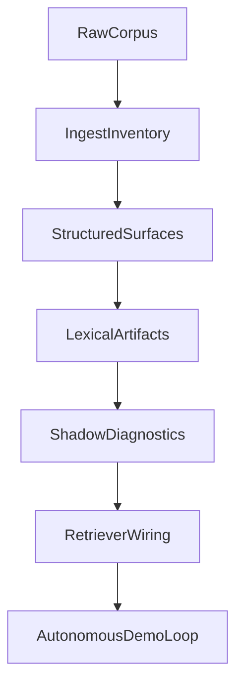

---
# Canonical super-plan for split-corpus retrieval through autonomous demo.
# Update `last_updated_at` and `changelog` on every substantive edit.
document_id: dmb-plan-split-corpus-autonomous-demo
title: Split-corpus retrieval to autonomous C1S1–C1S3 demo
document_class: plan
plan_kind: execution_super_plan
status: active
version: 5
created_at: "2026-05-09T00:00:00Z"
last_updated_at: "2026-05-09T20:41:00Z"
timezone_note: "Timestamps are UTC; local work may use America/Denver."
supersedes: []
superseded_by: null
related_documents:
  - path: Docs/Plans/CHECKLIST-dynamic-lexical-retrieval-rollout.md
    role: operational_tracker
  - path: Docs/Design/DECISION-world-campaign-knowledge-hierarchy.md
    role: decision_anchor
cursor_plan_mirror:
  path: .cursor/plans/phasebtoagenticdemo_16f63efa.plan.md
  note: >-
    Cursor may regenerate this file; this PLAN doc is the repo-canonical
    narrative. When rebaselining from IDE plans, diff against this file and
    merge intentional edits here.
demo_scope:
  campaign: Longmont Campaign 1
  sessions: [1, 2, 3]
  autonomy: fully_autonomous_with_benchmark_gates
milestones:
  - id: M1
    label: Phase A complete
  - id: M2
    label: Phase B lexical artifacts
  - id: M3
    label: Phase C-ready shadow gates
  - id: M4
    label: Demo-ready autonomous loop
changelog:
  - at: "2026-05-09T20:41:00Z"
    version: 5
    summary: >-
      Status correction after GitHub check: PR #1 remains OPEN while equivalent
      code is integrated on main; review state renamed accordingly.
  - at: "2026-05-09T20:39:00Z"
    version: 4
    summary: >-
      Post-merge doc sync: PR #1 moved from parked to merged + evaluated with
      follow-up on route-id derivation for directory-style hub_path values.
  - at: "2026-05-09T20:00:00Z"
    version: 3
    summary: >-
      PR #1 scope clarified (Phase 1 + early Phase 2); rubric adds registry
      hub_path shape check after reviewing PR diff vs live _npc_registry.json.
  - at: "2026-05-09T12:00:00Z"
    version: 2
    summary: >-
      Anchor GitHub PR #1 as deferred Phase 1 work with explicit judgment
      notation (parked_until_phase_gate + rubric).
  - at: "2026-05-09T00:00:00Z"
    version: 1
    summary: Initial canonical document from agreed super-plan.

# External PR anchor (post-integration state)
# Notation: plan_phase_primary / plan_phase_also_touches map work to phases;
# review_status captures current merge/review disposition.
external_pull_requests:
  - id: github-pr-1
    url: https://github.com/Drakosfire/DungeonMindBuddy/pull/1
    plan_phase_primary: "1"
    plan_phase_also_touches: "2"
    plan_phase_label: >-
      Phase 1 (RouteEquivalenceRecord schema + authority_effect) plus early
      Phase 2 (build/write route equivalence manifest from NPC registry).
    review_status: integrated_on_main_pr_open
    review_status_meaning: >-
      Equivalent content is integrated on main (see commit 731ca52), while the
      GitHub PR remains OPEN; follow-up items remain tracked for production-shape
      hub_path handling.
    judgment_record:
      verdict: accepted_with_followups
      evaluated_at: "2026-05-09T20:39:00Z"
      evaluator: cursor-agent
      notes: >-
        Accepted for merged Phase 1+early Phase 2 scope. Keep explicit follow-up:
        validate/fix route ID slug derivation against directory-style hub_path
        values in live _npc_registry.json (not only README.md-shaped paths).
    rubric_when_we_judge:
      - "Schemas are versioned; JSON/YAML shape is documented and test-covered."
      - "Authority semantics match DECISION (campaign authority vs world fallback); no silent flattening."
      - "No ungated live retrieval / ranking behavior change unless behind an explicit flag agreed in Phase 5."
      - "CI and targeted pytest for touched modules green; evidence pasted or linked in PR or checklist session log."
      - "Scope matches Phase 1 contract surface; unrelated refactors called out explicitly if present."
      - >-
        Route ID derivation matches real registry hub_path shapes (corpus-relative
        hub **directories** ending in …/NPCs/<slug>/); tests must not only cover
        README.md file paths if that is not production shape.
---

# Split-corpus retrieval to autonomous demo

## Purpose

Build a stepwise, benchmark-first path from current Phase A state to a **fully autonomous** agentic loop demo for **Campaign 1 sessions 1–3**, using split-corpus semantics (campaign authority + world fallback) **without** flattening authority. Treat benchmarking as a **reusable engine** (cohorts, diagnostics, artifacts), not one-off scripts.

## How to maintain this document

1. **Canonical copy lives here** (`Docs/Plans/PLAN-split-corpus-retrieval-to-autonomous-demo.md`).
2. On substantive change: bump `version` or append `changelog`, set `last_updated_at` to the edit time (UTC).
3. If a Cursor plan file diverges, **merge into this file** and treat the checklist + this PLAN as source of truth for the team.

## Goal and scope

- Deliver a fully autonomous agentic loop demo for C1S1–C1S3 with split-corpus semantics.
- Keep retrieval behavior stable until shadow diagnostics prove safety; benchmark expansion is a first-class deliverable.
- Anchor on:
  - [CHECKLIST-dynamic-lexical-retrieval-rollout.md](CHECKLIST-dynamic-lexical-retrieval-rollout.md) (phases A–E, reanchor block).
  - [DECISION-world-campaign-knowledge-hierarchy.md](../Design/DECISION-world-campaign-knowledge-hierarchy.md) (world vs campaign authority, roadmap).

## Architecture track

## Phase 0: Reanchor and close remaining Phase A red gate

- Re-run the deterministic alignment lane and close remaining hierarchy contract gaps before Phase B work.
- Confirm `audit_world_campaign_alignment` is green; record artifact path in the checklist session log.
- Advance checklist **Active phase** from A to B only after this gate is green.

**Primary files**

- [CHECKLIST-dynamic-lexical-retrieval-rollout.md](CHECKLIST-dynamic-lexical-retrieval-rollout.md)
- `evals/sentence_routing_retrieval_falsification/gold/breadcrumb_query_natural_c1s13_v1.json`
- `scripts/audit_world_campaign_alignment.py`

## Phase 1: Define Phase B contracts (schema-first)

- Versioned contracts for: route records, route-equivalence edges, entity candidates/resolution, lexical artifacts, shadow diagnostic rows.
- Encode authority explicitly (`campaign_authority`, `setting_fallback`, routing-only effects).
- Strict validation tests so malformed artifacts fail early.

### PR anchor (post-integration status)

| Field | Value |
|-------|--------|
| **PR** | [Drakosfire/DungeonMindBuddy#1](https://github.com/Drakosfire/DungeonMindBuddy/pull/1) |
| **Plan mapping** | **Primary:** Phase 1 (`RouteEquivalenceRecord`, defaults `authority_effect=routing_only`). **Also:** early Phase 2 (deterministic `build_route_equivalence_manifest` / JSONL writer). Not Phase 0. |
| **Review status** | `integrated_on_main_pr_open` — equivalent content is on `main` (commit `731ca52`), but PR #1 is still OPEN; judgment recorded with one follow-up on route-id derivation for directory-style `hub_path` values. |
| **Verdict (YAML)** | `external_pull_requests[0].judgment_record.verdict = accepted_with_followups` with `evaluated_at` and `evaluator` now populated. |

**Judgment rubric reference:** the bullets under `rubric_when_we_judge` remain the acceptance criteria baseline for follow-up validation and future related PRs.

**Primary files**

- `src/token_resolution/resolver.py`
- `tests/test_token_resolution_contracts.py`
- `tests/test_token_resolution_resolver.py`

## Phase 2: Deterministic lexical artifact generator (shadow-only)

- Deterministic generator: lexical handles and route equivalences from ingestion outputs and registries.
- Start with highest-confidence links (registry-backed campaign hub ↔ world fallback).
- Emit artifacts under `evals/sentence_routing_retrieval_falsification/artifacts/lexicon/` with manifest hash and provenance.
- Regression test: same inputs ⇒ byte-stable artifact.

**Primary files**

- `evals/sentence_routing_retrieval_falsification/token_resolver_shadow.py`
- `evals/sentence_routing_retrieval_falsification/breadcrumb_query_run.py`
- `tests/test_benchmark_lexicon_seeds.py`

## Phase 3: Expand benchmark engine (not just cases)

- Reusable surfaces: scenario packs (C1S1/C1S2/C1S3), generated-artifact lane, shadow diagnostic lane, authority-risk and over-routing metrics, canvas payload adapters.
- Failure taxonomy: missing lexical handle; retrieval ranking miss; gold authoring mismatch; authority violation risk.
- Comparable cohort summary for C1S1–C1S3.

**Primary files**

- `evals/sentence_routing_retrieval_falsification/README.md`
- `evals/sentence_routing_retrieval_falsification/breadcrumb_query_grader.py`
- `evals/sentence_routing_retrieval_falsification/breadcrumb_query_rank_report.py`

## Phase 4: Shadow diagnostics in canvases (evidence vs linkage)

- Separate: retrieved campaign evidence routes; retrieved world routes; linked fallback (not evidence); equivalence-adjusted hints; authority warnings.
- Keep existing pass/fail; add shadow lane marked non-authoritative.

**Primary files**

- `evals/sentence_routing_retrieval_falsification/breadcrumb_query_canvas_payload.py`
- `evals/sentence_routing_retrieval_falsification/c1s1_benchmark_canvas_emit.py`
- `canvases/c1s1-breadcrumb-query-benchmark-review.canvas.tsx`
- Same pattern for C1S2/C1S3 emitters and templates.

## Phase 5: Controlled retriever wiring (Phase C exit)

- Gate behind explicit flag; legacy lexical source as fallback.
- Deterministic tests: generated-only mode for C1S1–C1S3.
- Promotion gate (shadow → active): authority-risk violations = 0 on cohort; over-routing below threshold; no regression on context-support metrics.

**Primary files**

- `src/agent/session_memory_query.py`
- `evals/sentence_routing_retrieval_falsification/breadcrumb_query_run.py`
- `tests/test_breadcrumb_query_run_lexicon_records_jsonl.py`

## Phase 6: Autonomous C1S1–C1S3 agentic loop demo

- One-command runner: ingest/update records → generate lexical artifacts → retrieval benchmark cohort → diagnostics + canvas refresh → autonomous verdict + next action.
- Repeatable and scenario-pack expandable (no hardcoded session assumptions in the engine).
- Single operator runbook under `Docs/Plans/` (create when implementing this phase).

**Primary files**

- `evals/sentence_routing_retrieval_falsification/breadcrumb_query_run.py`
- [CHECKLIST-dynamic-lexical-retrieval-rollout.md](CHECKLIST-dynamic-lexical-retrieval-rollout.md)
- New runbook: `Docs/Plans/RUNBOOK-split-corpus-autonomous-demo.md` (placeholder name; add when Phase 6 starts)

## Benchmark engine requirements (cross-cutting)

- Every run emits durable artifacts by default (report JSON, cohort summary, canvas payload provenance).
- Cohort reports: cost metrics and regression vs prior baseline (see project cost-as-signal rules).
- Scenario schema: fast extension (new lanes, authority expectations, diagnostics) without rewriting runners.
- Failure reports: one success and one failure sample per active failure class.

## Risks and mitigations

| Risk | Mitigation |
|------|------------|
| Authority flattening via equivalence | `authority_effect` in schema; shadow-only first |
| Benchmark deflation (gold edited to pass) | Verify-before-debug; classify gold defects separately |
| Engine complexity drift | Deterministic fixtures/tests per lane |
| Autonomous loop false confidence | Promotion gate: quality + risk metrics |

## Milestone exit criteria

| ID | Criterion |
|----|-----------|
| M1 | Alignment audit green; checklist advanced to Phase B |
| M2 | Deterministic lexical artifacts + stable hashes + tests |
| M3 | Shadow diagnostics in cohort + canvas; safety gates passing |
| M4 | Fully autonomous C1S1–C1S3 one-command loop + expandable benchmark artifacts |

## Workstream checklist (mirror Cursor todos)

Track detailed todos in [CHECKLIST-dynamic-lexical-retrieval-rollout.md](CHECKLIST-dynamic-lexical-retrieval-rollout.md) session log, or duplicate here when batching work:

- [ ] Close Phase A hierarchy / alignment gate
- [ ] Phase B schemas + artifact generator
- [ ] Benchmark engine + cohort taxonomy
- [ ] Shadow → canvas
- [ ] Gated retriever wiring
- [ ] Autonomous demo + runbook

## Changelog (human-readable)

| Date (UTC) | Version | Summary |
|------------|---------|---------|
| 2026-05-09 | 5 | Corrected PR state: still OPEN on GitHub; content integrated on `main` (731ca52). |
| 2026-05-09 | 4 | Post-merge sync: PR #1 status moved to merged/evaluated; follow-up on route-id directory-shape handling. |
| 2026-05-09 | 3 | PR #1: dual Phase 1+2 scope note; rubric hub_path directory vs README. |
| 2026-05-09 | 2 | Anchored GitHub PR #1 under Phase 1 with `parked_until_phase_gate` and judgment rubric in frontmatter. |
| 2026-05-09 | 1 | Initial canonical plan; mirrors super-plan phases M1–M4. |
