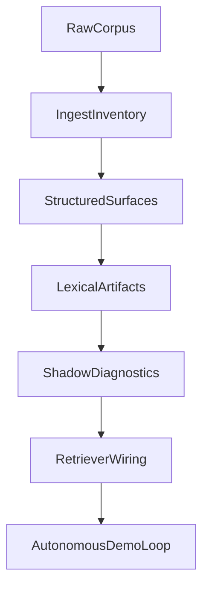

---
# Canonical super-plan for split-corpus retrieval through autonomous demo.
# Update `last_updated_at` and `changelog` on every substantive edit.
document_id: dmb-plan-split-corpus-autonomous-demo
title: Split-corpus retrieval to autonomous C1S1–C1S3 demo
document_class: plan
plan_kind: execution_super_plan
status: active
version: 10
created_at: "2026-05-09T00:00:00Z"
last_updated_at: "2026-05-10T16:35:00Z"
timezone_note: "Timestamps are UTC; local work may use America/Denver."
supersedes: []
superseded_by: null
related_documents:
  - path: Docs/Plans/CHECKLIST-dynamic-lexical-retrieval-rollout.md
    role: operational_tracker
  - path: Docs/Design/DECISION-world-campaign-knowledge-hierarchy.md
    role: decision_anchor
cursor_plan_mirror:
  path: .cursor/plans/phasebtoagenticdemo_16f63efa.plan.md
  note: >-
    Cursor may regenerate this file; this PLAN doc is the repo-canonical
    narrative. When rebaselining from IDE plans, diff against this file and
    merge intentional edits here.
demo_scope:
  campaign: Longmont Campaign 1
  sessions: [1, 2, 3]
  autonomy: fully_autonomous_with_benchmark_gates
milestones:
  - id: M1
    label: Phase A complete
  - id: M2
    label: Phase B lexical artifacts
  - id: M3
    label: Phase C-ready shadow gates
  - id: M4
    label: Demo-ready autonomous loop
execution_state:
  active_phase: B
  milestone_progress:
    M1: complete
    M2: in_progress
    M3: in_progress
    M4: not_started
  blockers: []
  next_gate_command: >-
    uv run python scripts/build_route_equivalence_manifests.py --check
    && uv run pytest tests/lexicon_phase_b/ -q
    && uv run pytest tests/test_breadcrumb_query_run_lexicon_records_jsonl.py -q
    (Phase C entry shadow consumer green on main after PR #4). Next substantive
    slices, in priority: (a) run `breadcrumb_query_run --route-equivalence-jsonl`
    against C1S1-C1S3 records to capture cohort `shadow_route_equivalences`
    baseline (Phase 4 diagnostics expansion / promotion-gate input); (b) broader
    Phase B remainder (manifest hash / provenance fields on artifacts,
    entity-candidate + lexical-handle artifacts under `artifacts/lexicon/`).
  flagged_followups:
    - >-
      Content quality of `location_hierarchy_equivalences` in
      `evals/sentence_routing_retrieval_falsification/gold/breadcrumb_query_natural_c1s13_v1.json`
      looks copy-pasted across two of three location-context scenarios; the
      audit only checks structure, not semantic correctness. Not a Phase A
      blocker. Tracked in `Backlog.md`.
    - >-
      `uv run python scripts/audit_world_campaign_alignment.py` can fail in a
      clean checkout when `out/evals/corpus_remote/normalization_manifest.json`
      is absent; document or generate that manifest before treating the audit as
      a portable gate (separate from route-equivalence JSONL lane).
  integration_notes:
    - >-
      PR #2 is MERGED to main (merge commit 545cf37, 2026-05-10T02:59Z): adds
      `src/lexicon_phase_b/` (`RouteEquivalenceRecord` + deterministic manifest
      builder) and `tests/lexicon_phase_b/` test layout that does not collide
      with `main`'s token-resolution tests; filters `entity_kind == "unknown"`
      edges; documents `source_type="npc_registry"` as registry-file lineage,
      not an NPC-only constraint.
    - >-
      PR #1 is CLOSED on GitHub (superseded by PR #2). Old branch
      `codex/implement-dynamic-lexical-artifact-generation` is no longer the
      canonical source for Phase 1 + early Phase 2 work.
    - >-
      Pre-merge gate runs: `uv run pytest tests/lexicon_phase_b/
      tests/test_token_resolution_resolver.py
      tests/test_token_resolution_contracts.py
      tests/test_benchmark_lexicon_seeds.py` -> 28 passed;
      `uv run python scripts/audit_world_campaign_alignment.py` -> PASS when
      the normalization manifest exists under the default path.
    - >-
      PR #3 is MERGED to main (merge commit 98c09aaf0fead2aaaf4b3a7c90afcb09bae8026f,
      2026-05-10T05:06Z): committed
      `evals/sentence_routing_retrieval_falsification/artifacts/lexicon/route_equivalence_longmont_c1_v1.jsonl`
      and `route_equivalence_longmont_c2_v1.jsonl`;
      `scripts/build_route_equivalence_manifests.py` (`--write` / `--check`);
      `tests/lexicon_phase_b/test_route_equivalence_artifacts_byte_stable.py`;
      `_is_campaign_path` treats relative `Longmont Campaign/...` registry paths
      as campaign (fixes wrong `elderwyld` prefix on `from_route_id`).
    - >-
      Route-id slug derivation for directory-style hub_path values lives in
      `src/lexicon_phase_b/route_equivalence_manifest.py` (`_entity_folder_name`
      + bucket-folder fallback) and is covered by
      `tests/lexicon_phase_b/test_route_id_path_shapes.py`.
    - >-
      PR #4 is MERGED to main (merge commit 21e84392da03095377b4de36defb82edfc37c741,
      2026-05-10T16:22Z): adds `src/lexicon_phase_b/route_equivalence_loader.py`
      (pure JSONL -> RouteEquivalenceRecord loader, exported via `__init__.py`),
      `evals/sentence_routing_retrieval_falsification/route_equivalence_shadow.py`
      (per-scenario `dmb_route_equivalence_shadow_v1` payload builder), and a
      `--route-equivalence-jsonl` (repeatable) CLI flag on `breadcrumb_query_run`.
      Field `shadow_route_equivalences` is emitted only when the flag is set;
      legacy retrieval / grading / `shadow_token_resolution` paths are unchanged.
      Pre-merge verification: `uv run python scripts/build_route_equivalence_manifests.py
      --check` -> OK; `uv run pytest tests/lexicon_phase_b/ -q` -> 17 passed;
      `uv run pytest tests/test_breadcrumb_query_run_lexicon_records_jsonl.py -q`
      -> 10 passed (round 2 added byte-identity-when-flag-unset and
      load-failure-emits-error harness-boundary tests).
changelog:
  - at: "2026-05-10T16:35:00Z"
    version: 10
    summary: >-
      PR #4 merged (21e84392): Phase C entry shadow consumer lands. Adds
      route_equivalence_loader.py (pure JSONL -> RouteEquivalenceRecord),
      route_equivalence_shadow.py (per-scenario dmb_route_equivalence_shadow_v1
      payload), and `--route-equivalence-jsonl` CLI flag on breadcrumb_query_run.
      Shadow-only: `shadow_route_equivalences` field appears only when flag set;
      legacy retrieval / grading / shadow_token_resolution unchanged. Round 2
      added harness-boundary tests (byte-identity when flag unset; structured
      error payload on load failure, never raises). milestone_progress: M3
      not_started -> in_progress. external_pull_requests gains github-pr-4 with
      rubric bullet for "test the boundary that owns the rubric". Checklist
      Reanchor / Phase C Evidence / Session log synced in companion edit;
      HANDOFF-phase-c-route-equivalence-shadow-consumer.md archived with
      completion banner.
  - at: "2026-05-10T06:00:00Z"
    version: 9
    summary: >-
      PR #3 merged (98c09aaf): committed route-equivalence JSONL under
      evals/.../artifacts/lexicon/, build_route_equivalence_manifests.py CLI
      with --check, byte-stable regression test, _is_campaign_path fix for
      relative Longmont paths. execution_state next_gate_command and snapshot
      updated; external_pull_requests gains github-pr-3; PR #2 judgment_record
      note corrected (Phase A gate verified before Phase B advance). Checklist
      Evidence/Reanchor synced in companion edit.
  - at: "2026-05-10T03:30:00Z"
    version: 8
    summary: >-
      Phase A re-verified green on current main (audit PASS, all C1S13
      hierarchy fields structurally present). Active phase advanced A -> B,
      M1 marked complete, M2 marked in_progress. C1S13 hierarchy content
      quality concern moved from blocker to flagged_followup tracked in
      Backlog.md. Old combined Phase A + route-id handoff retired and
      archived; replaced by narrow Phase B handoff.
  - at: "2026-05-10T03:10:00Z"
    version: 7
    summary: >-
      PR #2 merged to main (merge commit 545cf37) with `src/lexicon_phase_b/`
      and collision-safe `tests/lexicon_phase_b/` layout; PR #1 closed as
      superseded. Phase 1 contract surface and early Phase 2 builder now land
      on main without test-namespace collisions.
  - at: "2026-05-09T20:52:00Z"
    version: 6
    summary: >-
      Added explicit execution_state snapshot (active phase, milestones, blocker,
      next gate command, and PR/integration notes) to reflect current state.
  - at: "2026-05-09T20:41:00Z"
    version: 5
    summary: >-
      Status correction after GitHub check: PR #1 remains OPEN while equivalent
      code is integrated on main; review state renamed accordingly.
  - at: "2026-05-09T20:39:00Z"
    version: 4
    summary: >-
      Post-merge doc sync: PR #1 moved from parked to merged + evaluated with
      follow-up on route-id derivation for directory-style hub_path values.
  - at: "2026-05-09T20:00:00Z"
    version: 3
    summary: >-
      PR #1 scope clarified (Phase 1 + early Phase 2); rubric adds registry
      hub_path shape check after reviewing PR diff vs live _npc_registry.json.
  - at: "2026-05-09T12:00:00Z"
    version: 2
    summary: >-
      Anchor GitHub PR #1 as deferred Phase 1 work with explicit judgment
      notation (parked_until_phase_gate + rubric).
  - at: "2026-05-09T00:00:00Z"
    version: 1
    summary: Initial canonical document from agreed super-plan.

# External PR anchor (post-integration state)
# Notation: plan_phase_primary / plan_phase_also_touches map work to phases;
# review_status captures current merge/review disposition.
external_pull_requests:
  - id: github-pr-4
    url: https://github.com/Drakosfire/DungeonMindBuddy/pull/4
    plan_phase_primary: "5"
    plan_phase_also_touches: "2"
    plan_phase_label: >-
      Phase C entry: shadow-only consumption of route-equivalence JSONL by the
      breadcrumb_query_run harness behind --route-equivalence-jsonl, emitting a
      per-scenario `shadow_route_equivalences` diagnostic alongside the existing
      `shadow_token_resolution` lane. Legacy lexical seeds remain the active
      retrieval source. Opens M3.
    review_status: merged
    review_status_meaning: >-
      Merged to main on 2026-05-10T16:22Z (merge commit
      21e84392da03095377b4de36defb82edfc37c741) after two rounds of review.
      Round 1 (commit e36b5a1) landed the loader, shadow module, CLI flag, and
      loader-level tests but was REQUEST_CHANGES'd (demoted to COMMENT due to
      self-review GitHub policy) for not testing the harness-boundary safety
      contract. Round 2 (commit a5f3c1c) added two harness-level tests:
      `test_route_equivalence_flag_is_additive_only_at_harness_boundary` (proves
      byte-identity of all non-shadow fields when flag is unset) and
      `test_route_equivalence_load_failure_emits_error_payload_and_run_survives`
      (proves harness emits a structured error payload and never raises into
      the run). Final verification on a5f3c1c: §7 suite green
      (`tests/lexicon_phase_b/ -q` -> 17 passed; `tests/test_breadcrumb_query_run_lexicon_records_jsonl.py
      -q` -> 10 passed; `--check` OK on both manifests). Approved (verdict
      delivered as COMMENT banner + APPROVE intent due to self-review block).
    judgment_record:
      verdict: accepted
      evaluated_at: "2026-05-10T16:22:43Z"
      evaluator: cursor-agent
      notes: >-
        Round 1 illustrated the failure mode the rule now names explicitly
        (rubric bullet promised "byte-identical when flag unset" but no test
        exercised that property at the harness boundary; only the loader was
        unit-tested). Round 2 closed it. PR converts PR #3's committed
        artifacts from "produced" to "consumed" in shadow mode. Known parent-spec
        defect to track separately (not blocking merge): the
        `shadow_route_equivalences.source_paths` field stores Path.__str__ of
        the resolved input which is machine-dependent (absolute vs relative
        depends on the operator's CWD). Capture as a follow-up to make
        provenance fields workspace-relative when manifest-hash / provenance
        lane lands.
    rubric_when_we_judge:
      - "Shadow-only contract: when the new flag is unset, harness output is byte-identical (modulo the absent shadow field) to a run without the flag. **Must be tested at the harness boundary, not the loader.**"
      - "Load-failure mode: missing or malformed manifest emits a structured error payload in `shadow_route_equivalences` and the run survives; no exception leaks into retrieval/grading."
      - "New field `shadow_route_equivalences` uses an explicit schema id (`dmb_route_equivalence_shadow_v1`) and is omitted entirely when the flag is unset (no `null` placeholder)."
      - "Existing diagnostic field (`shadow_token_resolution`) and grading remain untouched; legacy lexical seeds remain the active retrieval source."
      - "Lexicon-only loader/tests live under `src/lexicon_phase_b/` and `tests/lexicon_phase_b/`; harness-level tests live next to the existing `tests/test_breadcrumb_query_run_lexicon_records_jsonl.py`."
      - "Allowlist held: PR diff exactly matches §4 of the handoff; nothing in the §5 denylist was touched (especially gold files, schemas, manifest builder)."
  - id: github-pr-3
    url: https://github.com/Drakosfire/DungeonMindBuddy/pull/3
    plan_phase_primary: "2"
    plan_phase_also_touches: "1"
    plan_phase_label: >-
      Phase B route-equivalence slice: committed JSONL artifacts, reproducible
      CLI (`--write` / `--check`), byte-stable regression on real registries,
      campaign-path classification fix for relative hub_path values.
    review_status: merged
    review_status_meaning: >-
      Merged to main on 2026-05-10T05:06Z (merge commit
      98c09aaf0fead2aaaf4b3a7c90afcb09bae8026f) after verification:
      `uv run python scripts/build_route_equivalence_manifests.py --check` OK;
      `uv run pytest tests/lexicon_phase_b/ -q` -> 16 passed.
    judgment_record:
      verdict: accepted
      evaluated_at: "2026-05-10T05:06:30Z"
      evaluator: cursor-agent
      notes: >-
        Lands canonical artifacts next to the falsification eval suite; does not
        change live retrieval. Complements PR #2 schema/builder with operator
        reproducibility and regression locks.
    rubric_when_we_judge:
      - "Committed JSONL matches `uv run python scripts/build_route_equivalence_manifests.py --check` on main."
      - "Byte-stable test pins real-registry outputs; no silent drift in from_route_id / campaign prefixing."
      - "Lexicon-only tests remain under tests/lexicon_phase_b/."
  - id: github-pr-2
    url: https://github.com/Drakosfire/DungeonMindBuddy/pull/2
    plan_phase_primary: "1"
    plan_phase_also_touches: "2"
    plan_phase_label: >-
      Phase 1 (RouteEquivalenceRecord schema + authority_effect) plus early
      Phase 2 (build/write route equivalence manifest from NPC registry),
      delivered with collision-safe tests/lexicon_phase_b/ layout.
    review_status: merged
    review_status_meaning: >-
      Merged to main on 2026-05-10T02:59Z (merge commit 545cf37) after fresh
      verification: lexicon_phase_b + token_resolution + benchmark_lexicon_seeds
      pytest suite (28 passed) and audit_world_campaign_alignment (PASS).
    judgment_record:
      verdict: accepted
      evaluated_at: "2026-05-10T02:59:15Z"
      evaluator: cursor-agent
      notes: >-
        PR supersedes PR #1. Adds directory-style hub_path handling via
        `_entity_folder_name` (and related helpers), filters entity_kind=="unknown"
        edges, documents source_type ("npc_registry" = registry file lineage,
        not NPC-only). Phase A structural gate was verified green before advancing
        active work to Phase B; PR #3 extends the route-equivalence lane with
        committed artifacts + CLI + byte-stable tests.
    rubric_when_we_judge:
      - "Schemas are versioned; JSON/YAML shape is documented and test-covered."
      - "Authority semantics match DECISION (campaign authority vs world fallback); no silent flattening."
      - "No ungated live retrieval / ranking behavior change unless behind an explicit flag agreed in Phase 5."
      - "CI and targeted pytest for touched modules green; evidence pasted or linked in PR or checklist session log."
      - "Scope matches Phase 1 contract surface; unrelated refactors called out explicitly if present."
      - >-
        Route ID derivation matches real registry hub_path shapes (corpus-relative
        hub **directories** ending in …/NPCs/<slug>/); tests cover both
        directory-shaped and README.md-shaped paths.
      - >-
        New test files do not collide with existing token-resolution test
        basenames on main; lexicon-only tests live under tests/lexicon_phase_b/.
  - id: github-pr-1
    url: https://github.com/Drakosfire/DungeonMindBuddy/pull/1
    plan_phase_primary: "1"
    plan_phase_also_touches: "2"
    plan_phase_label: >-
      Original Phase 1 + early Phase 2 attempt. Closed in favor of PR #2.
    review_status: closed_superseded
    review_status_meaning: >-
      Closed without merge on 2026-05-10. PR #2 (branch
      codex/implement-dynamic-lexical-artifact-generation-1br3xu) replaces it
      with collision-safe test layout, unknown-kind filter, and source_type
      docstring.
    judgment_record:
      verdict: superseded_by_pr_2
      evaluated_at: "2026-05-10T02:38:00Z"
      evaluator: cursor-agent
      notes: >-
        PR #1 added test files at tests/test_token_resolution_*.py /
        tests/test_benchmark_lexicon_seeds.py paths that already host different
        suites on main. Closing prevents wrong-side merge resolution from
        wiping main's token_resolution test coverage.
---

# Split-corpus retrieval to autonomous demo

## Purpose

Build a stepwise, benchmark-first path from current Phase A state to a **fully autonomous** agentic loop demo for **Campaign 1 sessions 1–3**, using split-corpus semantics (campaign authority + world fallback) **without** flattening authority. Treat benchmarking as a **reusable engine** (cohorts, diagnostics, artifacts), not one-off scripts.

## How to maintain this document

1. **Canonical copy lives here** (`Docs/Plans/PLAN-split-corpus-retrieval-to-autonomous-demo.md`).
2. On substantive change: bump `version` or append `changelog`, set `last_updated_at` to the edit time (UTC).
3. If a Cursor plan file diverges, **merge into this file** and treat the checklist + this PLAN as source of truth for the team.

## Goal and scope

- Deliver a fully autonomous agentic loop demo for C1S1–C1S3 with split-corpus semantics.
- Keep retrieval behavior stable until shadow diagnostics prove safety; benchmark expansion is a first-class deliverable.
- Anchor on:
  - [CHECKLIST-dynamic-lexical-retrieval-rollout.md](CHECKLIST-dynamic-lexical-retrieval-rollout.md) (phases A–E, reanchor block).
  - [DECISION-world-campaign-knowledge-hierarchy.md](../Design/DECISION-world-campaign-knowledge-hierarchy.md) (world vs campaign authority, roadmap).

## Current state snapshot

- Active phase is **B**; **M1 complete**, **M2 in progress** (route-equivalence **sub-lane landed**; broader M2: manifest hash / provenance, entity-candidate + lexical-handle surfaces still open), **M3 in progress** (Phase C entry shadow consumer landed via PR #4 — flag-gated, shadow-only; retriever wiring stays gated for Phase 5 exit), **M4 not started**.
- No Phase A structural blockers on a machine that has the alignment audit inputs. `scripts/audit_world_campaign_alignment.py` is **PASS** when `out/evals/corpus_remote/normalization_manifest.json` exists at the default path; see `flagged_followups` for clean-checkout caveat.
- **Phase C entry shadow consumer is merged:** **PR #4** (`main` merge commit `21e84392da03095377b4de36defb82edfc37c741`, 2026-05-10T16:22Z) adds `src/lexicon_phase_b/route_equivalence_loader.py`, `evals/sentence_routing_retrieval_falsification/route_equivalence_shadow.py`, and a `--route-equivalence-jsonl` (repeatable) CLI flag on `breadcrumb_query_run`. Per-scenario `shadow_route_equivalences` field is emitted only when the flag is set; legacy retrieval, grading, and `shadow_token_resolution` paths are unchanged. Handoff `Docs/Plans/archive/2026-05-10/handoffs/HANDOFF-phase-c-route-equivalence-shadow-consumer.md` is the historical context.
- **Route-equivalence artifact lane is merged:** **PR #3** (`main` merge commit `98c09aaf0fead2aaaf4b3a7c90afcb09bae8026f`, 2026-05-10T05:06Z) adds committed JSONL under `evals/sentence_routing_retrieval_falsification/artifacts/lexicon/`, `scripts/build_route_equivalence_manifests.py`, and `tests/lexicon_phase_b/test_route_equivalence_artifacts_byte_stable.py`. Handoff `Docs/Plans/archive/2026-05-10/handoffs/HANDOFF-phase-b-route-equivalence-artifact-output.md` describes the same slice; treat it as historical context for PR #3.
- **PR #2 merged** (`main` merge commit `545cf37`, 2026-05-10T02:59Z): `src/lexicon_phase_b/` (schema + deterministic manifest builder), `tests/lexicon_phase_b/` collision-safe layout, `unknown`-kind filter, documented `source_type="npc_registry"` lineage.
- **PR #1 closed** as superseded by PR #2.
- Flagged content-quality follow-up (not a phase blocker): `location_hierarchy_equivalences` in `breadcrumb_query_natural_c1s13_v1.json` looks copy-pasted across two of three scenarios. Tracked in `Backlog.md`; the structural audit cannot detect this.

## Architecture track

## Phase 0: Reanchor and close remaining Phase A red gate

- Re-run the deterministic alignment lane and close remaining hierarchy contract gaps before Phase B work.
- Confirm `audit_world_campaign_alignment` is green; record artifact path in the checklist session log.
- Advance checklist **Active phase** from A to B only after this gate is green.

**Primary files**

- [CHECKLIST-dynamic-lexical-retrieval-rollout.md](CHECKLIST-dynamic-lexical-retrieval-rollout.md)
- `evals/sentence_routing_retrieval_falsification/gold/breadcrumb_query_natural_c1s13_v1.json`
- `scripts/audit_world_campaign_alignment.py`

## Phase 1: Define Phase B contracts (schema-first)

- Versioned contracts for: route records, route-equivalence edges, entity candidates/resolution, lexical artifacts, shadow diagnostic rows.
- Encode authority explicitly (`campaign_authority`, `setting_fallback`, routing-only effects).
- Strict validation tests so malformed artifacts fail early.

### PR anchor (post-merge status)

| Field | Value |
|-------|--------|
| **Phase C entry shadow consumer PR** | [Drakosfire/DungeonMindBuddy#4](https://github.com/Drakosfire/DungeonMindBuddy/pull/4) — **MERGED** (merge commit `21e84392da03095377b4de36defb82edfc37c741`, 2026-05-10T16:22Z). Loader + shadow module + `--route-equivalence-jsonl` flag + harness-boundary safety tests. Shadow-only. |
| **Route-equivalence artifacts PR** | [Drakosfire/DungeonMindBuddy#3](https://github.com/Drakosfire/DungeonMindBuddy/pull/3) — **MERGED** (merge commit `98c09aaf0fead2aaaf4b3a7c90afcb09bae8026f`, 2026-05-10T05:06Z). Committed JSONL + CLI `--check` + byte-stable regression. |
| **Schema + builder PR** | [Drakosfire/DungeonMindBuddy#2](https://github.com/Drakosfire/DungeonMindBuddy/pull/2) — **MERGED** (merge commit `545cf37`, 2026-05-10T02:59Z). |
| **Superseded PR** | [Drakosfire/DungeonMindBuddy#1](https://github.com/Drakosfire/DungeonMindBuddy/pull/1) — **CLOSED**, superseded by #2 due to test-namespace collision risk on `main`. |
| **Plan mapping** | **PR #2:** Phase 1 + early Phase 2 builder. **PR #3:** Phase 2 route-equivalence committed artifacts + reproducibility gates. **PR #4:** Phase 5 entry (Phase C entry, shadow-only) — consumes PR #3 artifacts via `--route-equivalence-jsonl` and emits `shadow_route_equivalences` diagnostic alongside the existing `shadow_token_resolution` lane. Opens M3. |
| **Review status** | PR #4: `tests/lexicon_phase_b/ -q` -> 17 passed; `tests/test_breadcrumb_query_run_lexicon_records_jsonl.py -q` -> 10 passed (round 2 added harness-boundary safety tests after round 1 had only loader-level coverage). PR #3: `build_route_equivalence_manifests.py --check` OK; `tests/lexicon_phase_b/ -q` -> 16 passed. PR #2 pre-merge: combined pytest 28 passed + audit PASS when manifest present. |
| **Verdict (YAML)** | `github-pr-4`, `github-pr-3`, `github-pr-2` → `accepted`. PR #1 → `superseded_by_pr_2`. |

**Judgment rubric reference:** the bullets under `rubric_when_we_judge` on **PR #2** and **PR #3** in the YAML `external_pull_requests` list remain the acceptance criteria baseline for related future PRs, including the requirement that lexicon-only tests live under `tests/lexicon_phase_b/` to avoid collision with `tests/test_token_resolution_*` on `main`.

**Primary files (now landed on main)**

- `src/lexicon_phase_b/schemas.py` (`RouteEquivalenceRecord`, `EntityKind`, `AuthorityEffect`)
- `src/lexicon_phase_b/route_equivalence_manifest.py` (`_entity_folder_name`, `_is_campaign_path`, `build_route_equivalence_manifest`, `write_route_equivalence_manifest`)
- `scripts/build_route_equivalence_manifests.py` (`--write`, `--check`, `--out-dir`)
- `evals/sentence_routing_retrieval_falsification/artifacts/lexicon/route_equivalence_longmont_c1_v1.jsonl`
- `evals/sentence_routing_retrieval_falsification/artifacts/lexicon/route_equivalence_longmont_c2_v1.jsonl`
- `tests/lexicon_phase_b/test_route_equivalence_manifest.py`
- `tests/lexicon_phase_b/test_route_id_path_shapes.py`
- `tests/lexicon_phase_b/test_route_equivalence_record_defaults.py`
- `tests/lexicon_phase_b/test_route_equivalence_entity_kind_inference.py`
- `tests/lexicon_phase_b/test_route_equivalence_artifacts_byte_stable.py`

**Preserved on main (not touched by PR #2)**

- `src/token_resolution/resolver.py`
- `tests/test_token_resolution_contracts.py`
- `tests/test_token_resolution_resolver.py`
- `tests/test_benchmark_lexicon_seeds.py`

## Phase 2: Deterministic lexical artifact generator (shadow-only)

- Deterministic generator: lexical handles and route equivalences from ingestion outputs and registries.
- Start with highest-confidence links (registry-backed campaign hub ↔ world fallback).
- Emit artifacts under `evals/sentence_routing_retrieval_falsification/artifacts/lexicon/` with manifest hash and provenance.
- Regression test: same inputs ⇒ byte-stable artifact.

**Status (2026-05-10):** Route-equivalence JSONL for Longmont C1 and C2 is **committed** with `scripts/build_route_equivalence_manifests.py --check` and `test_route_equivalence_artifacts_byte_stable.py` (PR #3). PR #4 added the **shadow consumer** path: a pure JSONL loader (`src/lexicon_phase_b/route_equivalence_loader.py`), a per-scenario diagnostic builder (`evals/sentence_routing_retrieval_falsification/route_equivalence_shadow.py`), and a `--route-equivalence-jsonl` flag on `breadcrumb_query_run` that emits `shadow_route_equivalences` (`dmb_route_equivalence_shadow_v1`) alongside the existing `shadow_token_resolution` lane — shadow-only, no retrieval/grading effect. Remaining Phase 2 scope: broader lexical handles, manifest hash / provenance fields on the JSONL artifacts, entity-candidate + lexical-handle artifacts under the same byte-stable contract.

**Primary files**

- `scripts/build_route_equivalence_manifests.py` and committed `route_equivalence_longmont_c*_v1.jsonl` (above)
- `evals/sentence_routing_retrieval_falsification/token_resolver_shadow.py`
- `evals/sentence_routing_retrieval_falsification/breadcrumb_query_run.py`
- `tests/test_benchmark_lexicon_seeds.py`

## Phase 3: Expand benchmark engine (not just cases)

- Reusable surfaces: scenario packs (C1S1/C1S2/C1S3), generated-artifact lane, shadow diagnostic lane, authority-risk and over-routing metrics, canvas payload adapters.
- Failure taxonomy: missing lexical handle; retrieval ranking miss; gold authoring mismatch; authority violation risk.
- Comparable cohort summary for C1S1–C1S3.

**Primary files**

- `evals/sentence_routing_retrieval_falsification/README.md`
- `evals/sentence_routing_retrieval_falsification/breadcrumb_query_grader.py`
- `evals/sentence_routing_retrieval_falsification/breadcrumb_query_rank_report.py`

## Phase 4: Shadow diagnostics in canvases (evidence vs linkage)

- Separate: retrieved campaign evidence routes; retrieved world routes; linked fallback (not evidence); equivalence-adjusted hints; authority warnings.
- Keep existing pass/fail; add shadow lane marked non-authoritative.

**Primary files**

- `evals/sentence_routing_retrieval_falsification/breadcrumb_query_canvas_payload.py`
- `evals/sentence_routing_retrieval_falsification/c1s1_benchmark_canvas_emit.py`
- `canvases/c1s1-breadcrumb-query-benchmark-review.canvas.tsx`
- Same pattern for C1S2/C1S3 emitters and templates.

## Phase 5: Controlled retriever wiring (Phase C entry → exit)

- Gate behind explicit flag; legacy lexical source as fallback.
- Deterministic tests: generated-only mode for C1S1–C1S3.
- Promotion gate (shadow → active): authority-risk violations = 0 on cohort; over-routing below threshold; no regression on context-support metrics.

**Status (2026-05-10):** Phase C **entry** shadow consumer landed via **PR #4** (merge commit `21e84392`). The harness now optionally consumes the committed route-equivalence JSONL behind `--route-equivalence-jsonl` and emits `shadow_route_equivalences` per scenario. Retriever still uses legacy lexical seeds; the promotion gate (shadow → active wiring) is the **exit**. Two harness-boundary safety tests guard the contract:
- `test_route_equivalence_flag_is_additive_only_at_harness_boundary` — proves byte-identity of all non-shadow fields when the flag is unset.
- `test_route_equivalence_load_failure_emits_error_payload_and_run_survives` — proves harness emits a structured error payload and never raises into the run.

**Primary files**

- `src/lexicon_phase_b/route_equivalence_loader.py` (PR #4)
- `evals/sentence_routing_retrieval_falsification/route_equivalence_shadow.py` (PR #4)
- `evals/sentence_routing_retrieval_falsification/breadcrumb_query_run.py` (extended in PR #4)
- `tests/test_breadcrumb_query_run_lexicon_records_jsonl.py` (extended in PR #4)
- `src/agent/session_memory_query.py` (Phase C **exit**: not yet wired; legacy seeds remain authoritative)

## Phase 6: Autonomous C1S1–C1S3 agentic loop demo

- One-command runner: ingest/update records → generate lexical artifacts → retrieval benchmark cohort → diagnostics + canvas refresh → autonomous verdict + next action.
- Repeatable and scenario-pack expandable (no hardcoded session assumptions in the engine).
- Single operator runbook under `Docs/Plans/` (create when implementing this phase).

**Primary files**

- `evals/sentence_routing_retrieval_falsification/breadcrumb_query_run.py`
- [CHECKLIST-dynamic-lexical-retrieval-rollout.md](CHECKLIST-dynamic-lexical-retrieval-rollout.md)
- New runbook: `Docs/Plans/RUNBOOK-split-corpus-autonomous-demo.md` (placeholder name; add when Phase 6 starts)

## Benchmark engine requirements (cross-cutting)

- Every run emits durable artifacts by default (report JSON, cohort summary, canvas payload provenance).
- Cohort reports: cost metrics and regression vs prior baseline (see project cost-as-signal rules).
- Scenario schema: fast extension (new lanes, authority expectations, diagnostics) without rewriting runners.
- Failure reports: one success and one failure sample per active failure class.

## Risks and mitigations

| Risk | Mitigation |
|------|------------|
| Authority flattening via equivalence | `authority_effect` in schema; shadow-only first |
| Benchmark deflation (gold edited to pass) | Verify-before-debug; classify gold defects separately |
| Engine complexity drift | Deterministic fixtures/tests per lane |
| Autonomous loop false confidence | Promotion gate: quality + risk metrics |

## Milestone exit criteria

| ID | Criterion |
|----|-----------|
| M1 | Alignment audit green; checklist advanced to Phase B |
| M2 | Deterministic lexical artifacts + stable hashes + tests |
| M3 | Shadow diagnostics in cohort + canvas; safety gates passing |
| M4 | Fully autonomous C1S1–C1S3 one-command loop + expandable benchmark artifacts |

## Workstream checklist (mirror Cursor todos)

Track detailed todos in [CHECKLIST-dynamic-lexical-retrieval-rollout.md](CHECKLIST-dynamic-lexical-retrieval-rollout.md) session log, or duplicate here when batching work:

- [x] Close Phase A hierarchy / alignment gate
- [x] Phase B route-equivalence lane: schema, builder, committed JSONL, CLI `--check`, byte-stable tests (PR #2 + PR #3)
- [x] Phase C entry: shadow consumer of route-equivalence JSONL behind `--route-equivalence-jsonl` flag, with harness-boundary safety tests (PR #4)
- [ ] Phase B remainder: manifest hash / provenance, entity-candidate + lexical-handle artifacts per contracts above
- [ ] Benchmark engine + cohort taxonomy
- [ ] Shadow → canvas
- [ ] Gated retriever wiring (Phase C exit / promotion gate)
- [ ] Autonomous demo + runbook

## Changelog (human-readable)

| Date (UTC) | Version | Summary |
|------------|---------|---------|
| 2026-05-10 | 10 | PR #4 merged (`21e84392`): Phase C entry shadow consumer lands. New `route_equivalence_loader.py`, `route_equivalence_shadow.py`, `--route-equivalence-jsonl` CLI flag, and harness-boundary safety tests (byte-identity-when-flag-unset, load-failure-emits-error). Shadow-only — no retrieval/grading change. `milestone_progress.M3: not_started -> in_progress`. `external_pull_requests` gains `github-pr-4` with the new "test the boundary that owns the rubric" bullet. Checklist Reanchor / Phase C Evidence / Session log synced; `HANDOFF-phase-c-route-equivalence-shadow-consumer.md` archived. |
| 2026-05-10 | 9 | PR #3 merged (`98c09aaf`): committed route-equivalence JSONL, `build_route_equivalence_manifests.py` CLI, byte-stable test, `_is_campaign_path` fix. Plan snapshot, `external_pull_requests`, PR table, Phase 2 status, and workstream checkboxes updated; checklist Evidence/Reanchor synced. |
| 2026-05-10 | 8 | Phase A re-verified green on current `main`; active phase advanced A -> B; M1 complete, M2 in progress. Old Phase A + route-id handoff retired. C1S13 hierarchy content concern moved to flagged follow-up in `Backlog.md`. |
| 2026-05-10 | 7 | PR #2 merged to `main` (merge commit `545cf37`); PR #1 closed as superseded. Phase 1 contract + early Phase 2 builder land with collision-safe `tests/lexicon_phase_b/` layout, unknown-kind filter, `source_type` lineage doc. |
| 2026-05-09 | 6 | Added explicit current execution-state snapshot (phase, blockers, gate command, PR/integration notes). |
| 2026-05-09 | 5 | Corrected PR state: still OPEN on GitHub; content integrated on `main` (731ca52). |
| 2026-05-09 | 4 | Post-merge sync: PR #1 status moved to merged/evaluated; follow-up on route-id directory-shape handling. |
| 2026-05-09 | 3 | PR #1: dual Phase 1+2 scope note; rubric hub_path directory vs README. |
| 2026-05-09 | 2 | Anchored GitHub PR #1 under Phase 1 with `parked_until_phase_gate` and judgment rubric in frontmatter. |
| 2026-05-09 | 1 | Initial canonical plan; mirrors super-plan phases M1–M4. |
