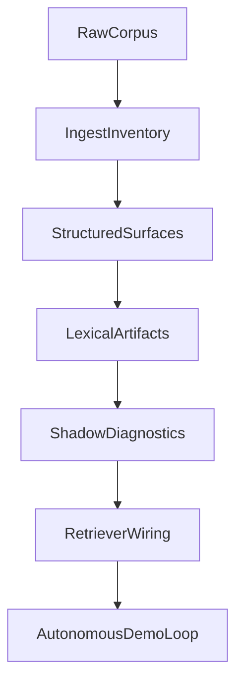

---
# Canonical super-plan for split-corpus retrieval through autonomous demo.
# Update `last_updated_at` and `changelog` on every substantive edit.
document_id: dmb-plan-split-corpus-autonomous-demo
title: Split-corpus retrieval to autonomous C1S1–C1S3 demo
document_class: plan
plan_kind: execution_super_plan
status: active
version: 29
created_at: "2026-05-09T00:00:00Z"
last_updated_at: "2026-05-13T16:50:00Z"
timezone_note: "Timestamps are UTC; local work may use America/Denver."
supersedes: []
superseded_by: null
related_documents:
  - path: Docs/Plans/CHECKLIST-dynamic-lexical-retrieval-rollout.md
    role: operational_tracker
  - path: Docs/Design/DECISION-world-campaign-knowledge-hierarchy.md
    role: decision_anchor
cursor_plan_mirror:
  path: .cursor/plans/phasebtoagenticdemo_16f63efa.plan.md
  note: >-
    Cursor may regenerate this file; this PLAN doc is the repo-canonical
    narrative. When rebaselining from IDE plans, diff against this file and
    merge intentional edits here.
demo_scope:
  campaign: Longmont Campaign 1
  sessions: [1, 2, 3]
  autonomy: fully_autonomous_with_benchmark_gates
milestones:
  - id: M1
    label: Phase A complete
  - id: M2
    label: Phase B lexical artifacts
  - id: M3
    label: Phase C-ready shadow gates
  - id: M4
    label: Demo-ready autonomous loop
execution_state:
  active_phase: B
  milestone_progress:
    M1: complete
    M2: in_progress
    M3: complete
    M4: not_started
  blockers: []
  next_gate_command: >-
    PR #22 **MERGED** to `main` (merge commit `64b7546dbf72bed6feb911408c7f28cec2d008fd`, 2026-05-13T16:43:34Z): **default-equivalence alias safety baseline** — query-text-gated compact entity aliases in **`breadcrumb_query_run.py`** (no manifest-wide injection; gold-free activation); **`_STRUCTURAL_ROUTE_ALIAS_TOKENS`** / **`_is_structural_route_alias`** + **`test_compact_aliases_for_route_id_blocks_structural_segments`** (round 2); refreshed committed **`cohort_baseline_*`**, **`cohort_l3_ab_delta_*`**, **`cohort_l3_ab_question_delta_*`** + eval README; **§4 thirteen-path** allowlist; §7 **passed** on verified PR head **`1de5524e08b2f3b697794c6162a3b7a37e957c86`** (`test_breadcrumb_query_run_lexicon_records_jsonl` **20**; `test_cohort_baseline_run` **29**; `build_route_equivalence_manifests.py --check` OK; tight + natural + C1S13 cohort **`--check`** / **`--check-delta`** / **`--check-question-delta`** OK; question-delta summaries **0 regressed / 0 improved** on all three manifests); cost **$0**. **PR #21** **MERGED** to `main` (merge commit `eabd3a83024b9cabe4a07cc22e4f072512730096`, 2026-05-13T15:23:54Z): question-delta **`scenario_level_delta_path`** footgun — **`_effective_delta_for_args`** in **`cohort_baseline_run`** for **`--write-question-delta`** / **`--check-question-delta`** when **`--delta`** is default; regenerated committed **`cohort_l3_ab_question_delta_c1s13_v1.json`** + **`cohort_l3_ab_question_delta_natural_v1.json`**; **§4 four-path** allowlist; §7 **passed** on verified PR head **`075ced328c59de89dfc47eeac7fe2ee7402fa93c`** (`test_cohort_baseline_run` **29**; C1S13 + natural + default **`--check-question-delta`** OK; heredoc smoke still parent-owned); cost **$0**. **PR #20** **MERGED** to `main` (merge commit `bb19d22910c4fb8720704ad6469d35165620936e`, 2026-05-13T14:11:45Z): L3 question deep-dive **canvas presentation** only — **`cohort_l3_question_deep_dive_canvas_emit`** + three **`canvases/cohort-l3-ab-question-deep-dive*.canvas.tsx`** + tests; **§4 five-path** allowlist; §7 **passed** on verified PR head **`0f7d93cf26dcbfc71f6bdf771aa6bf543af84673`** (`test_cohort_l3_question_deep_dive_canvas_emit` **3**; `test_cursor_canvas_paths` **5**; emitter regenerations; manual C1S13 `python -c` smoke where verify heredoc-split; cost **$0**). **PR #19** **MERGED** to `main` (merge commit `75996c52cb074f8c46d8e8615a422605e566c963`, 2026-05-13T03:20:11Z): cohort runner **default** `--write`/`--check` lane is **equivalence-augmented** (promoted summaries); legacy baseline isolated behind explicit **`--mode baseline`**; committed **`cohort_baseline_*`** (tight/natural/C1S13) + C1S13 scenario report pair under **`artifacts/baselines/`** refreshed; **`c1s13_holdout_l3_deep_dive_canvas_emit`** labels promoted-vs-legacy — **§4 nine-path** allowlist; §7 **passed** on verified PR head **`010898348b9905b3917f56dc6a2235c3ec119411`** (`test_cohort_baseline_run` **25**; `test_c1s13_holdout_l3_deep_dive_canvas_emit` **2**; promoted-default **`--check`** trio + **`--check-delta`** / **`--check-question-delta`** OK; legacy **`--mode baseline`** `/tmp/` smoke OK; cost **$0**). **PR #12** **`promotion_gate_candidate.status:none_found`** still blocks **alias-saturation / broader production default** promotion fork; **harness default ranking flags** unchanged from PR #18 (scene-beat packet lane remains opt-in). **PR #18** **MERGED** to `main` (merge commit `545bd08892481ef2169deabaa4b1739ea77d46ba`, 2026-05-13T01:40:16Z): opt-in scene-beat **packet** retrieval — **§4 allowlist 8/8**; §7 **passed** on verified head **`efd2807d902fbdaac911d762efbdbad82ea2246e`** (session-memory + breadcrumb + cohort pytest slices; `materialize_session_memory.py --all-blessed --check`; cohort `--check`; C1S13 `--check-question-delta` OK; temp scene-packet question-delta smoke shows **`scene_beat_packet_summary`** with **`questions_with_packet_units_added` 21**, **`total_packet_units_added` 90**, populated **`packet_beat_ids`**, and per-question packet traces including **`stormspire_activity_arrival`** `packets[]` with **`beat_id`**, **`score`**, **`first_pass_unit_ids`**, **`packet_unit_ids`**; cost **$0**). **Default retrieval / committed `cohort_l3_ab_*` unchanged**; **PR #12** **`promotion_gate_candidate.status:none_found`** still blocks default flip. **PR #17** **MERGED** to `main` (merge commit `28e98a89e591e7203d0b163d2ab445ac11509995`, 2026-05-12T22:14:57Z): **candidate scene-beat rebenchmark wiring** — strict **§4 allowlist 11/11**; §7 **passed** on verified head **`32727f69693b66eb10cd4c4be94e3115763f43c4`** (`test_scene_beat_memory` + `test_session_memory_query` **12**; `test_breadcrumb_query_run_lexicon_records_jsonl` **13**; `test_cohort_baseline_run` **23**; corpus memory `--all-blessed --check` OK; cohort `--check` + C1S13 `--check-question-delta` OK; temp C1S13 scene-beat question-delta smoke OK). Beat-enriched meta **`record_count` 63**, **`records_with_beat_id` 62**, **`beat_count` 12**; temp readout **improved 0 / regressed 0 / unchanged_pass 16 / unchanged_fail 9** with failure buckets **`passed` 16**, **`missing_lexical_handle` 2**, **`retriever_support_gap` 7**; live unit-annotation smoke cost **~$0.15** (within prior C1S13 annotation envelope). **Default retrieval / committed `cohort_l3_ab_*` artifacts unchanged**; **PR #12** **`promotion_gate_candidate.status:none_found`** still blocks default flip. **Next fork:** promotion acceptance criteria vs wider falsification cohorts vs further gold audit/normalization — scene-beat lane did **not** clear remaining C1S13 failures. Prior **PR #16** **MERGED** to `main` (merge commit `7978cd06151e6104fe064eba2e4c0fed1bb9a8f3`, 2026-05-12T20:24:05Z): L3 question-delta **failure diagnostics** — strict **§4 allowlist 6/6**; §7 **passed** on verified head **`e110be86a423488d3ddd366af3d35e18f5817650`** (`test_cohort_baseline_run` **22**; canvas compatibility **6**; lexicon + breadcrumb harness **37**; three committed question-delta regenerations + **`--check-question-delta`** trio **OK**); committed artifacts now carry per-question **`failure_diagnostic`** + top-level **`failure_diagnostic_summary`** with closed buckets (`passed`, `equivalence_helped`, `ranking_regression`, `missing_lexical_handle`, `retriever_support_gap`, `gold_or_rubric_gap`); readout unchanged on tight/natural/C1S13 summaries vs pre-merge lanes; **`llm_enabled`** **False**, **`retrieval_only`** **True**; cost **$0**. **Default retrieval / ranking unchanged**; **PR #12** **`promotion_gate_candidate.status:none_found`** still blocks default flip. **Next fork:** promotion acceptance criteria vs wider falsification cohorts vs further gold audit/normalization — now with machine-classified failure buckets on committed question-delta JSON. Prior **PR #15** **MERGED** to `main` (merge commit `27b3eea7dd87331758ddd07e5919c5094f6702bd`, 2026-05-12T01:32:31Z): C1S13 **hierarchy gold audit** — **`fetch`/allowlist** **1/1** (single gold file); §7 **passed** (`audit_world_campaign_alignment`, gold parse probe, temp **`cohort_baseline_run`** `--mode both` with `/tmp/…` delta + question-delta writes, temp readout); temp question-delta summary **`question_count`** **25**, **`regressed`** **0**, **`improved`** **0**, **`unchanged_pass`** **0**, **`unchanged_fail`** **25**; **`llm_enabled`** **False**, **`retrieval_only`** **True**; cost **$0**. **Wolf/Mossglade** `location_hierarchy_equivalences` **corrected**; **`unchanged_fail` saturation unchanged** (no retrieval pass signal yet). Prior **PR #13** five-path **`c1s13_v1`** + **PR #14** prerequisite remain the frozen-lane baseline under this doc state. **PR #12** alias-saturation still **`promotion_gate_candidate.status: none_found`**. **Promotion to default retrieval remains blocked** pending **broader judgment path** — **promotion criteria** vs **wider falsification cohorts** vs **further gold audit/normalization** (not a missing-ingest unblocker). **Next fork:** pick among those three; optional follow-up PR may **refresh frozen** C1S13 baselines/deltas **if** we scope regeneration after rubric trust work.
    uv run python scripts/build_route_equivalence_manifests.py --check
    && uv run pytest tests/lexicon_phase_b/ -q
    && uv run pytest tests/test_breadcrumb_query_run_lexicon_records_jsonl.py -q
    && uv run pytest tests/test_cohort_baseline_run.py -q
    && uv run pytest tests/test_cohort_l3_question_deep_dive_canvas_emit.py -q
    && uv run pytest tests/test_c1s13_holdout_l3_deep_dive_canvas_emit.py -q
    && uv run python -m evals.sentence_routing_retrieval_falsification.cohort_baseline_run --check
    && uv run python -m evals.sentence_routing_retrieval_falsification.cohort_baseline_run --check-delta
    && uv run python -m evals.sentence_routing_retrieval_falsification.cohort_baseline_run --check-question-delta
    && uv run python -m evals.sentence_routing_retrieval_falsification.cohort_baseline_run --manifest evals/sentence_routing_retrieval_falsification/cohorts/natural_v1.json --baseline evals/sentence_routing_retrieval_falsification/artifacts/baselines/cohort_baseline_natural_v1.json --check
    && uv run python -m evals.sentence_routing_retrieval_falsification.cohort_baseline_run --manifest evals/sentence_routing_retrieval_falsification/cohorts/natural_v1.json --delta evals/sentence_routing_retrieval_falsification/artifacts/baselines/cohort_l3_ab_delta_natural_v1.json --check-delta
    && uv run python -m evals.sentence_routing_retrieval_falsification.cohort_baseline_run --manifest evals/sentence_routing_retrieval_falsification/cohorts/natural_v1.json --check-question-delta evals/sentence_routing_retrieval_falsification/artifacts/baselines/cohort_l3_ab_question_delta_natural_v1.json
    && uv run python -m evals.sentence_routing_retrieval_falsification.cohort_l3_question_deep_dive_canvas_emit
    && uv run python -m evals.sentence_routing_retrieval_falsification.cohort_l3_question_deep_dive_canvas_emit --input evals/sentence_routing_retrieval_falsification/artifacts/baselines/cohort_l3_ab_question_delta_natural_v1.json --output canvases/cohort-l3-ab-question-deep-dive-natural-v1.canvas.tsx
    && uv run pytest tests/test_cohort_l3_alias_saturation_canvas_emit.py -q
    && uv run python -m evals.sentence_routing_retrieval_falsification.cohort_l3_alias_saturation_canvas_emit --input evals/sentence_routing_retrieval_falsification/artifacts/baselines/cohort_l3_ab_question_delta_c1s1_to_c1s3_v1.json --input evals/sentence_routing_retrieval_falsification/artifacts/baselines/cohort_l3_ab_question_delta_natural_v1.json --output canvases/cohort-l3-alias-saturation.canvas.tsx
    && uv run python -m evals.sentence_routing_retrieval_falsification.cohort_baseline_run --manifest evals/sentence_routing_retrieval_falsification/cohorts/c1s13_v1.json --baseline evals/sentence_routing_retrieval_falsification/artifacts/baselines/cohort_baseline_c1s13_v1.json --check
    && uv run python -m evals.sentence_routing_retrieval_falsification.cohort_baseline_run --manifest evals/sentence_routing_retrieval_falsification/cohorts/c1s13_v1.json --delta evals/sentence_routing_retrieval_falsification/artifacts/baselines/cohort_l3_ab_delta_c1s13_v1.json --check-delta
    && uv run python -m evals.sentence_routing_retrieval_falsification.cohort_baseline_run --manifest evals/sentence_routing_retrieval_falsification/cohorts/c1s13_v1.json --check-question-delta evals/sentence_routing_retrieval_falsification/artifacts/baselines/cohort_l3_ab_question_delta_c1s13_v1.json
    && uv run python -m evals.sentence_routing_retrieval_falsification.cohort_l3_question_deep_dive_canvas_emit --input evals/sentence_routing_retrieval_falsification/artifacts/baselines/cohort_l3_ab_question_delta_c1s13_v1.json --output canvases/cohort-l3-ab-question-deep-dive-c1s13-v1.canvas.tsx
    && uv run python -m evals.sentence_routing_retrieval_falsification.c1s13_holdout_l3_deep_dive_canvas_emit
  flagged_followups:
    - >-
      PR #15 addressed the **Wolf** / **Mossglade** mis-mappings in
      `breadcrumb_query_natural_c1s13_v1.json`; residual C1S13 hierarchy rows and
      **structural** vs **semantic** audit split remain documented in `Backlog.md`
      when new scenarios or ambiguous corpus edges appear — not a Phase A blocker.
    - >-
      `uv run python scripts/audit_world_campaign_alignment.py` can fail in a
      clean checkout when `out/evals/corpus_remote/normalization_manifest.json`
      is absent; document or generate that manifest before treating the audit as
      a portable gate (separate from route-equivalence JSONL lane).
  integration_notes:
    - >-
      PR #22 is MERGED to main (merge commit 64b7546dbf72bed6feb911408c7f28cec2d008fd, 2026-05-13T16:43:34Z): `breadcrumb_query_run.py` query-text-gated compact route-equivalence aliases for ranking (no manifest-wide injection; gold-free); structural-token guard + `test_compact_aliases_for_route_id_blocks_structural_segments`; refreshed committed `cohort_baseline_*`, `cohort_l3_ab_delta_*`, `cohort_l3_ab_question_delta_*` + eval README; thirteen-path §4 allowlist; §7 green on head `1de5524e08b2f3b697794c6162a3b7a37e957c86` (`test_breadcrumb_query_run_lexicon_records_jsonl` **20**; `test_cohort_baseline_run` **29**; manifest `--check`; cohort check trio all manifests). Cost $0. `github-pr-22` judgment + rubric below; `HANDOFF-pr22-equivalence-alias-safety-baseline.md` archived under `Docs/Plans/archive/2026-05-13/handoffs/`.
    - >-
      PR #21 is MERGED to main (merge commit eabd3a83024b9cabe4a07cc22e4f072512730096, 2026-05-13T15:23:54Z): `cohort_baseline_run.py` `_effective_delta_for_args` — manifest-default scenario-level delta for question-delta write/check without trusting stale JSON `scenario_level_delta_path`; committed `cohort_l3_ab_question_delta_c1s13_v1.json` + `cohort_l3_ab_question_delta_natural_v1.json` regenerated; four-path allowlist; §7 green on head `075ced328c59de89dfc47eeac7fe2ee7402fa93c` (29 cohort tests; C1S13 + natural + default question-delta checks). Cost $0. `github-pr-21` judgment + rubric below; `HANDOFF-pr21-c1s13-question-delta-path.md` archived under `Docs/Plans/archive/2026-05-13/handoffs/`.
    - >-
      PR #20 is MERGED to main (merge commit bb19d22910c4fb8720704ad6469d35165620936e, 2026-05-13T14:11:45Z): L3 question deep-dive canvas presentation refresh — `cohort_l3_question_deep_dive_canvas_emit.py` + three generated `canvases/cohort-l3-ab-question-deep-dive*.canvas.tsx` + `tests/test_cohort_l3_question_deep_dive_canvas_emit.py`; five-path allowlist; presentation-only (no cohort runner, gold, or retrieval changes). §7 green on head `0f7d93cf26dcbfc71f6bdf771aa6bf543af84673` (pytest slices; manual C1S13 smoke). Cost $0. `github-pr-20` judgment + rubric below; `HANDOFF-pr20-c1s13-l3-canvas-presentation.md` archived under `Docs/Plans/archive/2026-05-13/handoffs/`.
    - >-
      PR #19 is MERGED to main (merge commit 75996c52cb074f8c46d8e8615a422605e566c963,
      2026-05-13T03:20:11Z): cohort `cohort_baseline_run` default `--write`/`--check` is equivalence-augmented; legacy baseline behind `--mode baseline`; committed `cohort_baseline_*` + C1S13 scenario report pair refreshed; `c1s13_holdout_l3_deep_dive_canvas_emit` promoted-vs-legacy labels; nine-path allowlist; §7 passed on PR head `010898348b9905b3917f56dc6a2235c3ec119411` (cohort tests 25; holdout emitter tests 2; CLI checks + legacy /tmp smoke; holdout emitter module run). Cost $0. PR #12 `promotion_gate_candidate:none_found` still constrains alias-saturation production promotion; harness default ranking unchanged from PR #18. `github-pr-19` judgment + rubric below; `HANDOFF-pr19-deprecate-baseline-promote-equivalence.md` archived under `Docs/Plans/archive/2026-05-13/handoffs/`.
    - >-
      PR #18 is MERGED to main (merge commit 545bd08892481ef2169deabaa4b1739ea77d46ba,
      2026-05-13T01:40:16Z): opt-in scene-beat **packet** retrieval — `session_memory_query.py` packet scoring/surfacing before `_expand_hits`,
      harness `--use-scene-beat-packets` + row `scene_beat_packets`, cohort scene-beat question-delta lane emits `scene_beat_packet_summary` + per-question packet telemetry;
      eight-path allowlist; §7 passed on head `efd2807d902fbdaac911d762efbdbad82ea2246e` (pytest slices + `--all-blessed --check` + cohort `--check` + C1S13 `--check-question-delta`; temp packet smoke shows `questions_with_packet_units_added` 21, `total_packet_units_added` 90, populated `packet_beat_ids`).
      Default retrieval and committed `cohort_l3_ab_*` unchanged; PR #12 `promotion_gate_candidate:none_found` still constrains default flip. `github-pr-18` judgment + rubric below; `HANDOFF-pr18-scene-packet-retrieval.md` archived under `Docs/Plans/archive/2026-05-13/handoffs/`.
    - >-
      PR #17 is MERGED to main (merge commit 28e98a89e591e7203d0b163d2ab445ac11509995,
      2026-05-12T22:14:57Z): candidate scene-beat rebenchmark lane — `scene_beat_memory.py`,
      `enrich_records_with_beat_ids`, opt-in same-beat expansion in `session_memory_query.py` +
      breadcrumb harness flags, and `cohort_baseline_run.py` `--scene-beat-records-jsonl` /
      `--write-scene-beat-question-delta` (`dmb_breadcrumb_query_cohort_scene_beat_question_delta_v1`);
      eleven-path allowlist; §7 passed on head `32727f69` (scene-beat + session-memory tests 12;
      breadcrumb harness 13; cohort tests 23; corpus memory `--all-blessed --check` OK; cohort
      `--check` + C1S13 `--check-question-delta` OK; temp scene-beat question-delta smoke OK).
      Temp C1S13 readout improved 0 / regressed 0 / unchanged_pass 16 / unchanged_fail 9; beat meta
      record_count 63, records_with_beat_id 62, beat_count 12; live annotation smoke ~$0.15.
      Default retrieval and committed `cohort_l3_ab_*` artifacts unchanged; PR #12
      `promotion_gate_candidate:none_found` still constrains default flip. Final review round
      REQUEST_CHANGES on stale PR-body paste only; merged by operator request after verify green.
      Review ids `4276161552`, `4276396966`, `4276504774`, `4276596681`. `github-pr-17` judgment +
      rubric below; `HANDOFF-pr17-scene-beat-rebenchmark-wiring.md` archived under
      `Docs/Plans/archive/2026-05-12/handoffs/`.
    - >-
      PR #16 is MERGED to main (merge commit 7978cd06151e6104fe064eba2e4c0fed1bb9a8f3,
      2026-05-12T20:24:05Z): deterministic L3 question-delta failure diagnostics on
      `cohort_baseline_run.py` — per-question `failure_diagnostic` + top-level
      `failure_diagnostic_summary`; regenerated committed tight/natural/C1S13 question-delta
      JSON only (six-path allowlist). Round 1 requested classifier fix for route-loss
      regression (count comparison vs explicit lost-route set); round 2 on head `e110be8`
      closed with helper test for equal-count route swap. Final review: APPROVE posted
      COMMENTED (self-review fallback, review id `4275831033`). `github-pr-16` judgment +
      rubric below; `HANDOFF-pr16-phase-c-question-delta-failure-diagnostics.md` archived
      under `Docs/Plans/archive/2026-05-12/handoffs/`. Promotion/default-equivalence ranking
      unchanged; PR #12 `promotion_gate_candidate:none_found` still constrains default flip.
    - >-
      Corpus session-memory promotion (2026-05-12): blessed pilot breadcrumbs and committed
      `_session_memory/*.records_meta.{jsonl,json}` live under
      `corpus/eldyrwild-markdown/Longmont Campaign/Campaign N/Session Recaps/` per
      `Docs/CONVENTION-Session-Recap-Breadcrumbs-And-Memory.md`; cohort manifests
      `c1s1_to_c1s3_v1`, `c1s13_v1`, and `natural_v1` now reference corpus JSONL paths;
      eval `artifacts/*_norm_smoke.records_meta.*` duplicates retired. C1S13 holdout
      readout after inline-tagged breadcrumb + corpus memory: frozen baseline aggregate
      **16/25 pass** (was **0/25** on routeless records); companion meta
      **`records_with_routes` 56** (was **0**); question-delta summary
      **regressed 4 / improved 2 / unchanged_pass 12 / unchanged_fail 7**. Retrieval-only
      verification: `materialize_session_memory.py --all-blessed --check` OK; cohort
      `--check` + C1S13 `--check-delta` / `--check-question-delta` OK. Cost **$0**.
    - >-
      PR #15 is MERGED to main (merge commit 27b3eea7dd87331758ddd07e5919c5094f6702bd,
      2026-05-12T01:32:31Z): **single-file** gold rubric repair — **`breadcrumb_query_natural_c1s13_v1.json`** only; strict **§4 allowlist 1/1** on `fetch`/`verify`;
      §7 structural audit + gold parse + temp holdout **`cohort_baseline_run`** (`/tmp/c1s13_l3_*_post_gold_audit.json`) + readout **passed**; temp **`question_count` 25** summary **regressed 0 / improved 0 / unchanged_pass 0 / unchanged_fail 25**;
      **retrieval-only** / **$0**. Corrects **Wolf**/**Mossglade** hierarchy children vs Stormspire-family mis-attach; **does not** clear **`unchanged_fail`** saturation — interpretive trust improves, **promotion** still **blocked** (PR #12 **`none_found`** + holdout buckets).
      Final review: **APPROVE** posted **`COMMENTED`** (self-review fallback, review id **`4268511628`**). **`github-pr-15`** judgment + rubric below; **`HANDOFF-pr15-c1s13-hierarchy-gold-audit.md`** archived under `Docs/Plans/archive/2026-05-11/handoffs/`.
    - >-
      PR #13 is MERGED to main (merge commit 761bd007af6e47210dc69a1a60b8afc42c751822,
      2026-05-12T00:48:43Z): **accepted after** PR #14 prerequisite (`HANDOFF-pr13-addendum-option2-c1s13-records-prereq` spine) landed the missing
      `c1s13_norm_smoke.records_meta.{jsonl,json}`. Ships **five** holdout cohort paths only (`cohorts/c1s13_v1.json` + frozen baseline + L3 scenario delta +
      L3 question delta + generated `cohort-l3-ab-question-deep-dive-c1s13-v1.canvas.tsx`): **§4 allowlist 5/5**; **`test_cohort_baseline_run`** **19**
      passed at verified head **`fd8c4c6d1affbaa3f8dc45c3ee4c729ee2f228c5`**; **`test_cohort_l3_question_deep_dive_canvas_emit`** **3**
      passed; **`cohort_baseline_run`** baseline / delta / question-delta **check modes** OK on **`c1s13_v1`**; holdout **`cohort_l3_ab_question_delta_c1s13_v1`**
      readout **`question_count`** **25**, summary **`regressed:0`** **`improved:0`** **`unchanged_pass:0`** **`unchanged_fail:25`**; holdout baseline
      **`llm_enabled`** **False**, **`retrieval_only`** **True**; caveat in PR narrative preserves **possible gold-quality** explanation for **`unchanged_fail`**
      rows pending hierarchy-content audit — not framed as verified retrieval regressions alone. Final review: APPROVE requested, posted **`COMMENTED`**
      (self-review fallback, review id **`4268385088`**); cost **`$0`**. Separate lane unchanged: PR #12 combined payload still **`promotion_gate_candidate.status:none_found`**.
      **`github-pr-13`** judgment + tightened rubrics recorded below; **`HANDOFF-pr13`** + addendum archived under `Docs/Plans/archive/2026-05-11/handoffs/`.
      Promotion remains blocked (**`none_found`** **plus** holdout **`unchanged_fail`** saturation); **`execution_state`** narrative points **next gate** toward
      deciding **gold-audit** vs **promotion-rule / acceptance-criteria revision** vs **wider falsification cohorts**.
    - >-
      PR #14 is MERGED to main (merge commit 3e1f32a551b3600f77531a0708da18e89a1e5bd1,
      2026-05-12T00:22:14Z): **prerequisite input only** for **PR #13** (Option‑2 unblocker from
      `HANDOFF-pr13-addendum-option2-c1s13-records-prereq`) — adds exactly **two files** under
      `evals/sentence_routing_retrieval_falsification/artifacts/`: `c1s13_norm_smoke.records_meta.jsonl`
      and `c1s13_norm_smoke.records_meta.json`. Committed shapes: **`rows`** **68**, **`unit_count`**
      **68**, **`records_with_routes`** **0**, JSONL **size_bytes** **31286** — **no**
      retrieval/cohort-runner code edits, **no** gold edits, **no** frozen baseline/delta/canvas outputs
      in this PR (those remain PR #13 scope). Parent review: APPROVE demoted to COMMENTED (self‑review fallback,
      review id `4268310498`), PR head verified `4cc593429417ac0f457e7ba10583065069891fbd`; cost **$0**.
      **Historical prerequisite (#13 unblock):** missing `…/c1s13_norm_smoke.records_meta.jsonl` cleared before PR #13 landed; downstream holdout regeneration is now on `main` via PR #13 merge `761bd007af6e47210dc69a1a60b8afc42c751822`.
    - >-
      PR #12 is MERGED to main (merge commit 7eface014b3d5824a11d29ad1e91ed67c153711f,
      2026-05-11T20:37:15Z): alias-saturation diagnostics — new emitter
      `cohort_l3_alias_saturation_canvas_emit.py`, tests
      `tests/test_cohort_l3_alias_saturation_canvas_emit.py`, README documentation, generated
      `canvases/cohort-l3-alias-saturation.canvas.tsx` (**strict four-file allowlist**). Parent
      verification on PR head 00659b29d84dbbae57cc8ccd2567d925454a6b9c: existing deep-dive emitter
      tests **3** + cohort **19** + alias-saturation **3** passed; combined payload readout
      `question_count` **56**, `verdict_counts` `regressed:2 improved:1 unchanged_pass:49 unchanged_fail:4`,
      `promotion_gate_candidate.status` **none_found** under current rule; retrieval-only invariants true
      for tight + natural committed cohort summaries (`llm_enabled False`, `retrieval_only True`).
      APPROVE demoted to COMMENTED (self-review fallback, review id `4267219742`). Cost $0.
      **Reanchor:** promotion to default remains blocked; threshold-scan evidence shows no candidate
      threshold under the packaged gate, so default-flip arguments cannot claim an untested alias-count
      separation without changing the rule or the inputs.
    - >-
      PR #11 is MERGED to main (merge commit eec38807ea1866e63b5997e21558968d7559ea16,
      2026-05-11T19:39:14Z): wider-cohort `natural_v1` A/B baselines plus manifest-aware
      boundary checks. Adds committed `cohorts/natural_v1.json`,
      `artifacts/baselines/cohort_baseline_natural_v1.json`,
      `cohort_l3_ab_delta_natural_v1.json`, `cohort_l3_ab_question_delta_natural_v1.json`,
      and generated canvas `canvases/cohort-l3-ab-question-deep-dive-natural-v1.canvas.tsx`.
      `cohort_baseline_run.py` now forwards caller `--manifest` through `--check-delta` and
      `--check-question-delta` reruns, and question-delta metadata reflects the active
      delta lane path. `cohort_l3_question_deep_dive_canvas_emit.py` gains `--input`/`--output`
      while preserving defaults. Parent verification on PR head `eaae0ab103d5c1fd82c534d72e37dc8e6ebb6448`:
      lexicon **25**; cohort tests **19**; emitter tests **3**; natural baseline/delta/question-delta
      checks all OK; natural question artifact summary `regressed:0 improved:1 unchanged_pass:7 unchanged_fail:4`;
      retrieval-only assertions `llm_enabled False`, `retrieval_only True`. APPROVE demoted to
      COMMENTED (self-review fallback, review id `4266836748`). Cost $0.
    - >-
      PR #10 is MERGED to main (merge commit c75c3f6b622b35658eafd0a5b1641421b791357e,
      2026-05-11T14:54:48Z): per-question L3 deep-dive diagnostics + canvas emitter —
      `cohort_baseline_run.py` adds deterministic `--write-question-delta` /
      `--check-question-delta` contract; committed
      `artifacts/baselines/cohort_l3_ab_question_delta_c1s1_to_c1s3_v1.json`
      (`dmb_breadcrumb_query_cohort_l3_question_delta_v1`, `question_count: 44`,
      summary `regressed:2 improved:0 unchanged_pass:42 unchanged_fail:0`);
      new emitter `cohort_l3_question_deep_dive_canvas_emit.py` writes
      `canvases/cohort-l3-ab-question-deep-dive.canvas.tsx` with generated markers.
      Tests: lexicon **25**; cohort tests **17**; emitter tests **2**; baseline `--check` OK;
      scenario-delta `--check-delta` OK; question-delta smoke + `--check-question-delta` OK.
      Review APPROVE demoted to COMMENTED under self-review fallback (review id `4264759583`).
      Slice is diagnostics-only (no retrieval/default flip, no gold/producer edits), cost $0.
    - >-
      PR #9 is MERGED to main (merge commit 976512e94df62e42a27d1a41aa876a2561a0cb70,
      2026-05-11T04:13:54Z): Phase C **exit** slice (A/B sprint **L3**) — `breadcrumb_query_run.py`
      adds `--use-route-equivalence-for-ranking` (additive `query_spec.query_token_aliases` from
      loaded `RouteEquivalenceRecord` list; `ranking_augmented_by_equivalences` row field);
      `cohort_baseline_run.py` adds `--mode baseline|with-equivalence|both`, `--write-delta` /
      `--check-delta`, replaces hardcoded canvas skip triple with `--skip-<scenario_id>-canvas-refresh`;
      committed `artifacts/baselines/cohort_l3_ab_delta_c1s1_to_c1s3_v1.json`. Tests: lexicon **25**;
      breadcrumb harness **12**; cohort **15**; `build_route_equivalence_manifests.py --check` OK;
      `cohort_baseline_run --check` OK v2; `--write --baseline` smoke BYTE-IDENTICAL vs v2 baseline;
      `--check-delta` OK committed delta. Pre-merge verification on PR head `c89ba7f4ce7f8dfa74fef0e1e8d7d9215180b692`:
      §7 #6 in handoff used wrong CLI (`--write /path`); substantive byte-identity re-verified with
      `--write --baseline /path`. Verdict APPROVE demoted to COMMENTED (self-review fallback, review id
      `4260705957`). **Tight-cohort A/B headline:** `with_equivalence_all_ok_count` **1** vs baseline **3**
      (`scenarios_regressed: 2` in delta summary) — slice surfaces real ranking-pressure regression, not noise.
    - >-
      PR #8 is MERGED to main (merge commit adeb060911be35f4f477cb15eaf701ab7d409fbf,
      2026-05-11T03:45:24Z): producer route-equivalence JSONL **`0.3.0`** —
      `RouteEquivalenceRecord` gains `producer_registry_path`, `producer_registry_sha256`,
      `route_equivalence_manifest_hash`; `build_route_equivalence_manifest` computes
      preimage per handoff §6.2 (sorted `record_id`, `model_dump(exclude={hash})`,
      `json.dumps(..., sort_keys=True)`, joined SHA-256); committed
      `evals/.../artifacts/lexicon/route_equivalence_longmont_c{1,2}_v1.jsonl` regenerated;
      loader admits `0.3.0`; lexicon tests + byte-stable + manifest preimage test extended.
      Pre-merge verification on PR head `91fb12ee1b09e03b6653148124e5a2f8816dbcdc`: lexicon
      **25** passed; byte-stable **10**; loader **6**; manifest **4**; record defaults **1**;
      `build_route_equivalence_manifests.py --check` OK both; breadcrumb harness **12**;
      cohort **13**; `cohort_baseline_run --check` OK v2; probes: one manifest hash per file,
      schema `0.3.0`, one registry sha256 per c1 file, workspace-relative `producer_registry_path`.
      No edits to `breadcrumb_query_run.py`, `cohort_baseline_run.py`, `route_equivalence_shadow.py`,
      gold, or baselines. Verdict APPROVE demoted to COMMENTED (self-review fallback, review id
      `4260634217`). One non-blocking review note: preimage-sensitivity test mutates registry file
      (registry sha256 co-changes); future test can isolate semantic edge-only mutation in-memory.
    - >-
      PR #7 is MERGED to main (merge commit 0036df30e5f53abd7ba76ab510483a9e1df0d3fa,
      2026-05-11T02:59:47Z): A/B sprint **L2** — additive per-row
      `expected_route_substring_breakdown` in `breadcrumb_query_run.py` (reuses
      `hits_cover_expected_routes`); `cohort_baseline_run.py` derives
      `recall_via_equivalence` + `recall_via_equivalence_aggregate`; schema bump to
      `dmb_breadcrumb_query_cohort_summary_v2`; frozen baseline
      `artifacts/baselines/cohort_baseline_c1s1_to_c1s3_v2.json` (v1 file removed).
      Tests: breadcrumb harness 12, cohort runner 13, combined with lexicon 22
      -> 47 passed on PR head `2bc6ad9e`; cohort `--check` OK; `--write` smoke
      BYTE-IDENTICAL vs committed v2 baseline; `canvases/` clean. APPROVE demoted to
      COMMENTED (self-review fallback, review id `4260504200`). No retrieval, grader,
      gold, producer JSONL, or shadow-module edits. Tight cohort: all three scenarios
      `recall_via_equivalence: null` (denominator zero — load-bearing readout).
    - >-
      PR #6 is MERGED to main (merge commit 9af4741a635125d3403d66a9f266564f25bad746,
      2026-05-11T01:49:53Z): A/B sprint **L1** — `cohort_baseline_run.py` CLI,
      committed cohort manifest `cohorts/c1s1_to_c1s3_v1.json`, frozen curated
      byte-stable summary `artifacts/baselines/cohort_baseline_c1s1_to_c1s3_v1.json`
      (`dmb_breadcrumb_query_cohort_summary_v1`), `tests/test_cohort_baseline_run.py`
      (9 tests including harness-boundary CWD invariance on the full curated JSON).
      Single round (PR head `06280c87`); APPROVE demoted to COMMENTED (self-review
      fallback, review id `4260316552`). §7 green: lexicon 22, breadcrumb harness 11,
      manifest `--check` OK, cohort 9 + CWD test, `--check` OK baseline,
      `--write` vs committed file BYTE-IDENTICAL, `canvases/` clean. No changes to
      `breadcrumb_query_run.py`, `route_equivalence_shadow.py`, producer paths,
      gold, or grader. Cost $0 (`--retrieval-only`).
    - >-
      PR #5 is MERGED to main (merge commit 40be747a87d0eecb4dc1c865f236f3728cf1d4d4,
      2026-05-10T21:09Z): makes `shadow_route_equivalences.source_paths`
      workspace-relative POSIX strings rendered at the harness boundary, so
      the field is byte-identical regardless of operator CWD or absolute
      install path. Adds `_workspace_relative_posix(path, workspace_root)` to
      `evals/sentence_routing_retrieval_falsification/route_equivalence_shadow.py`;
      `build_route_equivalence_shadow_payload` gains a required
      `workspace_root: Path` kwarg; the harness passes
      `_HARNESS_WORKSPACE_ROOT = Path(__file__).resolve().parents[2]` from
      `evals/sentence_routing_retrieval_falsification/breadcrumb_query_run.py`.
      New harness-boundary test
      `test_route_equivalence_source_paths_are_workspace_relative_and_cwd_invariant`
      spawns `breadcrumb_query_run` from `_REPO_ROOT` and from
      `_REPO_ROOT / "tests"` via `uv run --directory _REPO_ROOT …` and asserts
      full-payload byte-identity, not just source_paths equality. Single round
      of review (commit ec1f55fa); APPROVE demoted to COMMENTED via the
      standard self-review fallback. Pre-merge verification:
      `uv run pytest tests/lexicon_phase_b/ -q` -> 22 passed (unchanged from
      main; producer-side untouched);
      `uv run pytest tests/test_breadcrumb_query_run_lexicon_records_jsonl.py -q`
      -> 11 passed (was 10; the new harness-boundary test is the +1);
      `uv run python scripts/build_route_equivalence_manifests.py --check`
      -> OK both manifests; smoke run + `python -c` byte-string assertion
      printed the expected workspace-relative POSIX list. Unblocks the next
      slice: a byte-stable cohort `shadow_route_equivalences` baseline for
      C1S1-C1S3.
    - >-
      PR #2 is MERGED to main (merge commit 545cf37, 2026-05-10T02:59Z): adds
      `src/lexicon_phase_b/` (`RouteEquivalenceRecord` + deterministic manifest
      builder) and `tests/lexicon_phase_b/` test layout that does not collide
      with `main`'s token-resolution tests; filters `entity_kind == "unknown"`
      edges; documents `source_type="npc_registry"` as registry-file lineage,
      not an NPC-only constraint.
    - >-
      PR #1 is CLOSED on GitHub (superseded by PR #2). Old branch
      `codex/implement-dynamic-lexical-artifact-generation` is no longer the
      canonical source for Phase 1 + early Phase 2 work.
    - >-
      Pre-merge gate runs: `uv run pytest tests/lexicon_phase_b/
      tests/test_token_resolution_resolver.py
      tests/test_token_resolution_contracts.py
      tests/test_benchmark_lexicon_seeds.py` -> 28 passed;
      `uv run python scripts/audit_world_campaign_alignment.py` -> PASS when
      the normalization manifest exists under the default path.
    - >-
      PR #3 is MERGED to main (merge commit 98c09aaf0fead2aaaf4b3a7c90afcb09bae8026f,
      2026-05-10T05:06Z): committed
      `evals/sentence_routing_retrieval_falsification/artifacts/lexicon/route_equivalence_longmont_c1_v1.jsonl`
      and `route_equivalence_longmont_c2_v1.jsonl`;
      `scripts/build_route_equivalence_manifests.py` (`--write` / `--check`);
      `tests/lexicon_phase_b/test_route_equivalence_artifacts_byte_stable.py`;
      `_is_campaign_path` treats relative `Longmont Campaign/...` registry paths
      as campaign (fixes wrong `elderwyld` prefix on `from_route_id`).
    - >-
      Route-id slug derivation for directory-style hub_path values lives in
      `src/lexicon_phase_b/route_equivalence_manifest.py` (`_entity_folder_name`
      + bucket-folder fallback) and is covered by
      `tests/lexicon_phase_b/test_route_id_path_shapes.py`.
    - >-
      PR #4 is MERGED to main (merge commit 21e84392da03095377b4de36defb82edfc37c741,
      2026-05-10T16:22Z): adds `src/lexicon_phase_b/route_equivalence_loader.py`
      (pure JSONL -> RouteEquivalenceRecord loader, exported via `__init__.py`),
      `evals/sentence_routing_retrieval_falsification/route_equivalence_shadow.py`
      (per-scenario `dmb_route_equivalence_shadow_v1` payload builder), and a
      `--route-equivalence-jsonl` (repeatable) CLI flag on `breadcrumb_query_run`.
      Field `shadow_route_equivalences` is emitted only when the flag is set;
      legacy retrieval / grading / `shadow_token_resolution` paths are unchanged.
      Pre-merge verification: `uv run python scripts/build_route_equivalence_manifests.py
      --check` -> OK; `uv run pytest tests/lexicon_phase_b/ -q` -> 17 passed;
      `uv run pytest tests/test_breadcrumb_query_run_lexicon_records_jsonl.py -q`
      -> 10 passed (round 2 added byte-identity-when-flag-unset and
      load-failure-emits-error harness-boundary tests).
changelog:
  - at: "2026-05-13T16:43:34Z"
    version: 29
    summary: >-
      PR #22 merged (64b7546dbf72bed6feb911408c7f28cec2d008fd): query-text-gated compact route-equivalence aliases in `breadcrumb_query_run.py`; structural-token guard + direct test; refreshed committed baselines + L3 deltas/question-deltas + README; thirteen-path allowlist; §7 on `1de5524e08b2f3b697794c6162a3b7a37e957c86` (20 breadcrumb harness tests; 29 cohort tests; cohort check trio). Cost $0. Added `github-pr-22`; next_gate narrative + integration note + verdict table + judgment rubric + snapshot + workstream checklist; handoff archived `archive/2026-05-13/handoffs/HANDOFF-pr22-equivalence-alias-safety-baseline.md`.
  - at: "2026-05-13T15:23:54Z"
    version: 28
    summary: >-
      PR #21 merged (eabd3a83024b9cabe4a07cc22e4f072512730096): `_effective_delta_for_args` for question-delta write/check; regenerated C1S13 + natural committed `cohort_l3_ab_question_delta_*.json` pointers; four-path allowlist; §7 on `075ced328c59de89dfc47eeac7fe2ee7402fa93c` (29 cohort tests; question-delta checks). Cost $0. Added `github-pr-21`; next_gate narrative + integration note + verdict table + judgment rubric reference; handoff archived `archive/2026-05-13/handoffs/`. Updated `github-pr-20` judgment note (PR #21 no longer “pending follow-up”).
  - at: "2026-05-13T14:11:45Z"
    version: 27
    summary: >-
      PR #20 merged (bb19d22910c4fb8720704ad6469d35165620936e): L3 question deep-dive canvas presentation — cohort title + summary/failure_diagnostic_summary header, per-card bucket/reasons/support_ratio_delta, compact baseline-vs-default must-hit grid for regressed/unchanged_fail, open unchanged_fail by default; five-path allowlist (`cohort_l3_question_deep_dive_canvas_emit.py`, tests, three generated canvases). §7 green on PR head (emitter tests 3; cursor_canvas_paths 5; manual C1S13 smoke via `python -c` because `review_external_pr.py verify` line-splits heredocs). Cost $0. Added `github-pr-20`; integration note; verdict table + judgment rubric reference; handoff archived under `archive/2026-05-13/handoffs/`.
  - at: "2026-05-13T03:20:11Z"
    version: 26
    summary: >-
      PR #19 merged (75996c52cb074f8c46d8e8615a422605e566c963): promote equivalence-augmented cohort summary as default --write/--check lane; legacy baseline behind --mode baseline; refresh committed cohort_baseline_* + C1S13 scenario report pair; c1s13_holdout deep-dive emitter labels; nine-path allowlist; §7 passed on head 010898348
      (test_cohort_baseline_run 25; test_c1s13_holdout_l3_deep_dive_canvas_emit 2; cohort --check / --check-delta / --check-question-delta OK; legacy /tmp smoke OK; c1s13_holdout_l3_deep_dive_canvas_emit OK). Cost $0. Added github-pr-19; next_gate_command + integration note + workstream checklist + verdict table + judgment rubric reference + primary-files bullets updated;
      atomic doc-sync archived HANDOFF-pr19 under archive/2026-05-13/handoffs/ + checklist session log + Reanchor + PR header line.
  - at: "2026-05-13T01:40:16Z"
    version: 25
    summary: >-
      PR #18 merged (545bd08892481ef2169deabaa4b1739ea77d46ba): opt-in scene-beat packet retrieval — strict allowlist 8/8; §7 passed on head efd2807d9
      (session-memory + harness + cohort pytest slices; corpus --all-blessed --check; cohort --check + C1S13 --check-question-delta OK; temp packet question-delta smoke shows
      scene_beat_packet_summary with questions_with_packet_units_added 21, total_packet_units_added 90, packet_beat_ids populated). Default retrieval and committed cohort_l3_ab_* unchanged;
      promotion still blocked (PR #12 none_found). Added github-pr-18; execution_state + integration note + workstream checklist + verdict table + judgment rubric reference updated;
      atomic doc-sync archived HANDOFF-pr18 under archive/2026-05-13/handoffs/ + checklist session log + Reanchor + PR header lines.
  - at: "2026-05-12T22:14:57Z"
    version: 24
    summary: >-
      PR #17 merged (28e98a89e591e7203d0b163d2ab445ac11509995): candidate scene-beat rebenchmark wiring — strict allowlist 11/11; §7 passed on head 32727f69
      (scene-beat + session-memory tests 12; breadcrumb harness 13; cohort tests 23; corpus memory --all-blessed --check OK; cohort --check + C1S13 --check-question-delta OK;
      temp scene-beat question-delta smoke OK). Temp C1S13 readout improved 0 / regressed 0 / unchanged_pass 16 / unchanged_fail 9; beat meta record_count 63,
      records_with_beat_id 62, beat_count 12; live annotation smoke ~$0.15. Default retrieval and committed cohort_l3_ab_* artifacts unchanged; promotion still blocked
      (PR #12 none_found). Added github-pr-17; execution_state + integration note updated; atomic doc-sync archived HANDOFF-pr17 under archive/2026-05-12/handoffs/ +
      checklist session log + Reanchor.
  - at: "2026-05-12T20:24:05Z"
    version: 23
    summary: >-
      PR #16 merged (7978cd06151e6104fe064eba2e4c0fed1bb9a8f3): L3 question-delta failure diagnostics — strict allowlist 6/6; §7 passed on head e110be8
      (cohort tests 22; canvas compatibility 6; lexicon+breadcrumb 37; question-delta regenerate + check trio OK); committed tight/natural/C1S13 question-delta
      JSON now include failure_diagnostic + failure_diagnostic_summary; ranking/default retrieval unchanged; promotion still blocked (PR #12 none_found). Added
      github-pr-16; execution_state + integration note + current-state snapshot + workstream checklist updated; atomic doc-sync archived HANDOFF-pr16 under
      archive/2026-05-12/handoffs/ + checklist session log + Reanchor.
  - at: "2026-05-12T01:40:00Z"
    version: 22
    summary: >-
      PR #15 merged (27b3eea7dd87331758ddd07e5919c5094f6702bd): C1S13 hierarchy gold audit — strict allowlist 1/1; §7 passed; temp holdout rerun question_count 25 with
      regressed 0 / improved 0 / unchanged_pass 0 / unchanged_fail 25; retrieval-only cost $0; Wolf/Mossglade mappings corrected; unchanged_fail saturation unchanged;
      promotion still blocked pending broader judgment path (PR #12 none_found holds). Added `github-pr-15`; `execution_state.next_gate_command` + `flagged_followups` + integration note
      updated; atomic doc-sync moved HANDOFF-pr15 to archive + checklist session log + Reanchor.
  - at: "2026-05-12T00:48:43Z"
    version: 21
    summary: >-
      PR #13 merged (761bd007af6e47210dc69a1a60b8afc42c751822): accepted after PR #14 prerequisite — five-path `c1s13_v1` holdout manifest + baseline + L3 deltas + deep-dive canvas;
      verified allowlist strict 5/5; cohort tests 19 / emitter tests 3; holdout `--check*` trio OK on committed JSON; retrieval-only baseline `llm_enabled` false /
      `retrieval_only` true; question_delta readout question_count 25 with regressed 0 / improved 0 / unchanged_pass 0 / unchanged_fail 25; gold-quality caveat
      retained vs retrieval-only causal claims; alias-saturation `promotion_gate_candidate` still none_found — promotion blocked. Added `github-pr-13`; integration note +
      `execution_state.next_gate_command` extended with holdout invariant bundle + narrative toward gold-audit vs promotion-rule vs broader cohorts.
      Atomic doc-sync archived HANDOFF-pr13 holdout + addendum; checklist fifteenth session log + Reanchor updated.
  - at: "2026-05-12T00:22:14Z"
    version: 20
    summary: >-
      PR #14 merged (3e1f32a551b3600f77531a0708da18e89a1e5bd1): prerequisite C1S13 records artifacts only
      (`c1s13_norm_smoke.records_meta.jsonl` + `.json`; rows/unit_count 68; records_with_routes 0; size_bytes 31286;
      no code/gold/frozen cohort outputs). Clears PR #13 missing-file blocker while PR #13 stays open/request-changes
      until regenerated holdout cohort artifacts verify. Added `github-pr-14` judgment + rubric; integration note +
      `execution_state.next_gate_command` reanchor pointing external loop back to HANDOFF-pr13 §7 / `verify 13`; checklist
      Reanchor + session log + archive handoff synced.
  - at: "2026-05-11T20:37:15Z"
    version: 19
    summary: >-
      PR #12 merged (7eface014b3d5824a11d29ad1e91ed67c153711f): alias-saturation emitter +
      `tests/test_cohort_l3_alias_saturation_canvas_emit.py` + README + generated
      `cohort-l3-alias-saturation.canvas.tsx` (four paths). Combined question-delta readout
      `question_count:56`, `verdict_counts` regressed 2 / improved 1 / unchanged_pass 49 / unchanged_fail 4;
      `promotion_gate_candidate.status: none_found`. `external_pull_requests` gains `github-pr-12` with
      judgment record + rubric (threshold evidence before default flip; read-only question-delta inputs;
      schema/markers; legacy lanes green; retrieval-only lane). Execution narrative: promotion still blocked,
      now with explicit threshold-scan negative. Handoff archived `archive/2026-05-11/handoffs/`. Checklist
      Reanchor + session log synced.
  - at: "2026-05-11T19:42:00Z"
    version: 18
    summary: >-
      PR #11 merged (eec38807ea1866e63b5997e21558968d7559ea16): wider-cohort `natural_v1`
      baseline + L3 scenario/question deltas + natural deep-dive canvas committed. `cohort_baseline_run.py`
      now forwards `--manifest` through `--check-delta` / `--check-question-delta` reruns and writes
      active-lane `scenario_level_delta_path`; emitter now supports `--input` / `--output` while preserving
      default behavior. `external_pull_requests` gains `github-pr-11` with rubric bullets for manifest-aware
      boundary checks and wider-cohort deterministic contracts. Handoff archived under `archive/2026-05-11/handoffs/`.
      Checklist Reanchor + Phase C evidence + session log synced.
  - at: "2026-05-11T14:58:00Z"
    version: 17
    summary: >-
      PR #10 merged (c75c3f6b622b35658eafd0a5b1641421b791357e): diagnostics-only L3 per-question
      deep-dive surface. Adds `cohort_l3_ab_question_delta_c1s1_to_c1s3_v1.json`
      (`dmb_breadcrumb_query_cohort_l3_question_delta_v1`) and deterministic emitter
      `cohort_l3_question_deep_dive_canvas_emit.py` for
      `canvases/cohort-l3-ab-question-deep-dive.canvas.tsx`. `next_gate_command`
      now includes emitter tests + `--check-question-delta` + emitter run. `external_pull_requests`
      gains `github-pr-10` with rubric bullets for per-question determinism, route-vs-support
      distinction, generated-marker contract, allowlist lock, and retrieval-only cost lane.
      Handoff archived under `archive/2026-05-11/handoffs/`. Checklist Reanchor + Phase C evidence +
      session log synced.
  - at: "2026-05-11T04:25:00Z"
    version: 16
    summary: >-
      PR #9 merged (976512e94df62e42a27d1a41aa876a2561a0cb70): Phase C exit / A/B sprint **L3** —
      `--use-route-equivalence-for-ranking` on `breadcrumb_query_run`; cohort `--mode both`,
      `--write-delta` / `--check-delta`, committed `cohort_l3_ab_delta_c1s1_to_c1s3_v1.json`;
      canvas skip argv derived from `scenario_id`. `milestone_progress.M3: complete`. `external_pull_requests`
      gains `github-pr-9` with four NEW rubric bullets (handoff §7 vs worker CLI; multi-value argv
      discrimination; delta-mode two-CWD harness; L3 delta headline as regression anchor). `next_gate_command`
      adds `--check-delta`; integration_notes + A/B sprint table + workstream L3 checkbox synced. Handoff
      `HANDOFF-pr9-phase-c-exit-l3-true-ab-cohort.md` archived under `archive/2026-05-11/handoffs/`.
      Checklist Reanchor + Phase C L3 evidence + session log synced. Cherry-picked prior local PR #8
      doc-sync (458b53e) onto `origin/main` so PLAN v15 narrative is on the integration line before this v16 hop.
  - at: "2026-05-11T03:46:00Z"
    version: 15
    summary: >-
      PR #8 merged (adeb060911be35f4f477cb15eaf701ab7d409fbf): producer **`0.3.0`**
      route-equivalence JSONL — `route_equivalence_manifest_hash` + `producer_registry_path`
      + `producer_registry_sha256` on every line; §6.2 preimage in
      `route_equivalence_manifest.py`; loader + tests; no harness/cohort/shadow edits.
      `external_pull_requests` gains `github-pr-8` with four NEW rubric bullets (preimage
      normative definition; per-file hash constancy; workspace-relative path + registry-byte
      tie; sensitivity tests must hold other preimage inputs constant). `next_gate_command`
      and integration_notes updated; lexicon regression count **25** on verified head.
      Handoff `HANDOFF-pr8-producer-route-equivalence-manifest-hash.md` archived under
      `archive/2026-05-11/handoffs/`. Checklist Reanchor + Phase B header + session log synced.
      Next queue: wider cohort and/or canvas `--skip-*` derivation before manifest expansion.
  - at: "2026-05-11T03:05:00Z"
    version: 14
    summary: >-
      PR #7 merged (0036df30): A/B sprint **L2** — shadow recall-via-equivalence on
      `dmb_breadcrumb_query_cohort_summary_v2`, baseline
      `cohort_baseline_c1s1_to_c1s3_v2.json`, additive `expected_route_substring_breakdown`
      in `breadcrumb_query_run.py`, cohort-runner bridging helpers + tests (47 passed
      regression bundle). `external_pull_requests` gains `github-pr-7` with four NEW
      rubric bullets (denominator-zero contract; OR-aggregation across questions needs
      focused tests when wider cohort lands; anti-oracle diagnostic-only; derive
      canvas skip flags from manifest before widening cohort). PLAN narrative renumber:
      former PR 6.5 L2 slice is **PR #7**; producer `manifest_hash` lane is **PR #8**.
      Re-sequencing: L2 on tight cohort shows null signal — wider cohort or PR #8 next.
      Handoff archived `2026-05-11/handoffs/HANDOFF-pr7-shadow-recall-via-equivalence-c1s1-to-c1s3.md`.
      Checklist Reanchor + session log + PR header synced.
  - at: "2026-05-11T02:05:00Z"
    version: 13
    summary: >-
      PR #6 merged (9af4741a): A/B sprint **L1** — cohort baseline runner
      `cohort_baseline_run.py`, manifest `cohorts/c1s1_to_c1s3_v1.json`, frozen
      curated summary `artifacts/baselines/cohort_baseline_c1s1_to_c1s3_v1.json`,
      `tests/test_cohort_baseline_run.py` (harness-boundary CWD invariance on full
      curated JSON). `external_pull_requests` gains `github-pr-6` with three NEW
      rubric bullets (committed baseline byte-identity + `--check`; cohort-runner
      subprocess CWD contract; curated-field exclusions + no canvas perturbation).
      `next_gate_command` now includes cohort pytest + `cohort_baseline_run --check`
      and points next work to L2 / PR #7 / Phase C exit. Checklist Reanchor +
      session log + PR header synced; `HANDOFF-pr6-cohort-baseline-runner-c1s1-to-c1s3.md`
      archived under `archive/2026-05-11/handoffs/`. Open-scope question in A/B
      sprint section resolved **tight** (C1S1–C1S3 only) by shipped manifest.
  - at: "2026-05-10T21:50:00Z"
    version: 12
    summary: >-
      Capture the **A/B Benchmarking Sprint** as the current active
      workstream — a skeptical, intentionally annoying-when-wrong benchmarking
      surface for this vertical slice that lets us compare the new
      lexical-artifact architecture against the original ad-hoc retrieval
      design. New `## A/B Benchmarking Sprint (post-PR #5)` section between
      Phase 5 and Phase 6 describes the three comparison-fidelity levels
      mapped to PRs (PR 6 = baseline; PR 6 + recall metric = leading
      indicator; minimal Phase C exit slice = true A/B), the open scope
      question (C1S1-C1S3 only vs include c1s13 / natural_v1), and the
      re-sequencing question (additive retrieval wiring before vs after the
      producer-side / entity-candidate lanes). `next_gate_command` rewritten
      to lead with the sprint framing. Workstream checklist gains explicit
      sprint sub-items. Architectural seed captured separately in
      `Docs/Design/DESIGN-dungeonbuddy-client-seed.md` (status: SEED) — the
      observation that the benchmarking-retrieval wrapper has bones to be
      abstracted into a thin DungeonBuddy client serving LLM and benchmarking
      calls out, learning from DungeonMindServer.
  - at: "2026-05-10T21:10:00Z"
    version: 11
    summary: >-
      PR #5 merged (40be747a): `shadow_route_equivalences.source_paths` is now
      workspace-relative POSIX strings rendered at the harness boundary.
      Adds `_workspace_relative_posix(path, workspace_root)` to
      route_equivalence_shadow.py; required `workspace_root: Path` kwarg on
      `build_route_equivalence_shadow_payload`; harness wires
      `_HARNESS_WORKSPACE_ROOT = Path(__file__).resolve().parents[2]`. New
      harness-boundary test asserts full-payload byte-identity across two
      different operator CWDs via subprocess. Closes the PR #4
      machine-dependent-source_paths follow-up. Producer-side untouched
      (lexicon_phase_b stays at 22 passed). Single round of review;
      `external_pull_requests` gains `github-pr-5` with the new rubric bullet
      "provenance fields in shadow diagnostics are rendered at the harness
      boundary, with CWD-invariance tested by spawning subprocesses from at
      least two different CWDs and asserting full-payload equality."
      `next_gate_command` rewritten: cohort `shadow_route_equivalences`
      baseline for C1S1-C1S3 is now byte-stable-able and is priority (a).
      Checklist top header / Reanchor / Phase C provenance-hardening evidence
      / session log synced; `HANDOFF-route-equivalence-shadow-source-paths-workspace-relative.md`
      archived with completion banner.
  - at: "2026-05-10T16:35:00Z"
    version: 10
    summary: >-
      PR #4 merged (21e84392): Phase C entry shadow consumer lands. Adds
      route_equivalence_loader.py (pure JSONL -> RouteEquivalenceRecord),
      route_equivalence_shadow.py (per-scenario dmb_route_equivalence_shadow_v1
      payload), and `--route-equivalence-jsonl` CLI flag on breadcrumb_query_run.
      Shadow-only: `shadow_route_equivalences` field appears only when flag set;
      legacy retrieval / grading / shadow_token_resolution unchanged. Round 2
      added harness-boundary tests (byte-identity when flag unset; structured
      error payload on load failure, never raises). milestone_progress: M3
      not_started -> in_progress. external_pull_requests gains github-pr-4 with
      rubric bullet for "test the boundary that owns the rubric". Checklist
      Reanchor / Phase C Evidence / Session log synced in companion edit;
      HANDOFF-phase-c-route-equivalence-shadow-consumer.md archived with
      completion banner.
  - at: "2026-05-10T06:00:00Z"
    version: 9
    summary: >-
      PR #3 merged (98c09aaf): committed route-equivalence JSONL under
      evals/.../artifacts/lexicon/, build_route_equivalence_manifests.py CLI
      with --check, byte-stable regression test, _is_campaign_path fix for
      relative Longmont paths. execution_state next_gate_command and snapshot
      updated; external_pull_requests gains github-pr-3; PR #2 judgment_record
      note corrected (Phase A gate verified before Phase B advance). Checklist
      Evidence/Reanchor synced in companion edit.
  - at: "2026-05-10T03:30:00Z"
    version: 8
    summary: >-
      Phase A re-verified green on current main (audit PASS, all C1S13
      hierarchy fields structurally present). Active phase advanced A -> B,
      M1 marked complete, M2 marked in_progress. C1S13 hierarchy content
      quality concern moved from blocker to flagged_followup tracked in
      Backlog.md. Old combined Phase A + route-id handoff retired and
      archived; replaced by narrow Phase B handoff.
  - at: "2026-05-10T03:10:00Z"
    version: 7
    summary: >-
      PR #2 merged to main (merge commit 545cf37) with `src/lexicon_phase_b/`
      and collision-safe `tests/lexicon_phase_b/` layout; PR #1 closed as
      superseded. Phase 1 contract surface and early Phase 2 builder now land
      on main without test-namespace collisions.
  - at: "2026-05-09T20:52:00Z"
    version: 6
    summary: >-
      Added explicit execution_state snapshot (active phase, milestones, blocker,
      next gate command, and PR/integration notes) to reflect current state.
  - at: "2026-05-09T20:41:00Z"
    version: 5
    summary: >-
      Status correction after GitHub check: PR #1 remains OPEN while equivalent
      code is integrated on main; review state renamed accordingly.
  - at: "2026-05-09T20:39:00Z"
    version: 4
    summary: >-
      Post-merge doc sync: PR #1 moved from parked to merged + evaluated with
      follow-up on route-id derivation for directory-style hub_path values.
  - at: "2026-05-09T20:00:00Z"
    version: 3
    summary: >-
      PR #1 scope clarified (Phase 1 + early Phase 2); rubric adds registry
      hub_path shape check after reviewing PR diff vs live _npc_registry.json.
  - at: "2026-05-09T12:00:00Z"
    version: 2
    summary: >-
      Anchor GitHub PR #1 as deferred Phase 1 work with explicit judgment
      notation (parked_until_phase_gate + rubric).
  - at: "2026-05-09T00:00:00Z"
    version: 1
    summary: Initial canonical document from agreed super-plan.

# External PR anchor (post-integration state)
# Notation: plan_phase_primary / plan_phase_also_touches map work to phases;
# review_status captures current merge/review disposition.
external_pull_requests:
  - id: github-pr-22
    url: https://github.com/Drakosfire/DungeonMindBuddy/pull/22
    plan_phase_primary: "5"
    plan_phase_also_touches: null
    plan_phase_label: >-
      Default-equivalence **alias safety baseline** at the harness: compact entity aliases only,
      **query-text-gated** activation (no manifest-wide alias injection), **gold-free** activation rules,
      explicit filter so malformed route IDs cannot emit **structural** final-segment alias tokens;
      refreshed committed **`cohort_baseline_*`**, **`cohort_l3_ab_delta_*`**, **`cohort_l3_ab_question_delta_*`**
      for tight / natural / C1S13 plus eval README. Thirteen-path §4 allowlist; does not touch `session_memory_query.py`, gold, cohort manifests, or producer JSONL.
    review_status: merged
    review_status_meaning: >-
      Merged to main on 2026-05-13T16:43:34Z (merge commit 64b7546dbf72bed6feb911408c7f28cec2d008fd).
      Round 1 (pre-structural-guard): REQUEST_CHANGES on `_compact_aliases_for_route_id` possibly emitting structural final segments for malformed route IDs — review posted COMMENTED (self-review fallback).
      Round 2 (head 1de5524e08b2f3b697794c6162a3b7a37e957c86): `_STRUCTURAL_ROUTE_ALIAS_TOKENS` / `_is_structural_route_alias` + `test_compact_aliases_for_route_id_blocks_structural_segments`; §7 green
      (`uv run pytest tests/test_breadcrumb_query_run_lexicon_records_jsonl.py -q` -> 20 passed; `uv run pytest tests/test_cohort_baseline_run.py -q` -> 29 passed;
      `build_route_equivalence_manifests.py --check` OK; tight + natural + C1S13 cohort `--check` / `--check-delta` / `--check-question-delta` OK; question-delta readouts 0 regressed / 0 improved on all three).
      Verdict APPROVE expressed as COMMENTED under self-review fallback (review id 4283581214). Cost $0.
    judgment_record:
      verdict: accepted
      evaluated_at: "2026-05-13T16:43:34Z"
      evaluator: cursor-agent
      notes: >-
        Accepted as harness-only safety for the promoted default equivalence lane: ranking aliases are compact, query-aligned, and cannot reintroduce route-structural tokens via the compaction helper; committed baselines and L3 artifacts refresh to match the safer activation contract without gold or producer edits.
        Round 2 closed the structural-token edge case with an explicit denylist and a direct unit test on the helper. PR #12 `promotion_gate_candidate:none_found` unchanged; this slice is safety/readouts, not production promotion.
    rubric_when_we_judge:
      - >-
        **Folded §7 heredocs are parent-owned:** `review_external_pr.py verify` may line-split `python - <<'PY'` blocks — supply a one-line `uv run python -c` equivalent or run manually (carry-forward from PR #21).
      - >-
        **Equivalence-safety harness allowlist is strict:** worker PR touches only `breadcrumb_query_run.py`, targeted harness/cohort tests, eval README, and the committed `artifacts/baselines/*` JSON refreshed by the slice; any `session_memory_query.py`, `gold/**`, `cohorts/**`, `artifacts/lexicon/**`, or `src/lexicon_phase_b/**` edit ⇒ scope creep revert unless the handoff explicitly expands §4.
      - >-
        **Compact-alias helpers must reject structural tokens:** route-id compaction must never emit final-segment aliases that are route-structural (`route`, `npc`, campaign markers, etc.) for malformed or future route IDs; lock with **direct** tests on the harness module (subprocess-only coverage is insufficient for this class of bug).
  - id: github-pr-21
    url: https://github.com/Drakosfire/DungeonMindBuddy/pull/21
    plan_phase_primary: "5"
    plan_phase_also_touches: null
    plan_phase_label: >-
      Question-delta provenance repair: `_effective_delta_for_args` so manifest-default scenario-level delta is used for
      `--mode both --write-question-delta` and `--check-question-delta` when `--delta` is implicit default — without copying
      stale `scenario_level_delta_path` from the expected JSON. Regenerates committed **`cohort_l3_ab_question_delta_c1s13_v1.json`**
      and **`cohort_l3_ab_question_delta_natural_v1.json`**. Four-path allowlist; no retriever, gold, canvas, or scenario-level delta regeneration.
    review_status: merged
    review_status_meaning: >-
      Merged to main on 2026-05-13T15:23:54Z (merge commit eabd3a83024b9cabe4a07cc22e4f072512730096).
      Verified PR head 075ced328c59de89dfc47eeac7fe2ee7402fa93c: four-path allowlist; §7 green on non-heredoc commands
      (`uv run pytest tests/test_cohort_baseline_run.py -q` -> 29 passed; C1S13 + natural + default `--check-question-delta` OK).
      `review_external_pr.py verify` still line-splits handoff heredoc smoke; parent-owned one-line `python -c` pointer asserts OK.
      Operator merge after re-review round addressing natural committed regeneration. Cost $0.
    judgment_record:
      verdict: accepted
      evaluated_at: "2026-05-13T15:23:54Z"
      evaluator: cursor-agent
      notes: >-
        Accepted as cohort-runner provenance-only: fixes default-delta footgun for non-tight manifests and refreshes the two
        affected committed question-delta JSON files so `scenario_level_delta_path` matches each cohort’s scenario-level delta.
        Does not change retrieval, gold, or promotion evidence; PR #12 `promotion_gate_candidate:none_found` unchanged.
    rubric_when_we_judge:
      - >-
        **Folded §7 heredocs are parent-owned:** `review_external_pr.py verify` may line-split `python - <<'PY'` blocks — supply a one-line `uv run python -c` equivalent in the handoff or rerun manually (carry-forward from PR #20).
      - >-
        **`--check-question-delta` must not bless stale pointers:** regeneration must derive the active scenario-level delta from manifest + explicit `--delta` defaulting rules, not from `scenario_level_delta_path` stored in the expected artifact.
      - >-
        **Four-path question-delta provenance allowlist:** worker PR touches only `cohort_baseline_run.py`, `tests/test_cohort_baseline_run.py`, `cohort_l3_ab_question_delta_c1s13_v1.json`, and `cohort_l3_ab_question_delta_natural_v1.json` when both manifests share the same footgun; any canvas, gold, `cohort_l3_ab_delta_*.json` regeneration, or harness retrieval flip ⇒ scope creep revert.
      - >-
        **Explicit `--delta` wins:** custom `--delta` paths must still flow through to emitted `scenario_level_delta_path` for paired `--write-delta` / `--write-question-delta` invocations; lock with subprocess tests.
  - id: github-pr-20
    url: https://github.com/Drakosfire/DungeonMindBuddy/pull/20
    plan_phase_primary: "5"
    plan_phase_also_touches: null
    plan_phase_label: >-
      L3 question deep-dive canvas presentation: cohort-scoped title, headline summary and failure_diagnostic_summary,
      per-question failure bucket/reasons/support_ratio_delta, compact baseline-vs-default must-hit comparison for
      regressed/unchanged_fail rows, and default-open unchanged_fail cards — without restoring the old full baseline panel.
      Five-path allowlist; presentation-only slice atop PR #10 emitter.
    review_status: merged
    review_status_meaning: >-
      Merged to main on 2026-05-13T14:11:45Z (merge commit bb19d22910c4fb8720704ad6469d35165620936e).
      Verified PR head 0f7d93cf26dcbfc71f6bdf771aa6bf543af84673: strict §4 allowlist 5/5; §7 green on non-heredoc commands
      (`uv run pytest tests/test_cohort_l3_question_deep_dive_canvas_emit.py -q` -> 3 passed;
      `uv run pytest tests/test_cursor_canvas_paths.py -q` -> 5 passed; three canvas regeneration module runs exit 0).
      `review_external_pr.py verify` line-split the handoff heredoc smoke block; parent reran equivalent `python -c` smoke on PR head (pass).
      Verdict APPROVE expressed as COMMENTED under self-review fallback (review id 4282442311). Cost $0.
    judgment_record:
      verdict: accepted
      evaluated_at: "2026-05-13T14:11:45Z"
      evaluator: cursor-agent
      notes: >-
        Accepted as presentation-only changes to the shared L3 deep-dive emitter and regenerated canvases (default, natural, C1S13).
        Does not change cohort baselines, retrieval, or gold. Committed question-delta JSON pointer hygiene landed separately under PR #21 (`github-pr-21`).
    rubric_when_we_judge:
      - >-
        **Folded §7 heredocs are parent-owned:** when §7 uses `python - <<'PY'` blocks, `review_external_pr.py verify` line-splits may not execute them — parent reruns folded blocks before accept when rubric depends on them (carry-forward from PR #18 / PR #19).
      - >-
        **Do not conflate cohort default with production promotion:** PR #12 `promotion_gate_candidate:none_found` can remain true while cohort default lane promotes — record which fork each PR addresses to avoid stale blocker language (carry-forward from PR #19).
      - >-
        **L3 deep-dive presentation allowlist is five paths:** worker PR touches only `cohort_l3_question_deep_dive_canvas_emit.py`, `tests/test_cohort_l3_question_deep_dive_canvas_emit.py`, and the three generated `canvases/cohort-l3-ab-question-deep-dive*.canvas.tsx`; any `cohort_baseline_run.py`, committed `cohort_l3_ab_question_delta_*.json`, gold, or retriever edit ⇒ scope creep revert.
      - >-
        **§7 smoke for folded heredocs:** if handoff §7 embeds a heredoc, also supply a one-line `uv run python -c '...'` equivalent (or fold to single line) so `review_external_pr.py verify` cannot false-fail on line-splitting; parent reruns manual smoke when verify disagrees.
  - id: github-pr-16
    url: https://github.com/Drakosfire/DungeonMindBuddy/pull/16
    plan_phase_primary: "5"
    plan_phase_also_touches: null
    plan_phase_label: >-
      Phase C promotion-path wiring: deterministic per-question failure diagnostics on committed
      `cohort_l3_ab_question_delta_*` artifacts (`failure_diagnostic` + `failure_diagnostic_summary`)
      via `cohort_baseline_run.py`; regenerates tight, natural, and C1S13 question-delta JSON only.
      Diagnostics-only — no default retrieval flip, no gold/cohort/producer/canvas edits beyond README.
    review_status: merged
    review_status_meaning: >-
      Merged to main on 2026-05-12T20:24:05Z (merge commit 7978cd06151e6104fe064eba2e4c0fed1bb9a8f3).
      Round 1 (head 6a08f53b992699483c06bde5e52a030be58d3eb4): REQUEST_CHANGES on ranking_regression classifier
      using missing-route counts instead of explicit baseline-supported route losses; review id 4275322528 (COMMENTED fallback).
      Round 2 (head e110be86a423488d3ddd366af3d35e18f5817650): lost-route set + equal-count swap helper test; §7 green —
      `uv run pytest tests/test_cohort_baseline_run.py -q` -> 22 passed; canvas compatibility -> 6 passed;
      lexicon + breadcrumb harness -> 37 passed; three question-delta writes exit 0; `--check-question-delta` trio OK;
      readout covers tight, natural, and C1S13 committed artifacts with closed bucket summaries. Verdict APPROVE requested;
      delivered as COMMENTED under self-review fallback (review id 4275831033). Cost $0.
    judgment_record:
      verdict: accepted
      evaluated_at: "2026-05-12T20:24:05Z"
      evaluator: cursor-agent
      notes: >-
        Accepted as additive question-delta diagnostics only: `_classify_question_delta_failure` buckets unchanged failures
        from existing retrieval fields without LLM calls or ranking changes. Regenerated the three committed question-delta
        baselines and extended cohort README + tests; canvas emitters tolerate additive row fields. Does not clear PR #12
        promotion_gate_candidate none_found or authorize default-equivalence ranking flip.
    rubric_when_we_judge:
      - >-
        **Strict six-path question-delta diagnostics allowlist:** worker PR touches only `cohort_baseline_run.py`,
        `tests/test_cohort_baseline_run.py`, eval README, and the three committed `cohort_l3_ab_question_delta_*` JSON files;
        any retrieval core, gold, cohort manifest, producer JSONL, canvas, or plan/checklist edit ⇒ scope creep revert.
      - >-
        **Closed bucket vocabulary + additive fields only:** per-question `failure_diagnostic.bucket` must stay within the
        handoff vocabulary; schema_id `dmb_breadcrumb_query_cohort_l3_question_delta_v1` unchanged; top-level
        `failure_diagnostic_summary` aggregates bucket counts deterministically.
      - >-
        **Ranking regression uses explicit lost routes:** classify route-loss regression when any expected substring matched
        in baseline and not in equivalence mode — not by comparing missing-route counts alone; lock with a helper test for
        equal-count route swap.
      - >-
        **`cohort_baseline_run` check trio owns regenerated artifacts:** rerun tight/natural/C1S13 `--write-question-delta`
        then `--check-question-delta` for each manifest; reviewer pastes harness OK lines and final readout covering all three files.
      - >-
        **Consumer compatibility:** `test_cohort_l3_question_deep_dive_canvas_emit.py` and
        `test_cohort_l3_alias_saturation_canvas_emit.py` must remain green with additive question-row fields.
      - >-
        **Retrieval-only / $0 lane:** diagnostics derive from committed retrieval fields only; no LLM calls, semantic graders,
        timestamps, or environment-dependent paths in output; legacy lexicon + breadcrumb harness tests unchanged.
  - id: github-pr-17
    url: https://github.com/Drakosfire/DungeonMindBuddy/pull/17
    plan_phase_primary: "5"
    plan_phase_also_touches: null
    plan_phase_label: >-
      Candidate scene-beat rebenchmark wiring: beat-enriched session-memory JSONL from unit annotations, opt-in same-beat
      expansion in `session_memory_query.py` + breadcrumb harness flags, and C1S13 scene-beat question-delta output via
      `cohort_baseline_run.py` (`dmb_breadcrumb_query_cohort_scene_beat_question_delta_v1`). Candidate-only — no default
      retrieval flip, no corpus/gold/canvas edits, no committed `cohort_l3_ab_*` regeneration.
    review_status: merged
    review_status_meaning: >-
      Merged to main on 2026-05-12T22:14:57Z (merge commit 28e98a89e591e7203d0b163d2ab445ac11509995).
      Verified head 32727f69693b66eb10cd4c4be94e3115763f43c4: strict §4 allowlist 11/11; §7 green —
      `uv run pytest tests/test_scene_beat_memory.py tests/test_session_memory_query.py -q` -> 12 passed;
      `uv run pytest tests/test_breadcrumb_query_run_lexicon_records_jsonl.py -q` -> 13 passed;
      `uv run pytest tests/test_cohort_baseline_run.py -q` -> 23 passed; `materialize_session_memory.py --all-blessed --check` OK;
      cohort `--check` + C1S13 `--check-question-delta` OK; temp scene-beat question-delta smoke OK. Temp C1S13 readout
      improved 0 / regressed 0 / unchanged_pass 16 / unchanged_fail 9; beat meta record_count 63, records_with_beat_id 62,
      beat_count 12; live unit-annotation smoke ~$0.15. Final review round REQUEST_CHANGES on stale PR-body / verbatim §7 paste
      only; merged by operator request after verify green. Review ids 4276161552, 4276396966, 4276504774, 4276596681 (COMMENTED fallback).
    judgment_record:
      verdict: accepted
      evaluated_at: "2026-05-12T22:14:57Z"
      evaluator: cursor-agent
      notes: >-
        Accepted as candidate rebenchmark lane only: deterministic beat-enriched records, explicit same-beat expansion behind
        harness flags, and distinct scene-beat question-delta schema without overwriting committed `cohort_l3_ab_*` artifacts or
        changing default retrieval. Temp C1S13 readout shows no pass movement (16 unchanged pass, 9 unchanged fail); does not
        clear PR #12 promotion_gate_candidate none_found or authorize default flip.
    rubric_when_we_judge:
      - >-
        **Strict eleven-path scene-beat allowlist:** worker PR touches only the HANDOFF-pr17 §4 table paths; any corpus, gold,
        canvas, planner, prompt, or committed `cohort_l3_ab_*` JSON edit ⇒ scope creep revert.
      - >-
        **Default retrieval byte-identity:** scene-beat flags off must preserve legacy harness outputs; same-beat expansion only
        when explicit flags / query_spec knobs are set; lock with harness-boundary tests.
      - >-
        **Distinct scene-beat question-delta schema:** `--write-scene-beat-question-delta` must emit
        `dmb_breadcrumb_query_cohort_scene_beat_question_delta_v1` with per-question `with_scene_beats.scene_beat_expansion`
        metadata; must not overwrite route-equivalence question-delta files.
      - >-
        **C1S13 readout is temp unless scoped:** beat-enriched meta and scene-beat question-delta smoke targets `/tmp` unless a
        follow-up PR explicitly commits refreshed artifacts; paste improved/regressed/unchanged counts and failure buckets.
      - >-
        **Cost-bearing smoke is optional but quoted:** live unit-annotation generation must report `telemetry_cost` and compare
        against prior C1S13 annotation envelope when available; flag cost regression per cost-as-signal.
      - >-
        **Retrieval-only default lane unchanged:** committed `cohort_l3_ab_*` artifacts and default ranking behavior stay frozen;
        scene-beat lane is falsification tooling, not promotion evidence by itself.
  - id: github-pr-19
    url: https://github.com/Drakosfire/DungeonMindBuddy/pull/19
    plan_phase_primary: "5"
    plan_phase_also_touches: null
    plan_phase_label: >-
      Cohort baseline policy: promote **equivalence-augmented** summary as default `--write`/`--check`, isolate legacy baseline behind explicit **`--mode baseline`**, refresh committed **`cohort_baseline_*`** + C1S13 scenario report JSON pair, and relabel **`c1s13_holdout_l3_deep_dive_canvas_emit`** cards for promoted-vs-legacy semantics. Nine-path allowlist; no corpus/gold/producer/harness-default-flag edits.
    review_status: merged
    review_status_meaning: >-
      Merged to main on 2026-05-13T03:20:11Z (merge commit 75996c52cb074f8c46d8e8615a422605e566c963).
      Verified PR head 010898348b9905b3917f56dc6a2235c3ec119411: strict §4 allowlist 9/9; §7 green (`uv run pytest tests/test_cohort_baseline_run.py -q` -> 25 passed;
      `uv run pytest tests/test_c1s13_holdout_l3_deep_dive_canvas_emit.py -q` -> 2 passed; promoted-default cohort `--check` trio OK; C1S13 `--check-delta` / `--check-question-delta` OK;
      legacy `--mode baseline` write/check to `/tmp/cohort_baseline_c1s13_legacy_smoke.json` OK). Verdict APPROVE expressed as COMMENTED under self-review fallback. Cost $0.
    judgment_record:
      verdict: accepted
      evaluated_at: "2026-05-13T03:20:11Z"
      evaluator: cursor-agent
      notes: >-
        Accepted as cohort-runner policy + committed artifact refresh only: default frozen baselines now encode equivalence-on summaries while legacy lane stays callable for diagnostics.
        Does not clear PR #12 promotion_gate_candidate none_found for alias-saturation production promotion; does not change breadcrumb harness default ranking flags or committed L3 question-delta JSON beyond coherence with refreshed baselines.
    rubric_when_we_judge:
      - >-
        **Strict nine-path baseline-promotion allowlist:** worker PR touches only HANDOFF-pr19 §4 paths (`cohort_baseline_run.py`, `tests/test_cohort_baseline_run.py`, `c1s13_holdout_l3_deep_dive_canvas_emit.py`, `tests/test_c1s13_holdout_l3_deep_dive_canvas_emit.py`, eval README, three committed `cohort_baseline_*.json`, two `cohort_l3_ab_scenario_report_c1s13_v1_*.json`);
        any corpus, gold, producer JSONL, planner prompt, harness default-flag, or `canvases/**` runtime output edit ⇒ scope creep revert.
      - >-
        **Default `--check` must validate promoted artifacts:** after merge, `cohort_baseline_run --check` with no explicit `--mode` must byte-validate the refreshed committed `cohort_baseline_*` files; forgetting regeneration while flipping argparse defaults is merge-blocking.
      - >-
        **Legacy lane remains explicit and deterministic:** `--mode baseline` write/check to a temp or smoke path must remain green and must not silently alias the promoted default.
      - >-
        **Folded §7 heredocs are parent-owned:** when §7 uses `python - <<'PY'` blocks, `review_external_pr.py verify` line-splits may not execute them — parent reruns folded blocks before accept when rubric depends on them (carry-forward from PR #18).
      - >-
        **Retrieval-only economics:** slice stays `llm_enabled: false` / `retrieval_only: true` on cohort summaries unless handoff budgets LLM steps; cost $0 on deterministic §7 unless quoted otherwise.
      - >-
        **Do not conflate cohort default with production promotion:** PR #12 `promotion_gate_candidate:none_found` can remain true while cohort default lane promotes — record which fork each PR addresses to avoid stale blocker language.
  - id: github-pr-18
    url: https://github.com/Drakosfire/DungeonMindBuddy/pull/18
    plan_phase_primary: "5"
    plan_phase_also_touches: null
    plan_phase_label: >-
      Opt-in scene-beat **packet** retrieval: score first-pass hits by `beat_id`, surface qualifying beats as context packets
      outside greedy expansion budgets, and emit packet contribution telemetry on harness rows and cohort scene-beat question-delta
      JSON (`scene_beat_packet_summary`, per-question `scene_beat_packets` / trace). Eight-path allowlist; `/tmp` C1S13 smoke only — no
      committed `cohort_l3_ab_*` regeneration, no default retrieval flip.
    review_status: merged
    review_status_meaning: >-
      Merged to main on 2026-05-13T01:40:16Z (merge commit 545bd08892481ef2169deabaa4b1739ea77d46ba).
      Verified head efd2807d902fbdaac911d762efbdbad82ea2246e: strict §4 allowlist 8/8; §7 green on non-heredoc commands plus manual
      execution of folded `python - <<'PY'` blocks from HANDOFF §7 (automation line-splits heredocs); `uv run pytest tests/test_session_memory_query.py -q` OK;
      `uv run pytest tests/test_breadcrumb_query_run_lexicon_records_jsonl.py tests/test_cohort_baseline_run.py -q` OK;
      `materialize_session_memory.py --all-blessed --check` OK; cohort `--check` + C1S13 `--check-question-delta` OK; temp
      `/tmp/cohort_l3_scene_packet_question_delta_c1s13_v1.json` shows `scene_beat_packet_summary` with `questions_with_packet_units_added` 21,
      `total_packet_units_added` 90, populated `packet_beat_ids`, and `stormspire_activity_arrival` packet sample with beat_id/score/first_pass_unit_ids/packet_unit_ids.
      Verdict APPROVE expressed as COMMENTED under self-review fallback. Cost $0.
    judgment_record:
      verdict: accepted
      evaluated_at: "2026-05-13T01:40:16Z"
      evaluator: cursor-agent
      notes: >-
        Accepted as additive falsification wiring only: packet mode proves non-empty cohort/harness telemetry on temp C1S13
        scene-beat question-delta without touching committed A/B artifacts or default ranking. Does not clear PR #12
        promotion_gate_candidate none_found or authorize default-equivalence flip; promotion fork unchanged.
    rubric_when_we_judge:
      - >-
        **Strict eight-path scene-packet allowlist:** worker PR touches only HANDOFF-pr18 §4 paths (`session_memory_query.py`,
        `breadcrumb_query_grader.py`, `breadcrumb_query_run.py`, `cohort_baseline_run.py`, eval README, three named test modules);
        any corpus, gold, canvas, planner prompt, or committed `cohort_l3_ab_*` JSON edit ⇒ scope creep revert.
      - >-
        **Packet contribution must materialize in JSON:** with `--use-scene-beat-packets` on the scene-beat question-delta lane,
        artifacts must carry top-level `scene_beat_packet_summary` (including `questions_with_packet_units_added`, `total_packet_units_added`,
        `packet_beat_ids`) and per-question packet fields sufficient to diff against packet-off; empty summaries when flags are on is a merge-blocking defect.
      - >-
        **Folded §7 heredocs are parent-owned:** `review_external_pr.py verify` line-splits multi-line `python - <<'PY'` scripts — automation-green
        without executing the full heredoc block is insufficient; parent reruns folded blocks manually (or one-shot shell) before accept when §7 depends on them.
      - >-
        **Default lanes frozen:** flags off preserves harness byte-identity and existing cohort `--check*` committed paths; no LLM calls in slice; cost $0 unless handoff budgets annotation.
  - id: github-pr-15
    url: https://github.com/Drakosfire/DungeonMindBuddy/pull/15
    plan_phase_primary: "5"
    plan_phase_also_touches: null
    plan_phase_label: >-
      C1S13 natural gold hierarchy audit: correct **`location_hierarchy_equivalences`** in
      **`breadcrumb_query_natural_c1s13_v1.json`** (Wolf/Mossglade vs Stormspire-family mis-attach).
      Single-file allowlist; rubric-trust slice — no harness, producer JSONL, frozen cohort outputs, or canvas in merge scope.
    review_status: merged
    review_status_meaning: >-
      Merged to main on 2026-05-12T01:32:31Z (merge commit 27b3eea7dd87331758ddd07e5919c5094f6702bd).
      **`fetch`/allowlist** — exactly **one** §4 path (**1/1**).
      **`review_external_pr.py verify 15`** §7 lane: `audit_world_campaign_alignment` **PASS**; gold parse / hierarchy row probes **OK**;
      temp **`cohort_baseline_run --mode both`** with **`/tmp/c1s13_l3_delta_post_gold_audit.json`** + **`/tmp/c1s13_l3_qdelta_post_gold_audit.json`**;
      temp question-delta readout **`question_count`** **25**, summary **`regressed:0`** **`improved:0`** **`unchanged_pass:0`** **`unchanged_fail:25`**;
      **`llm_enabled`** **`False`**, **`retrieval_only`** **`True`**; cost **`$0`**.
      Hierarchy mappings for **Wolf** / **Mossglade** scenarios corrected; **`unchanged_fail`** bucket saturation **unchanged** — holdout lane still shows **no** pass/regression/improvement churn under current rubric until broader judgment.
      Verdict **APPROVE** requested; delivered as **`COMMENTED`** under self-review fallback (review id **`4268511628`**).
    judgment_record:
      verdict: accepted
      evaluated_at: "2026-05-12T01:32:31Z"
      evaluator: cursor-agent
      notes: >-
        Accepted as corpus-grounded gold repair only: improves interpretability of C1S13 **`unchanged_fail`** rows
        without claiming retrieval wins. **`github-pr-13`** frozen **`c1s13_v1`** artifacts intentionally **not** regenerated in this slice;
        promotion/default-equivalence remains **blocked** (PR #12 **`promotion_gate_candidate:none_found`** + saturated fail readout) pending explicit criteria or falsification breadth, not missing verification of PR #15.
    rubric_when_we_judge:
      - >-
        **Strict single-file allowlist:** worker PR touches **only** `evals/sentence_routing_retrieval_falsification/gold/breadcrumb_query_natural_c1s13_v1.json`;
        any extra path ⇒ scope creep revert.
      - >-
        **Corpus-grounded hierarchy edits:** every changed **`location_hierarchy_equivalences`** parent→children row must be defensible against
        `Longmont Campaign/Campaign 1/Locations/` tree semantics; forbid Stormspire-descendant leakage under Wolf/Mossglade without explicit corpus proof.
      - >-
        **§7 must paste verbatim outputs:** structural audit stdout, gold **`python -c`** probe, temp **`cohort_baseline_run`** command block, and temp question-delta **`summary`**
        one-liner — narrator-only claims without commands are insufficient for rubric-trust slices.
      - >-
        **Temp reruns stay non-committal:** `--write-delta` / `--write-question-delta` targets under **`/tmp/`** only in the gold-audit PR; frozen **`cohort_baseline_c1s13_v1`**
        / L3 JSON / canvas regeneration belong to a separate scoped PR if readout materially moves.
      - >-
        **Retrieval-only falsification lane:** temp + committed cohort summaries used for invariants stay **`llm_enabled: false`**, **`retrieval_only: true`**, **`$0`**
        unless the handoff budgets LLM steps.
      - >-
        **Do not conflate rubric repair with promotion:** **`unchanged_fail:25`** persistence after PR #15 is **not** a retrieval regression claim — record explicitly in judgment notes when promotion narratives are discussed.
  - id: github-pr-13
    url: https://github.com/Drakosfire/DungeonMindBuddy/pull/13
    plan_phase_primary: "5"
    plan_phase_also_touches: null
    plan_phase_label: >-
      C1 holdout cohort **`c1s13_v1`**: cohort manifest referencing PR #14 `c1s13_norm_smoke.records_meta` inputs plus frozen **`dmb_breadcrumb_query_cohort_summary_v2`** baseline,
      **`dmb_breadcrumb_query_cohort_l3_delta_v1`** scenario delta, **`dmb_breadcrumb_query_cohort_l3_question_delta_v1`** per-question delta, and generated
      **`cohort-l3-ab-question-deep-dive-c1s13-v1.canvas.tsx`**. Retrieval-only artifact generation lane (no retrieval wiring / gold edits / runner code changes beyond prior PR queue).
    review_status: merged
    review_status_meaning: >-
      Merged to main on 2026-05-12T00:48:43Z (merge commit 761bd007af6e47210dc69a1a60b8afc42c751822) **after** prerequisite PR #14 supplied missing records-meta artifacts (Option‑2 spine).
      Final verification on **`fd8c4c6d1affbaa3f8dc45c3ee4c729ee2f228c5`**: **`fetch`/allowlist** — **exactly five** §4 paths, **extras/missing absent** (**5/5**); **`uv run pytest tests/test_cohort_baseline_run.py -q`** -> **19 passed**;
      **`uv run pytest tests/test_cohort_l3_question_deep_dive_canvas_emit.py -q`** -> **3 passed**;
      **`cohort_baseline_run`** `--manifest` **`c1s13_v1.json`** with `--check`, `--check-delta`, **`--check-question-delta`** -> **OK** on committed lanes;
      **`cohort_l3_ab_question_delta_c1s13_v1`** readout **`question_count`** **25**, **`summary`** **`regressed:0`** **`improved:0`** **`unchanged_pass:0`** **`unchanged_fail:25`**;
      **`cohort_baseline_c1s13_v1`** smoke **`llm_enabled`** **`False`**, **`retrieval_only`** **`True`**;
      caveat explicitly retained that **`unchanged_fail`** may reflect **gold-quality** risk pending hierarchy audit, not retrieval-only regressions standing alone — cost **`$0`**.
      Verdict **APPROVE** requested; delivered as **`COMMENTED`** under self‑review fallback (review id **`4268385088`**).
    judgment_record:
      verdict: accepted
      evaluated_at: "2026-05-12T00:48:43Z"
      evaluator: cursor-agent
      notes: >-
        Accepted as additive holdout falsification cohort outputs only — five negotiated paths tying **`c1s13`** gold via manifest to committed records-meta prerequisites and frozen JSON /
        generated canvas summaries. Leaves promotion decision unchanged separately: **`promotion_gate_candidate.status:none_found`** from PR #12 evidence plus saturated **`unchanged_fail`** readout means
        default-equivalence ranking is still blocked without criterion or corpus follow-up noted in PLAN **`execution_state`**, not absent verification.
    rubric_when_we_judge:
      - >-
        **Strict five-path holdout artifact allowlist:** any PR billing `c1s13_v1` must match `HANDOFF-pr13` §4 exactly (manifest + three frozen JSON summaries + generated deep-dive canvas under the named paths);
        extras ⇒ scope creep revert; prerequisite-only inputs belong in prerequisite PR slices, not silently folded into artifact generation PR diff stats.
      - >-
        **`cohort_baseline_run` check trio owns the falsification artifacts:** rerun `--baseline … --check`, `--delta … --check-delta`, and **`--check-question-delta …`** bound to **`--manifest`** for **`c1s13_v1.json`** —
        reviewer pastes harness stdout OK lines; narrator-only summaries without those commands violate the harness-boundary invariant from PR #6→#13 lineage.
      - >-
        **`test_cohort_baseline_run`** + **`test_cohort_l3_question_deep_dive_canvas_emit`** pass counts anchored to PR head (**19 / 3** at merge verification) alongside legacy tight + natural **`--check*`** regressions unchanged.
      - >-
        **`llm_enabled: false`** and **`retrieval_only: true`** on the frozen holdout baseline JSON must survive the Python smoke one-liners in authoritative handoffs — cost lane stays **`$0`** absent new LLM calls.
      - >-
        **`unchanged_fail` interpretation:** for **`c1s13_v1`** PR narratives **must** carry the Backlog-aligned caveat that **`unchanged_fail`** rows **may reflect gold/content-quality** hypotheses (hierarchy duplication smell),
        not asserted retrieval regressions absent an audit — identical rubrics from PR #14 prerequisite notes but now binding on merged holdout judgments.
      - >-
        **Prerequisite ordering discipline:** ingest-only prerequisite merges (records-meta JSON shapes) MUST NOT substitute for regenerated holdout baselines/canvases; judgment records SHOULD name both merge hashes when sequencing PR #14 then #13 completes.
  - id: github-pr-14
    url: https://github.com/Drakosfire/DungeonMindBuddy/pull/14
    plan_phase_primary: "5"
    plan_phase_also_touches: null
    plan_phase_label: >-
      Prerequisite artifact slice for PR #13 holdout cohort lane: commits exactly **two files**
      `evals/sentence_routing_retrieval_falsification/artifacts/c1s13_norm_smoke.records_meta.{jsonl,json}`
      so `cohorts/c1s13_v1.json` can resolve its records-meta inputs. No cohort baselines/deltas/canvases, no harness
      or gold edits — input-only unblocker (Option‑2 spine).
    review_status: merged
    review_status_meaning: >-
      Merged to main on 2026-05-12T00:22:14Z (merge commit 3e1f32a551b3600f77531a0708da18e89a1e5bd1) after prerequisite
      review round. Worker diff: strictly the two artifact paths (`git diff --stat` shows two Adds). Parent verification
      on PR head 4cc593429417ac0f457e7ba10583065069891fbd: JSON summary + JSONL probes report **rows/unit_count** **68**,
      **records_with_routes** **0**, **size_bytes** **31286**; no Python module, gold, or baseline JSON in scope; cost **$0**.
      Verdict APPROVE expressed as COMMENTED under self-review fallback (review id `4268310498`).
    judgment_record:
      verdict: accepted
      evaluated_at: "2026-05-12T00:22:14Z"
      evaluator: cursor-agent
      notes: >-
        Accepted as intentionally narrow prerequisites: restores the cohort manifest's referenced records-meta paths
        that previously failed §7 existence checks on PR #13. Does not advance holdout retrieval science — only clears
        the **missing artifact** unblock so PR #13 can regenerate cohort outputs deterministically against `main`.
    rubric_when_we_judge:
      - >-
        **Prerequisite-input-only contract:** exactly the handoff §4 allowlist artifact paths (two files expected);
        forbid cohort `artifacts/baselines/cohort_*c1s13*`, generated canvases, `cohort_baseline_run.py`,
        `breadcrumb_query_run.py`, and `gold/` edits in this worker PR — every extra path indicates scope bleed.
      - >-
        **Unblock condition for PR #13:** reviewer §7 MUST assert `c1s13_norm_smoke.records_meta.jsonl` exists where
        `cohorts/c1s13_v1.json` resolves it (and companion `.json` parses with consistent **`unit_count`**, **`records_with_routes`**),
        so missing-file objections cannot recur on the reopened PR head.
      - >-
        **Shape probes, not narration:** cite parsed counts (`rows`, `unit_count`, `records_with_routes`, optional `size_bytes`)
        verbatim from deterministic one-liners; hand-wavy "looks good" acceptance is inadequate for ingestion inputs downstream
        of falsification benchmarks.
      - >-
        **No gold or frozen harness artifacts here:** prerequisite PRs MUST NOT revise `breadcrumb_query_natural_c1s13_v1.json`
        or freeze `cohort_baseline`/delta/question-delta/canvases — those remain the holdout cohort PR's responsibility so review
        allowlists stay separable.
      - >-
        **Cost honesty:** ingestion-artifact commits are **`$0`** unless the worker adds LLM or paid API lanes; call that out explicitly
        in judgment notes when juxtaposed with retrieval-only regressions elsewhere.
  - id: github-pr-12
    url: https://github.com/Drakosfire/DungeonMindBuddy/pull/12
    plan_phase_primary: "5"
    plan_phase_also_touches: "3"
    plan_phase_label: >-
      Alias-saturation analysis + promotion-gate evidence surface: deterministic emitter
      `cohort_l3_alias_saturation_canvas_emit.py` ingests both committed L3 question-delta JSON artifacts
      (tight `c1s1_to_c1s3` + `natural_v1`) in one CLI invocation and writes generated
      `canvases/cohort-l3-alias-saturation.canvas.tsx` with schema `dmb_cohort_l3_alias_saturation_v1`,
      per-question alias/top-K rows, `threshold_scan`, and `promotion_gate_candidate`. Strict four-file
      allowlist; no retrieval core, baseline, question-delta JSON, gold, producer JSONL, or plan/checklist edits
      in the worker PR.
    review_status: merged
    review_status_meaning: >-
      Merged to main on 2026-05-11T20:37:15Z (merge commit
      7eface014b3d5824a11d29ad1e91ed67c153711f) after one review round.
      Parent verification on PR head 00659b29d84dbbae57cc8ccd2567d925454a6b9c: four-path allowlist honored;
      `tests/test_cohort_l3_question_deep_dive_canvas_emit.py` **3** passed; `tests/test_cohort_baseline_run.py`
      **19** passed; `tests/test_cohort_l3_alias_saturation_canvas_emit.py` **3** passed; emitter run + payload
      smoke show `question_count` **56**, `verdict_counts` `regressed:2 improved:1 unchanged_pass:49 unchanged_fail:4`,
      `promotion_gate_candidate.status` **none_found**; §7 retrieval-only smoke: tight + natural cohort summaries
      `llm_enabled False`, `retrieval_only True`. Verdict APPROVE demoted to COMMENTED under self-review fallback
      (review id `4267219742`).
    judgment_record:
      verdict: accepted
      evaluated_at: "2026-05-11T20:37:00Z"
      evaluator: cursor-agent
      notes: >-
        Closes the planned alias-saturation / promotion-gate diagnostics lane: combined tight+natural
        question-delta inputs now produce an explicit `threshold_scan` and a negative `promotion_gate_candidate`
        under the handoff rule, so default-flip proposals cannot rest on undocumented alias-count intuition.
        Scope stayed measurement-only (four paths); committed question-delta and scenario-delta JSON remain
        immutable evidence anchors.
    rubric_when_we_judge:
      - >-
        **Aggregate threshold evidence before default-flip proposals:** Any PR that promotes equivalence-driven
        ranking input to default MUST cite an emitted `threshold_scan` / `promotion_gate_candidate` artifact
        (or a documented superseding analysis) built from committed cohort inputs—not scenario or question
        summaries alone.
      - >-
        **Question-delta JSON is read-only for analysis slices:** saturation emitters MUST treat
        `cohort_l3_ab_question_delta_*.json` as inputs only; changing them to force a pass is evidence
        tampering, not a fix.
      - >-
        **Alias-saturation contract:** ship `dmb_cohort_l3_alias_saturation_v1` with stable
        `BEGIN GENERATED COHORT_L3_ALIAS_SATURATION` / `END GENERATED COHORT_L3_ALIAS_SATURATION` markers;
        §7 MUST include payload smoke (parsed JSON from the generated TSX), not only isolated unit helpers.
      - >-
        **Do not regress adjacent diagnostic lanes:** landing alias-saturation MUST keep deep-dive emitter tests,
        cohort `--check*` contracts, and prior canvas emitters green under the same regression bundle.
      - >-
        **Retrieval-only falsification lane:** committed cohort summaries used for LLM/retrieval invariants MUST
        remain `llm_enabled: false` and `retrieval_only: true` unless the handoff explicitly budgets LLM spend.
  - id: github-pr-11
    url: https://github.com/Drakosfire/DungeonMindBuddy/pull/11
    plan_phase_primary: "5"
    plan_phase_also_touches: "3"
    plan_phase_label: >-
      Wider-cohort A/B falsification slice for `natural_v1`: committed cohort
      manifest + baseline + scenario-level delta + per-question delta + natural
      deep-dive canvas; manifest-aware `--check-delta` / `--check-question-delta`
      forwarding in `cohort_baseline_run`; emitter `--input` / `--output`
      parameterization with default behavior preserved.
    review_status: merged
    review_status_meaning: >-
      Merged to main on 2026-05-11T19:39:14Z (merge commit
      eec38807ea1866e63b5997e21558968d7559ea16) after one review round.
      Parent verification on PR head eaae0ab103d5c1fd82c534d72e37dc8e6ebb6448:
      allowlist/denylist pass; lexicon 25; cohort tests 19; emitter tests 3;
      natural baseline `--check` OK; natural scenario-delta `--check-delta` OK;
      natural question-delta `--check-question-delta` OK; natural emitter marker
      smoke OK; natural question summary `regressed:0 improved:1 unchanged_pass:7 unchanged_fail:4`;
      retrieval-only lane confirmed (`llm_enabled False`, `retrieval_only True`).
      Verdict APPROVE demoted to COMMENTED under self-review fallback (review id `4266836748`).
    judgment_record:
      verdict: accepted
      evaluated_at: "2026-05-11T19:39:00Z"
      evaluator: cursor-agent
      notes: >-
        Lands the wider-cohort measurement surface without retrieval-core churn:
        `natural_v1` artifacts are now first-class committed baselines, check-mode
        reruns honor non-default manifests at the harness boundary, and the deep-dive
        emitter can target alternate cohort payloads while preserving the default
        c1s1-c1s3 lane. This closes the planned Option A falsification slice and
        upgrades the promotion decision from tight-cohort-only evidence.
    rubric_when_we_judge:
      - >-
        **Manifest-aware boundary checks are mandatory:** `--check-delta` and
        `--check-question-delta` must pass with caller-provided `--manifest` and
        lane-specific output paths; rerun commands that silently fall back to default
        manifests are a contract failure.
      - >-
        **Question-delta metadata must reflect active lane:** `scenario_level_delta_path`
        in `dmb_breadcrumb_query_cohort_l3_question_delta_v1` must point to the delta
        file used for that manifest run, not a hardcoded c1s1-c1s3 path.
      - >-
        **Emitter extensibility must preserve defaults:** adding `--input` / `--output`
        to canvas emitters must not break default invocation behavior for the original lane.
      - >-
        **Wider-cohort artifacts are deterministic anchors:** committed `cohort_baseline_*`,
        `cohort_l3_ab_delta_*`, and `cohort_l3_ab_question_delta_*` files must each be
        byte-stable under their corresponding `--check*` commands.
      - >-
        **Cost lane remains retrieval-only for A/B falsification:** wider-cohort slices
        must keep `llm_enabled False` and `retrieval_only True` unless the handoff
        explicitly scopes a paid LLM step.
  - id: github-pr-10
    url: https://github.com/Drakosfire/DungeonMindBuddy/pull/10
    plan_phase_primary: "5"
    plan_phase_also_touches: "3"
    plan_phase_label: >-
      Phase C diagnostics extension / A/B sprint L3 deep-dive: deterministic per-question
      artifact `cohort_l3_ab_question_delta_c1s1_to_c1s3_v1.json`
      (`dmb_breadcrumb_query_cohort_l3_question_delta_v1`) plus deterministic emitter
      `cohort_l3_question_deep_dive_canvas_emit.py` for
      `canvases/cohort-l3-ab-question-deep-dive.canvas.tsx`. No retrieval logic flip,
      no gold/producers edits.
    review_status: merged
    review_status_meaning: >-
      Merged to main on 2026-05-11T14:54:48Z (merge commit
      c75c3f6b622b35658eafd0a5b1641421b791357e) after one review round.
      Parent verification on PR head 81d9333abdb4cb32a9590796e09512edbf033e4b:
      allowlist/denylist pass; lexicon 25; cohort tests 17; emitter tests 2;
      baseline `--check` OK; scenario-delta `--check-delta` OK; question-delta smoke
      reports `question_count 44` and summary buckets; `--check-question-delta` OK;
      emitter run confirms generated markers. Verdict APPROVE demoted to COMMENTED
      under self-review fallback (review id 4264759583).
    judgment_record:
      verdict: accepted
      evaluated_at: "2026-05-11T14:54:00Z"
      evaluator: cursor-agent
      notes: >-
        Lands the per-question diagnostic surface needed to interpret L3 regressions without
        conflating route coverage with promoted-context support. Contract adds a committed
        deterministic question-delta artifact and emitter-generated deep-dive canvas while
        preserving all existing baseline/delta anchors. Diagnostics-only scope held exactly
        to the six-file allowlist; retrieval behavior remains unchanged by this PR.
    rubric_when_we_judge:
      - >-
        **Question-delta determinism:** `--write-question-delta` output MUST be byte-stable
        against committed `cohort_l3_ab_question_delta_*` and `--check-question-delta` MUST
        pass on `main` with no local edits.
      - >-
        **Route-vs-support distinction must remain explicit:** per-question entries must keep
        both expected-route breakdown and promoted-context support/must-hit fields so rows can
        show "route matched, support dropped" without ambiguity.
      - >-
        **Emitter contract is marker-based and deterministic:** canvas emitter output must include
        stable `BEGIN GENERATED` / `END GENERATED` block markers and render the full question set.
      - >-
        **Diagnostics slices stay scoped:** allowlist must remain exact; no edits to retrieval core,
        producer JSONL, gold, prompts, or plan/checklist docs inside worker PRs.
      - >-
        **Cost lane remains retrieval-only:** this diagnostic surface must not introduce LLM calls;
        verification command set should stay pytest + retrieval-only harness commands.
  - id: github-pr-9
    url: https://github.com/Drakosfire/DungeonMindBuddy/pull/9
    plan_phase_primary: "5"
    plan_phase_also_touches: "3"
    plan_phase_label: >-
      Phase C exit / A/B sprint L3: `--use-route-equivalence-for-ranking` on `breadcrumb_query_run`
      (equivalence-derived `query_token_aliases` + `ranking_augmented_by_equivalences`); `cohort_baseline_run`
      `--mode both` with `--write-delta` / `--check-delta` and committed `cohort_l3_ab_delta_c1s1_to_c1s3_v1.json`
      (`dmb_breadcrumb_query_cohort_l3_delta_v1`); canvas `--skip-<scenario_id>-canvas-refresh` derived from
      manifest. Default baseline path byte-identical to v2 frozen JSON; no gold / producer JSONL / shadow-module edits.
    review_status: merged
    review_status_meaning: >-
      Merged to main on 2026-05-11T04:13:54Z (merge commit
      976512e94df62e42a27d1a41aa876a2561a0cb70) after a single round of review.
      Parent verification on PR head c89ba7f4ce7f8dfa74fef0e1e8d7d9215180b692: lexicon 25; breadcrumb harness 12;
      cohort tests 15; manifest `--check` OK both; cohort `--check` OK v2; `--mode both --write-delta` smoke OK;
      `--check-delta` OK committed artifact; handoff §7 #6 failed on CLI typo (`--write /path` vs worker
      `--write --baseline /path`) — substantive byte-identity re-verified by hand with correct flags.
      Verdict APPROVE demoted to COMMENTED under self-review fallback (review id 4260705957).
    judgment_record:
      verdict: accepted
      evaluated_at: "2026-05-11T04:12:00Z"
      evaluator: cursor-agent
      notes: >-
        Lands the first gated retrieval change: ranking sees extra alias tokens only when the new flag is set.
        Cohort runner can emit a byte-stable delta between baseline and with-equivalence modes; committed delta
        shows two scenarios regress on the tight cohort when the flag is on — that readout is the intended
        falsification surface, not a merge blocker. Follow-ups captured in rubric: align handoff §7 commands with
        worker CLI; strengthen argv/CWD harness tests; investigate alias saturation before any default flip.
    rubric_when_we_judge:
      - >-
        **§6.2 manifest preimage (normative) — carry-forward:** Sort materialized records by `record_id`. For each record,
        `json.dumps(record.model_dump(mode="json", exclude={"route_equivalence_manifest_hash"}), sort_keys=True, ensure_ascii=False)`;
        join lines with `\n`; SHA-256 UTF-8 digest → lowercase hex; assign the **same** digest string to every
        record's `route_equivalence_manifest_hash` before `write_route_equivalence_manifest`. Emission order
        remains `sorted(records, key=lambda r: r.record_id)`.
      - >-
        **Handoff §7 commands must mirror worker CLI:** When the worker implements split flags (e.g. boolean `--write`
        plus `--baseline <path>`), the handoff's verbatim §7 block MUST use that exact argv shape — `review_external_pr.py verify`
        treats extracted lines as law; a handoff/implementation mismatch fails green on the wrong surface.
      - >-
        **Derived-argv tests need multi-value discrimination:** A unit test that only asserts `--skip-c1s1-canvas-refresh`
        appears for `scenario_id == "c1s1"` cannot distinguish parameterization from a hardcoded literal; add a second
        `scenario_id` and assert the expected skip token is present while the other scenario's skip token is absent.
      - >-
        **Delta-mode CWD harness is not baseline-mode CWD harness:** Baseline `--write` byte-identity across two operator
        CWDs does not substitute for `--mode both --write-delta`; when the rubric names delta byte-stability across CWDs,
        spawn the delta command from at least two CWDs and assert byte-identical JSON output.
      - >-
        **L3 delta headline is operational truth:** Committed `cohort_l3_ab_delta_*` JSON is a regression anchor — on the
        shipped tight cohort, equivalence-augmented ranking can reduce `all_ok` (e.g. baseline 3/3 vs with-equivalence 1/3).
        Do not promote `--use-route-equivalence-for-ranking` to default without wider-cohort measurement or alias-saturation analysis.
  - id: github-pr-8
    url: https://github.com/Drakosfire/DungeonMindBuddy/pull/8
    plan_phase_primary: "2"
    plan_phase_also_touches: "1"
    plan_phase_label: >-
      Phase B producer provenance: bump committed `route_equivalence_longmont_c*_v1.jsonl`
      to **`schema_version` `0.3.0`** with deterministic **`route_equivalence_manifest_hash`**
      (SHA-256 over sorted-by-`record_id` JSON lines excluding the hash field), plus
      **`producer_registry_path`** (workspace-relative POSIX) and **`producer_registry_sha256`**
      (registry file bytes at build time). Extends `RouteEquivalenceRecord`, `build_route_equivalence_manifest`,
      loader supported versions, byte-stable and manifest tests. No harness, cohort runner, shadow,
      gold, or baseline edits.
    review_status: merged
    review_status_meaning: >-
      Merged to main on 2026-05-11T03:45:24Z (merge commit
      adeb060911be35f4f477cb15eaf701ab7d409fbf) after a single round of review.
      Parent verification on PR head 91fb12ee1b09e03b6653148124e5a2f8816dbcdc: §7 suite green
      (lexicon 25; byte-stable 10; loader 6; manifest 4; record defaults 1; manifest --check OK both;
      breadcrumb harness 12; cohort tests 13; cohort --check OK v2 baseline; JSONL probes: one manifest
      hash per file, schema 0.3.0, c1 registry sha256 distinct 1, workspace-relative producer_registry_path).
      Verdict APPROVE demoted to COMMENTED under self-review fallback (review id 4260634217).
    judgment_record:
      verdict: accepted
      evaluated_at: "2026-05-11T03:44:00Z"
      evaluator: cursor-agent
      notes: >-
        Closes the producer-side manifest-hash lane deferred from PR #5 narrative. Every JSONL row
        is cryptographically tied to the registry bytes and to a file-level self-consistency hash
        for drift detection beyond raw byte compare. Loader policy drops stale `0.2.0` for committed
        artifacts in favor of `0.3.0`. Follow-up captured on PR: preimage-sensitivity unit test could
        hold registry bytes constant by mutating in-memory records instead of rewriting the registry file.
    rubric_when_we_judge:
      - >-
        **Wider-cohort prerequisite — canvas skip flags (carry-forward from PR #7):** Before adding
        scenarios beyond `c1s1`/`c1s2`/`c1s3` to the cohort manifest, `cohort_baseline_run.run_one_scenario`
        MUST NOT rely on a hardcoded `--skip-c1s1-canvas-refresh` / `--skip-c2s*` triple; derive skip flags
        from `scenario_id` (or manifest) so argv stays valid when the manifest expands.
      - >-
        **§6.2 manifest preimage (normative):** Sort materialized records by `record_id`. For each record,
        `json.dumps(record.model_dump(mode="json", exclude={"route_equivalence_manifest_hash"}), sort_keys=True, ensure_ascii=False)`;
        join lines with `\n`; SHA-256 UTF-8 digest → lowercase hex; assign the **same** digest string to every
        record's `route_equivalence_manifest_hash` before `write_route_equivalence_manifest`. Emission order
        remains `sorted(records, key=lambda r: r.record_id)`.
      - >-
        **Per-file constancy:** Within one committed JSONL file, `route_equivalence_manifest_hash` and
        `producer_registry_sha256` MUST each resolve to exactly one distinct value across all non-blank lines
        (probes + byte-stable tests).
      - >-
        **Workspace-relative `producer_registry_path` tied to registry bytes:** The path string MUST be
        repo-root-relative POSIX (no drive letters, no `/home/...` prefixes for default builds); `producer_registry_sha256`
        MUST be the SHA-256 of `Path(producer_registry_path).resolve().read_bytes()` at build time.
      - >-
        **Sensitivity tests and preimage inputs:** A test asserting that the manifest hash changes when a
        semantic edge field changes MUST hold all other preimage inputs constant — rewriting the registry file
        changes `producer_registry_sha256` and confounds "edge-only" discrimination; prefer in-memory
        `RouteEquivalenceRecord` mutation or pair equality-before-mutation with inequality-after.
  - id: github-pr-7
    url: https://github.com/Drakosfire/DungeonMindBuddy/pull/7
    plan_phase_primary: "3"
    plan_phase_also_touches: "5"
    plan_phase_label: >-
      A/B Benchmarking Sprint L2: shadow recall-via-equivalence — additive
      `expected_route_substring_breakdown` per harness row (reuses
      `hits_cover_expected_routes`); `cohort_baseline_run.py` derives per-scenario
      `recall_via_equivalence` and aggregate `recall_via_equivalence_aggregate` from
      loaded `RouteEquivalenceRecord` edges; cohort summary schema bumps to
      `dmb_breadcrumb_query_cohort_summary_v2`; frozen baseline
      `artifacts/baselines/cohort_baseline_c1s1_to_c1s3_v2.json` (v1 removed).
      No retrieval, grader, gold, producer JSONL, or `route_equivalence_shadow.py` edits.
    review_status: merged
    review_status_meaning: >-
      Merged to main on 2026-05-11T02:59:47Z (merge commit
      0036df30e5f53abd7ba76ab510483a9e1df0d3fa) after a single round of review.
      Parent verification on PR head 2bc6ad9e3dc602a6b34f055f642fb504193ecdf5:
      §7 suite green (lexicon 22; breadcrumb harness 12; manifest --check OK both;
      cohort tests 13 + CWD harness; cohort --check OK v2 baseline; --write smoke
      BYTE-IDENTICAL; v1 baseline absent; canvases/ clean). Verdict APPROVE demoted
      to COMMENTED under self-review fallback (review id 4260504200). Tight cohort
      shows per-scenario recall null and aggregate min/mean/max null
      (scenarios_with_misses: 0) — expected denominator-zero contract.
    judgment_record:
      verdict: accepted
      evaluated_at: "2026-05-11T03:00:00Z"
      evaluator: cursor-agent
      notes: >-
        Lands L2 leading indicator without flipping the retriever. Tight C1S1–C1S3
        cohort produces no integration signal for the rescue metric (all scenarios
        all_ok; recall fields null) — correct per handoff §9 and strengthens the case
        for wider cohort or producer-side work next. Bridging helpers unit-tested;
        scenario-level OR aggregation across questions is integration-covered only
        via byte-identity until wider cohort adds focused tests.
    rubric_when_we_judge:
      - >-
        **L2 denominator-zero contract:** When a scenario has zero gold route misses
        (all `expect_route_substrings` matched at scenario level), per-scenario
        `recall_via_equivalence` MUST be JSON `null` and `recall_via_equivalence_aggregate`
        MUST report `scenarios_with_misses: 0` with `min`/`mean`/`max` as `null` — never
        `0.0` or `1.0` placeholders. An all-pass tight cohort hitting this arm is the
        expected readout ("no headroom here"), not a defect; the first integration
        exercise of non-null recall MUST be on a cohort that actually has misses.
      - >-
        **Scenario-level substring aggregation across questions** (`_aggregate_question_breakdowns`):
        treat a gold substring as scenario-matched if it matched on **at least one**
        question row that listed it. When the cohort widens beyond C1S1–C1S3, add
        focused unit tests for OR-aggregation (not only indirect byte-identity coverage).
      - >-
        **Anti-oracle (`.cursor/rules/anti-oracle-leakage.mdc`):** `expected_route_substring_breakdown`
        and `recall_via_equivalence` are diagnostic-only on benchmarking harness output;
        they MUST NOT be wired into retrieval, ranking, or legacy lexical-seed paths as
        a ranking signal.
      - >-
        **Wider-cohort prerequisite — canvas skip flags:** Before adding scenarios beyond
        `c1s1`/`c1s2`/`c1s3` to the cohort manifest, `cohort_baseline_run.run_one_scenario`
        MUST NOT rely on a hardcoded `--skip-c1s1-canvas-refresh` / `--skip-c2s*` triple;
        derive skip flags from `scenario_id` (or manifest) so argv stays valid when the
        manifest expands.
  - id: github-pr-6
    url: https://github.com/Drakosfire/DungeonMindBuddy/pull/6
    plan_phase_primary: "3"
    plan_phase_also_touches: "5"
    plan_phase_label: >-
      A/B Benchmarking Sprint L1: cohort baseline runner for C1S1–C1S3
      (`cohort_baseline_run.py`), committed manifest
      `cohorts/c1s1_to_c1s3_v1.json`, frozen curated summary
      `artifacts/baselines/cohort_baseline_c1s1_to_c1s3_v1.json` (schema
      `dmb_breadcrumb_query_cohort_summary_v1`), `--check` regression mode.
      Drives `breadcrumb_query_run --retrieval-only` with route-equivalence
      JSONL per manifest row. No edits to harness, shadow module, producer
      JSONL, gold, or grader.
    review_status: merged
    review_status_meaning: >-
      Merged to main on 2026-05-11T01:49:53Z (merge commit
      9af4741a635125d3403d66a9f266564f25bad746) after a single round of review.
      Parent verification on PR head 06280c87099f4896ff65c31f6c9c48ea3065c8eb:
      §7 suite green (lexicon 22 passed; breadcrumb_query_run harness tests 11;
      manifest --check OK both; cohort_baseline_run tests 9 + CWD harness test;
      cohort --check OK; fresh --write vs committed baseline BYTE-IDENTICAL;
      canvases/ clean). Verdict APPROVE demoted to COMMENTED under self-review
      fallback (review id 4260316552).
    judgment_record:
      verdict: accepted
      evaluated_at: "2026-05-11T01:50:00Z"
      evaluator: cursor-agent
      notes: >-
        Lands the L1 frozen pre-plan retrieval baseline for the A/B sprint: cohort
        manifest scopes exactly C1S1, C1S2, C1S3; curated summary omits volatile
        and CWD-dependent fields; harness-boundary test asserts full curated JSON
        byte-identity across two operator CWDs. `--check` mirrors PR #3 producer UX.
        No LLM calls; legacy retriever unchanged.
    rubric_when_we_judge:
      - "Shadow-only contract: when the new flag is unset, harness output is byte-identical (modulo the absent shadow field) to a run without the flag. **Must be tested at the harness boundary, not the loader.**"
      - "Load-failure mode: missing or malformed manifest emits a structured error payload in `shadow_route_equivalences` and the run survives; no exception leaks into retrieval/grading."
      - "New field `shadow_route_equivalences` uses an explicit schema id (`dmb_route_equivalence_shadow_v1`) and is omitted entirely when the flag is unset (no `null` placeholder)."
      - "Existing diagnostic field (`shadow_token_resolution`) and grading remain untouched; legacy lexical seeds remain the active retrieval source."
      - "Lexicon-only loader/tests live under `src/lexicon_phase_b/` and `tests/lexicon_phase_b/`; harness-level tests live next to the existing `tests/test_breadcrumb_query_run_lexicon_records_jsonl.py`."
      - "Allowlist held: PR diff exactly matches §4 of the handoff; nothing in the §5 denylist was touched (especially gold files, schemas, manifest builder)."
      - >-
        **Provenance fields in shadow diagnostics are rendered at the harness
        boundary, not at the loader, and the boundary's CWD invariance is
        tested by spawning a subprocess from at least two different CWDs and
        asserting full-payload equality (not just the field under test).**
        Loader-side or single-CWD unit coverage is necessary but not sufficient
        — payload byte-identity is the contract. (Carry-forward from PR #5.)
      - >-
        **Committed cohort baseline summary (`dmb_breadcrumb_query_cohort_summary_v1`)
        must match `cohort_baseline_run --write` output byte-for-byte on a clean checkout;
        `cohort_baseline_run --check` must exit 0 against that file.** (NEW from PR #6.)
      - >-
        **Cohort-runner CWD invariance is tested at the harness boundary** by spawning
        `cohort_baseline_run --write` from at least two different operator CWDs and asserting
        full curated summary JSON byte-identity — not only an in-process unit call to the
        summary builder. (NEW from PR #6; extends PR #5's full-payload subprocess contract.)
      - >-
        **Curated cohort summary must exclude** CWD-dependent absolute paths, LLM cost fields,
        and per-question volatile retrieval payloads; cohort runs must not perturb `canvases/`
        without explicit opt-in. (NEW from PR #6.)
  - id: github-pr-5
    url: https://github.com/Drakosfire/DungeonMindBuddy/pull/5
    plan_phase_primary: "5"
    plan_phase_also_touches: "2"
    plan_phase_label: >-
      Phase C entry hardening: `shadow_route_equivalences.source_paths` is
      rendered as workspace-relative POSIX strings at the harness boundary,
      so the field is byte-identical regardless of operator CWD or absolute
      install path. Closes the PR #4 machine-dependent-source_paths
      follow-up and unblocks a byte-stable cohort `shadow_route_equivalences`
      baseline for C1S1-C1S3 (the next planned slice).
    review_status: merged
    review_status_meaning: >-
      Merged to main on 2026-05-10T21:09Z (merge commit
      40be747a87d0eecb4dc1c865f236f3728cf1d4d4) after a single round of
      review. Round 1 (commit ec1f55fa) shipped the harness-side
      `_workspace_relative_posix` helper, the required `workspace_root: Path`
      kwarg on `build_route_equivalence_shadow_payload`, the harness wiring
      via `_HARNESS_WORKSPACE_ROOT = Path(__file__).resolve().parents[2]`,
      and the new harness-boundary test
      `test_route_equivalence_source_paths_are_workspace_relative_and_cwd_invariant`
      that spawns `breadcrumb_query_run` from `_REPO_ROOT` and from
      `_REPO_ROOT / "tests"` via `uv run --directory _REPO_ROOT …` and
      asserts full-payload equality (not just `source_paths` equality). Final
      verification on ec1f55fa: §7 suite green
      (`tests/lexicon_phase_b/ -q` -> 22 passed;
      `tests/test_breadcrumb_query_run_lexicon_records_jsonl.py -q` -> 11
      passed (10 -> 11 from the new harness-boundary test);
      `--check` OK on both manifests; smoke + `python -c` byte-string
      assertion printed the expected workspace-relative POSIX list).
      Verdict delivered as COMMENT banner + APPROVE intent due to the
      standard self-review GitHub policy block (review id 4259919574).
    judgment_record:
      verdict: accepted
      evaluated_at: "2026-05-10T21:08:33Z"
      evaluator: cursor-agent
      notes: >-
        Closes the PR #4 known follow-up that `shadow_route_equivalences.source_paths`
        stored `Path.__str__` of the resolved input (machine-dependent: absolute
        vs corpus-relative depended on operator CWD). PR makes the field
        workspace-relative POSIX rendered at the harness boundary, with the
        invariant tested by spawning two subprocesses from different CWDs and
        comparing the full payload (not just the field under test). Producer-side
        artifacts and tests were untouched as required by §5 denylist; signature
        change to `build_route_equivalence_shadow_payload` (required `workspace_root`
        kwarg) is safe — caller audit confirmed only the harness call site and the
        four updated unit tests reach this function. Stale rubric line in the
        original handoff (§9 bullet #6 quoted "17 passed" for `tests/lexicon_phase_b/`;
        actual is 22 passed at both main and PR head) was a benign authoring miscount,
        not a PR defect — the substantive claim "producer-side untouched" holds
        (no diff in those paths). Defensive `path.name` fallback in
        `_workspace_relative_posix` covers the unlikely outside-workspace path
        case; not exercised in the smoke and not worth gating on.
      followups_not_blocking_merge:
        - >-
          Sibling lane: producer-side `manifest_hash` + provenance fields on
          `route_equivalence_longmont_c*_v1.jsonl`. Would let the consumer
          payload surface `manifest_hash` alongside the now-stable
          `source_paths`. Out of scope for PR #5 (consumer-side only); next
          worker can dispatch in parallel with the cohort-baseline lane since
          file scopes don't overlap.
    rubric_when_we_judge:
      - "Shadow-only contract: when the new flag is unset, harness output is byte-identical (modulo the absent shadow field) to a run without the flag. **Must be tested at the harness boundary, not the loader.**"
      - "Load-failure mode: missing or malformed manifest emits a structured error payload in `shadow_route_equivalences` and the run survives; no exception leaks into retrieval/grading."
      - "New field `shadow_route_equivalences` uses an explicit schema id (`dmb_route_equivalence_shadow_v1`) and is omitted entirely when the flag is unset (no `null` placeholder)."
      - "Existing diagnostic field (`shadow_token_resolution`) and grading remain untouched; legacy lexical seeds remain the active retrieval source."
      - "Lexicon-only loader/tests live under `src/lexicon_phase_b/` and `tests/lexicon_phase_b/`; harness-level tests live next to the existing `tests/test_breadcrumb_query_run_lexicon_records_jsonl.py`."
      - "Allowlist held: PR diff exactly matches §4 of the handoff; nothing in the §5 denylist was touched (especially gold files, schemas, manifest builder)."
      - >-
        **Provenance fields in shadow diagnostics are rendered at the harness
        boundary, not at the loader, and the boundary's CWD invariance is
        tested by spawning a subprocess from at least two different CWDs and
        asserting full-payload equality (not just the field under test).**
        Loader-side or single-CWD unit coverage is necessary but not sufficient
        — payload byte-identity is the contract. (NEW from PR #5.)
  - id: github-pr-4
    url: https://github.com/Drakosfire/DungeonMindBuddy/pull/4
    plan_phase_primary: "5"
    plan_phase_also_touches: "2"
    plan_phase_label: >-
      Phase C entry: shadow-only consumption of route-equivalence JSONL by the
      breadcrumb_query_run harness behind --route-equivalence-jsonl, emitting a
      per-scenario `shadow_route_equivalences` diagnostic alongside the existing
      `shadow_token_resolution` lane. Legacy lexical seeds remain the active
      retrieval source. Opens M3.
    review_status: merged
    review_status_meaning: >-
      Merged to main on 2026-05-10T16:22Z (merge commit
      21e84392da03095377b4de36defb82edfc37c741) after two rounds of review.
      Round 1 (commit e36b5a1) landed the loader, shadow module, CLI flag, and
      loader-level tests but was REQUEST_CHANGES'd (demoted to COMMENT due to
      self-review GitHub policy) for not testing the harness-boundary safety
      contract. Round 2 (commit a5f3c1c) added two harness-level tests:
      `test_route_equivalence_flag_is_additive_only_at_harness_boundary` (proves
      byte-identity of all non-shadow fields when flag is unset) and
      `test_route_equivalence_load_failure_emits_error_payload_and_run_survives`
      (proves harness emits a structured error payload and never raises into
      the run). Final verification on a5f3c1c: §7 suite green
      (`tests/lexicon_phase_b/ -q` -> 17 passed; `tests/test_breadcrumb_query_run_lexicon_records_jsonl.py
      -q` -> 10 passed; `--check` OK on both manifests). Approved (verdict
      delivered as COMMENT banner + APPROVE intent due to self-review block).
    judgment_record:
      verdict: accepted
      evaluated_at: "2026-05-10T16:22:43Z"
      evaluator: cursor-agent
      notes: >-
        Round 1 illustrated the failure mode the rule now names explicitly
        (rubric bullet promised "byte-identical when flag unset" but no test
        exercised that property at the harness boundary; only the loader was
        unit-tested). Round 2 closed it. PR converts PR #3's committed
        artifacts from "produced" to "consumed" in shadow mode. Known parent-spec
        defect to track separately (not blocking merge): the
        `shadow_route_equivalences.source_paths` field stores Path.__str__ of
        the resolved input which is machine-dependent (absolute vs relative
        depends on the operator's CWD). Capture as a follow-up to make
        provenance fields workspace-relative when manifest-hash / provenance
        lane lands.
    rubric_when_we_judge:
      - "Shadow-only contract: when the new flag is unset, harness output is byte-identical (modulo the absent shadow field) to a run without the flag. **Must be tested at the harness boundary, not the loader.**"
      - "Load-failure mode: missing or malformed manifest emits a structured error payload in `shadow_route_equivalences` and the run survives; no exception leaks into retrieval/grading."
      - "New field `shadow_route_equivalences` uses an explicit schema id (`dmb_route_equivalence_shadow_v1`) and is omitted entirely when the flag is unset (no `null` placeholder)."
      - "Existing diagnostic field (`shadow_token_resolution`) and grading remain untouched; legacy lexical seeds remain the active retrieval source."
      - "Lexicon-only loader/tests live under `src/lexicon_phase_b/` and `tests/lexicon_phase_b/`; harness-level tests live next to the existing `tests/test_breadcrumb_query_run_lexicon_records_jsonl.py`."
      - "Allowlist held: PR diff exactly matches §4 of the handoff; nothing in the §5 denylist was touched (especially gold files, schemas, manifest builder)."
  - id: github-pr-3
    url: https://github.com/Drakosfire/DungeonMindBuddy/pull/3
    plan_phase_primary: "2"
    plan_phase_also_touches: "1"
    plan_phase_label: >-
      Phase B route-equivalence slice: committed JSONL artifacts, reproducible
      CLI (`--write` / `--check`), byte-stable regression on real registries,
      campaign-path classification fix for relative hub_path values.
    review_status: merged
    review_status_meaning: >-
      Merged to main on 2026-05-10T05:06Z (merge commit
      98c09aaf0fead2aaaf4b3a7c90afcb09bae8026f) after verification:
      `uv run python scripts/build_route_equivalence_manifests.py --check` OK;
      `uv run pytest tests/lexicon_phase_b/ -q` -> 16 passed.
    judgment_record:
      verdict: accepted
      evaluated_at: "2026-05-10T05:06:30Z"
      evaluator: cursor-agent
      notes: >-
        Lands canonical artifacts next to the falsification eval suite; does not
        change live retrieval. Complements PR #2 schema/builder with operator
        reproducibility and regression locks.
    rubric_when_we_judge:
      - "Committed JSONL matches `uv run python scripts/build_route_equivalence_manifests.py --check` on main."
      - "Byte-stable test pins real-registry outputs; no silent drift in from_route_id / campaign prefixing."
      - "Lexicon-only tests remain under tests/lexicon_phase_b/."
  - id: github-pr-2
    url: https://github.com/Drakosfire/DungeonMindBuddy/pull/2
    plan_phase_primary: "1"
    plan_phase_also_touches: "2"
    plan_phase_label: >-
      Phase 1 (RouteEquivalenceRecord schema + authority_effect) plus early
      Phase 2 (build/write route equivalence manifest from NPC registry),
      delivered with collision-safe tests/lexicon_phase_b/ layout.
    review_status: merged
    review_status_meaning: >-
      Merged to main on 2026-05-10T02:59Z (merge commit 545cf37) after fresh
      verification: lexicon_phase_b + token_resolution + benchmark_lexicon_seeds
      pytest suite (28 passed) and audit_world_campaign_alignment (PASS).
    judgment_record:
      verdict: accepted
      evaluated_at: "2026-05-10T02:59:15Z"
      evaluator: cursor-agent
      notes: >-
        PR supersedes PR #1. Adds directory-style hub_path handling via
        `_entity_folder_name` (and related helpers), filters entity_kind=="unknown"
        edges, documents source_type ("npc_registry" = registry file lineage,
        not NPC-only). Phase A structural gate was verified green before advancing
        active work to Phase B; PR #3 extends the route-equivalence lane with
        committed artifacts + CLI + byte-stable tests.
    rubric_when_we_judge:
      - "Schemas are versioned; JSON/YAML shape is documented and test-covered."
      - "Authority semantics match DECISION (campaign authority vs world fallback); no silent flattening."
      - "No ungated live retrieval / ranking behavior change unless behind an explicit flag agreed in Phase 5."
      - "CI and targeted pytest for touched modules green; evidence pasted or linked in PR or checklist session log."
      - "Scope matches Phase 1 contract surface; unrelated refactors called out explicitly if present."
      - >-
        Route ID derivation matches real registry hub_path shapes (corpus-relative
        hub **directories** ending in …/NPCs/<slug>/); tests cover both
        directory-shaped and README.md-shaped paths.
      - >-
        New test files do not collide with existing token-resolution test
        basenames on main; lexicon-only tests live under tests/lexicon_phase_b/.
  - id: github-pr-1
    url: https://github.com/Drakosfire/DungeonMindBuddy/pull/1
    plan_phase_primary: "1"
    plan_phase_also_touches: "2"
    plan_phase_label: >-
      Original Phase 1 + early Phase 2 attempt. Closed in favor of PR #2.
    review_status: closed_superseded
    review_status_meaning: >-
      Closed without merge on 2026-05-10. PR #2 (branch
      codex/implement-dynamic-lexical-artifact-generation-1br3xu) replaces it
      with collision-safe test layout, unknown-kind filter, and source_type
      docstring.
    judgment_record:
      verdict: superseded_by_pr_2
      evaluated_at: "2026-05-10T02:38:00Z"
      evaluator: cursor-agent
      notes: >-
        PR #1 added test files at tests/test_token_resolution_*.py /
        tests/test_benchmark_lexicon_seeds.py paths that already host different
        suites on main. Closing prevents wrong-side merge resolution from
        wiping main's token_resolution test coverage.
---

# Split-corpus retrieval to autonomous demo

## Purpose

Build a stepwise, benchmark-first path from current Phase A state to a **fully autonomous** agentic loop demo for **Campaign 1 sessions 1–3**, using split-corpus semantics (campaign authority + world fallback) **without** flattening authority. Treat benchmarking as a **reusable engine** (cohorts, diagnostics, artifacts), not one-off scripts.

## How to maintain this document

1. **Canonical copy lives here** (`Docs/Plans/PLAN-split-corpus-retrieval-to-autonomous-demo.md`).
2. On substantive change: bump `version` or append `changelog`, set `last_updated_at` to the edit time (UTC).
3. If a Cursor plan file diverges, **merge into this file** and treat the checklist + this PLAN as source of truth for the team.

## Goal and scope

- Deliver a fully autonomous agentic loop demo for C1S1–C1S3 with split-corpus semantics.
- Keep retrieval behavior stable until shadow diagnostics prove safety; benchmark expansion is a first-class deliverable.
- Anchor on:
  - [CHECKLIST-dynamic-lexical-retrieval-rollout.md](CHECKLIST-dynamic-lexical-retrieval-rollout.md) (phases A–E, reanchor block).
  - [DECISION-world-campaign-knowledge-hierarchy.md](../Design/DECISION-world-campaign-knowledge-hierarchy.md) (world vs campaign authority, roadmap).

## Current state snapshot

- Active phase is **B**; **M1 complete**, **M2 in progress** (route-equivalence **sub-lane landed**; broader M2: entity-candidate + lexical-handle surfaces still open), **M3 complete** (Phase C entry via PR #4–#5; **exit** gated wiring + true A/B deltas landed via **PR #9/#10/#11**; **failure-mode diagnostics on committed question-delta JSON** landed via **PR #16** — default retrieval unchanged; **PR #19** promotes equivalence-augmented cohort summaries as default `--write`/`--check`; **PR #22** adds **query-text-gated** compact equivalence aliases at the harness so the default lane does not inject structural or manifest-wide aliases; **PR #12** adds alias-saturation threshold evidence (`promotion_gate_candidate: none_found`) — promotion/fallback-only work remains), **M4 not started**.
- **Route-equivalence default-lane alias safety baseline is merged:** **PR #22** (`main` merge commit `64b7546dbf72bed6feb911408c7f28cec2d008fd`, 2026-05-13T16:43:34Z) tightens `breadcrumb_query_run.py` ranking-alias activation to **compact**, **query-text-gated**, **gold-free** aliases with an explicit **structural-token** guard on route-id compaction; refreshes committed **`cohort_baseline_*`**, **`cohort_l3_ab_delta_*`**, and **`cohort_l3_ab_question_delta_*`** for tight, natural, and C1S13; **`evals/sentence_routing_retrieval_falsification/README.md`**. Verified on **`1de5524e08b2f3b697794c6162a3b7a37e957c86`**: harness tests **20**, cohort tests **29**, producer **`--check`** OK, cohort **`--check`** / **`--check-delta`** / **`--check-question-delta`** OK on all three manifests; question-delta summaries **0 regressed / 0 improved** each; retrieval-only / **$0**. **PR #12** `promotion_gate_candidate: none_found` unchanged. Handoff archived at `Docs/Plans/archive/2026-05-13/handoffs/HANDOFF-pr22-equivalence-alias-safety-baseline.md`.
- **L3 question-delta failure diagnostics are merged:** **PR #16** (`main` merge commit `7978cd06151e6104fe064eba2e4c0fed1bb9a8f3`, 2026-05-12T20:24:05Z) adds deterministic per-question `failure_diagnostic` + top-level `failure_diagnostic_summary` on committed tight/natural/C1S13 `cohort_l3_ab_question_delta_*` JSON via `cohort_baseline_run.py` (six-path allowlist; round 2 fixes route-loss regression classification with explicit lost-route set). Verification on head `e110be8`: cohort tests **22**; canvas compatibility **6**; lexicon + breadcrumb harness **37**; question-delta regenerate + `--check-question-delta` trio OK; retrieval-only / **$0**. Default ranking unchanged; PR #12 `promotion_gate_candidate: none_found` still blocks default flip. Handoff archived at `Docs/Plans/archive/2026-05-12/handoffs/HANDOFF-pr16-phase-c-question-delta-failure-diagnostics.md`.
- **Alias-saturation + promotion-gate evidence is merged:** **PR #12** (`main` merge commit `7eface014b3d5824a11d29ad1e91ed67c153711f`, 2026-05-11T20:37:15Z) adds deterministic emitter `evals/sentence_routing_retrieval_falsification/cohort_l3_alias_saturation_canvas_emit.py`, `tests/test_cohort_l3_alias_saturation_canvas_emit.py`, README documentation, and generated `canvases/cohort-l3-alias-saturation.canvas.tsx` (strict four-file allowlist). Combined tight+natural question-delta readout in one run: `question_count` **56**, `verdict_counts` regressed **2** / improved **1** / unchanged_pass **49** / unchanged_fail **4**; `promotion_gate_candidate.status` **none_found** under the packaged rule — explicit evidence that no candidate alias-count threshold clears the current gate. Retrieval-only invariants confirmed on both committed cohort summaries. Handoff archived at `Docs/Plans/archive/2026-05-11/handoffs/HANDOFF-pr12-alias-saturation-analysis-promotion-gate.md`.
- **Wider-cohort `natural_v1` A/B baselines are merged:** **PR #11** (`main` merge commit `eec38807ea1866e63b5997e21558968d7559ea16`, 2026-05-11T19:39:14Z) adds committed `cohorts/natural_v1.json`, `cohort_baseline_natural_v1.json`, `cohort_l3_ab_delta_natural_v1.json`, `cohort_l3_ab_question_delta_natural_v1.json`, and natural deep-dive canvas `cohort-l3-ab-question-deep-dive-natural-v1.canvas.tsx`. `cohort_baseline_run.py` now forwards caller `--manifest` through `--check-delta`/`--check-question-delta`, and question-delta metadata reflects the active delta lane path. Wider-cohort readout: `question_count 12`, summary `regressed 0 / improved 1 / unchanged_pass 7 / unchanged_fail 4`; retrieval/default behavior remains unchanged. Handoff archived at `Docs/Plans/archive/2026-05-11/handoffs/HANDOFF-pr11-wider-cohort-natural-v1-ab-baseline-and-question-delta.md`.
- **L3 per-question deep-dive diagnostics are merged:** **PR #10** (`main` merge commit `c75c3f6b622b35658eafd0a5b1641421b791357e`, 2026-05-11T14:54:48Z) adds deterministic question-level artifact `artifacts/baselines/cohort_l3_ab_question_delta_c1s1_to_c1s3_v1.json` (`schema_id` `dmb_breadcrumb_query_cohort_l3_question_delta_v1`, `question_count` 44, summary `regressed` 2 / `improved` 0 / `unchanged_pass` 42 / `unchanged_fail` 0) and emitter `cohort_l3_question_deep_dive_canvas_emit.py` for `canvases/cohort-l3-ab-question-deep-dive.canvas.tsx`. This resolves the review-surface gap from scenario-level-only L3 deltas; retrieval/default behavior remains unchanged. Handoff archived at `Docs/Plans/archive/2026-05-11/handoffs/HANDOFF-pr10-l3-question-deep-dive-canvas.md`.
- No Phase A structural blockers on a machine that has the alignment audit inputs. `scripts/audit_world_campaign_alignment.py` is **PASS** when `out/evals/corpus_remote/normalization_manifest.json` exists at the default path; see `flagged_followups` for clean-checkout caveat.
- **A/B sprint L2 recall metric is merged:** **PR #7** (`main` merge commit `0036df30e5f53abd7ba76ab510483a9e1df0d3fa`, 2026-05-11T02:59:47Z) bumps the frozen cohort summary to `dmb_breadcrumb_query_cohort_summary_v2` at `artifacts/baselines/cohort_baseline_c1s1_to_c1s3_v2.json`, adds per-row `expected_route_substring_breakdown` + per-scenario `recall_via_equivalence` / aggregate on `cohort_baseline_run.py`, and extends `breadcrumb_query_run.py` + tests (47-pass regression bundle). No retrieval flip; grader unchanged; shadow module and producer JSONL untouched. Tight cohort: all three scenarios `recall_via_equivalence: null` (denominator zero). Handoff `Docs/Plans/archive/2026-05-11/handoffs/HANDOFF-pr7-shadow-recall-via-equivalence-c1s1-to-c1s3.md`.
- **A/B sprint L1 cohort baseline is merged:** **PR #6** (`main` merge commit `9af4741a635125d3403d66a9f266564f25bad746`, 2026-05-11T01:49:53Z) adds `evals/sentence_routing_retrieval_falsification/cohort_baseline_run.py`, committed manifest `cohorts/c1s1_to_c1s3_v1.json`, frozen curated summary `artifacts/baselines/cohort_baseline_c1s1_to_c1s3_v1.json` (superseded as regression anchor by PR #7's v2 file), and `tests/test_cohort_baseline_run.py`. `--check` mirrors PR #3's producer UX. L1 shipped with no harness / shadow / producer / gold edits (PR #7 later touched `breadcrumb_query_run.py` additively for L2 only). Handoff `Docs/Plans/archive/2026-05-11/handoffs/HANDOFF-pr6-cohort-baseline-runner-c1s1-to-c1s3.md` is the historical context.
- **Phase C entry provenance hardening is merged:** **PR #5** (`main` merge commit `40be747a87d0eecb4dc1c865f236f3728cf1d4d4`, 2026-05-10T21:09Z) makes `shadow_route_equivalences.source_paths` workspace-relative POSIX strings rendered at the harness boundary, so the field is byte-identical regardless of operator CWD or absolute install path. Adds `_workspace_relative_posix` helper to `route_equivalence_shadow.py`; required `workspace_root: Path` kwarg on `build_route_equivalence_shadow_payload`; harness wires `_HARNESS_WORKSPACE_ROOT = Path(__file__).resolve().parents[2]`. New harness-boundary test `test_route_equivalence_source_paths_are_workspace_relative_and_cwd_invariant` spawns the harness from two different operator CWDs and asserts full-payload byte-identity. Closes the PR #4 known follow-up. Handoff `Docs/Plans/archive/2026-05-10/handoffs/HANDOFF-route-equivalence-shadow-source-paths-workspace-relative.md` is the historical context.
- **Phase C entry shadow consumer is merged:** **PR #4** (`main` merge commit `21e84392da03095377b4de36defb82edfc37c741`, 2026-05-10T16:22Z) adds `src/lexicon_phase_b/route_equivalence_loader.py`, `evals/sentence_routing_retrieval_falsification/route_equivalence_shadow.py`, and a `--route-equivalence-jsonl` (repeatable) CLI flag on `breadcrumb_query_run`. Per-scenario `shadow_route_equivalences` field is emitted only when the flag is set; legacy retrieval, grading, and `shadow_token_resolution` paths are unchanged. Handoff `Docs/Plans/archive/2026-05-10/handoffs/HANDOFF-phase-c-route-equivalence-shadow-consumer.md` is the historical context.
- **Route-equivalence artifact lane is merged:** **PR #3** (`main` merge commit `98c09aaf0fead2aaaf4b3a7c90afcb09bae8026f`, 2026-05-10T05:06Z) adds committed JSONL under `evals/sentence_routing_retrieval_falsification/artifacts/lexicon/`, `scripts/build_route_equivalence_manifests.py`, and `tests/lexicon_phase_b/test_route_equivalence_artifacts_byte_stable.py`. Handoff `Docs/Plans/archive/2026-05-10/handoffs/HANDOFF-phase-b-route-equivalence-artifact-output.md` describes the same slice; treat it as historical context for PR #3.
- **PR #2 merged** (`main` merge commit `545cf37`, 2026-05-10T02:59Z): `src/lexicon_phase_b/` (schema + deterministic manifest builder), `tests/lexicon_phase_b/` collision-safe layout, `unknown`-kind filter, documented `source_type="npc_registry"` lineage.
- **PR #1 closed** as superseded by PR #2.
- Flagged content-quality follow-up (not a phase blocker): `location_hierarchy_equivalences` in `breadcrumb_query_natural_c1s13_v1.json` looks copy-pasted across two of three scenarios. Tracked in `Backlog.md`; the structural audit cannot detect this.

## Architecture track

## Phase 0: Reanchor and close remaining Phase A red gate

- Re-run the deterministic alignment lane and close remaining hierarchy contract gaps before Phase B work.
- Confirm `audit_world_campaign_alignment` is green; record artifact path in the checklist session log.
- Advance checklist **Active phase** from A to B only after this gate is green.

**Primary files**

- [CHECKLIST-dynamic-lexical-retrieval-rollout.md](CHECKLIST-dynamic-lexical-retrieval-rollout.md)
- `evals/sentence_routing_retrieval_falsification/gold/breadcrumb_query_natural_c1s13_v1.json`
- `scripts/audit_world_campaign_alignment.py`

## Phase 1: Define Phase B contracts (schema-first)

- Versioned contracts for: route records, route-equivalence edges, entity candidates/resolution, lexical artifacts, shadow diagnostic rows.
- Encode authority explicitly (`campaign_authority`, `setting_fallback`, routing-only effects).
- Strict validation tests so malformed artifacts fail early.

### PR anchor (post-merge status)

| Field | Value |
|-------|--------|
| **Default-equivalence alias safety baseline PR** | [Drakosfire/DungeonMindBuddy#22](https://github.com/Drakosfire/DungeonMindBuddy/pull/22) — **MERGED** (merge commit `64b7546dbf72bed6feb911408c7f28cec2d008fd`, 2026-05-13T16:43:34Z). `breadcrumb_query_run.py` query-text-gated compact ranking aliases + structural-token compaction guard; refreshed committed `cohort_baseline_*`, `cohort_l3_ab_delta_*`, `cohort_l3_ab_question_delta_*`, eval README; thirteen-path allowlist; verified head `1de5524e08b2f3b697794c6162a3b7a37e957c86`; **$0**. |
| **Alias-saturation + promotion-gate evidence PR** | [Drakosfire/DungeonMindBuddy#12](https://github.com/Drakosfire/DungeonMindBuddy/pull/12) — **MERGED** (merge commit `7eface014b3d5824a11d29ad1e91ed67c153711f`, 2026-05-11T20:37:15Z). Adds `cohort_l3_alias_saturation_canvas_emit.py`, `tests/test_cohort_l3_alias_saturation_canvas_emit.py`, README section, `cohort-l3-alias-saturation.canvas.tsx` (`dmb_cohort_l3_alias_saturation_v1`); combined readout `question_count` 56, `promotion_gate_candidate.status` `none_found`; four-file allowlist; no retrieval or committed baseline/delta JSON edits. |
| **Wider-cohort A/B baseline + question delta PR** | [Drakosfire/DungeonMindBuddy#11](https://github.com/Drakosfire/DungeonMindBuddy/pull/11) — **MERGED** (merge commit `eec38807ea1866e63b5997e21558968d7559ea16`, 2026-05-11T19:39:14Z). Adds `cohorts/natural_v1.json`, `cohort_baseline_natural_v1.json`, `cohort_l3_ab_delta_natural_v1.json`, `cohort_l3_ab_question_delta_natural_v1.json`, and `cohort-l3-ab-question-deep-dive-natural-v1.canvas.tsx`; `cohort_baseline_run.py` check reruns now forward `--manifest`; emitter supports `--input`/`--output` without default-lane regression. |
| **L3 per-question deep-dive diagnostics PR** | [Drakosfire/DungeonMindBuddy#10](https://github.com/Drakosfire/DungeonMindBuddy/pull/10) — **MERGED** (merge commit `c75c3f6b622b35658eafd0a5b1641421b791357e`, 2026-05-11T14:54:48Z). `cohort_baseline_run.py` adds `--write-question-delta` / `--check-question-delta`; committed `cohort_l3_ab_question_delta_c1s1_to_c1s3_v1.json` (`dmb_breadcrumb_query_cohort_l3_question_delta_v1`); new emitter `cohort_l3_question_deep_dive_canvas_emit.py` writes `canvases/cohort-l3-ab-question-deep-dive.canvas.tsx`. No retrieval, gold, producer JSONL, or shadow-module edits. |
| **Phase C exit / A/B L3 PR** | [Drakosfire/DungeonMindBuddy#9](https://github.com/Drakosfire/DungeonMindBuddy/pull/9) — **MERGED** (merge commit `976512e94df62e42a27d1a41aa876a2561a0cb70`, 2026-05-11T04:13:54Z). `--use-route-equivalence-for-ranking` + `ranking_augmented_by_equivalences`; cohort `--mode both` + `--write-delta` / `--check-delta`; committed `cohort_l3_ab_delta_c1s1_to_c1s3_v1.json`; derived canvas skip argv. No gold / producer JSONL / `route_equivalence_shadow.py` edits. |
| **Phase B producer provenance PR** | [Drakosfire/DungeonMindBuddy#8](https://github.com/Drakosfire/DungeonMindBuddy/pull/8) — **MERGED** (merge commit `adeb060911be35f4f477cb15eaf701ab7d409fbf`, 2026-05-11T03:45:24Z). JSONL `0.3.0` + `route_equivalence_manifest_hash` + registry path/sha256; loader + tests. No harness/cohort edits at merge time. |
| **A/B sprint L2 recall PR** | [Drakosfire/DungeonMindBuddy#7](https://github.com/Drakosfire/DungeonMindBuddy/pull/7) — **MERGED** (merge commit `0036df30e5f53abd7ba76ab510483a9e1df0d3fa`, 2026-05-11T02:59:47Z). Additive `breadcrumb_query_run.py` + `cohort_baseline_run.py` extensions; frozen `dmb_breadcrumb_query_cohort_summary_v2` baseline `cohort_baseline_c1s1_to_c1s3_v2.json`; v1 baseline removed. No shadow / producer / gold / grader edits. |
| **A/B sprint L1 cohort baseline PR** | [Drakosfire/DungeonMindBuddy#6](https://github.com/Drakosfire/DungeonMindBuddy/pull/6) — **MERGED** (merge commit `9af4741a635125d3403d66a9f266564f25bad746`, 2026-05-11T01:49:53Z). `cohort_baseline_run.py` + manifest + frozen `dmb_breadcrumb_query_cohort_summary_v1` baseline + harness tests at ship time; regression anchor superseded by PR #7 v2 file. |
| **Phase C entry provenance hardening PR** | [Drakosfire/DungeonMindBuddy#5](https://github.com/Drakosfire/DungeonMindBuddy/pull/5) — **MERGED** (merge commit `40be747a87d0eecb4dc1c865f236f3728cf1d4d4`, 2026-05-10T21:09Z). Workspace-relative POSIX `source_paths` rendered at harness boundary + new harness-boundary CWD-invariance test. Closes PR #4 known follow-up. |
| **Phase C entry shadow consumer PR** | [Drakosfire/DungeonMindBuddy#4](https://github.com/Drakosfire/DungeonMindBuddy/pull/4) — **MERGED** (merge commit `21e84392da03095377b4de36defb82edfc37c741`, 2026-05-10T16:22Z). Loader + shadow module + `--route-equivalence-jsonl` flag + harness-boundary safety tests. Shadow-only. |
| **Route-equivalence artifacts PR** | [Drakosfire/DungeonMindBuddy#3](https://github.com/Drakosfire/DungeonMindBuddy/pull/3) — **MERGED** (merge commit `98c09aaf0fead2aaaf4b3a7c90afcb09bae8026f`, 2026-05-10T05:06Z). Committed JSONL + CLI `--check` + byte-stable regression. |
| **Schema + builder PR** | [Drakosfire/DungeonMindBuddy#2](https://github.com/Drakosfire/DungeonMindBuddy/pull/2) — **MERGED** (merge commit `545cf37`, 2026-05-10T02:59Z). |
| **Superseded PR** | [Drakosfire/DungeonMindBuddy#1](https://github.com/Drakosfire/DungeonMindBuddy/pull/1) — **CLOSED**, superseded by #2 due to test-namespace collision risk on `main`. |
| **Plan mapping** | **PR #2:** Phase 1 + early Phase 2 builder. **PR #3:** Phase 2 route-equivalence committed artifacts + reproducibility gates. **PR #4:** Phase 5 entry (Phase C entry, shadow-only) — consumes PR #3 artifacts via `--route-equivalence-jsonl` and emits `shadow_route_equivalences` diagnostic alongside the existing `shadow_token_resolution` lane. Opens M3. **PR #5:** Phase 5 entry hardening — `source_paths` byte-stable across operator CWDs. **PR #6:** Phase 3 / A/B sprint L1 — frozen pre-plan cohort baseline for C1S1–C1S3 (`cohort_baseline_run` + committed manifest + baseline JSON + tests). **PR #7:** Phase 3 / A/B sprint L2 — recall-via-equivalence on v2 cohort summary + additive harness row field (no retrieval flip). **PR #8:** Phase 2 producer provenance on JSONL (`0.3.0` + manifest hash + registry bytes). **PR #9:** Phase 5 exit / A/B L3 — gated ranking-input wiring + cohort delta runner + derived canvas skip argv (default path still legacy). **PR #10:** Phase 5 diagnostics extension — per-question L3 delta artifact + deep-dive canvas emitter (no retrieval flip). **PR #12:** Phase 5 diagnostics extension — alias-saturation + threshold-scan canvas over committed question-delta inputs (promotion gate evidence only). **PR #22:** Phase 5 harness safety on the default equivalence lane — query-text-gated compact ranking aliases + structural-token compaction guard + refreshed committed baselines/deltas/question-deltas (no gold, no producer JSONL, no `session_memory_query.py`). |
| **Review status** | PR #7: §7 at head `2bc6ad9e` — lexicon 22, breadcrumb harness 12, manifest `--check` OK, cohort tests 13 + CWD harness, cohort `--check` OK v2, `--write` BYTE-IDENTICAL vs `cohort_baseline_c1s1_to_c1s3_v2.json`, v1 absent, `canvases/` clean; cost $0; per-scenario recall all `null` on tight cohort. PR #6: §7 at head `06280c87` — lexicon 22, breadcrumb harness 11, manifest `--check` OK, cohort tests 9 + CWD harness, cohort `--check` OK v1 baseline at ship time, `--write` BYTE-IDENTICAL, `canvases/` clean; cost $0. PR #5: `tests/lexicon_phase_b/ -q` -> 22 passed (producer-side untouched); `tests/test_breadcrumb_query_run_lexicon_records_jsonl.py -q` -> 11 passed (10 -> 11 from new harness-boundary CWD-invariance test); `--check` OK; smoke + `python -c` byte-string assertion green. PR #4: `tests/lexicon_phase_b/ -q` -> 17 passed (count grew before PR #5; both PR #4 and PR #5 substantively held "producer-side untouched"); `tests/test_breadcrumb_query_run_lexicon_records_jsonl.py -q` -> 10 passed (round 2 added harness-boundary safety tests after round 1 had only loader-level coverage). PR #3: `build_route_equivalence_manifests.py --check` OK; `tests/lexicon_phase_b/ -q` -> 16 passed. PR #2 pre-merge: combined pytest 28 passed + audit PASS when manifest present. |
| **Verdict (YAML)** | `github-pr-22`, `github-pr-21`, `github-pr-20`, `github-pr-19`, `github-pr-18`, `github-pr-17`, `github-pr-16`, `github-pr-15`, `github-pr-14`, `github-pr-13`, `github-pr-12`, `github-pr-11`, `github-pr-10`, `github-pr-9`, `github-pr-8`, `github-pr-7`, `github-pr-6`, `github-pr-5`, `github-pr-4`, `github-pr-3`, `github-pr-2` → `accepted`. PR #1 → `superseded_by_pr_2`. |

**Judgment rubric reference:** the bullets under `rubric_when_we_judge` on **PR #22** (default-equivalence alias safety / structural-token guard on compact aliases), **PR #21** (question-delta `scenario_level_delta_path` / effective default delta), **PR #20** (L3 deep-dive canvas presentation), **PR #19** (cohort default baseline promotion), **PR #18**, **PR #17** (scene-beat / packet falsification lanes), **PR #16** (question-delta diagnostics), **PR #12** (promotion-gate / threshold evidence), **PR #11**, **PR #10**, **PR #9**, **PR #8**, **PR #7**, **PR #6**, **PR #5**, **PR #4**, **PR #3**, and **PR #2** in the YAML `external_pull_requests` list are the acceptance baseline for related future PRs, including lexicon-only tests under `tests/lexicon_phase_b/` and harness-boundary contracts for shadow and cohort surfaces.

**Primary files (now landed on main)**

- `src/lexicon_phase_b/schemas.py` (`RouteEquivalenceRecord`, `EntityKind`, `AuthorityEffect`)
- `src/lexicon_phase_b/route_equivalence_manifest.py` (`_entity_folder_name`, `_is_campaign_path`, `build_route_equivalence_manifest`, `write_route_equivalence_manifest`)
- `scripts/build_route_equivalence_manifests.py` (`--write`, `--check`, `--out-dir`)
- `evals/sentence_routing_retrieval_falsification/artifacts/lexicon/route_equivalence_longmont_c1_v1.jsonl`
- `evals/sentence_routing_retrieval_falsification/artifacts/lexicon/route_equivalence_longmont_c2_v1.jsonl`
- `tests/lexicon_phase_b/test_route_equivalence_manifest.py`
- `tests/lexicon_phase_b/test_route_id_path_shapes.py`
- `tests/lexicon_phase_b/test_route_equivalence_record_defaults.py`
- `tests/lexicon_phase_b/test_route_equivalence_entity_kind_inference.py`
- `tests/lexicon_phase_b/test_route_equivalence_artifacts_byte_stable.py`
- `evals/sentence_routing_retrieval_falsification/breadcrumb_query_run.py` (PR #4 + PR #5 + PR #7 + **PR #9** L3 flag + ranking row field + **PR #22** query-text-gated equivalence aliases for ranking)
- `evals/sentence_routing_retrieval_falsification/cohort_baseline_run.py` (PR #6 + PR #7 + **PR #9** delta + skip argv + **PR #19** default promoted baseline lane + **PR #21** question-delta effective default delta)
- `evals/sentence_routing_retrieval_falsification/c1s13_holdout_l3_deep_dive_canvas_emit.py` (**PR #19** holdout deep-dive labels)
- `tests/test_c1s13_holdout_l3_deep_dive_canvas_emit.py` (**PR #19**)
- `evals/sentence_routing_retrieval_falsification/cohorts/c1s1_to_c1s3_v1.json` (PR #6)
- `evals/sentence_routing_retrieval_falsification/artifacts/baselines/cohort_baseline_c1s1_to_c1s3_v2.json` (PR #7; v1 file removed)
- `evals/sentence_routing_retrieval_falsification/artifacts/baselines/cohort_l3_ab_delta_c1s1_to_c1s3_v1.json` (**PR #9** — `dmb_breadcrumb_query_cohort_l3_delta_v1`)
- `evals/sentence_routing_retrieval_falsification/artifacts/baselines/cohort_l3_ab_question_delta_c1s1_to_c1s3_v1.json` (**PR #10** — `dmb_breadcrumb_query_cohort_l3_question_delta_v1`)
- `evals/sentence_routing_retrieval_falsification/cohorts/natural_v1.json` (**PR #11**)
- `evals/sentence_routing_retrieval_falsification/artifacts/baselines/cohort_baseline_natural_v1.json` (**PR #11**)
- `evals/sentence_routing_retrieval_falsification/artifacts/baselines/cohort_l3_ab_delta_natural_v1.json` (**PR #11**)
- `evals/sentence_routing_retrieval_falsification/artifacts/baselines/cohort_l3_ab_question_delta_natural_v1.json` (**PR #11** + **PR #21** pointer repair)
- `evals/sentence_routing_retrieval_falsification/artifacts/baselines/cohort_l3_ab_question_delta_c1s13_v1.json` (**PR #13** holdout + **PR #21** pointer repair)
- `evals/sentence_routing_retrieval_falsification/cohort_l3_question_deep_dive_canvas_emit.py` (**PR #10** + **PR #20** presentation)
- `tests/test_cohort_l3_question_deep_dive_canvas_emit.py` (**PR #10** + **PR #20**)
- `canvases/cohort-l3-ab-question-deep-dive.canvas.tsx` (**PR #10** + **PR #20** generated deep-dive surface)
- `canvases/cohort-l3-ab-question-deep-dive-natural-v1.canvas.tsx` (**PR #11** + **PR #20** generated deep-dive surface)
- `canvases/cohort-l3-ab-question-deep-dive-c1s13-v1.canvas.tsx` (**PR #13** holdout + **PR #20** presentation)
- `evals/sentence_routing_retrieval_falsification/cohort_l3_alias_saturation_canvas_emit.py` (**PR #12**)
- `canvases/cohort-l3-alias-saturation.canvas.tsx` (**PR #12** generated saturation / threshold-scan surface)
- `tests/test_cohort_l3_alias_saturation_canvas_emit.py` (**PR #12**)
- `tests/test_cohort_baseline_run.py` (PR #6 + PR #7 + **PR #9** + **PR #21**)
- `tests/test_breadcrumb_query_run_lexicon_records_jsonl.py` (PR #4 + PR #5 + PR #7 + **PR #9** + **PR #22**)

**Preserved on main (not touched by PR #2)**

- `src/token_resolution/resolver.py`
- `tests/test_token_resolution_contracts.py`
- `tests/test_token_resolution_resolver.py`
- `tests/test_benchmark_lexicon_seeds.py`

## Phase 2: Deterministic lexical artifact generator (shadow-only)

- Deterministic generator: lexical handles and route equivalences from ingestion outputs and registries.
- Start with highest-confidence links (registry-backed campaign hub ↔ world fallback).
- Emit artifacts under `evals/sentence_routing_retrieval_falsification/artifacts/lexicon/` with manifest hash and provenance.
- Regression test: same inputs ⇒ byte-stable artifact.

**Status (2026-05-10):** Route-equivalence JSONL for Longmont C1 and C2 is **committed** with `scripts/build_route_equivalence_manifests.py --check` and `test_route_equivalence_artifacts_byte_stable.py` (PR #3). PR #4 added the **shadow consumer** path: a pure JSONL loader (`src/lexicon_phase_b/route_equivalence_loader.py`), a per-scenario diagnostic builder (`evals/sentence_routing_retrieval_falsification/route_equivalence_shadow.py`), and a `--route-equivalence-jsonl` flag on `breadcrumb_query_run` that emits `shadow_route_equivalences` (`dmb_route_equivalence_shadow_v1`) alongside the existing `shadow_token_resolution` lane — shadow-only, no retrieval/grading effect. **PR #5 hardened** the consumer payload's provenance field: `source_paths` is now rendered as workspace-relative POSIX strings at the harness boundary, so it is byte-identical across operator CWDs and absolute install paths. Remaining Phase 2 scope: broader lexical handles, manifest hash / provenance fields on the **producer-side JSONL artifacts** (sibling lane to PR #5; could be dispatched in parallel with the cohort-baseline lane since file scopes don't overlap), entity-candidate + lexical-handle artifacts under the same byte-stable contract.

**Primary files**

- `scripts/build_route_equivalence_manifests.py` and committed `route_equivalence_longmont_c*_v1.jsonl` (above)
- `evals/sentence_routing_retrieval_falsification/token_resolver_shadow.py`
- `evals/sentence_routing_retrieval_falsification/breadcrumb_query_run.py`
- `tests/test_benchmark_lexicon_seeds.py`

## Phase 3: Expand benchmark engine (not just cases)

- Reusable surfaces: scenario packs (C1S1/C1S2/C1S3), generated-artifact lane, shadow diagnostic lane, authority-risk and over-routing metrics, canvas payload adapters.
- Failure taxonomy: missing lexical handle; retrieval ranking miss; gold authoring mismatch; authority violation risk.
- Comparable cohort summary for C1S1–C1S3 — **L1 via PR #6** (`cohort_baseline_run` + manifest); **L2 via PR #7** (recall-via-equivalence on `dmb_breadcrumb_query_cohort_summary_v2` + `cohort_baseline_c1s1_to_c1s3_v2.json` + additive per-row breakdown in `breadcrumb_query_run`).

**Primary files**

- `evals/sentence_routing_retrieval_falsification/README.md`
- `evals/sentence_routing_retrieval_falsification/breadcrumb_query_grader.py`
- `evals/sentence_routing_retrieval_falsification/breadcrumb_query_rank_report.py`

## Phase 4: Shadow diagnostics in canvases (evidence vs linkage)

- Separate: retrieved campaign evidence routes; retrieved world routes; linked fallback (not evidence); equivalence-adjusted hints; authority warnings.
- Keep existing pass/fail; add shadow lane marked non-authoritative.

**Primary files**

- `evals/sentence_routing_retrieval_falsification/breadcrumb_query_canvas_payload.py`
- `evals/sentence_routing_retrieval_falsification/c1s1_benchmark_canvas_emit.py`
- `canvases/c1s1-breadcrumb-query-benchmark-review.canvas.tsx`
- Same pattern for C1S2/C1S3 emitters and templates.

## Phase 5: Controlled retriever wiring (Phase C entry → exit)

- Gate behind explicit flag; legacy lexical source as fallback.
- Deterministic tests: generated-only mode for C1S1–C1S3.
- Promotion gate (shadow → active): authority-risk violations = 0 on cohort; over-routing below threshold; no regression on context-support metrics.

**Status (2026-05-11):** Phase C **entry** shadow consumer landed via **PR #4** (merge commit `21e84392`); provenance rendering via **PR #5**; **PR #9** (merge `976512e94d`) lands the **exit** slice as gated wiring only: `--use-route-equivalence-for-ranking` augments `query_token_aliases` from loaded equivalence records; default runs (flag unset) remain byte-identical to the v2 cohort baseline. Committed L3 delta `cohort_l3_ab_delta_c1s1_to_c1s3_v1.json` records that the tight cohort **regresses** under the flag (baseline 3/3 `all_ok` vs with-equivalence 1/3) — treat as falsification signal, not a reason to revert the harness. **Promotion gate** (shadow → default active wiring, static seeds to fallback-only) remains open until wider cohorts and alias-saturation analysis say otherwise. Harness-boundary safety contract for the entry still includes:
- `test_route_equivalence_flag_is_additive_only_at_harness_boundary` (PR #4) — proves byte-identity of all non-shadow fields when the flag is unset.
- `test_route_equivalence_load_failure_emits_error_payload_and_run_survives` (PR #4) — proves harness emits a structured error payload and never raises into the run.
- `test_route_equivalence_source_paths_are_workspace_relative_and_cwd_invariant` (PR #5) — proves the full shadow payload (not just `source_paths`) is byte-identical when `breadcrumb_query_run` is invoked from `_REPO_ROOT` vs `_REPO_ROOT / "tests"` via `uv run --directory _REPO_ROOT …`.

**Primary files**

- `src/lexicon_phase_b/route_equivalence_loader.py` (PR #4)
- `evals/sentence_routing_retrieval_falsification/route_equivalence_shadow.py` (PR #4; `_workspace_relative_posix` helper + required `workspace_root` kwarg added in PR #5)
- `evals/sentence_routing_retrieval_falsification/breadcrumb_query_run.py` (extended in PR #4; `_HARNESS_WORKSPACE_ROOT` wiring added in PR #5; additive `expected_route_substring_breakdown` per row in PR #7 for L2; `--use-route-equivalence-for-ranking` + `ranking_augmented_by_equivalences` in PR #9 for L3)
- `tests/test_breadcrumb_query_run_lexicon_records_jsonl.py` (extended in PR #4; CWD-invariance harness-boundary test added in PR #5)
- `src/agent/session_memory_query.py` (Phase C **exit**: not yet wired; legacy seeds remain authoritative)

## A/B Benchmarking Sprint (post-PR #5)

### Mission

Build a **skeptical, intentionally annoying-when-wrong** benchmarking surface for this vertical slice that lets us compare the new lexical-artifact architecture against the **original ad-hoc retrieval design** on the existing question artifacts (`evals/sentence_routing_retrieval_falsification/gold/breadcrumb_query_natural_*.json`). "Annoying-when-wrong" means: cohort comparisons that reject any unexplained delta, refuse to silently realign gold (per `gold-realignment-vs-deflation.mdc`), surface cost as a leading indicator (per `cost-as-signal.mdc`), and emit byte-stable artifacts by default (per `benchmark-disk-artifacts.mdc`).

### Why this sprint, why now

Through **PR #8**, the default retriever scoring path was unchanged when flags are unset. **PR #6** froze `--retrieval-only` behavior as a committed cohort baseline (superseded as regression anchor by **PR #7**'s `dmb_breadcrumb_query_cohort_summary_v2`) without flipping the retriever. **PR #7** adds L2 diagnostics only. **PR #8** adds producer-side manifest hash + registry provenance on JSONL (`0.3.0`). **PR #9** adds the first **opt-in** retrieval change: `--use-route-equivalence-for-ranking` augments `query_token_aliases` from loaded equivalence records; **default** runs (no flag) remain byte-identical to the pre-PR #9 baseline. `session_memory_query.py` is still the scoring core — PR #9 wires at the harness via scenario copy. **Legacy default retrieval == pre-plan retrieval at the algorithm level** when the new flag is off; L3 delta JSON captures the metric split when it is on.

### Three comparison-fidelity levels mapped to PRs

| Fidelity | Question it answers | First useful PR | Cost |
|----|----|----|----|
| **L1 — Pre-plan baseline frozen** | "What does today's retriever do on the existing question artifacts, byte-stably?" | **PR 6** (cohort baseline runner) | ~$0 (`--retrieval-only`, no LLM) |
| **L2 — Leading indicator** | "Of the gold-expected routes today's retriever misses, how many would the new lexical artifacts have made reachable?" | **PR #7** (merged; was PLAN-narrative PR 6.5) | ~$0 |
| **L3 — True architecture A/B** | "Same cohort, same gold, two retrieval modes (legacy vs equivalence-augmented). What's the metric delta?" | **PR #9 MERGED** (`976512e94d`) — cohort `--mode both` + committed `cohort_l3_ab_delta_c1s1_to_c1s3_v1.json`; tight cohort shows **regressions** when flag is on | ~$0 retrieval-only; LLM cost only if running end-to-end |

L3 landed as Phase C **exit** harness + delta contract (**PR #9**). L1 and L2 did not flip the retriever; L3 flips **only behind** `--use-route-equivalence-for-ranking` while keeping default byte-identical to the v2 baseline.

### Concrete deliverables

**PR 6 — cohort baseline runner (MERGED)**

- Landed as `cohort_baseline_run.py` + `cohorts/c1s1_to_c1s3_v1.json` + committed `artifacts/baselines/cohort_baseline_c1s1_to_c1s3_v1.json` + `tests/test_cohort_baseline_run.py` (PR #6, merge `9af4741a`). Drives `breadcrumb_query_run --retrieval-only` with route-equivalence JSONL per manifest row; `--write` / `--check` UX mirrors PR #3. Regression anchor for the frozen summary file moved to **PR #7**'s `cohort_baseline_c1s1_to_c1s3_v2.json` (`dmb_breadcrumb_query_cohort_summary_v2`).
- Per-scenario durable run JSON under `/tmp` in §7 smoke only; the **regression contract** is the committed cohort summary + `--check`, not per-date `artifacts/runs/` paths (narrower than the original bullet; intentional).

**PR #7 (merged) — shadow recall metric (L2)**

- Landed as additive `expected_route_substring_breakdown` per harness row + per-scenario `recall_via_equivalence` / `recall_via_equivalence_aggregate` on `cohort_baseline_run.py`; cohort summary schema `dmb_breadcrumb_query_cohort_summary_v2`; baseline `cohort_baseline_c1s1_to_c1s3_v2.json` (merge `0036df30`). Bridge uses slug-tail normalization + substring match against `from_route_id` / `to_route_id` on loaded records.
- Does **not** change retrieval. Tight C1S1–C1S3 cohort: per-scenario `recall_via_equivalence` is `null` and aggregate stats are `null` (denominator zero — **expected** readout until a wider cohort with misses exists).

**PR #8 (merged)** — producer-side `route_equivalence_manifest_hash` + `producer_registry_path` + `producer_registry_sha256` on `route_equivalence_longmont_c*_v1.jsonl` at **`schema_version` `0.3.0`** (merge `adeb060911be35f4f477cb15eaf701ab7d409fbf`). File scopes did not overlap PR #6 / PR #7 harnesses.

**Phase C exit slice — true A/B (MERGED — PR #9)**

- Additive ranking-input wiring at the harness (`breadcrumb_query_run.py`): `--use-route-equivalence-for-ranking` merges equivalence-derived tokens into `query_spec.query_token_aliases` before `natural_retrieval_bundle`; `session_memory_query.py` unchanged.
- Cohort runner: `--mode both` runs baseline vs with-equivalence per scenario; `--write-delta` / `--check-delta` against committed `cohort_l3_ab_delta_c1s1_to_c1s3_v1.json` (`dmb_breadcrumb_query_cohort_l3_delta_v1`); canvas skip argv `--skip-<scenario_id>-canvas-refresh` derived from manifest.
- **Still open — promotion:** default flip + static-seeds-fallback-only + authority/over-routing gates await wider cohort evidence; tight-cohort delta shows context-support + semantic regressions under the flag.

### Open scope question (resolved by shipped PR #6)

PR #6 shipped the **tight** cohort only (`c1s1`, `c1s2`, `c1s3` per `cohorts/c1s1_to_c1s3_v1.json`) — matches `demo_scope` and avoids the C1S13 hierarchy-content concern in `flagged_followups`. A wider cohort (`c1s13_v1`, `natural_v1`) remains a **follow-up manifest + baseline pair**, not a silent expansion of this committed file.

### Re-sequencing question (updated after PR #7 L2)

L1 + L2 baselines are published: cohort aggregate remains **44/44** `all_scenarios_all_ok`; L2 per-scenario `recall_via_equivalence` is **`null` for all three scenarios** on the tight cohort. **PR #8** producer provenance merged (`adeb060`). **PR #9** L3 merged (`976512e94d`) — canvas skip argv derivation + `--mode both` delta shipped; committed delta shows **baseline 3/3 `all_ok` vs with-equivalence 1/3** (c1s1 + c1s3 pick up `context_support_below_threshold` + `semantic_verdict:fail_incomplete`). **Decision:** prioritize **wider cohort** (records + manifest + baseline for `c1s13_v1` / `natural_v1`) and **alias-saturation / ranking-pressure analysis** before any default promotion of the L3 flag; entity-candidate lanes remain parallel risk if equivalences-only wiring hits a ceiling.

### Architectural seed (separate doc)

A standalone observation surfaced while writing this sprint: the benchmarking-retrieval wrapper feels like it has bones to be more abstracted, separately from the retrieval-comparison content. Captured as a SEED in `Docs/Design/DESIGN-dungeonbuddy-client-seed.md` — explicitly **not** an active workstream; do not let it pull weight from the sprint above.

## Phase 6: Autonomous C1S1–C1S3 agentic loop demo

- One-command runner: ingest/update records → generate lexical artifacts → retrieval benchmark cohort → diagnostics + canvas refresh → autonomous verdict + next action.
- Repeatable and scenario-pack expandable (no hardcoded session assumptions in the engine).
- Single operator runbook under `Docs/Plans/` (create when implementing this phase).

**Primary files**

- `evals/sentence_routing_retrieval_falsification/breadcrumb_query_run.py`
- [CHECKLIST-dynamic-lexical-retrieval-rollout.md](CHECKLIST-dynamic-lexical-retrieval-rollout.md)
- New runbook: `Docs/Plans/RUNBOOK-split-corpus-autonomous-demo.md` (placeholder name; add when Phase 6 starts)

## Benchmark engine requirements (cross-cutting)

- Every run emits durable artifacts by default (report JSON, cohort summary, canvas payload provenance).
- Cohort reports: cost metrics and regression vs prior baseline (see project cost-as-signal rules).
- Scenario schema: fast extension (new lanes, authority expectations, diagnostics) without rewriting runners.
- Failure reports: one success and one failure sample per active failure class.

## Risks and mitigations

| Risk | Mitigation |
|------|------------|
| Authority flattening via equivalence | `authority_effect` in schema; shadow-only first |
| Benchmark deflation (gold edited to pass) | Verify-before-debug; classify gold defects separately |
| Engine complexity drift | Deterministic fixtures/tests per lane |
| Autonomous loop false confidence | Promotion gate: quality + risk metrics |

## Milestone exit criteria

| ID | Criterion |
|----|-----------|
| M1 | Alignment audit green; checklist advanced to Phase B |
| M2 | Deterministic lexical artifacts + stable hashes + tests |
| M3 | Shadow diagnostics in cohort + canvas; safety gates passing; **Phase C exit** gated wiring + true A/B delta (**PR #9**) — promotion to default retrieval still gated |
| M4 | Fully autonomous C1S1–C1S3 one-command loop + expandable benchmark artifacts |

## Workstream checklist (mirror Cursor todos)

Track detailed todos in [CHECKLIST-dynamic-lexical-retrieval-rollout.md](CHECKLIST-dynamic-lexical-retrieval-rollout.md) session log, or duplicate here when batching work:

- [x] Close Phase A hierarchy / alignment gate
- [x] Phase B route-equivalence lane: schema, builder, committed JSONL, CLI `--check`, byte-stable tests (PR #2 + PR #3)
- [x] Phase C entry: shadow consumer of route-equivalence JSONL behind `--route-equivalence-jsonl` flag, with harness-boundary safety tests (PR #4)
- [x] Phase C entry hardening: workspace-relative POSIX `source_paths` rendered at harness boundary, with CWD-invariance harness-boundary test (PR #5) — closes PR #4 known follow-up; unblocks byte-stable cohort baseline
- [x] **A/B Benchmarking Sprint — L1:** PR #6 cohort baseline runner for C1S1-C1S3 (frozen pre-plan retrieval baseline, `--retrieval-only`, byte-stable; merge `9af4741a`)
- [x] **A/B Benchmarking Sprint — L2:** PR #7 recall-via-equivalence metric on `dmb_breadcrumb_query_cohort_summary_v2` + v2 baseline + additive harness row field (merge `0036df30`; no retrieval flip)
- [x] **A/B Benchmarking Sprint — L3:** Phase C exit slice — minimal additive ranking-input wiring + true A/B cohort (**PR #9** merged `976512e94d`; committed `cohort_l3_ab_delta_c1s1_to_c1s3_v1.json`)
- [x] **A/B Benchmarking Sprint — L3 diagnostics:** per-question deep-dive artifact + deterministic canvas emitter (**PR #10** merged `c75c3f6b622b35658eafd0a5b1641421b791357e`; committed `cohort_l3_ab_question_delta_c1s1_to_c1s3_v1.json`)
- [x] **A/B Benchmarking Sprint — wider cohort Option A:** committed `natural_v1` manifest + baseline + scenario/question deltas + natural deep-dive canvas; manifest-aware check reruns in `cohort_baseline_run.py` (**PR #11** merged `eec38807ea1866e63b5997e21558968d7559ea16`)
- [x] **A/B Benchmarking Sprint — alias-saturation + promotion gate evidence:** combined tight+natural question-delta analysis emitter + generated saturation canvas + tests (**PR #12** merged `7eface014b3d5824a11d29ad1e91ed67c153711f`; `promotion_gate_candidate.status: none_found` under packaged rule)
- [x] **A/B Benchmarking Sprint — L3 failure-mode diagnostics:** per-question `failure_diagnostic` buckets + `failure_diagnostic_summary` on committed question-delta JSON (**PR #16** merged `7978cd06151e6104fe064eba2e4c0fed1bb9a8f3`; tight/natural/C1S13 artifacts regenerated; default retrieval unchanged)
- [x] **Cohort default baseline = equivalence (PR #19):** merged `75996c52` — default `--write`/`--check` promotes equivalence-augmented summaries; legacy `--mode baseline`; refreshed committed `cohort_baseline_*` + C1S13 scenario report pair; `c1s13_holdout_l3_deep_dive_canvas_emit` labels; nine paths; §7 green on `010898348` (cohort tests 25; holdout emitter tests 2; cost $0). **PR #12** `promotion_gate_candidate:none_found` still blocks alias-saturation production promotion fork.
- [x] **Scene-beat rebenchmark + packet lane (opt-in):** **PR #18** merged `545bd088` (packet scoring/surfacing + cohort/harness packet telemetry; eight-path allowlist; temp C1S13 smoke; cost $0) atop **PR #17** merged `28e98a89` (beat-enriched records + same-beat expansion + scene-beat question-delta schema; eleven paths); harness default retrieval unchanged; **PR #12** `promotion_gate_candidate:none_found` still constrains broader default-flip narrative.
- [x] **Default-equivalence alias safety baseline (PR #22):** merged `64b7546` — query-text-gated compact ranking aliases + structural-token compaction guard in `breadcrumb_query_run.py`; refreshed committed `cohort_baseline_*` + `cohort_l3_ab_delta_*` + `cohort_l3_ab_question_delta_*` + eval README (thirteen-path §4); §7 on `1de5524` (`test_breadcrumb_query_run_lexicon_records_jsonl` 20; `test_cohort_baseline_run` 29; cohort check trio all manifests; **$0**). **PR #12** unchanged.
- [x] Phase B — producer JSONL provenance: **`route_equivalence_manifest_hash`** + registry path/sha256 on committed artifacts (**PR #8**, merge `adeb060911be35f4f477cb15eaf701ab7d409fbf`)
- [ ] Phase B remainder: entity-candidate + lexical-handle artifacts per contracts above
- [ ] Benchmark engine + cohort taxonomy (subsumed under the A/B sprint above for this vertical slice; broader scope after Phase 5 closes)
- [ ] Shadow → canvas
- [ ] Autonomous demo + runbook
- [ ] *Architectural seed (not active workstream):* extracted DungeonBuddy LLM + benchmarking client — see `Docs/Design/DESIGN-dungeonbuddy-client-seed.md`

## Changelog (human-readable)

| Date (UTC) | Version | Summary |
|------------|---------|---------|
| 2026-05-13 | 29 | PR #22 merged (`64b7546dbf72bed6feb911408c7f28cec2d008fd`): query-text-gated compact equivalence aliases in `breadcrumb_query_run.py`; structural-token guard + direct test; refreshed committed baselines + L3 deltas/question-deltas + README; thirteen-path allowlist; §7 on `1de5524e08b2f3b697794c6162a3b7a37e957c86` (20 harness + 29 cohort tests; cohort check trio). Cost $0. Added `github-pr-22` rubric; next_gate + integration + verdict table + snapshot + checklist; handoff archived `archive/2026-05-13/handoffs/HANDOFF-pr22-equivalence-alias-safety-baseline.md`. |
| 2026-05-13 | 28 | PR #21 merged (`eabd3a83024b9cabe4a07cc22e4f072512730096`): `_effective_delta_for_args` for question-delta write/check; regenerated C1S13 + natural `cohort_l3_ab_question_delta_*.json` pointers; four-path allowlist; §7 on `075ced328c59de89dfc47eeac7fe2ee7402fa93c` (29 cohort tests; question-delta checks). Cost $0. Added `github-pr-21` rubric; updated `github-pr-20` judgment note; handoff archived `archive/2026-05-13/handoffs/`. |
| 2026-05-13 | 27 | PR #20 merged (`bb19d22910c4fb8720704ad6469d35165620936e`): L3 question deep-dive canvas presentation refresh (emitter + three canvases + tests); five-path allowlist; §7 on `0f7d93cf26dcbfc71f6bdf771aa6bf543af84673` (3 + 5 tests; emitter runs; manual smoke); cost $0. Added `github-pr-20` rubric; PR #12 still blocks alias-saturation production promotion. Handoff archived `archive/2026-05-13/handoffs/`. |
| 2026-05-13 | 26 | PR #19 merged (`75996c52cb074f8c46d8e8615a422605e566c963`): cohort default baseline lane promotes equivalence-augmented summaries; legacy `--mode baseline`; refreshed committed `cohort_baseline_*` + C1S13 scenario reports; holdout deep-dive emitter labels; nine-path allowlist; §7 on `010898348b9905b3917f56dc6a2235c3ec119411` (25 + 2 tests; CLI + legacy smoke); cost $0. Added `github-pr-19` rubric; PR #12 still blocks alias-saturation production promotion. Handoff archived `archive/2026-05-13/handoffs/`. |
| 2026-05-13 | 25 | PR #18 merged (`545bd08892481ef2169deabaa4b1739ea77d46ba`): opt-in scene-beat packet retrieval — first-pass packet scoring/surfacing, harness row telemetry, cohort `scene_beat_packet_summary` + per-question packets; eight-path allowlist; temp C1S13 smoke shows packet unit counts and `packet_beat_ids`; default retrieval unchanged; cost $0. Added `github-pr-18` judgment + rubric (eight-path allowlist; JSON telemetry contract; folded-heredoc verify discipline; default frozen). Promotion still blocked (`promotion_gate_candidate: none_found`). Handoff archived `archive/2026-05-13/handoffs/`. |
| 2026-05-12 | 24 | PR #17 merged (`28e98a89e591e7203d0b163d2ab445ac11509995`): candidate scene-beat rebenchmark wiring — beat-enriched session-memory JSONL, opt-in same-beat expansion, C1S13 scene-beat question-delta schema; eleven-path allowlist; temp readout improved 0 / regressed 0 / unchanged_pass 16 / unchanged_fail 9; default retrieval unchanged. Added `github-pr-17` judgment + rubric. Promotion still blocked (`promotion_gate_candidate: none_found`). Handoff archived `archive/2026-05-12/handoffs/`. |
| 2026-05-12 | 23 | PR #16 merged (`7978cd06151e6104fe064eba2e4c0fed1bb9a8f3`): L3 question-delta failure diagnostics — `failure_diagnostic` + `failure_diagnostic_summary` on committed tight/natural/C1S13 question-delta JSON; six-path allowlist; round 2 fixes route-loss regression via explicit lost-route set + helper test. Added `github-pr-16` judgment + rubric (six-path allowlist; closed buckets; lost-route set; check trio; consumer compatibility; retrieval-only). Promotion still blocked (`promotion_gate_candidate: none_found`). Handoff archived `archive/2026-05-12/handoffs/`. |
| 2026-05-11 | 19 | PR #12 merged (`7eface014b3d5824a11d29ad1e91ed67c153711f`): alias-saturation emitter + tests + README + `cohort-l3-alias-saturation.canvas.tsx` (four paths). Combined `question_count` 56, `verdict_counts` regressed 2 / improved 1 / unchanged_pass 49 / unchanged_fail 4; `promotion_gate_candidate.status: none_found`. Added `github-pr-12` judgment + rubric (threshold evidence before default flip; read-only question-delta inputs; schema/markers + payload smoke; legacy lanes; retrieval-only). Promotion narrative: blocked with explicit negative threshold scan. Handoff archived `archive/2026-05-11/handoffs/`. |
| 2026-05-11 | 18 | PR #11 merged (`eec38807ea1866e63b5997e21558968d7559ea16`): wider-cohort `natural_v1` baseline + L3 scenario/question deltas + generated natural deep-dive canvas committed. `cohort_baseline_run.py` now forwards `--manifest` through `--check-delta` / `--check-question-delta` and writes active-lane `scenario_level_delta_path`; emitter gains `--input` / `--output` while preserving defaults. Added `github-pr-11` judgment record + rubric bullets for manifest-aware boundary checks and deterministic wider-cohort anchors. Handoff archived under `archive/2026-05-11/handoffs/`. |
| 2026-05-11 | 17 | PR #10 merged (`c75c3f6b622b35658eafd0a5b1641421b791357e`): diagnostics-only L3 per-question surface — committed `cohort_l3_ab_question_delta_c1s1_to_c1s3_v1.json` (`dmb_breadcrumb_query_cohort_l3_question_delta_v1`) + emitter `cohort_l3_question_deep_dive_canvas_emit.py` + generated `cohort-l3-ab-question-deep-dive.canvas.tsx`. Added `github-pr-10` judgment record + rubric bullets; regression bundle now includes `tests/test_cohort_l3_question_deep_dive_canvas_emit.py`, `--check-question-delta`, and emitter run. Handoff archived under `archive/2026-05-11/handoffs/`. |
| 2026-05-11 | 15 | PR #8 merged (`adeb060911be35f4f477cb15eaf701ab7d409fbf`): producer JSONL **`0.3.0`** — `route_equivalence_manifest_hash` + `producer_registry_path` + `producer_registry_sha256`; §6.2 preimage in `route_equivalence_manifest.py`; lexicon **25** passed on verified head. `github-pr-8` + five rubric bullets (canvas skip carry-forward; preimage; constancy; path+sha256 tie; sensitivity-test discipline). Handoff archived `2026-05-11/handoffs/HANDOFF-pr8-producer-route-equivalence-manifest-hash.md`. Next: wider cohort + canvas argv derivation. |
| 2026-05-11 | 14 | PR #7 merged (`0036df30`): A/B sprint **L2** — `expected_route_substring_breakdown` + `recall_via_equivalence` / aggregate; schema `dmb_breadcrumb_query_cohort_summary_v2`; baseline `cohort_baseline_c1s1_to_c1s3_v2.json`; tests 47-pass bundle. `github-pr-7` + four rubric bullets. PLAN narrative: PR 6.5 → PR #7; producer lane PR #7 → **PR #8**. Handoff archived same date folder. |
| 2026-05-11 | 13 | PR #6 merged (`9af4741a`): A/B sprint **L1** — `cohort_baseline_run.py`, manifest `cohorts/c1s1_to_c1s3_v1.json`, frozen curated baseline `artifacts/baselines/cohort_baseline_c1s1_to_c1s3_v1.json`, `tests/test_cohort_baseline_run.py` (harness-boundary CWD invariance on full curated JSON). `external_pull_requests` gains `github-pr-6` with three NEW rubric bullets (baseline `--check`; cohort subprocess CWD contract; curated-field exclusions + no canvas drift). `next_gate_command` adds cohort pytest + `--check`. Checklist + handoff archive `2026-05-11`. Open cohort scope question resolved tight by shipped manifest. |
| 2026-05-10 | 12 | Capture **A/B Benchmarking Sprint** as the current active workstream — skeptical, intentionally annoying-when-wrong benchmarking surface for this vertical slice that compares the new lexical-artifact architecture against the original ad-hoc retrieval design on the existing `breadcrumb_query_natural_*.json` question artifacts. New `## A/B Benchmarking Sprint (post-PR #5)` section (between Phase 5 and Phase 6) defines three comparison-fidelity levels (L1 baseline at PR 6, L2 leading indicator at PR 6/6.5, L3 true A/B at re-sequenceable PR 7-or-9) and the open scope + re-sequencing questions. `next_gate_command` rewritten to lead with the sprint framing. Workstream checklist gains explicit L1/L2/L3 sub-items. Architectural seed captured separately in `Docs/Design/DESIGN-dungeonbuddy-client-seed.md` (status: SEED) — extracted LLM + benchmarking client absorbing DungeonMindServer lessons; not an active workstream. |
| 2026-05-10 | 11 | PR #5 merged (`40be747a`): `shadow_route_equivalences.source_paths` is now workspace-relative POSIX strings rendered at the harness boundary. Adds `_workspace_relative_posix(path, workspace_root)` to `route_equivalence_shadow.py`; required `workspace_root: Path` kwarg on `build_route_equivalence_shadow_payload`; harness wires `_HARNESS_WORKSPACE_ROOT = Path(__file__).resolve().parents[2]`. New harness-boundary test asserts full-payload byte-identity across two operator CWDs via subprocess. Closes the PR #4 machine-dependent-`source_paths` follow-up. Producer-side untouched. `external_pull_requests` gains `github-pr-5` with the new rubric bullet "provenance fields in shadow diagnostics rendered at the harness boundary, with CWD-invariance tested by spawning subprocesses from at least two different CWDs and asserting full-payload equality." Workstream checklist: Phase C entry hardening checked off; cohort baseline added as the next open item. |
| 2026-05-10 | 10 | PR #4 merged (`21e84392`): Phase C entry shadow consumer lands. New `route_equivalence_loader.py`, `route_equivalence_shadow.py`, `--route-equivalence-jsonl` CLI flag, and harness-boundary safety tests (byte-identity-when-flag-unset, load-failure-emits-error). Shadow-only — no retrieval/grading change. `milestone_progress.M3: not_started -> in_progress`. `external_pull_requests` gains `github-pr-4` with the new "test the boundary that owns the rubric" bullet. Checklist Reanchor / Phase C Evidence / Session log synced; `HANDOFF-phase-c-route-equivalence-shadow-consumer.md` archived. |
| 2026-05-10 | 9 | PR #3 merged (`98c09aaf`): committed route-equivalence JSONL, `build_route_equivalence_manifests.py` CLI, byte-stable test, `_is_campaign_path` fix. Plan snapshot, `external_pull_requests`, PR table, Phase 2 status, and workstream checkboxes updated; checklist Evidence/Reanchor synced. |
| 2026-05-10 | 8 | Phase A re-verified green on current `main`; active phase advanced A -> B; M1 complete, M2 in progress. Old Phase A + route-id handoff retired. C1S13 hierarchy content concern moved to flagged follow-up in `Backlog.md`. |
| 2026-05-10 | 7 | PR #2 merged to `main` (merge commit `545cf37`); PR #1 closed as superseded. Phase 1 contract + early Phase 2 builder land with collision-safe `tests/lexicon_phase_b/` layout, unknown-kind filter, `source_type` lineage doc. |
| 2026-05-09 | 6 | Added explicit current execution-state snapshot (phase, blockers, gate command, PR/integration notes). |
| 2026-05-09 | 5 | Corrected PR state: still OPEN on GitHub; content integrated on `main` (731ca52). |
| 2026-05-09 | 4 | Post-merge sync: PR #1 status moved to merged/evaluated; follow-up on route-id directory-shape handling. |
| 2026-05-09 | 3 | PR #1: dual Phase 1+2 scope note; rubric hub_path directory vs README. |
| 2026-05-09 | 2 | Anchored GitHub PR #1 under Phase 1 with `parked_until_phase_gate` and judgment rubric in frontmatter. |
| 2026-05-09 | 1 | Initial canonical plan; mirrors super-plan phases M1–M4. |
