# Architecture — Hermes × World Graph interaction

**Status:** PROPOSED TARGET ARCHITECTURE  
**Decision:** shared retrieval session and claim ledger

## Executive architecture

Replace the independent preflight-panel and Hermes-tool pipelines with one server-owned `GraphRetrievalSession`. Deterministic identity resolution and an initial claim packet happen once. The panel and Hermes consume the same session. Hermes may request bounded expansions and source reads. A deterministic answer validator accepts claims by authority class and records graph references, source citations, inferences, coverage, and gaps.

## Alternatives compared

### Alternative 1 — current architecture repaired

Independent preflight panel plus model-directed five tools. Repair event classification and republish anchors.

### Alternative 2 — deterministic candidate handoff

Preflight candidate IDs enter the Hermes turn as non-authoritative seeds; Hermes still runs exact graph tools and returns current event/citation shapes.

### Alternative 3 — shared retrieval-plan/result model **selected**

Server creates a typed retrieval session; panel and Hermes share candidates, claim ledger, expansions, source reads, and acceptance state.

### Alternative 4 — server-built claim packet, no agent traversal

Server fully retrieves a fixed packet and Hermes only synthesizes. Simple but too rigid for flexible exploration.

## Decision matrix

Scores: 1 poor, 5 strong.

| Criterion | Alt 1 repaired | Alt 2 candidates | Alt 3 shared session | Alt 4 fixed packet |
|---|---:|---:|---:|---:|
| GM usefulness | 2 | 3 | 5 | 3 |
| flexible exploration | 3 | 4 | 5 | 2 |
| correctness | 2 | 3 | 5 | 4 |
| explainability | 2 | 3 | 5 | 4 |
| graph/source clarity | 2 | 2 | 5 | 4 |
| partial answers | 2 | 3 | 5 | 3 |
| ambiguity handling | 2 | 4 | 5 | 4 |
| latency | 2 | 3 | 4 | 5 |
| model/tool reliability | 2 | 3 | 4 | 5 |
| token cost | 2 | 3 | 4 | 4 |
| implementation simplicity | 4 | 3 | 2 | 4 |
| testability | 3 | 4 | 5 | 5 |
| source integrity | 4 | 4 | 5 | 5 |
| admissibility safety | 4 | 4 | 5 | 5 |
| revision coherence | 4 | 4 | 5 | 5 |
| future write compatibility | 2 | 3 | 5 | 3 |
| obsolete-path deletion | 1 | 2 | 5 | 4 |
| incomplete coverage resilience | 2 | 3 | 5 | 3 |
| **Total** | **46** | **58** | **88** | **70** |

Alternative 3 costs more initially but resolves the product contradiction instead of moving it.

## Component ownership

```mermaid
flowchart TD
    UI[Plan/Play/Build chat + graph UI] --> RSAPI[Retrieval Session API]
    RSAPI --> SCOPE[Scope/Revision Authority]
    RSAPI --> RESOLVE[Deterministic Referent Resolver]
    RESOLVE --> KERNEL[World Graph Kernel]
    KERNEL --> LEDGER[Claim & Evidence Ledger]
    LEDGER --> UI
    LEDGER --> HERMES[Hermes Conversation/Synthesis]
    HERMES --> PLAN[Expansion Request]
    PLAN --> VALIDATE[Retrieval Plan Validator]
    VALIDATE --> KERNEL
    HERMES --> SRCREQ[Source Read Request]
    SRCREQ --> SOURCES[Integrity-Checked Source Reader]
    SOURCES --> LEDGER
    HERMES --> DRAFT[Structured Answer Draft]
    DRAFT --> ACCEPT[Answer Support Validator]
    ACCEPT --> FINAL[Answer + refs + coverage]
    FINAL --> UI
    FINAL --> TRACE[Product Trace]
    FINAL --> PERSIST[Completed Turn Persistence]
```



| Component | Owns | Does not own |
|---|---|---|
| Surface/UI | selected objects, interaction display | claim authority, retrieval semantics |
| Scope authority | world/campaign/focus/admissibility/revision | query planning |
| Referent resolver | exact IDs, aliases/candidates, selected referents | facts |
| Kernel | visibility-filtered graph operations | answer prose |
| Retrieval session | shared candidates, claims, sources, coverage, trace | durable canon writes |
| Hermes | exploration choice, synthesis, disclosed inference | scope, source admission, fact acceptance |
| Answer validator | claim/source/inference support rules | creative quality |
| Source reader | bounded admitted integrity-checked reads | arbitrary filesystem access |
| Persistence | completed turn pointers/ledger summary | corpus bodies, hidden reasoning |

## Core contracts

### `GraphRetrievalSession`

```json
{
  "schema": "dmb_graph_retrieval_session_v1",
  "id": "grs:...",
  "snapshot": {
    "world_id": "eldyrwild",
    "campaign_id": "longmont-c2",
    "focus": {"kind":"session","session_id":"session-23"},
    "admissibility": "gm",
    "revision_id": "revision:...",
    "is_head": true
  },
  "referents": {
    "explicit": [],
    "selected": [],
    "thread_pinned": [],
    "candidates": [],
    "resolved": []
  },
  "operations": [],
  "claims": [],
  "source_anchors": [],
  "source_reads": [],
  "inferences": [],
  "coverage": {},
  "diagnostics": []
}
```

The session is turn-scoped and immutable by append-only events. It is not a Hermes conversation session and not durable graph state.

### Retrieval operation event

```json
{
  "operation_id": "op:...",
  "requested_by": "server_initial|hermes|user_click",
  "operation": "resolve|object|neighborhood|compare|path|timeline|support|coverage|source_read",
  "inputs": {},
  "status": "started|completed|partial|failed|blocked",
  "added_claim_ids": [],
  "added_anchor_ids": [],
  "diagnostic_codes": [],
  "duration_ms": 0
}
```

### Claim ledger entry

Defined in the agent-story design. It must include authority class and source support/readability state.

### Structured answer

Each answer section maps to claim IDs, source-read IDs, or a disclosed inference. The validator—not model prose alone—drives product acceptance.

## Initial request flow

1. UI sends question, scope request, selected object pointers, thread ID, and optional bounded prose.
2. Server resolves exact revision and admissibility.
3. Server validates selected/thread referents against the revision.
4. Deterministic resolver finds candidates and match reasons.
5. For a unique/high-confidence selected identity, server retrieves explicit accepted claims and bounded direct relationships.
6. Retrieval session is created.
7. UI panel and Hermes receive projections from the same session.
8. Hermes requests expansions/source reads as needed.
9. Hermes returns a structured answer draft.
10. Validator produces final outcome, references, coverage, and trace.
11. Completed turn persists pointers and bounded ledger summary.

## Panel state model

The panel becomes a shared exploration/support inspector with explicit sections:

```text
Current referent(s)
Candidate matches
Claims used in this answer
Hermes inferences
Sources opened
Sources available but unread/unreadable
Additional connected objects
Coverage gaps / conflicts
Revision and admissibility
```

Visual rules:

- candidate: neutral outline;
- used graph claim: solid graph-fact marker;
- source verified: source marker;
- inference: distinct “Hermes inference” marker;
- unavailable/unreadable: warning state;
- conflict: two-sided conflict state.

Click behavior:

```text
node → select/pin referent and open claim view
edge → inspect connection and support
assertion → inspect authority/provenance
source → read bounded source
multi-select → compare
answer reference → focus corresponding panel entry
```

## Trace state

Replace generic `Steps 0 / Toolset n/a` with a graph-turn summary:

```text
Resolved: Tripod Null-Calf from exact label + selected focus
Revision: ...
Initial retrieval: 1 object, 4 claims, 1 relationship
Hermes expansions: neighborhood depth 1
Sources: 4 available, 0 opened, 4 unreadable
Answer support: 3 graph claims, 1 inference
Coverage: partial — source verification unavailable
Decision: partial_coverage, model prose accepted after claim validation
```

Raw developer trace remains available behind a secondary disclosure.

## Failure model

| Condition | Product outcome |
|---|---|
| unique object and accepted claims | graph-grounded answer |
| useful claims + missing requested fields | partial answer + named gap |
| unreadable source | graph answer + source-verification warning |
| source requested but unavailable | partial/abstain only for exact-source portion |
| ambiguous identity | candidate choice/clarification |
| no graph object | graph gap; no Markdown fallback |
| known endpoints, missing edge | relationship gap + endpoint facts |
| graph/source conflict | conflict answer + review path |
| denied by admissibility | denial without leaking IDs/content |
| integrity error | fail closed for affected source/claim path |
| tool/runtime error | execution error, never “insufficient evidence” |

## Session and continuity boundaries

### Turn retrieval session

Short-lived, one revision, shared UI/agent state. May be persisted as a bounded audit summary.

### Conversation thread

Persists visible turns, selected/pinned durable referents, and prior retrieval-session summaries. It does not persist factual claim bodies as authority.

### Hermes durable session

Deferred. When introduced, it may optimize model continuity but must receive current retrieval-session truth each turn and may not reuse old tool results as current facts.

## Future write seam

A future correction proposal consumes:

```text
exact target claim/object ID
current revision
current authority/support state
opened source reads or GM reason
proposed typed assertion/identity/edge change
impact projection
```

It produces a noncanonical `GraphChangeProposal`, preview revision, and explicit confirmation requirement. No read-path object is directly mutable by Hermes.

## Demolition map

Replace or delete after migration:

- query-dependent independent preflight result as a separate semantic product;
- `WorldGraphQueryContextPanel` candidate-only contract;
- model-facing five-tool vocabulary (retain Kernel functions internally);
- `hermes_graph_query.py` anchor-presence grounding classifier;
- `dmb_world_graph_anchor_citation_v1` as the sole reference model;
- generic Hermes trace fields that cannot explain graph acceptance;
- duplicated history policy constants/validators;
- tests that claim grounding from synthetic non-readable/non-opened anchor IDs.

## Compatibility policy

No compatibility is required for current Hermes graph request/result, grounding, citation, panel, or trace schemas. Preserve only graph storage/revision integrity and security boundaries. Migrate persisted local turns with a versioned display adapter or mark old turns “legacy support summary”; do not make the new validator interpret old opaque citations as source-verified.
