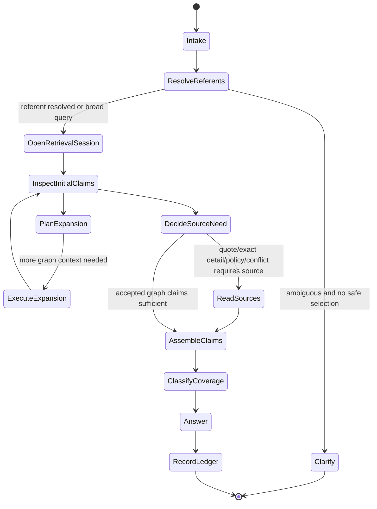

# Design — Hermes graph agent story and interaction protocol

**Status:** PROPOSED  
**Purpose:** define the agent’s typed state machine rather than relying on “Hermes chooses tools.”

## Agent promise

Hermes is the conversational planner and synthesizer over a server-governed retrieval session. It does not own graph scope, revision, visibility, claim authority, source admission, or writes.

## State machine



## Server-owned turn context

```json
{
  "schema": "dmb_graph_retrieval_session_request_v1",
  "retrieval_session_id": "generated server-side",
  "question": "...",
  "world_id": "eldyrwild",
  "campaign_id": "longmont-c2",
  "focus": {"kind":"session","session_id":"session-23"},
  "admissibility": "gm",
  "revision_id": "revision:...",
  "explicit_referents": [
    {"kind":"node","id":"threat:tripod-null-calf","origin":"ui_selection"}
  ],
  "conversation_context": {
    "thread_id": "...",
    "resolved_referents": [],
    "visible_prose": []
  },
  "bounds": {
    "max_candidates": 8,
    "max_claims": 48,
    "max_relationships": 24,
    "max_source_anchors": 16
  }
}
```

The server validates all locators and strips foreign/stale context before model invocation.

## Referent resolution priority

```text
1. explicit node/edge/assertion IDs in current request
2. current UI-selected object(s)
3. thread-pinned durable referents
4. prior turn’s resolved referents
5. deterministic candidate resolution from current query
6. bounded visible prose for lexical intent
7. clarification
```

Every durable pointer is revalidated against world/campaign/admissibility/revision. No label-first rebinding after deletion/collision.

## Initial deterministic retrieval

Before Hermes plans, the server performs bounded candidate resolution and returns a shared packet used by both panel and agent:

```json
{
  "schema": "dmb_graph_retrieval_session_v1",
  "retrieval_session_id": "...",
  "snapshot": {"world_id":"...","campaign_id":"...","revision_id":"...","focus":{},"admissibility":"gm"},
  "intent_hint": "identify|lookup|explore|compare|trace|timeline|support|coverage|brainstorm|correction",
  "candidates": [
    {"node_id":"threat:tripod-null-calf","label":"Tripod Null-Calf","match_reasons":["exact_label"],"selected":true}
  ],
  "claim_ledger": [],
  "available_expansions": [],
  "diagnostics": []
}
```

The intent hint is non-authoritative. A small extensible intent vocabulary is useful for routing and evaluation, but Hermes may request a different supported operation.

## Claim packet

The agent reasons over explicit claims, not only UI node cards.

```json
{
  "claim_id": "assertion:f902e45c1371e9c6",
  "claim_kind": "attribute",
  "subject": {"node_id":"threat:tripod-null-calf","label":"Tripod Null-Calf"},
  "predicate": "battlefield_role",
  "object": null,
  "value": "Siege scout and positional controller...",
  "epistemic_kind": "fact",
  "canon_state": "canonical",
  "acceptance_state": "accepted",
  "visibility": "gm",
  "campaign_scope": "longmont-c2",
  "temporal_scope": null,
  "revision_id": "revision:...",
  "authority_class": "gm_authored_accepted_assertion",
  "support": {
    "state": "anchor_unreadable",
    "source_anchors": [{"anchor_id":"...","readable":false,"opened":false}]
  }
}
```

Node identity/label/kind may be represented as explicit identity claims or governed object fields. Derived summaries are included only under `navigation_summary` and cannot be cited as claims.

## Proposed tool model

Keep existing Kernel primitives internally. Replace the five model-visible tools with two composable tools plus server-owned initial retrieval.

### Tool 1 — `expand_graph_retrieval`

**Purpose:** request additional graph claims within the existing retrieval session.

**Input:**

```json
{
  "retrieval_session_id": "...",
  "operation": "object|neighborhood|compare|path|timeline|support|coverage",
  "targets": [{"kind":"node","id":"..."}],
  "relation_families": ["location","appearance","threatens"],
  "claim_predicates": ["battlefield_role"],
  "depth": 1,
  "historical_revision_id": null,
  "bounds": {}
}
```

**Server injection/validation:** world, campaign, focus, admissibility, current revision, maximum bounds, target membership/visibility.

**Output:** appended claim ledger entries, selected graph objects, available expansions, coverage/gap diagnostics, and operation trace.

**Error semantics:**

```text
ambiguous_target
unknown_target
denied
empty
partial
truncated
revision_conflict
integrity_error
execution_error
```

No raw path or query language is model-selected in v1.

### Tool 2 — `read_graph_source`

**Purpose:** read one or more admitted anchors already present in the retrieval session.

**Input:** retrieval session ID, anchor IDs, max chars.

**Server validation:** anchor belongs to current session/scope/revision and is admitted/readable.

**Output:** source-read ledger entries with content hash/range/truncation; no unbounded file body or absolute path.

**Error semantics:** unknown, unreadable, unavailable, integrity failed, truncated.

### Optional future tool — `propose_graph_change`

Not part of the read rebuild. It will consume exact claim IDs and source/inference ledger entries to create a noncanonical proposal preview.

## Why not retain five model-visible tools

The current catalog exposes Kernel operation decomposition to the model and requires it to discover the intended sequence. It also makes “evidence” a separate object after the model has already received claims, while the product classifier ignores claim-level use.

A retrieval-session executor allows:

- deterministic initial identity work;
- one shared state for UI and model;
- iterative exploration;
- simpler tool selection;
- claim-level observability;
- centralized bounds and security;
- extension through operation enums without proliferating tools.

## Retrieval planning ownership

Hybrid ownership:

| Concern | Owner |
|---|---|
| world/campaign/focus/admissibility/revision | server |
| exact explicit referent validation | server |
| deterministic candidate resolution | server |
| initial exact-object claim packet | server |
| exploration goal and useful expansion | Hermes |
| bounds and allowed operation validation | server |
| source-read necessity policy | deterministic policy + Hermes request |
| final synthesis/inference | Hermes |
| claim-support acceptance | deterministic claim ledger classifier |

## Source-read policy

A source read is required when:

- the user asks for a quote or exact wording;
- exact mechanics/detail is not represented as an accepted claim;
- claim class policy requires source verification;
- source/graph conflict must be examined;
- the agent wants to add detail beyond accepted claim values.

A source read is not required merely to repeat an accepted graph claim.

## Claim assembly and answer protocol

Hermes produces a structured answer draft:

```json
{
  "sections": [
    {
      "text": "Tripod is a siege scout and positional controller...",
      "statement_kind": "graph_fact",
      "supporting_claim_ids": ["assertion:f902..."],
      "source_read_ids": []
    },
    {
      "text": "Prepare an alternate route to the cure line.",
      "statement_kind": "inference",
      "supporting_claim_ids": ["assertion:f902...", "assertion:cure-line..."],
      "inference_id": "turn-local:1"
    }
  ],
  "coverage": {
    "state": "partial_coverage",
    "known": ["battlefield role", "appearance"],
    "missing": ["source verification"]
  }
}
```

The server validates:

- every `graph_fact` maps to accepted admissible claims;
- every source-backed detail maps to successful source reads;
- every inference has supporting claims and is labeled;
- unsupported statements are removed or force repair/abstention;
- one revision is used.

The final UI text may be natural prose; the ledger remains inspectable.

## Inference policy

Hermes may infer when:

- all premises are accepted current claims;
- the implication is useful to GM prep;
- the conclusion is not presented as campaign canon;
- speculation level is disclosed;
- support claim IDs are retained.

Too speculative:

- introduces an unmodeled motive/event as likely fact;
- bridges a missing relationship without direct premises;
- contradicts accepted current claims;
- depends on stale conversation prose;
- cannot name supporting claims.

## Gap behavior

Hermes should distinguish:

```text
identity_ambiguous
graph_object_missing
claim_family_missing
relationship_missing
source_anchor_missing
source_anchor_unreadable
source_unavailable
source_integrity_failed
admissibility_denied
revision_conflict
execution_failure
```

Each maps to a specific user message and trace reason. Only `graph_object_missing` or total denial with no useful claims normally causes full abstention.

## Continuity policy

Bounded prose replay remains supported as a low-priority lexical aid. It is not the primary referent channel. Durable Hermes sessions remain deferred until:

- retrieval sessions are stable and replayable;
- referent pointers are persisted safely;
- graph revision changes are handled explicitly;
- session transcript/tool state cannot become factual authority;
- the read architecture passes cumulative dogfood.

## Observability contract

Record per turn:

```text
retrieval session ID
referent candidates and selection source
initial deterministic operations
agent expansion requests
claim IDs added/used/rejected
source anchors available/readable/opened
source-read outcomes
coverage/gap reasons
inferences and premises
answer-validator decisions
revision/scope
latency/token/tool counts
```

Do not record secrets, hidden reasoning, unbounded sources, or arbitrary paths.
