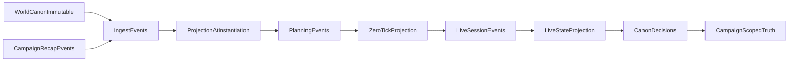

# Mirathorn Event-Sourced Vertical Slice Plan

## Objective

Implement a vertical slice that mirrors your GM workflow: ingest world canon and campaign recap context, instantiate a graph at campaign start, and progress state through planning, zero-tick, and live updates using an event-sourced model.

## User Story To System Mapping

- User flow:
  - Drop player summary/session context.
  - Generate current canon of world + last session.
  - Plan next session with DungeonMind tools as enrichment context.
  - Run live session updates without losing baseline canon.
- System contract:
  - Canon sources remain immutable per layer.
  - All change is captured as events.
  - Current truth is always a projection over event history + canon decisions.

## Locked Inputs For Milestone 1

- World source doc: `Docs/Eldyrwild and Campaign Context/Elderwyld/Cities and Towns/Mirathorn/The City of Mirathorn.docx`
- Campaign source doc: `Docs/Eldyrwild and Campaign Context/Longmont Campaign/Campaign 1/Longmont Campaign General Notes.docx`
- Seeded world baseline section to anchor initial graph state:
  - `Approach to Mirathorn` (including gates/toll/protest details and scene framing)

## Canon Layers and State Timeline

## Data Model Strategy (Event-Sourced)

- Keep existing schemas as primary contracts:
  - `[schemas/v0.1/evidence_unit.schema.json](/home/drakosfire/Projects/DungeonOverMind/DungeonMindBuddy/schemas/v0.1/evidence_unit.schema.json)`
  - `[schemas/v0.1/event.schema.json](/home/drakosfire/Projects/DungeonOverMind/DungeonMindBuddy/schemas/v0.1/event.schema.json)`
  - `[schemas/v0.1/fact.schema.json](/home/drakosfire/Projects/DungeonOverMind/DungeonMindBuddy/schemas/v0.1/fact.schema.json)`
  - `[schemas/v0.1/conflict.schema.json](/home/drakosfire/Projects/DungeonOverMind/DungeonMindBuddy/schemas/v0.1/conflict.schema.json)`
  - `[schemas/v0.1/canon_decision.schema.json](/home/drakosfire/Projects/DungeonOverMind/DungeonMindBuddy/schemas/v0.1/canon_decision.schema.json)`
- Milestone-1 projection semantics:
  - Events produce candidate state changes.
  - Facts remain attributable to evidence and optionally linked to derived events.
  - Reducer projection resolves campaign overlays and conflict decisions.

## Vertical Slice Artifact Set

- `slice_manifest.json` with source file references and campaign id.
- Gold bundle (manually curated):
  - `evidence_units.json`
  - `events.json`
  - `facts.json`
  - `conflicts.json`
  - `canon_decisions.json`
  - `projection_instantiation.json`
  - `projection_zero_tick.json`
  - `projection_live_state.json`
- Run bundle:
  - extraction output
  - validation report
  - gate report
  - determinism hash report

## Hard Pass/Fail Gates

### Gate A: Source and Layer Integrity

- Pass:
  - Both source docs loaded and fingerprinted.
  - World evidence tagged `canon_layer=world` and `campaign_id=null`.
  - Campaign evidence tagged `canon_layer=campaign` with campaign id.
- Fail:
  - Missing source files, mixed layer tags, or invalid layer/campaign consistency.

### Gate B: Event Contract Integrity

- Pass:
  - Produced events validate against `event.schema.json`.
  - Each event has participants + source evidence ids.
  - Event ordering is deterministic within session.
- Fail:
  - Missing participants/evidence links, unstable ordering, or schema failures.

### Gate C: Hybrid Correctness (Core + Behavior)

- Pass:
  - Exact match on core identity/provenance fields against gold outputs.
  - Expected world vs campaign conflicts detected.
  - Campaign projection overrides only where event/canon decision specifies.
  - World baseline remains unchanged.
- Fail:
  - Any core mismatch, missing expected conflict, or world mutation.

### Gate D: Workflow State Progression

- Pass:
  - Instantiation projection produced from world + recap events.
  - Zero-tick projection produced from planning events.
  - Live projection produced from live session events.
  - Transition deltas are explicit and auditable.
- Fail:
  - Missing any projection stage or opaque/untraceable state transition.

## Implementation Phases

1. Source lock and corpus extraction boundary
2. Gold event/fact/conflict bundle authoring for Mirathorn
3. LLM loop adaptation to emit event-first outputs
4. Projection runner for instantiation -> zero-tick -> live
5. Hybrid and workflow gate implementation
6. Determinism/replay verification and report

## Notes On Rules Corpus (Current Decision)

- For Milestone 1, core rules are included as referenced context metadata only (not first-class nodes), to keep proof focused on world/campaign state correctness.

## Verification Commands

- `uv run ruff check .`
- `uv run pytest tests/ --maxfail=1`
- `uv run python evals/llm_ingestion_slice/run_slice.py`

## Success Criteria

- You can demo one end-to-end run from source docs to live-state projection in under 2 minutes.
- Report clearly shows what changed from world baseline to campaign live state and why (event provenance + decisions).
- Canon layering invariant holds under replay: campaign drift never rewrites world canon.

