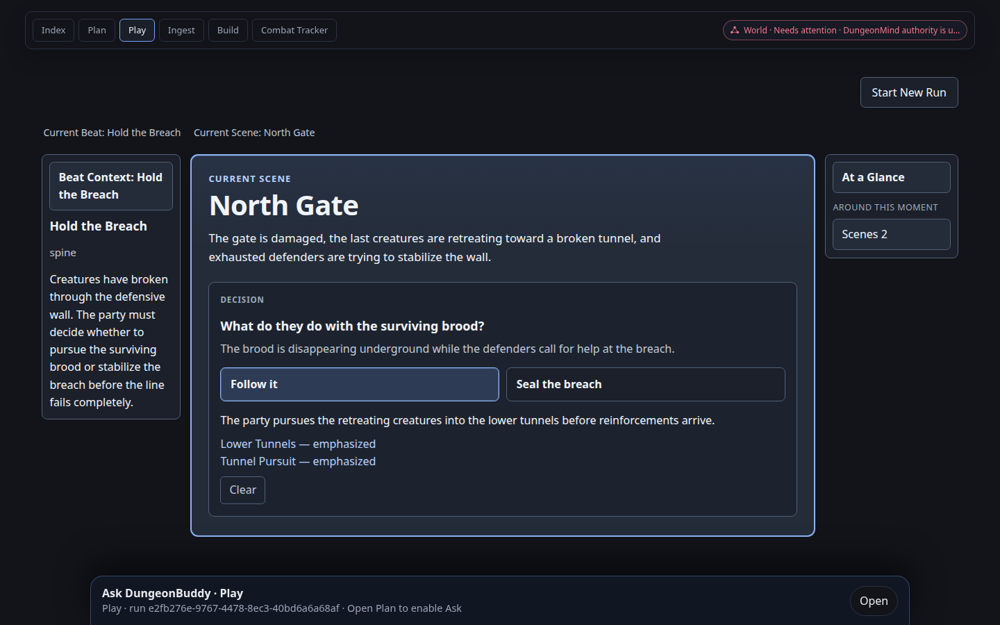
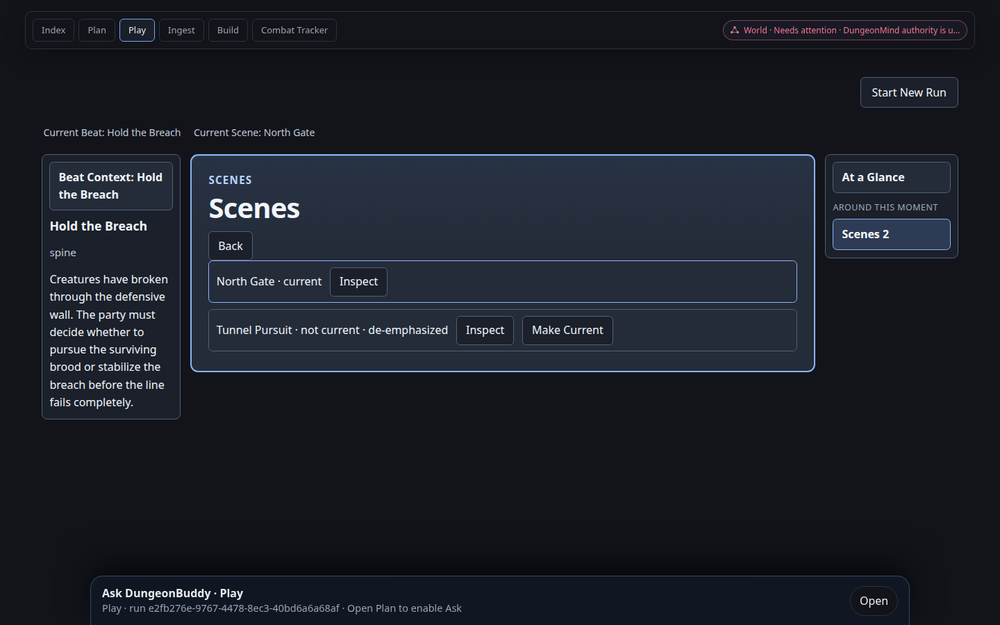
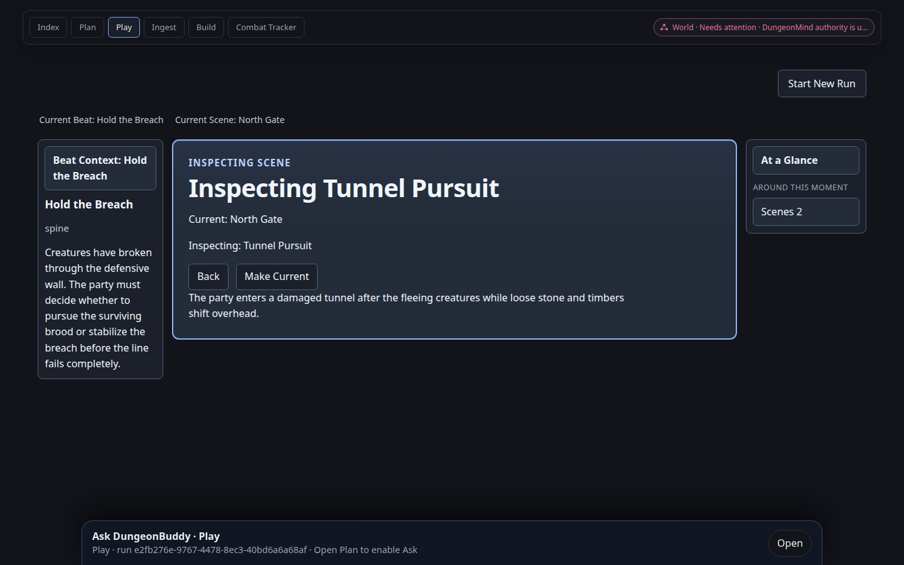
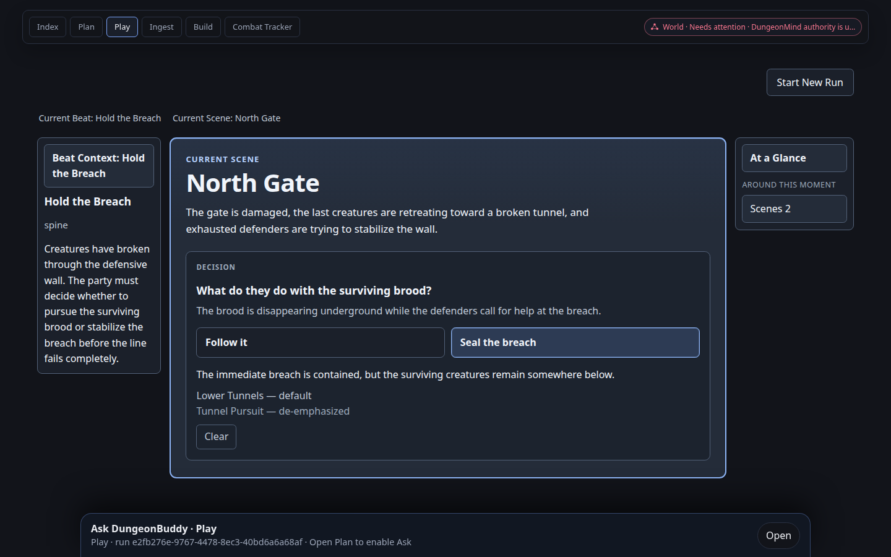
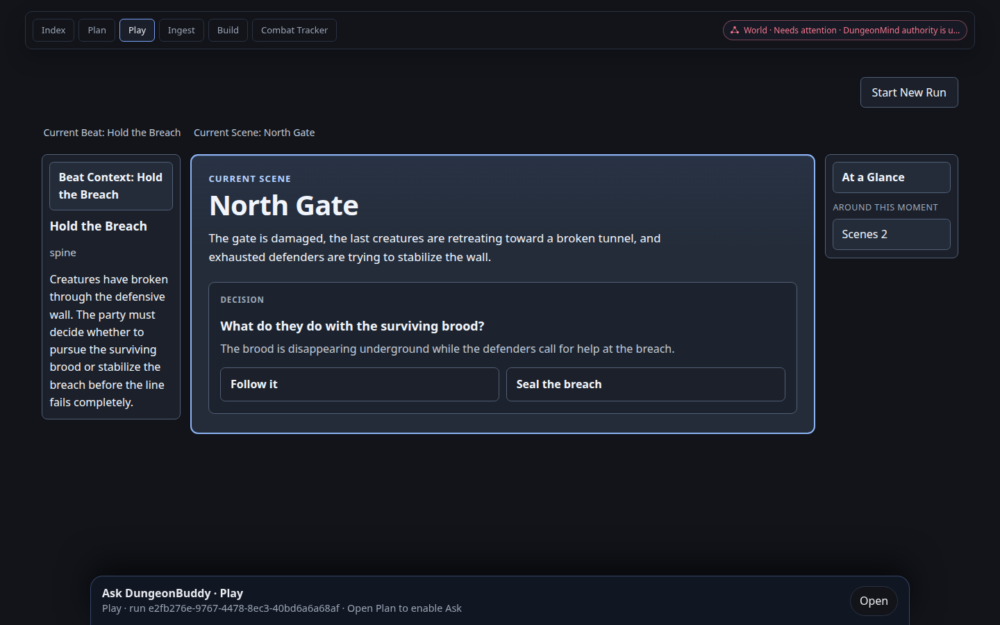
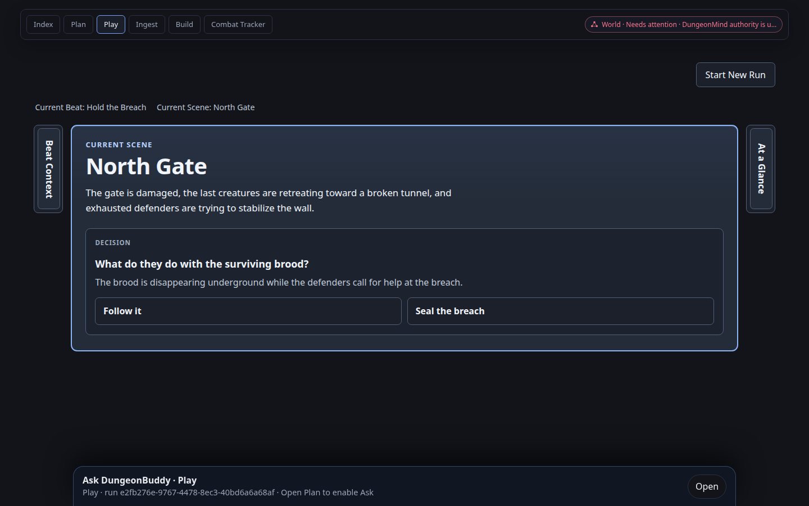

# Report — BF3B recut exact-head Decision cockpit witnesses

## Status

**VISUAL WITNESS PASS / AUTHORITY RE-ANCHOR PASS**

Cycle 1 on PR #673 accepted the product direction at `4e8e43d1ebeb38b397e18983b3e0f3a969c7b311` and blocked on missing exact-head screenshots plus CON-READY headers still advertising `770f79…`. Cycle 2 does not change Play product code. It records the mandatory §11 witnesses against that UI and re-anchors steward/roadmap headers to the actual implementation base.

Reviewer question: **What does my eye identify first: North Gate or the Decision?**

**North Gate.** In unselected, Follow, Seal, and collapsed-rail states the largest heading on the board is `North Gate` under `CURRENT SCENE`. The Decision is a nested panel inside that Scene card, not a peer column and not a standalone Decision screen.

## Implementation head

- Product/UI code (unchanged from Cycle 1): `4e8e43d1ebeb38b397e18983b3e0f3a969c7b311`
- Implementation base: GitHub `main` merge `ae01ef630e170e9b2a2de6daaa93373f88dc3a91`
- Design base: `c71e4e18905a8a482e7cba3be9b80f0e12cf999c`
- Approved visual target: `Docs/Design/assets/play-surface-gm-cockpit-target.webp`
- Handoff: `Docs/Plans/HANDOFF-PLAY-SURFACE-decision-interaction.md`
- Candidate UI: recut worktree `apps/live-control-ui` at `http://127.0.0.1:5180`
- Candidate API: recut worktree `apps.live_control_server` at `http://127.0.0.1:8010`
- Not used: long-running #670 servers on `5173` / `8000`

## Environment / viewport / zoom

- Browser: headless Google Chrome `/usr/bin/google-chrome` via `puppeteer-core`
- Viewport: `1440 × 900` CSS pixels, `deviceScaleFactor` 1, zoom 100%
- AppChrome header visible in every witness (`data-testid="app-chrome-header"`)
- APP-STATE: local PostgreSQL `dungeonbuddy_application_state` on `127.0.0.1:54329`, bootstrap `READY`
- Predecessor setup (not BF3B product): DF0/BF4A create/commit of the §7 Breach Markdown, Start exact Run, Make North Gate current with empty selections

## Exact Run identity

- Runbook: **BF3B Recut Witness Runbook** `1221fc98-3377-4c4a-b542-4c6e66586796`
- Campaign: `longmont-c2`
- Committed revision: `1` / SHA prefix `53c7a68da8ba8ac2`
- Run: `e2fb276e-9767-4478-8ec3-40bd6a6a68af`
- Starting progress: Beat `beat:hold-breach`, Scene `scene:north-gate`, selections `{}`

Markdown is the handoff §7 / `breachDogfoodFixture.ts` Breach Dogfood text. No copyrighted Hempholm module prose.

## Witnesses

Assets: `Docs/Reports/assets/play-surface-bf3b-673/`

### Witness A — unselected North Gate


- Current Beat Hold the Breach, Current Scene North Gate
- Scene heading `North Gate` dominates the center board
- Decision prompt and both Options are inside the Scene card; neither Option selected; no consequence
- Beat Context is subordinate; At a Glance is present with caption “Around this moment” and `Scenes 2`
- Not three equal columns; not a Decision-first screen

### Witness B — Follow it


Reload after Follow:



- North Gate remains current
- Follow selected only after the authoritative response
- Consequence is the Follow Option body
- `Tunnel Pursuit — emphasized` and `Lower Tunnels — emphasized`
- Hard reload restores the same selection, consequence, relevance, and North Gate
- No automatic navigation

### Witness C — Seal the breach


At a Glance → Scenes still exposes Tunnel Pursuit:



Inspect Tunnel Pursuit does not mutate current Scene; Make Current remains available:



Back returns to North Gate with Seal still selected:



- Seal is the only selected Option
- Seal consequence visible
- `Tunnel Pursuit — de-emphasized`
- **`Lower Tunnels — default` remains visible**
- Inspect keeps `Current: North Gate`; Make Current is present; Back restores the North Gate board

### Witness D — Clear



Reload after Clear:


- Selection, consequence, and branch-state rows gone
- North Gate remains current
- Hard reload remains cleared

### Witness E — both rails collapsed



- Beat Context and At a Glance collapse to vertical rail labels
- Scene board reclaims the workspace; North Gate still dominates
- Decision remains readable/usable
- Collapse/restore did not change Beat, Scene, or selections

### Witness F — 422 truthful reconciliation

Automated only, as allowed. Cockpit tests already cover 409/422 reread failure → unknown/locked with no “Reloaded the exact Run” claim. No production debug affordance was added.

## §12 visual review answers

1. **What does my eye identify first: North Gate or the Decision?** North Gate / current Scene.
2. **Does the Decision feel like playable content inside the Scene?** Yes. Nested `DECISION` panel under the Scene body.
3. **Do Beat Context and At a Glance support the board rather than compete with it?** Yes. Narrower rails; collapse leaves the Scene board.
4. **Can I still tell that At a Glance is the contextual-launcher concept that can later hold NPCs/Threats/Combat?** Yes. Caption remains “Around this moment”; `Scenes 2` is a category launcher, not a location navigator replacing the board.
5. **Is Make Current explicit?** Yes. Inspect Tunnel Pursuit leaves North Gate current and still offers Make Current.
6. **Does Seal visibly explain that Lower Tunnels returned to default?** Yes. `Lower Tunnels — default` is shown next to `Tunnel Pursuit — de-emphasized`.

## Intentional differences from the approved cockpit webp

The approved target is a design still. This live head keeps shared AppChrome, Start New Run in session lifecycle, the Ask host, and World-graph chrome status. Those are not BF3B work. The recut interpretation lock is: stronger Scene identity, Decision inside the Scene, At a Glance preserved as compact supporting chrome. The live board is closer to that lock than to a three-equal-column or Decision-first layout.

## Automated evidence (Cycle 2, product code `4e8e43d1`)

```text
PlayCurrentMomentCockpit.test.tsx     34 passed
decisionInteractionModel.test.ts      12 passed
nativeRunbookProjection.test.ts       36 passed
v2RuntimeProjection.test.ts            5 passed
uv run pytest tests/test_play_run_progress.py  25 passed
frontend typecheck                    passed
git diff --check                      clean
STEWARDS / ROADMAP mirrors            byte-identical
```

## Authority cleanup

Steward and roadmap headers now advertise the actual implementation base:

```text
Re-anchor base: main ae01ef630e170e9b2a2de6daaa93373f88dc3a91
Updated / Re-anchored: 2026-08-31
```

`Docs/Plans` / `Docs/Roadmaps` copies remain byte-identical to `Docs/Sources/design-agent/ACTIVE_AUTHORITY/`. PLAN-BLANK-SHELL merge `770f79…` remains only as historical predecessor metadata, not as the current re-anchor.

## Formal review cycles for #673

Cycle 1 complete at `4e8e43d1ebeb38b397e18983b3e0f3a969c7b311` (REQUEST-CHANGES-equivalent, review `5071047112`). Cycle 2 is this evidence/state-authority head.
