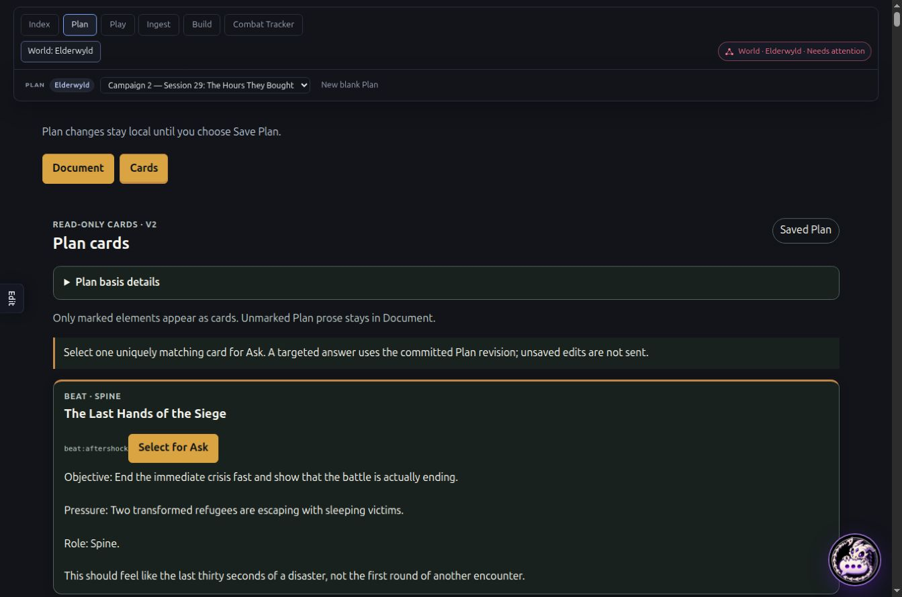
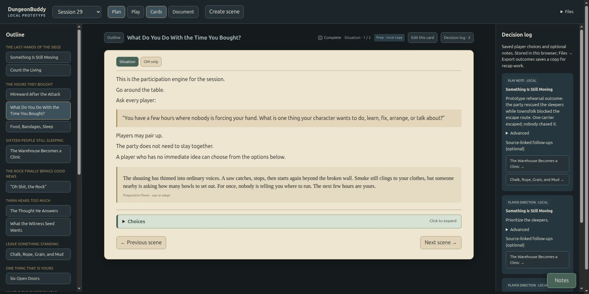
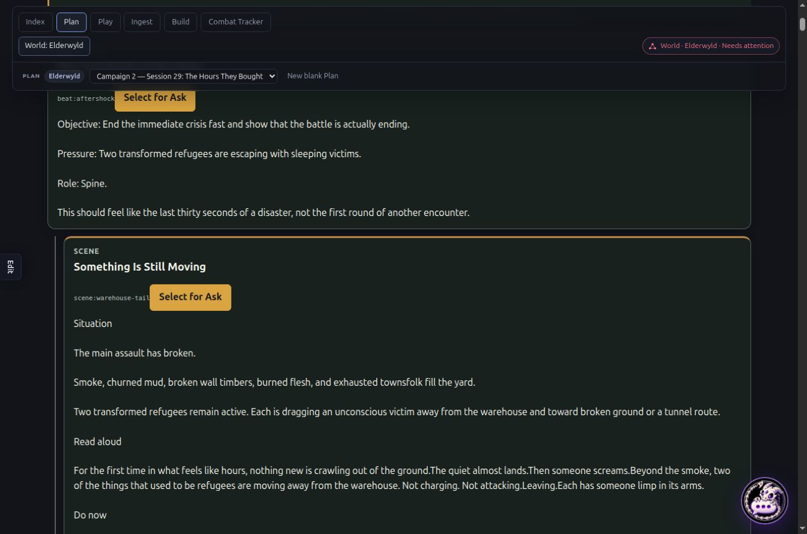
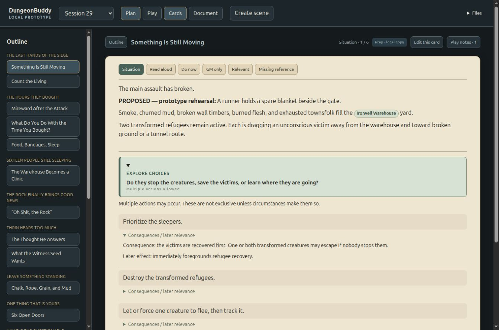
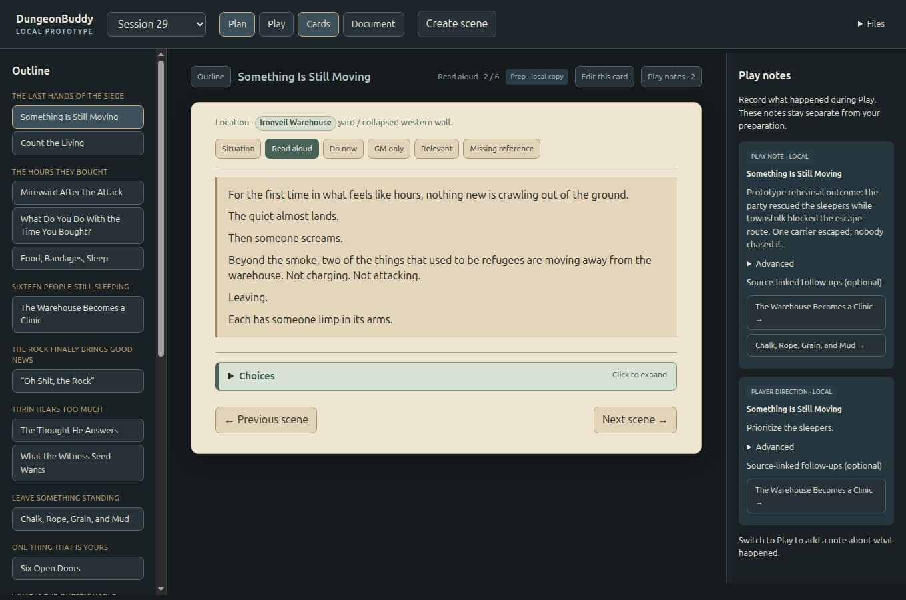

# Cards presentation comparison

Observed on 2026-10-04: production main a21da688, Elderwyld Session 29. Production captures below are current; prototype images are preserved historical evidence. Operator explicitly authorized posting these screenshots.

## 1. Attention and visual hierarchy

The upper navigation is followed by draft instructions, Document/Cards controls, another Cards heading, basis disclosure, grammar explanation and Ask instructions. The first beat begins near the lower half of the viewport. Broad dark boxes, large gold controls and IDs dominate; all marked bodies continue down one nested scroll.

The prototype uses a bounded parchment reading plane, cool dark chrome, narrative serif type and compact node pills. A selected scene and lens are the unit of attention. Outline and contextual navigation support switching without showing every body at once. This historical screenshot is a reference, not evidence of production adoption.

Code: production WorldPlanCardProjection.tsx:369 renders every root; WorldPlanCardProjection.css:35 defines the broad grid. Prototype app.js:51 selects one block; app.js:60 renders tabs and focused-block. Prototype style.css:1 defines narrative paper/type; :9 defines contextual navigation and collapsible side panels.

## 2. Projection fidelity is a correctness issue

Live Cards DOM drops names retained in Document: “Contact .” instead of Mirathorn; “Spend time with .” instead of Thrin; clinic “Location: .” instead of Ironveil Warehouse; NPC list starts with a comma instead of Lysandra. Lists and read-aloud passages concatenate, e.g. “ground.The quiet”. The screenshot shows the opening scene; the other examples were observed throughout its live DOM.

Code: nativeRunbookProjection.ts:236 collectNodeText recognizes text nodes and descendant content; :241 joins descendants with an empty separator. Attribute-backed atom labels disappear and structural separators collapse. WorldPlanCardProjection.tsx:127 consumes flattened bodyText; :254 renders the whole body as one paragraph. Preserve labels/identity, lists, paragraphs and marks. Ask target/context impact still requires assessment.

## 3. Choice reading versus actual play decisions

These historical references show progressive disclosure and actual player-decision capture. Production WorldPlanCardProjection.tsx:250 exposes Select for Ask; :256 renders raw authored activates/suppresses IDs. Asking about a card is distinct from recording a player's choice. Durable notes, completion and decisions require separate Run adoption; they are not missing requirements in the bounded read-only Cards implementation.

## Adoption guidance

Fix fidelity first. Then adopt focused scene/lens navigation and accepted design-v1 aesthetics while retaining formal Plan identity, mounted draft and committed Ask contracts. Move technical IDs/basis/grammar into Advanced and title/view/context into composed navigation. Keep saved-versus-draft disclosure near its action. Structural card rendering does not establish visual adoption. Prototype node dossiers do not prove native Graph integration.

All production paths above are under apps/live-control-ui/src: planSurface/components/WorldPlanCardProjection.tsx and .css; playSurface/runbook/nativeRunbookProjection.ts. Prototype paths are under prototypes/plan-play-cards. No production implementation changes accompany this report.
