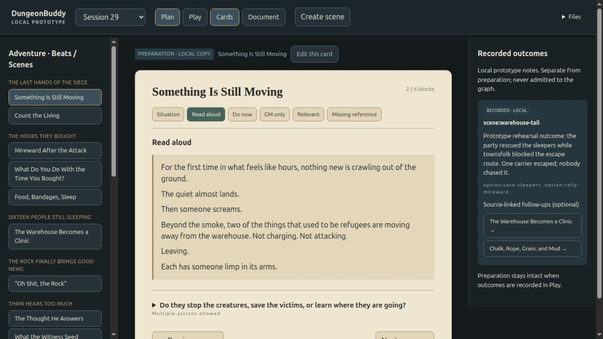
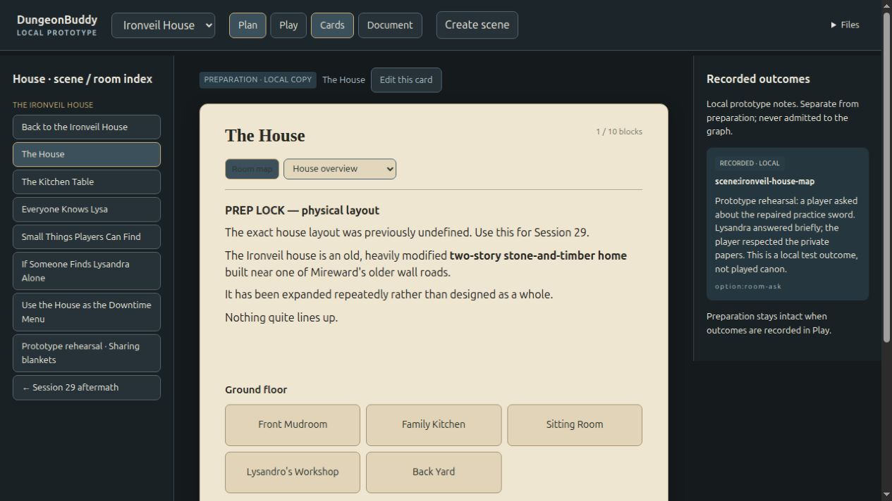
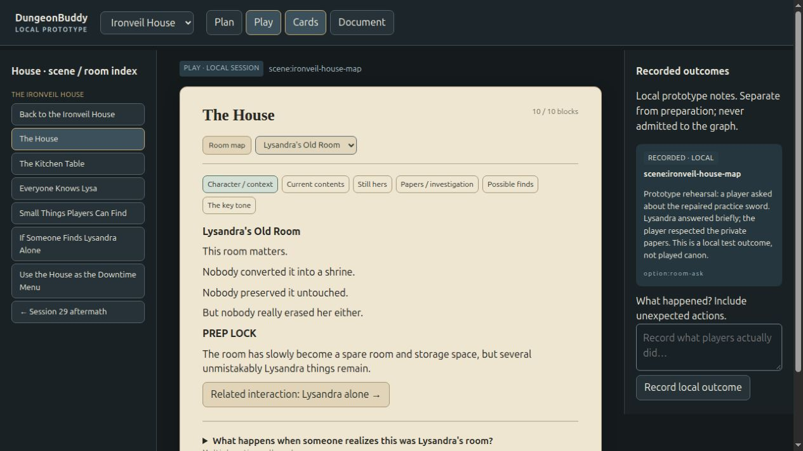
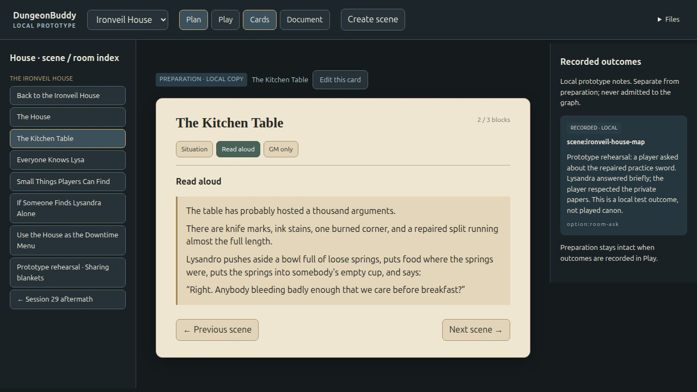
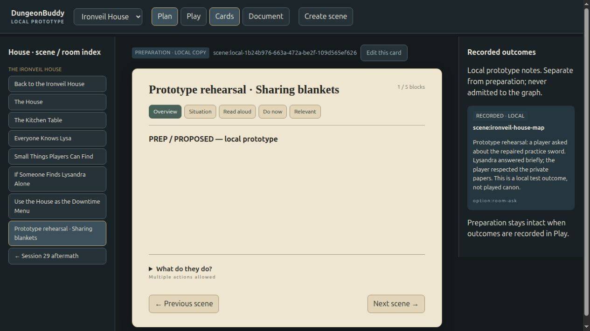

# Rendered acceptance evidence

Verified against the running isolated prototype http://127.0.0.1:5203/ through native in-app-browser controls. These are labeled rehearsal edits/outcomes, not actual campaign events. Existing production Plan revision 5 and both source files were not written by these experiments.

## 1. Opening → rescue choice → aftermath

Opened Something Is Still Moving, switched to Play, selected `option:save-sleepers` and `option:rally-mireward` together, recorded a local note that sleepers were rescued while townsfolk blocked the route and a carrier escaped, then used Next scene to reach Count the Living. Accessibility state confirmed `scene:count-living`, the outcome text, and both selected IDs. Source-linked optional follow-ups to the clinic and recovery scene now render in the journal; the underlying activate/suppress attributes are preserved and all navigation remains available.

## 2. House map → room → interaction / discovery

Traversed Session29's Connected place → Ironveil House → The House. Floor-grouped map lists the nine source-described spaces, explicitly without inferred adjacency/residence. Opened Lysandra's Old Room, reviewed its source material, selected `option:room-ask` in Play and recorded a clearly labeled rehearsal about asking after the repaired practice sword and respecting private papers. Reload showed the saved outcome. After refinement, the room offers Character/context, Current contents, Still hers, Papers/investigation, Possible finds and key tone separately. Also traversed Family Kitchen → related Kitchen Table → Read aloud and verified the existing breakfast dialogue.

## 3. Plan edit → Play → outcome → Plan

Edited only the opening scene in the local preparation buffer to add `PROPOSED — prototype rehearsal: A runner holds a spare blanket beside the gate.` Applied through the card editor, switched to Play and performed the simultaneous rescue test above. Returned to Plan: the proposed sentence remained in Situation while the journal retained its separate `RECORDED · LOCAL` record. Reload preserved both. No production apply, native graph call, database mutation or model call occurred.

Attempted changing `option:save-sleepers` to a new ID: Apply rejected the edit and displayed the exact marker to preserve. Cancel kept the prior preparation intact. Attempted adding `node:invented-prototype-check`: Apply rejected the unverified node reference. Verified insertion control added the exact existing `loc:ironveil-warehouse` Markdown link at the cursor; canceled that test before saving.

## 4. Cards ↔ full document

Switched opening card → Document → Return to focused card → Edit. Compared the text area before/after: exact equality. Full-document rendered text included the proposed sentence, The Failed Rain, and the original final Session29 success-condition sentence. The House full document retained its original ending, all named House scenes, and the newly authored local rehearsal scene. Return restored Kitchen Table's Read aloud block. The renderer reads one canonical local Markdown buffer per source; it does not produce a second slide document.

An unfinished outcome note survived block navigation and reload (both DOM value checks true); the temporary test note was then cleared. Action selections have the same per-scene local persistence.

## Guided creation / deterministic validation

Create scene rejected advancing with an empty required field. Completed the six-step workflow with a labeled Sharing blankets rehearsal, structured action/consequence pairs and unlinked reference notes. The scene appeared in the index and focused-card view, with generated local IDs, proposed status, simultaneous actions, and a generated unexpected path. The source fixtures retain their original 19/7 scene counts; only this browser's prototype state includes the additional scene.

## Automated owning-model evidence

`verify_fixture.py`: exact source/fixture equality, original source hashes, reversible 72 node links, original 90 markers. `model.test.mjs`: 19 scenes/10 Beats/9 choices/52 options; seven House scenes/nine spaces; precise scene edit boundaries; exact marker preservation; simultaneous outcomes without prep mutation; serialization; guided block/choice validation; unexpected-action generation; room focus; rejection of unknown node links and acceptance of explicitly verified identities. Tests passed after final model edits.

## Honest limits

This is a usable standalone prototype with browser-local authoring/session state. It does not integrate with production Agent, Graph, semantic editor or Combat Tracker. Source status labels are preserved author claims; a rendered ESTABLISHED label is not new verification. The original imported documents and active product owner leases remain untouched. Review/adoption into production is a separate owner decision.

Final preservation audit limit: a fresh read-only request to the previously known production API on 7866 returned connection refused, and the historical runtime checkout path was absent in this execution environment. No production restart/reconstruction was attempted. Preservation claims are bounded to this lane's no-write/no-call behavior, unchanged repository source hashes, and the earlier saved revision receipt; current external runtime availability/revision cannot be re-certified here. The prototype remains independently accessible on 5203.

Final boundary repair: source-level H1/H2 reference sections (GM Running Notes / House Tone) are outside scene edit ranges rather than accidentally bundled into the last option. Model checks prove editing either last scene leaves the global section intact. Browser verification showed the storm editor excludes GM Running Notes while Intent/source context → Document still contains it. The opening screenshot was refreshed after this repair. Verified-reference select now has an explicit accessible label.

## Compact layout follow-up

Renamed the scene index Outline and the outcome journal Play notes. Added independently persisted panel toggles (notes closed by default), explicit grid placement so content reclaims hidden columns, and a compact scene toolbar containing title, block/count and prep status. Removed repeated card heading and only matching leading block labels; source Markdown is unchanged.

Syntax, model and fixture checks pass. This follow-up could not receive fresh browser acceptance: the in-app browser returned connection refused for 5203 despite the restored host listener returning HTTP 200. Existing screenshots above show the prior accepted layout, not this follow-up. Toggle/reload visual acceptance remains pending.

## Node context and choice clarity follow-up

Browser connectivity recovered. Verified Warehouse inspection shows two connected scenes with source excerpts and scene navigation controls; IDs/provenance are behind Advanced. Choice disclosure has an Explore choices callout and explicit expansion hint. Expanded rescue consequences show victims recovered / possible creature escape and later effect, with no repeated option label or choice title. Source Markdown remains unchanged. Screenshots: `evidence/node-context.png`, `evidence/choice-callout.png`. Syntax, model and fixture checks pass.
